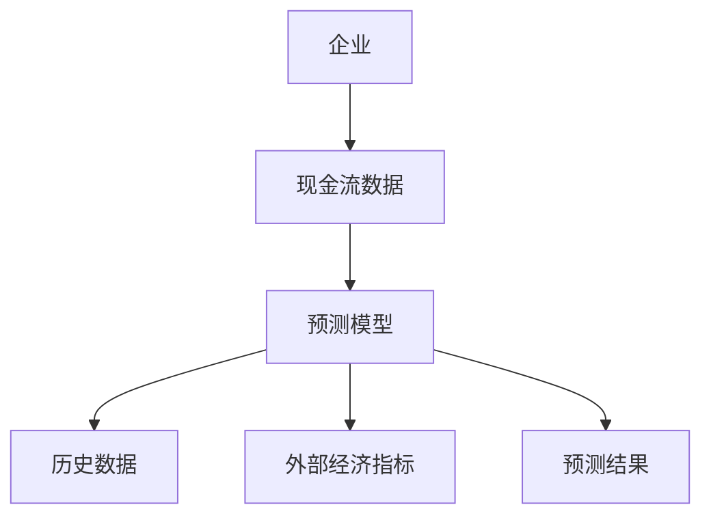
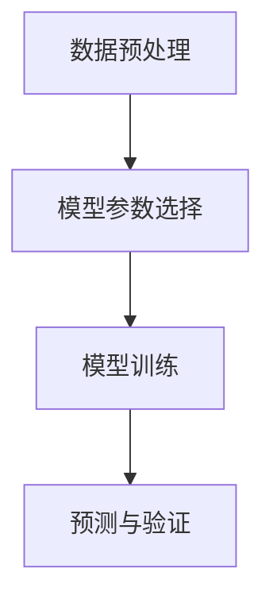
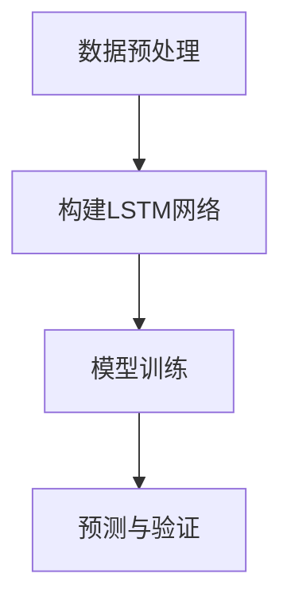
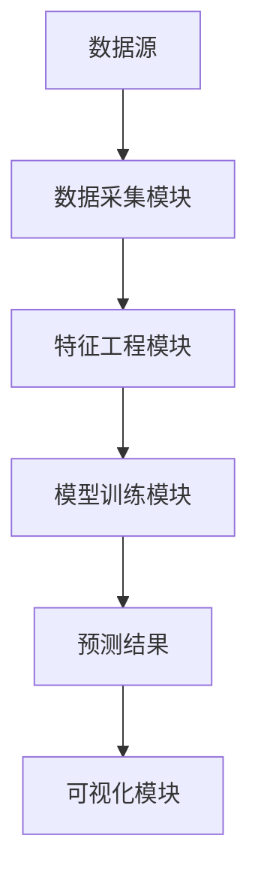
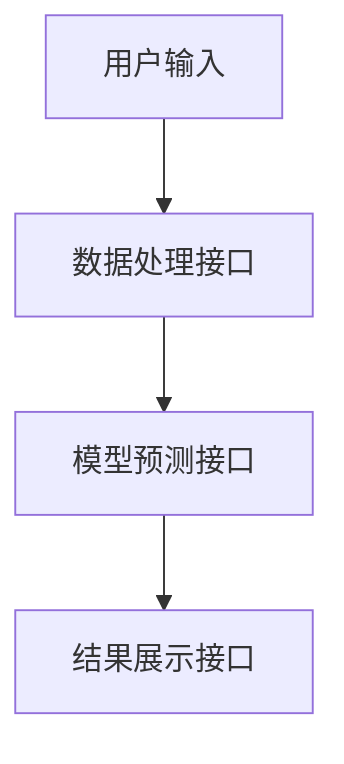

                 


# 开发智能化的企业现金流预测模型

> 关键词：现金流预测、人工智能、时间序列分析、机器学习、LSTM、ARIMA

> 摘要：现金流预测是企业财务管理中的重要环节，传统的预测方法存在诸多局限性。随着人工智能和大数据技术的发展，智能化的现金流预测模型为企业提供了更高效、更准确的预测手段。本文将从背景、核心概念、算法原理、系统架构到项目实战，全面解析如何开发智能化的企业现金流预测模型，为企业财务管理提供新的思路和解决方案。

---

## 第1章: 现金流预测的背景与重要性

### 1.1 现金流预测的基本概念
现金流预测是指根据企业过去的财务数据和外部经济指标，预测未来一段时期内的现金流状况。它是企业财务管理的核心内容之一，直接关系到企业的资金调度、投资决策和风险控制。

### 1.2 传统现金流预测方法的局限性
传统的现金流预测方法主要包括线性回归和时间序列分析。然而，这些方法在面对复杂的市场环境和非线性关系时表现不佳，预测精度有限。

### 1.3 智能化预测的必要性
人工智能（AI）和机器学习（ML）的快速发展为现金流预测提供了新的解决方案。通过深度学习模型，如LSTM（长短期记忆网络），可以更好地捕捉时间序列中的复杂模式，提高预测精度。

---

## 第2章: 现金流预测模型的核心概念与联系

### 2.1 现金流预测模型的定义与分类
现金流预测模型可以分为以下几类：
1. **时间序列模型**：基于历史数据的线性关系进行预测。
2. **机器学习模型**：利用特征工程和深度学习算法捕捉非线性关系。
3. **混合模型**：结合时间序列和机器学习的优势，提升预测精度。

### 2.2 现金流预测模型的输入与输出
- **输入**：历史现金流数据、外部经济指标（如GDP、利率）、行业数据等。
- **输出**：未来某一时间段内的现金流预测值及预测区间。

### 2.3 模型的核心要素
| 核心要素 | 描述 |
|----------|------|
| 数据来源 | 历史数据、外部指标、行业数据 |
| 特征工程 | 数据清洗、特征提取、特征选择 |
| 模型选择 | 时间序列模型、机器学习模型 |
| 评价指标 | �均方误差（MSE）、平均绝对误差（MAE）、R²值 |

### 2.4 实体关系图


---

## 第3章: 现金流预测的算法原理

### 3.1 时间序列分析
时间序列分析是现金流预测的传统方法，常用模型包括ARIMA（自回归积分滑动平均模型）。

#### ARIMA模型原理
ARIMA模型通过捕捉数据的自相关性来预测未来值。其数学公式为：
$$ ARIMA(p, d, q) $$
其中：
- \( p \)：自回归阶数
- \( d \)：差分阶数
- \( q \)：移动平均阶数

#### ARIMA模型实现步骤


### 3.2 机器学习模型
深度学习模型在处理时间序列数据方面表现出色，其中LSTM网络是常用的模型。

#### LSTM模型原理
LSTM通过记忆单元和遗忘门控制信息流动，能够捕捉长期依赖关系。其结构如下：
$$ \text{遗忘门} = \sigma(W_f \cdot [h_{t-1}, x_t] + b_f) $$
$$ \text{记忆单元} = \text{cell} = \tanh(W_c \cdot [h_{t-1}, x_t] + b_c) $$
$$ \text{输出门} = \sigma(W_o \cdot [h_{t-1}, x_t] + b_o) $$
$$ h_t = \text{输出门} \cdot \text{记忆单元} $$

#### LSTM模型实现步骤


---

## 第4章: 现金流预测系统的架构设计

### 4.1 问题场景介绍
企业需要实时预测未来现金流，以便优化资金使用和降低财务风险。

### 4.2 系统功能设计
系统功能模块包括：
1. 数据采集模块
2. 特征工程模块
3. 模型训练模块
4. 预测与可视化模块

### 4.3 系统架构设计


### 4.4 接口设计与交互流程


---

## 第5章: 项目实战——现金流预测模型的实现

### 5.1 环境安装
安装所需的库：
```bash
pip install numpy pandas scikit-learn tensorflow keras matplotlib
```

### 5.2 数据预处理
```python
import pandas as pd
import numpy as np

# 加载数据
data = pd.read_csv('cash_flow.csv')

# 数据清洗
data = data.dropna()
data['日期'] = pd.to_datetime(data['日期'])
data = data.set_index('日期')

# 特征工程
features = data[['收入', '支出', '资产', '负债']]
target = data['现金流']
```

### 5.3 模型训练与优化
```python
from tensorflow.keras.models import Sequential
from tensorflow.keras.layers import LSTM, Dense

# 构建LSTM模型
model = Sequential()
model.add(LSTM(64, input_shape=(timesteps, features)))
model.add(Dense(1))
model.compile(loss='mean_squared_error', optimizer='adam')

# 训练模型
model.fit(X_train, y_train, epochs=100, batch_size=32)
```

### 5.4 结果分析与可视化
```python
# 预测结果
y_pred = model.predict(X_test)

# 可视化
plt.plot(y_test, label='真实值')
plt.plot(y_pred, label='预测值')
plt.legend()
plt.show()
```

---

## 第6章: 最佳实践与注意事项

### 6.1 小结
智能化现金流预测模型通过结合AI和大数据技术，显著提高了预测精度和效率。

### 6.2 注意事项
1. 数据质量是模型性能的关键，需注意数据清洗和特征工程。
2. 模型选择应根据具体场景和数据特点进行调整。
3. 模型部署后需定期更新，以适应市场变化。

### 6.3 未来趋势
随着AI技术的不断进步，现金流预测将更加智能化和个性化，应用场景也将更加广泛。

---

## 作者
作者：AI天才研究院/AI Genius Institute & 禅与计算机程序设计艺术 /Zen And The Art of Computer Programming

