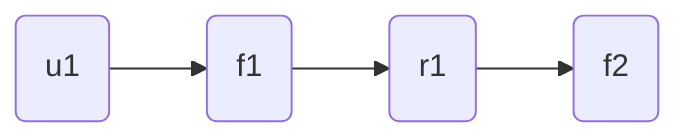
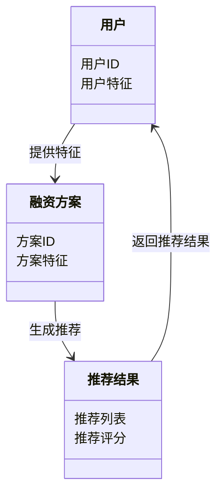
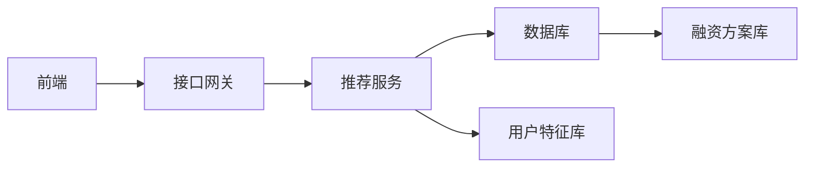
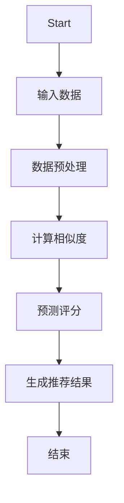

                 


# 开发智能化的企业融资方案推荐系统

> 关键词：企业融资、推荐系统、协同过滤、机器学习、系统架构

> 摘要：本文详细介绍了开发智能化企业融资方案推荐系统的背景、核心概念、算法原理、系统架构设计以及项目实战。通过分析企业融资需求的多样性与传统融资方式的局限性，提出智能化推荐系统的解决方案，并基于协同过滤算法实现推荐功能，结合系统架构设计与项目实战，为企业融资方案推荐系统的开发提供了全面的指导。

---

## 第一部分：企业融资方案推荐系统背景与核心概念

### 第1章：企业融资方案推荐系统背景介绍

#### 1.1 问题背景与描述

现代企业的融资需求日益多样化，传统的融资方式往往依赖于人工匹配或经验判断，存在效率低下、覆盖面有限、难以精准匹配等问题。特别是在中小企业融资难的背景下，如何通过技术手段提高融资效率、降低融资门槛，成为亟待解决的难题。

#### 1.2 问题解决与边界

智能化的企业融资方案推荐系统通过大数据分析和机器学习技术，能够快速匹配企业需求与合适的融资方案，显著提升融资效率。系统的边界包括：

1. **输入**：企业的基本资料、财务数据、经营状况、融资需求等。
2. **输出**：推荐的融资方案列表，包括方案名称、适用场景、风险评估等。
3. **限制**：仅针对已知数据范围内的融资方案进行推荐，不涉及实时市场数据的动态调整。

#### 1.3 核心要素与组成结构

系统的核心要素包括：

1. **用户数据**：企业的基本信息、财务数据、经营状况。
2. **融资方案库**：各种融资方案的详细信息，包括贷款类型、额度、利率、期限等。
3. **推荐算法**：基于协同过滤、机器学习等技术的核心推荐引擎。
4. **反馈机制**：用户对推荐结果的反馈，用于优化推荐算法。

---

## 第二部分：核心概念与联系

### 第2章：推荐系统原理与方法

#### 2.1 推荐系统核心原理

推荐系统的核心目标是通过分析用户的行为数据或特征数据，找到与用户需求相匹配的融资方案。常见的推荐方法包括：

1. **基于规则的推荐**：根据预设的规则（如企业规模、行业）进行推荐。
2. **协同过滤推荐**：基于用户行为的相似性进行推荐。
3. **基于内容的推荐**：根据融资方案的特征进行推荐。
4. **基于机器学习的推荐**：利用机器学习模型（如协同过滤、深度学习）进行推荐。

#### 2.2 不同推荐方法对比

| 方法类型          | 基于规则的推荐 | 协同过滤推荐 | 基于内容的推荐 | 基于机器学习的推荐 |
|-------------------|----------------|--------------|----------------|--------------------|
| **优势**          | 实现简单，规则明确 | 能发现用户相似性 | 内容特征明确 | 高精度，支持复杂场景 |
| **劣势**          | 规则难以覆盖所有场景 | 对冷启动问题敏感 | 内容特征提取困难 | 实现复杂，计算资源消耗大 |
| **适用场景**       | 简单场景，规则清晰 | 用户行为数据丰富 | 内容特征丰富 | 复杂场景，高精度需求 |

#### 2.3 ER实体关系图架构



---

## 第三部分：算法原理与实现

### 第3章：协同过滤算法原理

#### 3.1 算法流程

1. **数据预处理**：清洗数据，提取用户行为特征。
2. **相似度计算**：基于余弦相似度或Jaccard相似度计算用户或物品的相似度。
3. **预测评分**：基于相似度计算用户对物品的偏好程度。
4. **推荐结果生成**：根据预测评分生成推荐列表。

#### 3.2 协同过滤算法实现

以下是一个基于用户的协同过滤算法的Python实现示例：

```python
import numpy as np

def cosine_similarity(matrix):
    # 计算余弦相似度
    dot_product = matrix.dot(matrix.T)
    norm = np.linalg.norm(matrix, axis=1).reshape(-1, 1)
    similarity = dot_product / (norm * norm.T)
    return similarity

# 示例数据：用户-融资方案评分矩阵
users = 5
items = 3
matrix = np.random.randint(0, 5, (users, items))

similarity = cosine_similarity(matrix)
print("相似度矩阵：\n", similarity)
```

#### 3.3 数学模型与公式

1. **相似度计算公式**：

   $$\text{相似度} = \frac{\vec{u} \cdot \vec{v}}{|\vec{u}| \cdot |\vec{v}|}$$

2. **预测评分公式**：

   $$\hat{r}_{u,i} = \frac{\sum_{j \in N(u)} w_{u,j} \cdot r_{j,i}}{\sum_{j \in N(u)} w_{u,j}}}$$

   其中，$N(u)$ 表示与用户 $u$ 相似的用户集合，$w_{u,j}$ 表示用户 $u$ 和 $j$ 的相似度。

---

## 第四部分：系统分析与架构设计

### 第4章：系统功能设计

#### 4.1 领域模型设计



### 第5章：系统架构设计

#### 5.1 系统架构图



---

## 第五部分：项目实战

### 第6章：环境安装与核心实现

#### 6.1 环境配置

1. **安装Python与相关库**：
   - 安装Python 3.8+
   - 安装NumPy、Pandas、Scikit-learn等库：
     ```bash
     pip install numpy pandas scikit-learn
     ```

2. **数据库安装与配置**：
   - 使用MySQL或PostgreSQL存储用户数据和融资方案数据。

#### 6.2 核心代码实现

1. **数据预处理代码**：
```python
import pandas as pd

# 示例数据加载
data = pd.read_csv('user_funding.csv')
data.head()
```

2. **协同过滤算法实现**：
```python
from sklearn.metrics.pairwise import cosine_similarity

# 计算用户相似度
user_features = data.drop('user_id', axis=1)
similarity = cosine_similarity(user_features)
```

3. **接口开发代码**：
```python
from flask import Flask, request, jsonify

app = Flask(__name__)

@app.route('/recommend', methods=['POST'])
def recommend():
    user_id = request.json['user_id']
    # 获取推荐结果
    recommendation = get_recommendation(user_id)
    return jsonify(recommendation)

if __name__ == '__main__':
    app.run(debug=True)
```

---

## 第六部分：最佳实践与总结

### 第7章：项目总结与优化

#### 7.1 项目小结

通过本项目的实施，我们成功构建了一个智能化的企业融资方案推荐系统，实现了基于协同过滤算法的推荐功能，并验证了系统的可行性和有效性。

#### 7.2 注意事项与拓展

1. **数据质量**：确保数据的完整性和准确性。
2. **模型优化**：结合实时数据和用户反馈，持续优化推荐算法。
3. **系统扩展**：考虑引入深度学习模型（如神经网络协同过滤）以提升推荐精度。

---

## 附录：相关图表与代码示例

### 附录A：推荐系统ER实体关系图


### 附录B：协同过滤算法流程图



---

## 作者：AI天才研究院/AI Genius Institute & 禅与计算机程序设计艺术 /Zen And The Art of Computer Programming

