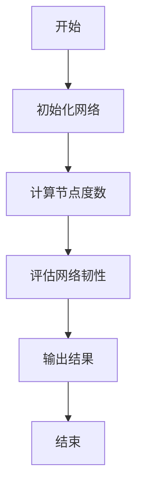
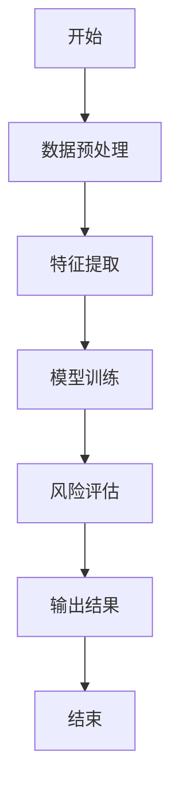
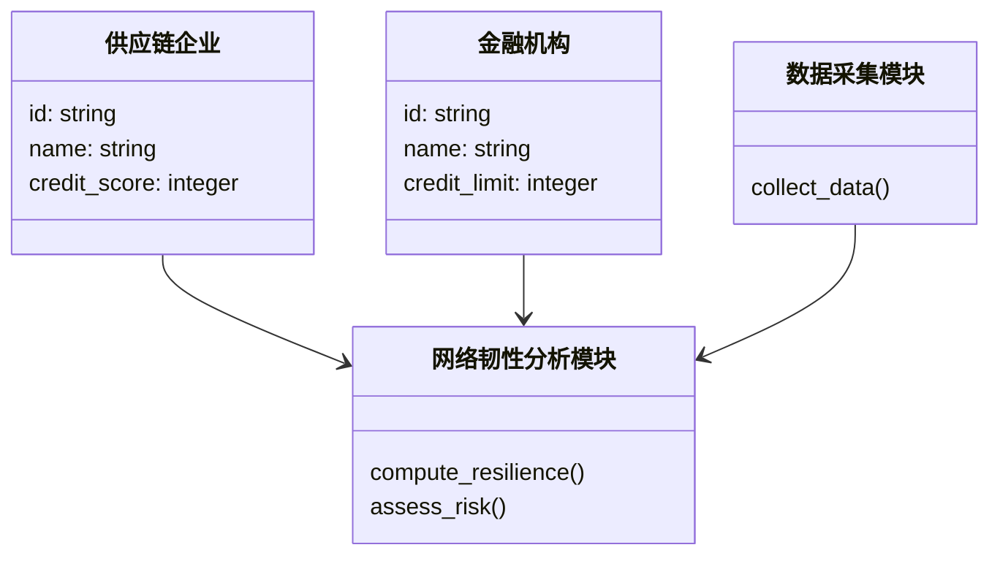

                 


# 开发智能化的供应链金融信用网络韧性分析模型

> 关键词：供应链金融、信用网络、网络韧性、算法原理、系统架构、项目实战

> 摘要：本文详细探讨了供应链金融信用网络韧性分析模型的开发过程，从背景概念、核心原理到算法实现、系统架构，再到项目实战，全面解析了该模型的构建与应用。通过结合理论与实践，本文旨在为供应链金融领域的信用风险管理和网络韧性优化提供新的思路和方法。

---

## 第一部分：供应链金融与信用网络韧性分析的背景与概念

### 第1章：供应链金融与信用网络韧性概述

#### 1.1 供应链金融的概念与特点
供应链金融是通过整合供应链中的物流、信息流和资金流，为供应链上的企业提供融资支持的一种金融模式。其特点包括：
- **整合性**：将供应链上的多方主体（供应商、制造商、分销商、零售商等）纳入统一的金融体系。
- **动态性**：根据供应链的实际运作情况动态调整融资方案。
- **风险分担**：通过多方协作降低单一环节的金融风险。

#### 1.2 信用网络的定义与属性
信用网络是指基于信任关系构建的网络，其属性包括：
- **节点**：代表供应链中的企业。
- **边**：表示企业之间的信用关系。
- **权重**：表示信用额度或信任程度。

#### 1.3 供应链金融信用网络的韧性分析
供应链金融信用网络的韧性分析是指评估该网络在面对信用风险、市场波动、供应链中断等挑战时的承受能力。其重要性体现在：
- **风险预警**：通过分析网络韧性，提前发现潜在风险点。
- **优化建议**：基于韧性分析结果，提出网络优化方案。

#### 1.4 核心概念与边界
核心概念包括供应链网络、信用网络和韧性分析。边界包括：
- **范围**：仅关注供应链金融相关的信用网络。
- **深度**：仅分析网络的结构韧性，不涉及具体业务流程。

---

## 第二部分：供应链金融信用网络韧性分析模型的核心概念与联系

### 第2章：核心概念与联系

#### 2.1 核心概念的原理
供应链网络的结构特性决定了信用网络的韧性。通过分析网络的度数分布、中心性等属性，可以评估网络的鲁棒性。

#### 2.2 概念属性特征对比
通过对比供应链网络和信用网络的属性，可以更好地理解其差异与联系。例如：
- **供应链网络**：关注物流和信息流的效率。
- **信用网络**：关注企业间的信任关系。

| 概念 | 属性 | 描述 |
|------|------|------|
| 供应链网络 | 度数 | 节点的连接数量 |
| 信用网络 | 权重 | 边的信任程度 |
| 韧性分析 | 阈值 | 网络的断裂点 |

#### 2.3 ER实体关系图
通过ER图可以清晰展示供应链金融信用网络中的实体关系。例如：

```mermaid
er
  actor 供应链企业 {
    id: string
    name: string
    credit_limit: integer
  }
  actor 金融机构 {
    id: string
    name: string
    credit_score: integer
  }
  relationship 提供融资 {
    from 供应链企业
    to 金融机构
    amount: integer
    term: string
  }
```

---

## 第三部分：供应链金融信用网络韧性分析模型的算法原理

### 第3章：算法原理与实现

#### 3.1 网络韧性计算算法
网络韧性计算算法通过分析网络的连接性来评估其韧性。例如：



算法步骤：
1. 初始化网络：构建供应链金融信用网络的图结构。
2. 计算节点度数：统计每个节点的连接数量。
3. 评估网络韧性：基于度数分布计算韧性指数。
4. 输出结果：返回网络韧性的评估结果。

#### 3.2 信用风险评估算法
信用风险评估算法通过分析企业间的信用关系来预测潜在风险。例如：



算法实现：
1. 数据预处理：清洗和标准化数据。
2. 特征提取：提取企业的信用评分、历史违约记录等特征。
3. 模型训练：使用机器学习算法（如逻辑回归）训练模型。
4. 风险评估：基于模型预测企业的信用风险等级。

#### 3.3 算法实现的Python代码
以下是一个信用风险评估算法的Python实现示例：

```python
import pandas as pd
from sklearn.linear_model import LogisticRegression
from sklearn.metrics import accuracy_score

# 数据加载与预处理
data = pd.read_csv('credit_network.csv')
data = data.dropna()

# 特征提取
X = data[['credit_score', 'history_default']]
y = data['risk']

# 模型训练
model = LogisticRegression()
model.fit(X, y)

# 风险评估
predicted = model.predict(X)
print("准确率:", accuracy_score(y, predicted))
```

---

## 第四部分：系统分析与架构设计方案

### 第4章：系统分析与架构设计

#### 4.1 问题场景介绍
供应链金融信用网络韧性分析系统的应用场景包括企业融资、风险预警、网络优化等。

#### 4.2 系统功能设计
系统功能包括：
- 数据采集：采集企业信用数据。
- 网络构建：构建供应链信用网络。
- 韧性分析：评估网络韧性。
- 风险预警：实时监测信用风险。

#### 4.3 领域模型图
以下是系统领域的模型图：



#### 4.4 系统架构设计
以下是系统架构图：

```mermaid
archi
    左上：供应链企业
    中上：金融机构
    右上：数据采集模块
    中间：网络韧性分析模块
    左下：风险预警模块
    右下：用户界面
    供应链企业 --> 数据采集模块
    金融机构 --> 数据采集模块
    数据采集模块 --> 网络韧性分析模块
    网络韧性分析模块 --> 风险预警模块
    风险预警模块 --> 用户界面
```

---

## 第五部分：项目实战

### 第5章：项目实战

#### 5.1 环境安装
安装Python和必要的库：
```bash
pip install pandas scikit-learn mermaid
```

#### 5.2 系统核心实现源代码
以下是网络韧性分析模块的实现代码：

```python
import networkx as nx

def compute_resilience(graph):
    # 计算节点度数
    degrees = nx.degree(graph)
    # 计算韧性指数
    resilience = sum([d for n, d in degrees])
    return resilience

# 示例网络构建
graph = nx.Graph()
graph.add_nodes_from(['A', 'B', 'C', 'D'])
graph.add_edges_from([('A', 'B'), ('B', 'C'), ('C', 'D')])
print(compute_resilience(graph))
```

#### 5.3 代码应用解读与分析
通过上述代码，可以实现对供应链金融信用网络的韧性计算。代码首先构建网络，然后计算每个节点的度数，最后求和得到韧性指数。

#### 5.4 实际案例分析
以某供应链企业为例，分析其信用网络的韧性。例如：
- 网络中存在多个高度数节点，说明网络具有较高的韧性。
- 某节点的度数较低，可能是网络的薄弱环节。

#### 5.5 项目小结
通过项目实战，可以验证模型的有效性和实用性。在实际应用中，需要结合具体业务场景进行调整和优化。

---

## 第六部分：最佳实践、小结、注意事项、拓展阅读

### 第6章：最佳实践与总结

#### 6.1 最佳实践
- 数据质量是模型准确性的关键，需确保数据的完整性和准确性。
- 在实际应用中，建议结合具体业务场景进行模型优化。

#### 6.2 小结
本文详细介绍了供应链金融信用网络韧性分析模型的开发过程，从背景概念到算法实现，再到系统架构和项目实战，为读者提供了全面的指导。

#### 6.3 注意事项
- 确保模型的可解释性，避免过于复杂的算法。
- 定期更新模型参数，适应市场变化。

#### 6.4 拓展阅读
推荐阅读《供应链金融与风险管理》和《网络科学与复杂系统》等书籍，深入理解供应链金融和网络韧性分析的理论与实践。

---

## 作者信息

作者：AI天才研究院/AI Genius Institute & 禅与计算机程序设计艺术 /Zen And The Art of Computer Programming

---

**全文完。**

