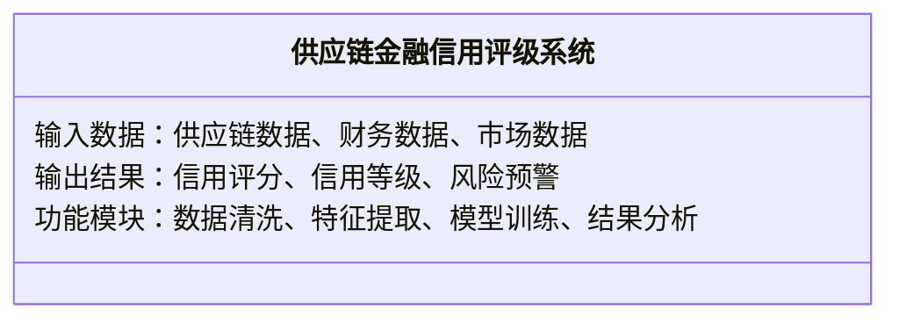

                 


# 开发智能化的供应链金融信用评级模型

---

## 关键词
- 供应链金融
- 信用评级模型
- 机器学习
- 智能化
- 金融风险

---

## 摘要
随着全球供应链的复杂化和金融风险的加剧，开发智能化的供应链金融信用评级模型成为企业优化融资效率、降低金融风险的核心需求。本文从供应链金融的基本概念出发，详细探讨了信用评级模型的核心要素、算法原理以及系统架构，结合实际案例，分析了模型的实现过程和优化策略。通过本文的阐述，读者可以全面理解如何利用智能化技术构建高效可靠的供应链金融信用评级系统。

---

# 第一部分: 供应链金融与信用评级模型概述

## 第1章: 供应链金融的基本概念

### 1.1 供应链金融的定义与特点
#### 1.1.1 供应链金融的定义
供应链金融是指通过整合供应链上下游资源，为参与方提供融资、支付、结算等金融服务的活动。其核心在于通过数据共享和信用评估，降低金融交易的成本和风险。

#### 1.1.2 供应链金融的核心特点
- **数据驱动**：依赖于供应链中的实时数据进行决策。
- **多参与方协作**：涉及供应商、客户、金融机构等多方主体。
- **动态风险控制**：能够根据市场变化和企业经营状况实时调整信用评级。

#### 1.1.3 供应链金融与传统金融的区别
传统金融主要基于企业的财务报表和历史信用记录进行评估，而供应链金融则结合了供应链中的实时交易数据、物流信息和市场动态，能够更精准地反映企业的信用状况。

---

## 第2章: 供应链金融智能化的背景与意义

### 2.1 供应链金融智能化的背景
#### 2.1.1 传统供应链金融的痛点
- 信息孤岛：供应链上下游企业之间的数据难以共享，导致信用评估效率低下。
- 风险分散：传统信用评估难以捕捉供应链中的复杂风险。
- 融资效率低：中小企业在传统金融体系中难以获得及时的融资支持。

#### 2.1.2 智能化技术的发展推动
- **大数据技术**：能够处理海量非结构化数据，提供更全面的信用评估依据。
- **人工智能**：通过机器学习算法，实现自动化、智能化的信用评级。
- **区块链技术**：确保供应链数据的安全性和不可篡改性。

#### 2.1.3 供应链金融智能化的必要性
- 提高融资效率，降低企业运营成本。
- 减少金融风险，提升金融机构的资产质量。
- 优化资源配置，促进供应链的整体效率提升。

### 2.2 供应链金融智能化的意义
#### 2.2.1 提高融资效率
通过智能化信用评级模型，金融机构可以快速评估企业的信用状况，缩短融资周期。

#### 2.2.2 降低金融风险
智能化模型能够实时监控供应链中的风险因素，提前预警潜在的信用风险。

#### 2.2.3 优化资源配置
通过智能化信用评级，金融机构可以更精准地分配信贷资源，支持优质企业的发展。

---

# 第二部分: 供应链金融信用评级模型的核心概念

## 第3章: 供应链金融信用评级模型的核心要素

### 3.1 供应链参与方的信用分析
#### 3.1.1 供应商信用分析
- 供应商的历史交易记录、履约能力、财务状况等。
- 供应商之间的合作关系和市场声誉。

#### 3.1.2 客户信用分析
- 客户的采购历史、支付能力、市场地位等。
- 客户与供应商之间的合同履行情况。

#### 3.1.3 第三方物流的信用评估
- 物流企业的运输能力、服务质量和历史记录。
- 物流企业在供应链中的信用表现。

### 3.2 供应链数据的特征与属性
#### 3.2.1 数据的完整性与准确性
- 数据来源的多样性和真实性。
- 数据清洗和预处理的重要性。

#### 3.2.2 数据的实时性与动态性
- 供应链数据的实时更新和动态变化。
- 模型需要具备动态调整的能力。

#### 3.2.3 数据的关联性与复杂性
- 数据之间的相互关联和影响。
- 复杂的供应链网络结构对信用评级的影响。

---

## 第4章: 供应链金融信用评级模型的ER实体关系图

### 4.1 实体关系图的定义
供应链金融信用评级模型的ER实体关系图展示了供应链中各参与方及其之间的关系。

### 4.2 实体关系图的构建
```mermaid
erd
 供应商(供应商ID, 企业名称, 注册资本, 经营范围, 信用评分)
 客户(客户ID, 企业名称, 注册资本, 经营范围, 信用评分)
 金融机构(机构ID, 机构名称, 资金规模, 信用评级标准)
 物流平台(平台ID, 平台名称, 运输能力, 信用评分)
 订单信息(订单ID, 供应商ID, 客户ID, 订单金额, 订单日期, 状态)
 支付信息(支付ID, 订单ID, 支付金额, 支付时间, 支付状态)
```

### 4.3 实体关系图的扩展与优化
通过引入更多实体（如市场数据、政策法规等），进一步丰富模型的复杂性和准确性。

---

# 第三部分: 供应链金融信用评级模型的算法原理

## 第5章: 常见的信用评级算法

### 5.1 传统信用评级算法
#### 5.1.1 线性回归模型
线性回归模型用于预测企业的信用评分，基于企业的财务数据和历史表现。

$$ 信用评分 = \beta_0 + \beta_1 \times 收入 + \beta_2 \times 利润 $$

#### 5.1.2 逻辑回归模型
逻辑回归模型用于分类企业信用等级（如AAA、AA、A、BBB等）。

$$ P(y=1) = \frac{e^{\beta_0 + \beta_1 x}}{1 + e^{\beta_0 + \beta_1 x}} $$

#### 5.1.3 支持向量机模型
支持向量机（SVM）用于非线性分类问题，适用于企业信用评级中的复杂场景。

---

## 第6章: 基于机器学习的信用评级模型

### 6.1 机器学习模型的输入特征
#### 6.1.1 企业经营状况
- 营业收入、净利润、资产负债率等。

#### 6.1.2 财务数据
- 财务报表数据、现金流、应收账款等。

#### 6.1.3 供应链关系
- 供应商和客户之间的关系强度、历史交易记录等。

### 6.2 神经网络模型的实现
#### 6.2.1 模型结构
- 输入层：供应链数据特征。
- 隐藏层：多个神经网络层，用于特征提取和非线性变换。
- 输出层：信用评分或信用等级。

#### 6.2.2 模型训练
使用历史数据对神经网络进行训练，优化模型参数。

### 6.3 集成学习模型的应用
#### 6.3.1 集成学习的优势
- 提高模型的稳定性和准确性。
- 减少过拟合的风险。

#### 6.3.2 常见的集成方法
- Bagging：通过bootstrap采样生成多个基模型。
- Boosting：通过加权训练数据逐步优化模型。

---

# 第四部分: 供应链金融信用评级模型的系统架构设计

## 第7章: 系统功能设计

### 7.1 领域模型设计


### 7.2 系统架构设计


---

# 第五部分: 供应链金融信用评级模型的项目实战

## 第8章: 环境安装与代码实现

### 8.1 环境安装
- Python 3.8+
- PyTorch、Scikit-learn、Pandas等库的安装。

### 8.2 核心代码实现
```python
import torch
import torch.nn as nn
import torch.optim as optim

class CreditRatingModel(nn.Module):
    def __init__(self, input_dim, hidden_dim, output_dim):
        super(CreditRatingModel, self).__init__()
        self.fc1 = nn.Linear(input_dim, hidden_dim)
        self.fc2 = nn.Linear(hidden_dim, output_dim)
        self.relu = nn.ReLU()
        self.sigmoid = nn.Sigmoid()

    def forward(self, x):
        out = self.fc1(x)
        out = self.relu(out)
        out = self.fc2(out)
        out = self.sigmoid(out)
        return out

# 初始化模型
input_dim = 10
hidden_dim = 20
output_dim = 1
model = CreditRatingModel(input_dim, hidden_dim, output_dim)

# 定义损失函数和优化器
criterion = nn.BCELoss()
optimizer = optim.Adam(model.parameters(), lr=0.001)

# 训练模型
for epoch in range(100):
    outputs = model(inputs)
    loss = criterion(outputs, labels)
    optimizer.zero_grad()
    loss.backward()
    optimizer.step()
```

---

## 第9章: 实际案例分析与优化策略

### 9.1 实际案例分析
通过一个具体案例，分析模型的输入特征、训练过程和输出结果。

### 9.2 模型优化策略
- 数据增强：引入更多的供应链数据。
- 模型调优：优化神经网络的结构和参数。
- 模型评估：使用准确率、召回率等指标评估模型性能。

---

## 第10章: 小结与注意事项

### 10.1 小结
供应链金融信用评级模型的开发需要结合供应链的复杂性和金融风险的动态性，通过智能化技术实现高效、精准的信用评估。

### 10.2 注意事项
- 数据隐私和安全问题。
- 模型的实时性和可解释性。
- 供应链金融的政策合规性。

---

## 第11章: 最佳实践与拓展阅读

### 11.1 最佳实践
- 定期更新模型，适应市场变化。
- 结合区块链技术，提高数据可信度。
- 优化模型的可解释性，方便用户理解。

### 11.2 拓展阅读
- 《供应链金融：理论与实践》
- 《机器学习实战》
- 《区块链技术与应用》

---

## 作者：AI天才研究院 & 禅与计算机程序设计艺术

---

通过本文的系统阐述，读者可以深入了解供应链金融信用评级模型的开发过程，掌握其实现方法和优化策略，为实际应用提供理论支持和实践指导。

