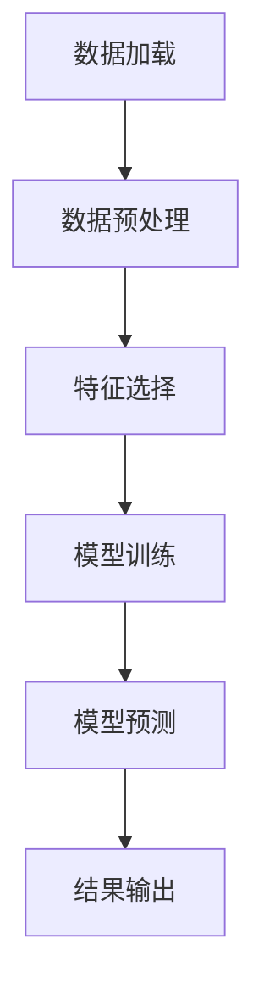
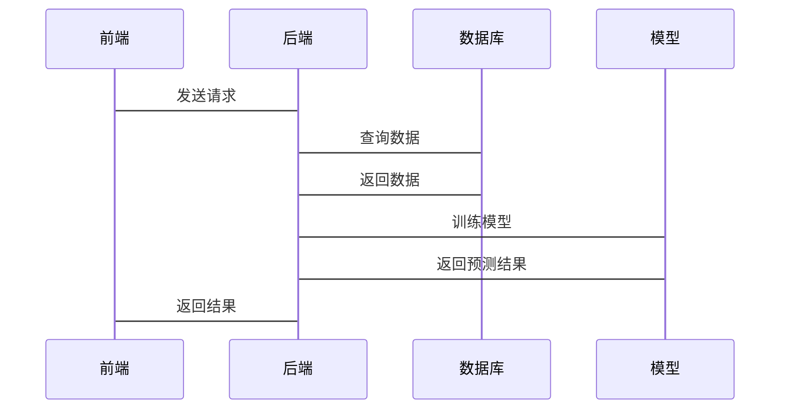

                 


```markdown
# 开发智能化的供应链金融风险预警模型

> 关键词：供应链金融，风险预警，人工智能，机器学习，供应链管理

> 摘要：本文将详细探讨如何开发一个智能化的供应链金融风险预警模型。通过分析供应链金融的风险类型，介绍模型的核心概念，讲解算法原理，设计系统架构，并通过项目实战展示模型的实现过程，最后总结最佳实践和未来发展方向。

---

# 第1章: 供应链金融风险预警模型的背景与概述

## 1.1 供应链金融的定义与特点
### 1.1.1 供应链金融的定义
供应链金融是指通过整合供应链上下游企业，提供融资、结算、支付等金融服务，以支持供应链的高效运作。其特点包括：资金流与物流的结合、多方协作、风险分担等。

### 1.1.2 供应链金融的核心特点
- **整体性**：覆盖供应链全链条。
- **协同性**：企业间协同运作。
- **风险性**：涉及多方信用风险。

### 1.1.3 供应链金融在企业中的应用价值
- 提高资金流动性。
- 优化库存管理。
- 降低融资成本。

## 1.2 供应链金融风险的定义与分类
### 1.2.1 供应链金融风险的定义
供应链金融风险是指在供应链运营过程中，由于市场变化、企业信用状况、操作失误等因素导致的财务损失可能性。

### 1.2.2 供应链金融风险的主要类型
- **信用风险**：交易对手违约风险。
- **市场风险**：价格波动影响企业偿债能力。
- **操作风险**：流程中的失误导致的损失。

### 1.2.3 供应链金融风险的特征与影响
- **复杂性**：涉及多个变量。
- **动态性**：受市场环境影响。
- **系统性**：风险可能在供应链中蔓延。

## 1.3 供应链金融风险预警模型的必要性
### 1.3.1 供应链金融风险预警的背景
随着供应链全球化和复杂化，传统的风险管理方法已不足以应对复杂风险。

### 1.3.2 供应链金融风险预警模型的作用
- 提前识别潜在风险。
- 减少经济损失。
- 提高供应链整体稳定性。

### 1.3.3 供应链金融风险预警模型的边界与外延
- **边界**：模型仅关注直接相关的风险因素。
- **外延**：可扩展至更多业务场景。

## 1.4 供应链金融风险预警模型的核心要素
### 1.4.1 数据来源与特征
- 数据来源：企业财务数据、供应链交易数据、市场数据等。
- 数据特征：时间序列性、多维性、相关性。

### 1.4.2 风险评估指标
- **信用评分**：衡量企业信用状况。
- **流动比率**：评估企业短期偿债能力。
- **存货周转率**：衡量库存管理效率。

### 1.4.3 预警机制与阈值
- **预警级别**：分为红色、橙色、黄色、蓝色四个级别。
- **触发条件**：当某项指标低于阈值时触发预警。

## 1.5 本章小结
本章介绍了供应链金融的基本概念、风险类型及其预警模型的必要性，为后续章节奠定了基础。

---

# 第2章: 供应链金融风险预警模型的核心概念与联系

## 2.1 供应链金融风险预警模型的原理
### 2.1.1 数据采集与处理
- 数据来源：企业ERP系统、供应链平台等。
- 数据清洗：处理缺失值、异常值。
- 数据转换：特征工程，如标准化、编码等。

### 2.1.2 风险评估与预测
- 使用机器学习算法预测风险级别。
- 通过模型输出预警信号。

### 2.1.3 预警结果的输出
- 生成风险报告。
- 提供风险缓解建议。

## 2.2 核心概念的属性特征对比
### 2.2.1 数据特征对比表
| 数据类型 | 特征 | 示例 |
|----------|------|------|
| 财务数据 | 时间序列性 | 每月财务报表 |
| 交易数据 | 多维性 | 供应商、客户、物流 |

### 2.2.2 模型特征对比表
| 模型类型 | 优势 | 劣势 |
|----------|------|------|
| 预测模型 | 高准确性 | 计算复杂 |
| 分类模型 | 易解释 | 准确性较低 |

### 2.2.3 预警结果特征对比表
| 预警级别 | 触发条件 | 影响范围 |
|----------|----------|----------|
| 红色 | 信用评分 < 60 | 供应链整体 |
| 橙色 | 流动比率 < 1.5 | 关键环节 |

## 2.3 ER实体关系图
### 2.3.1 实体关系图的描述
供应链金融风险预警模型涉及多个实体，包括企业、供应商、客户、交易记录等。

### 2.3.2 实体关系图的 mermaid 代码
```mermaid
erDiagram
    actor 供应链企业 {
        +企业ID : integer
        +企业名称 : string
        +行业 : string
    }
    actor 供应商 {
        +供应商ID : integer
        +供应商名称 : string
        +信用评分 : integer
    }
    actor 客户 {
        +客户ID : integer
        +客户名称 : string
        +订单金额 : integer
    }
    database 供应链数据表 {
        +交易ID : integer
        +企业ID : integer
        +供应商ID : integer
        +客户ID : integer
        +交易时间 : timestamp
        +金额 : integer
    }
    component 风险评估模型 {
        +风险级别 : enum{红色, 橙色, 黄色, 蓝色}
        +触发时间 : timestamp
    }
    供应链企业 --> 供应链数据表
    供应商 --> 供应链数据表
    客户 --> 供应链数据表
    供应链数据表 --> 风险评估模型
```

## 2.4 本章小结
本章通过对比和图解，详细阐述了供应链金融风险预警模型的核心概念及其相互关系。

---

# 第3章: 供应链金融风险预警模型的算法原理

## 3.1 算法选择与原理
### 3.1.1 算法选择
基于供应链金融的特征，选择随机森林作为分类算法，用于预测风险级别。

### 3.1.2 算法原理
随机森林是一种基于决策树的集成学习方法，通过构建多个决策树并进行投票或平均来提高模型准确性和鲁棒性。

## 3.2 算法流程
### 3.2.1 数据预处理
- 数据清洗：处理缺失值、异常值。
- 特征选择：提取关键特征，如流动比率、存货周转率等。

### 3.2.2 模型训练
- 使用训练数据训练随机森林模型。
- 调参：调整树的棵数、每个节点的最小样本数等参数。

### 3.2.3 模型预测
- 使用测试数据预测风险级别。
- 输出预警信号。

## 3.3 算法实现
### 3.3.1 代码实现
```python
import pandas as pd
from sklearn.ensemble import RandomForestClassifier
from sklearn.model_selection import train_test_split
from sklearn.metrics import accuracy_score

# 数据加载
data = pd.read_csv('supply_chain_data.csv')
X = data.drop('risk_level', axis=1)
y = data['risk_level']

# 数据分割
X_train, X_test, y_train, y_test = train_test_split(X, y, test_size=0.2)

# 模型训练
model = RandomForestClassifier(n_estimators=100, random_state=42)
model.fit(X_train, y_train)

# 模型预测
y_pred = model.predict(X_test)
print("Accuracy:", accuracy_score(y_test, y_pred))
```

### 3.3.2 算法流程图


## 3.4 数学模型与公式
### 3.4.1 随机森林的数学模型
随机森林通过投票机制进行预测，公式如下：
$$
\text{预测结果} = \arg\max_{i} \sum_{j=1}^{n} I(\text{树}j \text{预测类别}i)
$$

### 3.4.2 模型评估公式
准确率计算公式：
$$
\text{准确率} = \frac{\text{正确预测数}}{\text{总预测数}}
$$

## 3.5 本章小结
本章详细讲解了随机森林算法在供应链金融风险预警中的应用，并通过代码和流程图展示了实现过程。

---

# 第4章: 供应链金融风险预警系统的系统分析与架构设计

## 4.1 项目场景介绍
### 4.1.1 项目背景
企业希望通过智能化系统实时监控供应链金融风险。

### 4.1.2 项目目标
开发一个实时监控、智能预警的供应链金融风险预警系统。

## 4.2 系统功能设计
### 4.2.1 领域模型
```mermaid
classDiagram
    class 供应链企业 {
        +企业ID : integer
        +企业名称 : string
        +行业 : string
    }
    class 供应商 {
        +供应商ID : integer
        +供应商名称 : string
        +信用评分 : integer
    }
    class 客户 {
        +客户ID : integer
        +客户名称 : string
        +订单金额 : integer
    }
    class 交易记录 {
        +交易ID : integer
        +企业ID : integer
        +供应商ID : integer
        +客户ID : integer
        +交易时间 : timestamp
        +金额 : integer
    }
    class 风险评估模型 {
        +风险级别 : enum{红色, 橙色, 黄色, 蓝色}
        +触发时间 : timestamp
    }
    供应链企业 --> 交易记录
    供应商 --> 交易记录
    客户 --> 交易记录
    交易记录 --> 风险评估模型
```

### 4.2.2 系统架构设计


### 4.2.3 系统接口设计
- API接口：提供给前端调用，获取风险预警结果。

### 4.2.4 系统交互流程图


## 4.3 本章小结
本章通过系统架构设计，展示了供应链金融风险预警系统的实现方案。

---

# 第5章: 供应链金融风险预警系统的项目实战

## 5.1 环境安装与配置
### 5.1.1 安装Python环境
使用Anaconda安装Python 3.8及以上版本。

### 5.1.2 安装依赖库
安装pandas、scikit-learn、mermaid等库。

## 5.2 核心代码实现
### 5.2.1 数据加载与预处理
```python
import pandas as pd
from sklearn.ensemble import RandomForestClassifier
from sklearn.model_selection import train_test_split
from sklearn.metrics import accuracy_score

# 数据加载
data = pd.read_csv('supply_chain_data.csv')
X = data.drop('risk_level', axis=1)
y = data['risk_level']

# 数据分割
X_train, X_test, y_train, y_test = train_test_split(X, y, test_size=0.2)

# 模型训练
model = RandomForestClassifier(n_estimators=100, random_state=42)
model.fit(X_train, y_train)

# 模型预测
y_pred = model.predict(X_test)
print("Accuracy:", accuracy_score(y_test, y_pred))
```

### 5.2.2 风险评估与预警
```python
# 预警机制
def generate_warning(risk_level):
    if risk_level == '红色':
        return '供应链整体风险极高，建议立即采取措施'
    elif risk_level == '橙色':
        return '供应链存在较高风险，建议加强监控'
    elif risk_level == '黄色':
        return '供应链存在中等风险，建议关注'
    else:
        return '供应链风险较低，运行正常'

# 应用预警机制
warning = generate_warning(y_pred[0])
print(warning)
```

## 5.3 项目案例分析
### 5.3.1 案例背景
某制造企业供应链出现供应商延迟交货，导致库存积压。

### 5.3.2 数据分析
- 供应商信用评分下降。
- 存货周转率降低。

### 5.3.3 预警结果
模型预测风险级别为橙色，触发预警机制。

## 5.4 本章小结
本章通过实际案例展示了供应链金融风险预警系统的实现过程。

---

# 第6章: 供应链金融风险预警系统的最佳实践

## 6.1 小结
总结本项目的主要内容和实现过程。

## 6.2 注意事项
- 数据质量的重要性。
- 模型调优的必要性。
- 系统维护与更新。

## 6.3 拓展阅读
- 推荐阅读《供应链金融：理论与实践》。
- 推荐学习机器学习在金融领域的应用。

## 6.4 本章小结
本章总结了项目的实施经验，并提供了未来发展建议。

---

# 第7章: 供应链金融风险预警模型的高级主题与未来展望

## 7.1 高级主题
### 7.1.1 多模型融合
通过集成学习提高模型准确率。

### 7.1.2 实时预警系统
构建实时数据处理系统，实现动态风险预警。

## 7.2 未来展望
随着人工智能技术的发展，供应链金融风险预警模型将更加智能化、实时化和个性化。

## 7.3 本章小结
本章展望了供应链金融风险预警模型的未来发展方向。

---

# 作者：AI天才研究院/AI Genius Institute & 禅与计算机程序设计艺术 /Zen And The Art of Computer Programming

---

通过以上目录，您可以逐步深入理解并掌握如何开发智能化的供应链金融风险预警模型。希望本文对您有所帮助！
```

