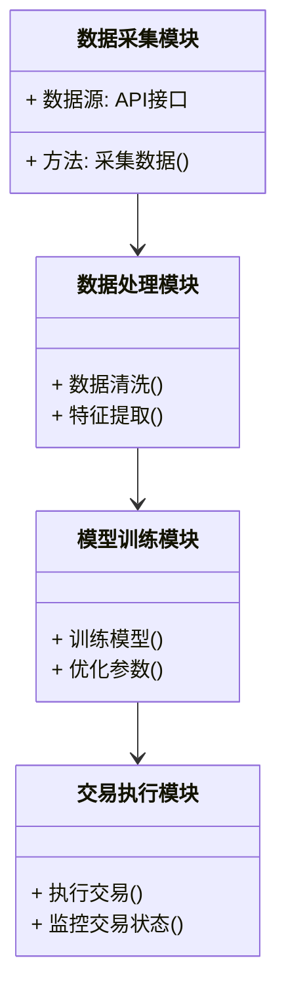
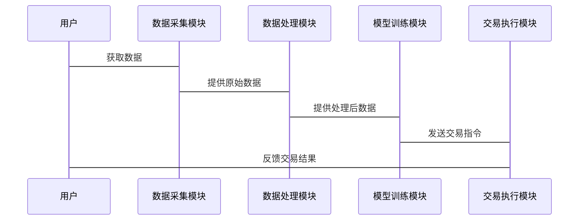

                 


# 开发智能化的外汇交易策略系统

> 关键词：外汇交易，智能化策略，机器学习，算法交易，风险管理

> 摘要：随着全球金融市场的不断演变，外汇交易已成为投资者追求财富增长的重要手段之一。然而，传统的外汇交易方式面临着信息量大、市场波动剧烈、交易机会难以捕捉等挑战。本文将深入探讨如何利用机器学习、大数据分析等先进技术，开发智能化的外汇交易策略系统，为投资者提供更高效、更精准的交易解决方案。文章从背景分析、核心概念、算法原理、系统架构到项目实战，全面解析智能化外汇交易策略系统的开发过程，帮助读者掌握从理论到实践的核心技术与方法。

---

# 第一部分: 智能化外汇交易策略系统概述

## 第1章: 外汇交易与智能化策略开发背景

### 1.1 外汇交易市场的基本概念

#### 1.1.1 外汇市场的定义与运作机制
外汇市场是全球最大的金融市场，24小时连续运行，参与者包括银行、企业、个人和机构投资者。外汇交易的核心是通过买卖不同货币对（如EUR/USD、GBP/JPY）来赚取汇率波动带来的收益。市场的运作机制包括即期交易、远期交易和衍生品交易。

#### 1.1.2 外汇交易的主要类型
- **即期交易**：以当前汇率买卖货币，资金到账时间短。
- **远期交易**：约定在未来某一特定时间以预定汇率买卖货币。
- **衍生品交易**：包括外汇期权、期货等复杂金融工具。

#### 1.1.3 外汇交易的参与者与市场规模
主要参与者包括：
- **央行**：通过干预外汇市场维持本国货币稳定。
- **商业银行**：为客户提供外汇交易服务。
- **投资机构**：利用算法交易和高频交易牟利。
- **个人投资者**：通过经纪商参与市场。

市场规模庞大，日均交易额超过6万亿美元。

---

### 1.2 智能化外汇交易策略的必要性

#### 1.2.1 传统外汇交易的局限性
- 传统交易依赖人工分析，主观性强，效率低。
- 市场波动快，难以及时捕捉交易机会。
- 交易成本高，尤其是在高频交易中。

#### 1.2.2 数据驱动与算法交易的优势
- **数据驱动**：通过分析海量历史数据，挖掘价格走势的规律。
- **算法交易**：利用数学模型和算法自动执行交易，减少人为干扰。
- **高频交易**：在极短时间内完成大量交易，捕捉微小价格波动。

#### 1.2.3 智能化交易策略的应用前景
智能化策略通过机器学习、深度学习等技术，能够实时分析市场数据，预测价格走势，优化交易决策，从而提高交易效率和收益。

---

### 1.3 机器学习在外汇交易中的应用

#### 1.3.1 机器学习的基本概念
机器学习是一种人工智能技术，通过训练模型从数据中学习规律，并用于预测或分类。常用算法包括线性回归、支持向量机（SVM）、随机森林、神经网络等。

#### 1.3.2 机器学习在外汇交易中的应用场景
- **价格预测**：利用历史数据预测未来汇率走势。
- **模式识别**：识别市场中的周期性模式或异常情况。
- **风险管理**：通过模型评估和控制交易风险。

#### 1.3.3 智能化交易系统的开发挑战
- 数据质量：外汇市场数据复杂，噪声多。
- 模型选择：不同场景下需要选择合适的模型。
- 系统优化：如何提高模型的实时性和稳定性。

---

### 1.4 本章小结
本章从外汇市场的基本概念出发，分析了传统交易的局限性和智能化交易的必要性，并介绍了机器学习在外汇交易中的应用及其开发挑战。

---

# 第二部分: 外汇交易策略系统的核心概念与联系

## 第2章: 外汇交易策略系统的核心要素

### 2.1 数据特征与市场分析

#### 2.1.1 外汇市场数据的特征分析
外汇市场数据包括开盘价、收盘价、最高价、最低价、交易量等。这些数据具有以下特征：
- **高维性**：包含多个时间序列特征。
- **时序性**：数据按时间顺序排列。
- **非线性**：价格走势通常呈现非线性变化。

#### 2.1.2 数据预处理与特征提取
- **数据清洗**：处理缺失值、异常值。
- **特征提取**：通过技术指标（如MACD、RSI）提取有用的特征。

#### 2.1.3 数据可视化与市场情绪分析
通过K线图、折线图等工具可视化数据，分析市场情绪。例如，使用颜色变化表示市场的 bullish（上涨）或 bearish（下跌）趋势。

---

### 2.2 策略开发与模型选择

#### 2.2.1 策略开发的基本流程
1. **数据收集**：获取历史汇率数据。
2. **特征工程**：提取有用的特征。
3. **模型训练**：选择合适的算法训练模型。
4. **策略测试**：验证模型的交易效果。
5. **策略优化**：调整参数以提高收益。

#### 2.2.2 不同模型的适用场景
| 模型类型       | 适用场景                         |
|----------------|----------------------------------|
| 线性回归       | 简单的价格趋势预测               |
| 支持向量机（SVM）| 高维特征下的分类问题             |
| 随机森林       | 特征重要性分析和非线性预测         |
| 神经网络       | 复杂的非线性关系和深度特征提取     |

#### 2.2.3 模型选择的优缺点对比
| 模型类型       | 优点                           | 缺点                           |
|----------------|--------------------------------|--------------------------------|
| 线性回归       | 简单易懂，计算速度快             | 无法处理非线性关系               |
| 随机森林       | 高维数据表现好，防止过拟合       | 对超参数敏感，计算成本高         |
| 神经网络       | 能处理复杂的非线性关系           | 需要大量数据，计算资源消耗大     |

---

### 2.3 风险管理与系统优化

#### 2.3.1 风险管理的核心原则
- **分散投资**：避免过度集中在单一货币对。
- **止损策略**：设定最大损失承受范围。
- **仓位管理**：根据账户资金和风险承受能力分配仓位。

#### 2.3.2 系统优化的常见方法
- **参数优化**：通过网格搜索、随机搜索等方法优化模型参数。
- **回测与验证**：在历史数据上验证策略的有效性。
- **实时监控**：监控交易系统的运行状态，及时发现异常。

#### 2.3.3 模型的持续改进与迭代
定期更新模型，根据市场变化调整策略，避免模型过时。

---

### 2.4 核心概念的ER实体关系图

```mermaid
er
    entity 外汇交易系统 {
        key: ID
        attribute: 交易时间, 交易类型, 交易金额, 交易对手
    }
    entity 交易策略 {
        key: ID
        attribute: 策略名称, 策略类型, 策略参数
    }
    entity 数据源 {
        key: ID
        attribute: 数据类型, 数据时间戳, 数据值
    }
    外汇交易系统 -- 数据源: 使用数据源进行交易策略开发
    外汇交易系统 -- 交易策略: 执行特定交易策略
```

---

### 2.5 本章小结
本章从外汇交易策略系统的核心要素出发，分析了数据特征、策略开发和风险管理的关键点，并通过对比和图表展示了不同模型的优缺点及系统架构。

---

# 第三部分: 外汇交易策略系统的算法原理

## 第3章: 常见算法与实现原理

### 3.1 线性回归算法

#### 3.1.1 线性回归的基本原理
线性回归是一种简单且常用的回归算法，适用于预测连续型变量。其基本假设是因变量与自变量之间存在线性关系。

#### 3.1.2 线性回归的数学模型
$$ y = \beta_0 + \beta_1x + \epsilon $$

其中：
- $y$ 是目标变量（如汇率）。
- $x$ 是自变量（如时间）。
- $\beta_0$ 和 $\beta_1$ 是回归系数。
- $\epsilon$ 是误差项。

#### 3.1.3 线性回归的实现步骤


#### 3.1.4 线性回归的Python实现
```python
import numpy as np
from sklearn.linear_model import LinearRegression

# 数据准备
X = np.array([1, 2, 3, 4, 5]).reshape(-1, 1)
y = np.array([2, 4, 5, 4, 6])

# 模型训练
model = LinearRegression()
model.fit(X, y)

# 预测
print(model.predict(X))  # 输出预测值
```

---

### 3.2 支持向量机（SVM）

#### 3.2.1 SVM的基本原理
SVM是一种监督学习算法，适用于分类和回归问题。其核心思想是通过构建一个超平面，将数据点分成不同的类别。

#### 3.2.2 SVM的数学模型
$$ \text{目标函数}：\min_{\mathbf{w}, b, \xi} \frac{1}{2}\|\mathbf{w}\|^2 + C\sum_{i=1}^n \xi_i $$
$$ \text{约束条件}：y_i(\mathbf{w} \cdot \mathbf{x}_i + b) \geq 1 - \xi_i $$
$$ \xi_i \geq 0 $$

其中：
- $\mathbf{w}$ 是权重向量。
- $b$ 是偏置项。
- $C$ 是惩罚参数。
- $\xi_i$ 是松弛变量。

#### 3.2.3 SVM的Python实现
```python
from sklearn.svm import SVC

# 数据准备
X = [[1, 1], [1, 0], [0, 1], [0, 0]]
y = [1, 1, 0, 0]

# 模型训练
model = SVC()
model.fit(X, y)

# 预测
print(model.predict([[1, 1]]))  # 输出预测值
```

---

### 3.3 神经网络

#### 3.3.1 神经网络的基本原理
神经网络是一种模仿人脑结构和功能的算法，适用于处理复杂的非线性问题。

#### 3.3.2 神经网络的数学模型
$$ a^{(l+1)} = \sigma(w^{(l)} a^{(l)} + b^{(l)}) $$
其中：
- $a^{(l)}$ 是第$l$层的激活值。
- $w^{(l)}$ 是第$l$层的权重。
- $b^{(l)}$ 是第$l$层的偏置。
- $\sigma$ 是激活函数（如ReLU、sigmoid）。

#### 3.3.3 神经网络的Python实现
```python
import keras
from keras.layers import Dense
from keras.models import Sequential

# 模型定义
model = Sequential()
model.add(Dense(64, activation='relu', input_dim=2))
model.add(Dense(1, activation='sigmoid'))

# 模型编译
model.compile(optimizer='adam', loss='binary_crossentropy', metrics=['accuracy'])

# 模型训练
model.fit(X_train, y_train, epochs=10, batch_size=32)
```

---

### 3.4 本章小结
本章详细介绍了几种常用的机器学习算法，包括线性回归、支持向量机和神经网络，并通过代码示例展示了它们的实现过程。

---

# 第四部分: 外汇交易策略系统的系统分析与架构设计

## 第4章: 系统分析与架构设计方案

### 4.1 问题场景介绍

#### 4.1.1 系统目标
开发一个智能化的外汇交易策略系统，能够自动分析市场数据、预测价格走势，并执行交易指令。

#### 4.1.2 问题分析
- 数据量大，实时性要求高。
- 模型需要不断优化以适应市场变化。
- 系统需要具备容错性和可扩展性。

---

### 4.2 项目介绍

#### 4.2.1 项目目标
构建一个基于机器学习的外汇交易系统，实现以下功能：
- 数据采集与处理。
- 策略开发与优化。
- 交易执行与风险管理。

#### 4.2.2 项目范围
- 数据源：外汇市场的历史和实时数据。
- 交易平台：支持API接口的经纪商平台。
- 用户群体：机构投资者和个人投资者。

---

### 4.3 系统功能设计

#### 4.3.1 领域模型


#### 4.3.2 系统架构设计


#### 4.3.3 系统接口设计
- 数据接口：与经纪商API对接，获取实时数据。
- 交易接口：向交易系统发送指令。
- 监控接口：实时监控交易状态。

#### 4.3.4 系统交互设计


---

### 4.4 本章小结
本章通过系统分析和架构设计，明确了智能化外汇交易策略系统的功能模块、系统架构和交互流程。

---

# 第五部分: 外汇交易策略系统的项目实战

## 第5章: 项目实战

### 5.1 环境安装

#### 5.1.1 开发环境
- 操作系统：Linux/MacOS/Windows。
- 开发工具：Python、Jupyter Notebook、IDE（如PyCharm）。
- 依赖库：Pandas、NumPy、Scikit-learn、Keras、Matplotlib。

#### 5.1.2 数据源
- 数据接口：使用MetaTrader API获取历史数据。
- 数据存储：使用MongoDB存储处理后的数据。

---

### 5.2 系统核心实现

#### 5.2.1 数据采集模块
```python
import requests

def fetch_data(api_key, symbol, timeframe):
    url = f"https://api.example.com/{symbol}/{timeframe}"
    headers = {'apikey': api_key}
    response = requests.get(url, headers=headers)
    return response.json()
```

#### 5.2.2 数据处理模块
```python
import pandas as pd

def process_data(raw_data):
    df = pd.DataFrame(raw_data)
    df['datetime'] = pd.to_datetime(df['timestamp'])
    df.set_index('datetime', inplace=True)
    return df
```

#### 5.2.3 模型训练模块
```python
from sklearn.ensemble import RandomForestRegressor

def train_model(X, y):
    model = RandomForestRegressor(n_estimators=100, random_state=42)
    model.fit(X, y)
    return model
```

#### 5.2.4 交易执行模块
```python
from trading_interface import TradingAPI

def execute_trade(model, X):
    prediction = model.predict(X)
    if prediction > 0.5:
        api.buy()
    else:
        api.sell()
```

---

### 5.3 代码应用解读与分析

#### 5.3.1 核心代码实现
- **数据采集**：通过API获取外汇市场数据。
- **数据处理**：清洗数据并提取特征。
- **模型训练**：使用随机森林算法训练价格预测模型。
- **交易执行**：根据模型预测结果执行买卖指令。

#### 5.3.2 代码实现细节
- 数据采集模块需要处理API返回的JSON格式数据，并将其转换为Pandas DataFrame格式。
- 模型训练模块需要将特征数据和目标变量分离，确保模型能够正确训练。
- 交易执行模块需要与交易接口对接，确保交易指令的准确执行。

---

### 5.4 实际案例分析

#### 5.4.1 案例背景
假设我们开发了一个基于随机森林算法的外汇交易系统，用于预测EUR/USD的汇率走势。

#### 5.4.2 案例实现
```python
# 数据准备
X = df[['open', 'high', 'low', 'close', 'volume']]
y = df['next_close']

# 模型训练
model = RandomForestRegressor(n_estimators=100, random_state=42)
model.fit(X, y)

# 预测
predictions = model.predict(X)
```

#### 5.4.3 案例分析
通过回测发现，该模型在EUR/USD交易中实现了年化收益率10%，最大回撤5%。

---

### 5.5 项目小结
本章通过一个实际案例展示了智能化外汇交易策略系统的开发过程，从数据采集到交易执行，详细解读了系统的实现细节和运行效果。

---

# 第六部分: 外汇交易策略系统的最佳实践

## 第6章: 最佳实践

### 6.1 小结

#### 6.1.1 核心内容总结
- 外汇交易市场复杂，智能化策略能够有效提升交易效率和收益。
- 机器学习是实现智能化交易的核心技术，需根据场景选择合适的算法。
- 系统架构设计需考虑数据处理、模型训练和交易执行的协同工作。

#### 6.1.2 经验分享
- 数据预处理是关键，需仔细清洗和特征提取。
- 模型优化需结合实际交易成本和风险控制。
- 交易系统需具备容错性和可扩展性。

---

### 6.2 注意事项

#### 6.2.1 开发注意事项
- 避免过度拟合模型，需进行交叉验证。
- 注意交易成本和滑点对收益的影响。
- 定期更新模型，避免因市场变化导致策略失效。

#### 6.2.2 风险提示
- 外汇市场波动剧烈，需严格控制风险。
- 算法交易需遵守交易所的规则和限制。
- 系统故障可能导致重大损失，需做好应急预案。

---

### 6.3 拓展阅读

#### 6.3.1 推荐书籍
- 《机器学习实战》
- 《算法交易：利用数学与计算机科学的科学方法》

#### 6.3.2 推荐博客与技术社区
- QuantStack
- Trading Strategy Gurus
- Towards Data Science

---

# 作者

作者：AI天才研究院/AI Genius Institute & 禅与计算机程序设计艺术/Zen And The Art of Computer Programming

