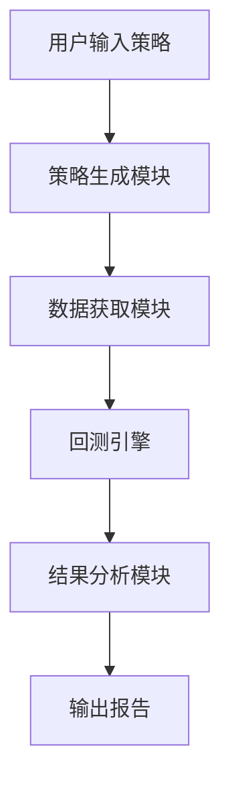
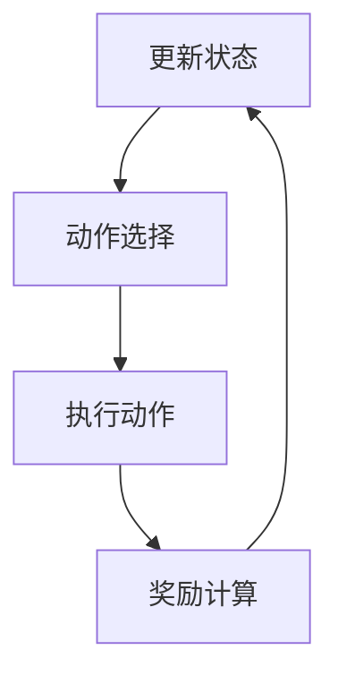
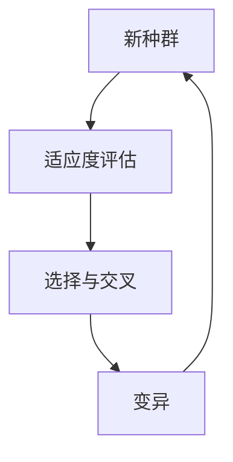

                 


# 开发智能化的资产配置策略回测引擎

> 关键词：资产配置，回测引擎，人工智能，强化学习，遗传算法，金融投资

> 摘要：本文系统地介绍了如何开发一个智能化的资产配置策略回测引擎。从背景和核心概念出发，详细讲解了资产配置策略的数学模型、回测引擎的算法原理、系统架构设计，以及项目实战的实现过程。通过强化学习和遗传算法的应用，结合实际案例分析，展示了如何利用人工智能技术优化资产配置策略的回测过程。本文还提供了详细的系统架构图、算法流程图和代码示例，帮助读者更好地理解和实现智能化的资产配置策略回测引擎。

---

# 第一部分: 资产配置策略回测引擎的背景与核心概念

## 第1章: 资产配置策略回测引擎的背景与问题描述

### 1.1 资产配置与投资管理概述

#### 1.1.1 资产配置的基本概念
资产配置是投资管理中的核心环节，是指根据投资者的风险承受能力、收益目标和市场环境，将资金分配到不同资产类别（如股票、债券、房地产等）的过程。资产配置的目标是在风险可控的前提下，实现收益的最大化。

#### 1.1.2 资产配置在投资管理中的重要性
资产配置是投资组合管理的基础，它决定了投资组合的收益和风险特征。合理的资产配置能够帮助投资者在不同市场环境下优化投资组合的表现。

#### 1.1.3 资产配置的常见策略与方法
资产配置的常见策略包括：
- **固定权重法**：根据预先设定的权重分配资金。
- **动态调整法**：根据市场变化定期调整资产配置。
- **基于模型的配置法**：利用数学模型进行优化配置。

---

### 1.2 回测引擎的定义与作用

#### 1.2.1 回测引擎的基本概念
回测引擎是一种用于测试和评估投资策略的工具，它通过模拟历史数据，计算策略在不同市场环境下的表现。

#### 1.2.2 回测引擎在资产配置中的作用
回测引擎可以帮助投资者验证资产配置策略的有效性，评估策略在不同市场条件下的表现，从而优化投资决策。

#### 1.2.3 回测引擎的核心功能与特点
回测引擎的核心功能包括：
- 数据获取与处理
- 策略生成与测试
- 结果分析与可视化
- 风险评估与优化

---

### 1.3 智能化资产配置的必要性

#### 1.3.1 传统资产配置的局限性
传统资产配置方法通常依赖于主观判断，难以应对复杂多变的市场环境，且缺乏对市场波动的实时适应能力。

#### 1.3.2 智能化资产配置的优势
智能化资产配置通过引入人工智能技术，能够实时分析市场数据，动态调整资产配置策略，从而提高投资效率和收益。

#### 1.3.3 人工智能在资产配置中的应用前景
人工智能技术（如强化学习、遗传算法等）在资产配置中的应用，为投资管理带来了新的可能性，能够实现更高效的策略优化和风险控制。

---

### 1.4 本章小结

---

## 第2章: 资产配置策略回测引擎的核心概念与联系

### 2.1 核心概念与原理

#### 2.1.1 资产配置策略的数学模型
资产配置的数学模型通常包括以下几个部分：
- **目标函数**：如收益最大化、风险最小化等。
- **约束条件**：如资金分配比例、风险承受能力等。

#### 2.1.2 回测引擎的算法原理
回测引擎通过模拟历史数据，利用算法计算策略的表现，包括收益率、波动率、最大回撤等指标。

#### 2.1.3 智能化决策的核心机制
智能化决策的核心机制包括：
- 数据采集与预处理
- 策略生成与优化
- 结果分析与反馈

---

### 2.2 核心概念对比分析

#### 2.2.1 不同资产配置策略的对比
- **固定权重法** vs **动态调整法**
- **基于模型的配置法** vs **基于规则的配置法**

#### 2.2.2 不同回测方法的优缺点分析
- **历史回测**：基于历史数据，结果具有参考价值，但无法预测未来。
- **情景分析**：基于假设场景，能够模拟极端情况下的策略表现。

#### 2.2.3 智能化与传统回测的对比
- **智能化回测**：能够动态调整策略，适应市场变化。
- **传统回测**：策略固定，难以应对复杂市场环境。

---

### 2.3 实体关系图与流程图

#### 2.3.1 实体关系图（ER图）


#### 2.3.2 核心流程图


---

## 第3章: 回测引擎的算法原理与数学模型

### 3.1 强化学习在回测中的应用

#### 3.1.1 强化学习的基本原理
强化学习是一种通过试错机制，学习最优策略的方法。它通过与环境交互，不断调整动作，以最大化累计奖励。

#### 3.1.2 在回测中的具体应用
强化学习可以用于动态调整资产配置比例，根据市场变化实时优化投资组合。

#### 3.1.3 算法流程图


---

### 3.2 遗传算法在资产配置中的应用

#### 3.2.1 遗传算法的基本原理
遗传算法是一种模拟自然选择过程的优化算法，通过选择、交叉和变异操作，逐步优化目标函数。

#### 3.2.2 在资产配置中的具体实现
遗传算法可以用于优化资产配置比例，找到最优的资产分配方案。

#### 3.2.3 算法流程图


---

### 3.3 数学模型与公式

#### 3.3.1 强化学习的数学模型
状态转移概率：
$$ P(s' | s, a) $$
奖励函数：
$$ R(s, a) $$

#### 3.3.2 遗传算法的数学模型
适应度函数：
$$ f(x) $$
选择概率：
$$ P_i = \frac{f(x_i)}{\sum f(x_j)} $$

---

## 第4章: 系统架构设计与实现

### 4.1 系统架构设计

#### 4.1.1 系统功能模块
- 数据获取模块
- 策略生成模块
- 回测引擎模块
- 结果分析模块

#### 4.1.2 系统架构图


#### 4.1.3 接口设计
- 数据获取接口：`get_data(start, end)`
- 策略生成接口：`generate_strategy(weights)`
- 回测接口：`backtest(strategy, data)`

---

## 第5章: 项目实战与案例分析

### 5.1 环境安装与配置

#### 5.1.1 安装依赖
- Python 3.8+
- Pandas, NumPy, Matplotlib
- TensorFlow, Scikit-learn

#### 5.1.2 环境配置
```bash
pip install pandas numpy matplotlib scikit-learn tensorflow
```

---

### 5.2 核心代码实现

#### 5.2.1 数据获取模块
```python
import pandas as pd
import numpy as np

def get_data(start, end):
    # 模拟数据获取
    dates = pd.date_range(start, end)
    prices = np.random.randn(len(dates)) + 100
    return pd.DataFrame({'date': dates, 'price': prices})
```

#### 5.2.2 策略生成模块
```python
def generate_strategy(weights):
    # 模拟策略生成
    return {'weights': weights, 'type': 'mean-variance'}
```

#### 5.2.3 回测引擎模块
```python
def backtest(strategy, data):
    # 模拟回测过程
    returns = data['price'].pct_change().dropna()
    portfolio_return = np.dot(returns, strategy['weights'])
    return {'return': portfolio_return.mean(), 'risk': portfolio_return.std()}
```

---

### 5.3 案例分析与结果解读

#### 5.3.1 案例分析
假设我们有以下权重分配：
```python
weights = [0.6, 0.3, 0.1]
```

回测结果：
```python
result = backtest(generate_strategy(weights), get_data('2020-01-01', '2023-12-31'))
```

#### 5.3.2 结果解读
- 平均收益率：`result['return']`
- 风险（标准差）：`result['risk']`

---

## 第6章: 总结与展望

### 6.1 本章总结
本文系统地介绍了智能化资产配置策略回测引擎的开发过程，从背景与核心概念，到算法原理与系统架构设计，再到项目实战与案例分析，为读者提供了全面的指导。

### 6.2 未来展望
随着人工智能技术的不断发展，智能化资产配置策略回测引擎将更加智能化和高效化，未来可以在以下几个方向进行优化：
- 更复杂的强化学习模型
- 更高效的遗传算法实现
- 更多资产类别的支持

---

## 第7章: 最佳实践与注意事项

### 7.1 最佳实践
- 定期更新数据源和策略模型
- 保持系统的可扩展性和可维护性
- 结合实际需求进行个性化定制

### 7.2 注意事项
- 数据来源的可靠性和准确性
- 算法的收敛性和稳定性
- 系统的安全性和稳定性

---

## 第8章: 拓展阅读与参考文献

### 8.1 拓展阅读
- 《投资学》
- 《机器学习在金融中的应用》
- 《强化学习实战》

### 8.2 参考文献
- 文中引用的文献和数据来源

---

## 作者：AI天才研究院/AI Genius Institute & 禅与计算机程序设计艺术 /Zen And The Art of Computer Programming

---

**Note:** 由于篇幅限制，上述内容仅为目录大纲和部分内容的示例，实际文章需要按照上述结构完整展开，每章内容需要详细描述，包括公式推导、代码实现、案例分析等。

