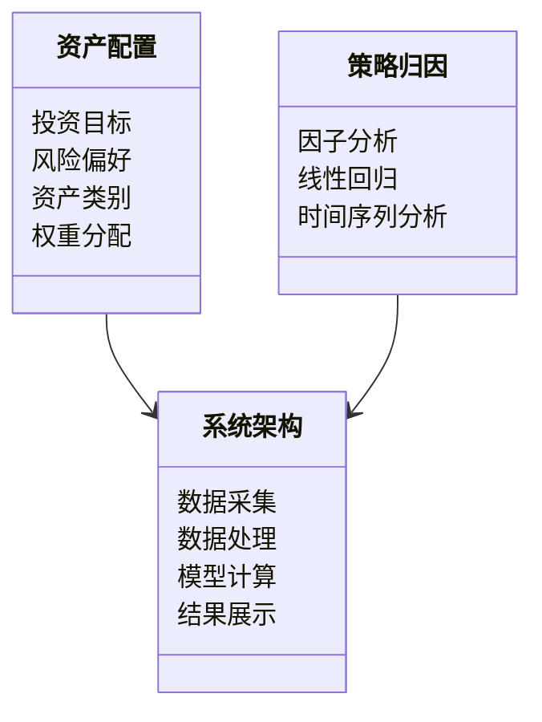
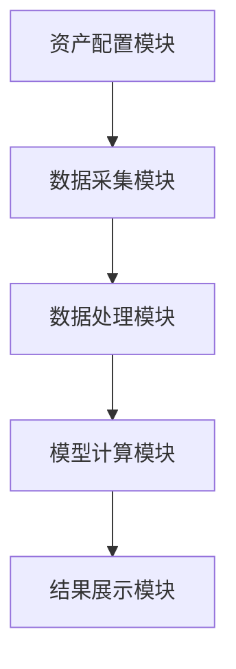
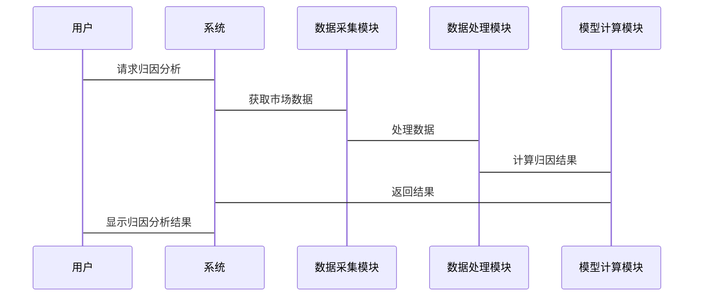

                 


# 开发智能化的资产配置策略归因分析引擎

> 关键词：资产配置，策略归因，人工智能，因子分析，时间序列分析，系统架构设计

> 摘要：本文详细探讨了开发智能化资产配置策略归因分析引擎的关键步骤与实现方法。首先介绍了资产配置和策略归因的基本概念，接着分析了智能化资产配置的必要性与行业趋势。然后从算法原理、数学模型、系统架构设计等多个维度，详细讲解了智能化归因分析引擎的核心技术与实现细节。最后通过实际项目案例，展示了如何将理论应用于实践，并总结了开发中的关键点与未来发展方向。

---

# 第一部分: 资产配置策略归因分析引擎的背景与概念

## 第1章: 资产配置与策略归因分析概述

### 1.1 资产配置的基本概念

#### 1.1.1 资产配置的定义与分类
资产配置是指将资金分配到不同的资产类别（如股票、债券、房地产等）中，以实现投资目标和风险控制。资产配置的分类包括：
- **战略性资产配置**：基于长期投资目标和市场预期进行的配置。
- **战术性资产配置**：根据短期市场变化进行的动态调整。
- **被动型资产配置**：严格按照固定比例分配资产。
- **主动型资产配置**：根据市场环境主动调整资产权重。

#### 1.1.2 资产配置的重要性与作用
资产配置是投资组合管理的核心，其作用包括：
- **分散风险**：通过配置不同资产类别降低投资组合的波动性。
- **提高收益**：通过优化资产权重提升整体收益。
- **适应市场变化**：根据市场环境动态调整资产配置。

#### 1.1.3 智能化资产配置的必要性
传统资产配置方法依赖人工判断，存在效率低、误差大等问题。智能化资产配置通过引入人工智能技术，能够实时分析市场数据，快速做出决策，显著提升了配置效率和准确性。

### 1.2 策略归因分析的基本概念

#### 1.2.1 策略归因的定义与特点
策略归因是指将投资组合的收益分解为各个资产类别或因子的贡献，以分析策略的有效性。其特点包括：
- **分解性**：将整体收益分解为各因子的贡献。
- **可解释性**：能够清晰解释收益来源。
- **动态性**：根据市场变化实时更新归因结果。

#### 1.2.2 策略归因与资产配置的关系
策略归因是资产配置的延伸，通过对收益的分解，可以反向优化资产配置策略，从而提升整体投资绩效。

#### 1.2.3 智能化策略归因的优势
智能化策略归因通过机器学习和大数据分析，能够快速识别复杂市场环境下的关键因子，显著提升了归因的准确性和效率。

### 1.3 智能化资产配置策略归因的背景与趋势

#### 1.3.1 人工智能在金融领域的应用现状
人工智能技术（如机器学习、深度学习）在金融领域的应用日益广泛，特别是在资产配置和风险控制方面。

#### 1.3.2 资产配置与策略归因的智能化需求
随着市场复杂化和数据量的增加，传统的资产配置和归因方法已难以满足需求，智能化成为必然趋势。

#### 1.3.3 行业趋势与未来发展方向
未来，智能化资产配置和归因分析将更加依赖于大数据和人工智能技术，向着实时化、自动化和个性化方向发展。

### 1.4 本章小结
本章介绍了资产配置和策略归因的基本概念，分析了智能化配置和归因的必要性，并探讨了行业趋势与发展方向。

---

# 第二部分: 核心概念与理论基础

## 第2章: 资产配置策略归因的核心概念

### 2.1 资产配置策略的构成要素

#### 2.1.1 投资目标与风险偏好
投资目标决定了资产配置的方向，而风险偏好决定了配置的激进程度。例如，风险厌恶型投资者会倾向于配置更多债券。

#### 2.1.2 资产类别与权重分配
资产类别包括股票、债券、商品等，权重分配决定了各资产在组合中的比例。

#### 2.1.3 市场环境与因子分析
市场环境影响资产配置决策，因子分析（如市值、价值、动量因子）是理解市场变化的重要工具。

### 2.2 策略归因分析的理论基础

#### 2.2.1 因子分析模型
因子分析模型通过提取影响资产收益的关键因子，将整体收益分解为各因子贡献。

#### 2.2.2 资产定价模型（CAPM, APT）
CAPM和APT是经典的资产定价模型，用于评估资产的预期收益。

#### 2.2.3 时间序列分析方法
时间序列分析用于研究资产收益的动态变化，帮助识别周期性特征。

### 2.3 资产配置与策略归因的关联性分析

#### 2.3.1 资产配置对策略归因的影响
资产配置决定了归因分析的对象和权重，影响归因结果的分布。

#### 2.3.2 策略归因对资产配置的反馈作用
归因分析能够揭示策略的有效性，为资产配置提供优化方向。

#### 2.3.3 两者结合的理论框架
通过构建资产配置-归因分析的联合模型，可以实现配置策略的动态优化。

### 2.4 核心概念对比分析

#### 2.4.1 资产配置与投资组合管理的对比
资产配置是投资组合管理的核心，而投资组合管理还包括风险管理和绩效评估。

#### 2.4.2 策略归因与绩效评估的对比
策略归因关注收益来源，而绩效评估关注整体表现。

#### 2.4.3 智能化与传统方法的对比
智能化方法更具灵活性和准确性，但需要更多的计算资源。

### 2.5 本章小结
本章通过对比分析，深入探讨了资产配置和策略归因的核心概念及其关联性。

---

# 第三部分: 算法原理与数学模型

## 第3章: 资产配置策略归因的核心算法

### 3.1 因子分析算法

#### 3.1.1 因子分析的基本原理
因子分析通过提取公共因子，将多个变量的变异归因于少数几个潜在因子。

#### 3.1.2 主成分分析（PCA）的应用
PCA用于降维，提取最重要的主成分作为因子。

#### 3.1.3 独立成分分析（ICA）的实现
ICA用于进一步分离出相互独立的因子成分。

### 3.2 策略归因分析算法

#### 3.2.1 线性回归模型在归因分析中的应用
通过线性回归模型，将资产收益分解为各因子的贡献。

#### 3.2.2 时间序列分析方法（ARIMA）
ARIMA用于分析资产收益的时间序列特征，帮助识别周期性归因。

#### 3.2.3 聚类分析在风险因子识别中的应用
聚类分析用于识别具有相似风险特征的资产类别。

### 3.3 智能化算法的实现

#### 3.3.1 机器学习算法在资产配置中的应用
机器学习算法（如随机森林、支持向量机）用于预测资产收益和风险。

#### 3.3.2 深度学习模型在策略归因中的应用
深度学习模型（如LSTM）用于捕捉复杂的市场模式，提升归因分析的准确性。

### 3.4 数学模型与公式

#### 3.4.1 因子分析模型
$$ Y = B F + E $$
其中，$Y$ 是观测变量，$F$ 是因子，$B$ 是因子载荷矩阵，$E$ 是误差项。

#### 3.4.2 线性回归模型
$$ R_i = \beta_1 x_1 + \beta_2 x_2 + \dots + \beta_n x_n + \epsilon $$
其中，$R_i$ 是资产$ i$ 的收益，$x_j$ 是因子，$\beta_j$ 是回归系数，$\epsilon$ 是误差项。

#### 3.4.3 时间序列模型（ARIMA）
ARIMA模型通过自回归和滑动平均部分捕捉时间序列的动态特征。

---

# 第四章: 系统分析与架构设计

## 4.1 问题场景介绍

#### 4.1.1 资产配置与归因分析的业务场景
投资者需要实时了解资产配置的效果，并通过归因分析优化策略。

## 4.2 系统功能设计

#### 4.2.1 领域模型设计
使用Mermaid绘制领域模型类图，展示各实体之间的关系。



## 4.3 系统架构设计

#### 4.3.1 架构设计图
使用Mermaid绘制系统架构图，展示各模块的交互关系。



## 4.4 接口与交互设计

#### 4.4.1 接口设计
定义各模块之间的接口，例如：
- 资产配置模块调用数据采集模块获取市场数据。

#### 4.4.2 交互设计
使用Mermaid绘制交互序列图，展示用户与系统之间的交互流程。



---

# 第五章: 项目实战

## 5.1 环境安装与配置

#### 5.1.1 安装Python与相关库
安装Python和必要的库（如numpy、pandas、scikit-learn、xarray等）。

#### 5.1.2 安装Jupyter Notebook
用于代码编写与调试。

## 5.2 系统核心功能实现

#### 5.2.1 资产配置模块实现
编写Python代码实现资产配置的计算。

```python
import numpy as np
import pandas as pd

# 示例：基于因子分析的资产配置
def factor_based_asset_allocation(factors, target_return):
    # 计算因子载荷矩阵
    factor_loadings = np.cov(factors, rowvar=False)
    # 计算权重
    weights = np.linalg.solve(factor_loadings, target_return)
    return weights
```

#### 5.2.2 策略归因分析模块实现
编写代码实现策略归因分析。

```python
from sklearn.linear_model import LinearRegression

# 示例：线性回归模型用于归因分析
def factor_contribution(factors, returns):
    model = LinearRegression()
    model.fit(factors, returns)
    return model.coef_
```

## 5.3 实际案例分析

#### 5.3.1 案例背景
以股票、债券、商品等资产为例，分析其在不同市场环境下的配置效果。

#### 5.3.2 数据收集与预处理
收集历史市场数据，进行清洗和标准化处理。

#### 5.3.3 模型计算与结果展示
运行代码，输出归因分析结果，并进行可视化展示。

---

# 第六章: 总结与展望

## 6.1 最佳实践 tips

#### 6.1.1 数据质量管理
确保数据的准确性和完整性。

#### 6.1.2 模型优化
定期更新模型参数，适应市场变化。

#### 6.1.3 风险管理
设置合理的风险控制机制，避免过度配置风险资产。

## 6.2 小结
智能化资产配置策略归因分析引擎的开发需要结合金融理论与人工智能技术，通过合理的系统架构设计和高效的算法实现，能够显著提升资产管理和投资决策的效率与准确性。

## 6.3 注意事项

#### 6.3.1 数据隐私与安全
确保数据处理符合相关法律法规。

#### 6.3.2 模型解释性
选择具有良好解释性的模型，便于投资者理解和使用。

## 6.4 拓展阅读

#### 6.4.1 推荐书籍
- 《Python金融数据分析》
- 《机器学习在金融中的应用》

#### 6.4.2 推荐博客与资源
- 国内外知名金融技术博客
- 开源项目与技术社区

---

# 作者：AI天才研究院/AI Genius Institute & 禅与计算机程序设计艺术/Zen And The Art of Computer Programming

