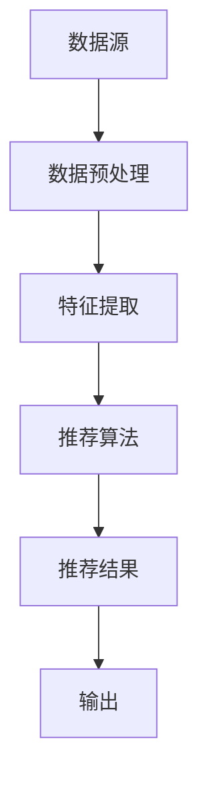

                 


# 开发智能化的金融产品交叉销售推荐引擎

> 关键词：智能化推荐引擎，金融产品交叉销售，协同过滤算法，用户画像，推荐系统

> 摘要：本文详细探讨了开发智能化金融产品交叉销售推荐引擎的背景、核心概念、算法原理、系统架构及项目实现。通过分析传统交叉销售的局限性，提出了基于协同过滤和混合推荐模型的解决方案，并结合实际案例展示了系统的实现过程和优化方法。

---

# 第1章: 金融产品交叉销售推荐引擎的背景与价值

## 1.1 问题背景与挑战

### 1.1.1 金融行业中的交叉销售问题

在金融行业，交叉销售（Cross-Selling）是指向现有客户销售额外的产品或服务，以提高客户满意度和收入。然而，传统的交叉销售方法依赖于人工推荐或简单的规则引擎，存在以下问题：

- **数据孤岛**：客户数据分散在不同的业务系统中，难以整合。
- **推荐不精准**：基于简单规则的推荐无法捕捉客户的深层次需求。
- **效率低下**：人工推荐耗时且成本高昂，难以大规模应用。

### 1.1.2 传统交叉销售的局限性

传统的交叉销售方法通常依赖于经验丰富的销售团队或简单的规则引擎。这些方法存在以下局限性：

- **缺乏个性化**：推荐的产品往往基于固定规则，无法根据客户的个性化需求进行调整。
- **效率低**：人工推荐效率低下，难以快速响应客户需求。
- **数据利用率低**：无法充分利用客户行为数据和市场数据来优化推荐策略。

### 1.1.3 智能化推荐引擎的必要性

随着人工智能和大数据技术的快速发展，智能化推荐引擎逐渐成为金融行业交叉销售的核心工具。通过分析客户的交易数据、行为数据和市场数据，推荐引擎能够实时生成个性化的推荐方案，显著提高销售效率和客户满意度。

---

## 1.2 问题描述与目标

### 1.2.1 交叉销售的核心问题

交叉销售的核心问题在于如何根据客户的历史行为、偏好和当前需求，推荐合适的产品或服务。具体来说，推荐引擎需要解决以下问题：

- **如何准确理解客户的需求？**
- **如何分析客户的行为模式？**
- **如何动态优化推荐策略？**

### 1.2.2 智能化推荐的目标

智能化推荐引擎的目标是通过分析客户的交易数据、行为数据和市场数据，实时生成个性化的推荐方案，提高销售效率和客户满意度。具体目标包括：

- **提高推荐精准度**：基于客户画像和产品特征，推荐最符合客户需求的产品。
- **提升销售效率**：自动化推荐流程，减少人工干预。
- **增强客户体验**：通过个性化推荐，提升客户的购买意愿和满意度。

### 1.2.3 解决方案的边界与外延

解决方案的核心是构建一个智能化的推荐引擎，其边界包括：

- **输入**：客户数据（如交易记录、行为数据、人口统计数据）、产品数据（如产品类型、风险等级、收益预期）。
- **输出**：针对具体客户的推荐产品列表。
- **外延**：推荐引擎可以与其他系统（如CRM、销售系统）集成，实现端到端的销售流程优化。

---

## 1.3 本章小结

本章介绍了金融产品交叉销售推荐引擎的背景和价值，分析了传统交叉销售的局限性，并提出了智能化推荐引擎的必要性。通过明确推荐引擎的目标和边界，为后续的系统设计和实现奠定了基础。

---

# 第2章: 智能化推荐引擎的核心概念

## 2.1 推荐算法的基本原理

### 2.1.1 协同过滤推荐

协同过滤推荐是一种基于用户相似性或产品相似性的推荐方法。具体来说，协同过滤推荐可以分为两类：

- **基于用户的协同过滤**：通过分析用户的行为数据，找到与目标用户相似的其他用户，推荐这些用户喜欢的产品。
- **基于产品的协同过滤**：通过分析产品的特征数据，找到与目标产品相似的其他产品，推荐这些产品给目标用户。

### 2.1.2 基于内容的推荐

基于内容的推荐是一种基于产品特征的推荐方法。具体来说，通过分析产品的特征数据（如产品类型、风险等级、收益预期），生成与目标用户需求匹配的产品推荐。

### 2.1.3 混合推荐模型

混合推荐模型是一种结合协同过滤和基于内容推荐的方法，通过融合两种推荐策略的优势，提高推荐的准确性和多样性。

---

## 2.2 用户画像与金融产品特征

### 2.2.1 用户画像的构建

用户画像是通过分析客户的交易数据、行为数据和人口统计数据，构建的客户画像。用户画像的构建步骤如下：

1. **数据收集**：收集客户的交易数据、行为数据和人口统计数据。
2. **特征提取**：提取客户的特征（如年龄、性别、收入水平、投资偏好）。
3. **画像构建**：根据特征对客户进行分类，构建用户画像。

### 2.2.2 金融产品的特征表示

金融产品的特征表示是通过分析产品的属性（如产品类型、风险等级、收益预期）构建的产品特征向量。特征表示的步骤如下：

1. **数据收集**：收集产品的基本属性数据。
2. **特征提取**：提取产品的特征（如产品类型、风险等级、收益预期）。
3. **特征向量构建**：将产品的特征表示为向量。

### 2.2.3 用户与产品的关系分析

用户与产品的关系分析是通过分析用户的行为数据和产品特征，构建用户与产品之间的关系模型。关系分析的步骤如下：

1. **数据收集**：收集用户的行为数据和产品特征数据。
2. **关系建模**：通过统计分析或机器学习方法，构建用户与产品之间的关系模型。
3. **关系分析**：通过分析关系模型，找出用户与产品之间的关联性。

---

## 2.3 实体关系图与数据流分析

### 2.3.1 ER实体关系图

以下是一个简单的ER实体关系图，展示了用户、产品和推荐之间的关系：

```mermaid
er
actor 用户 {
  类型: 实体
  属性: 用户ID, 用户名称, 用户画像
}
actor 产品 {
  类型: 实体
  属性: 产品ID, 产品名称, 产品特征
}
actor 推荐 {
  类型: 实体
  属性: 推荐ID, 推荐产品ID, 推荐用户ID
}

用户 --> 推荐: 推荐
产品 --> 推荐: 推荐
```

### 2.3.2 数据流分析

以下是一个数据流分析图，展示了数据在推荐引擎中的流动过程：



---

## 2.4 本章小结

本章详细介绍了智能化推荐引擎的核心概念，包括协同过滤推荐、基于内容的推荐、混合推荐模型、用户画像和金融产品特征。通过ER实体关系图和数据流分析，明确了推荐引擎的系统架构和数据流程。

---

# 第3章: 协同过滤算法的实现原理

## 3.1 协同过滤算法的数学模型

### 3.1.1 余弦相似度公式

余弦相似度是衡量两个向量相似性的一种常用方法，公式如下：

$$
\text{相似度} = \frac{\sum_{i=1}^{n} u_i v_i}{\sqrt{\sum_{i=1}^{n} u_i^2} \cdot \sqrt{\sum_{i=1}^{n} v_i^2}}
$$

其中，$u_i$ 和 $v_i$ 分别是两个向量的第 $i$ 个元素。

### 3.1.2 点积相似度公式

点积相似度是衡量两个向量相似性的一种简单方法，公式如下：

$$
\text{相似度} = \sum_{i=1}^{n} u_i v_i
$$

---

## 3.2 协同过滤算法的实现步骤

### 3.2.1 用户相似度计算

1. **数据预处理**：收集用户的行为数据，构建用户行为矩阵。
2. **相似度计算**：使用余弦相似度或点积相似度公式，计算用户之间的相似度。
3. **相似度排序**：根据相似度值对用户进行排序。

### 3.2.2 产品推荐

1. **目标用户选择**：选择一个目标用户，计算其与其他用户之间的相似度。
2. **推荐产品计算**：根据目标用户的相似用户的历史购买记录，推荐相似产品。

---

## 3.3 协同过滤算法的优缺点

### 3.3.1 优点

- **简单易懂**：实现简单，易于理解。
- **计算高效**：基于向量相似度的计算，可以在较短时间内完成推荐。

### 3.3.2 缺点

- **数据稀疏性问题**：在数据稀疏的情况下，推荐效果可能不佳。
- **计算复杂性问题**：随着用户数量的增加，计算相似度的复杂性会呈指数级增长。

---

## 3.4 本章小结

本章详细介绍了协同过滤算法的数学模型和实现步骤，分析了其优缺点，并通过具体的实现步骤展示了算法的应用。

---

# 第4章: 混合推荐模型的设计

## 4.1 混合推荐模型的结构

混合推荐模型是一种结合协同过滤和基于内容推荐的方法，通过融合两种推荐策略的优势，提高推荐的准确性和多样性。混合推荐模型的结构如下：

1. **协同过滤推荐**：基于用户相似性推荐产品。
2. **基于内容推荐**：基于产品特征推荐产品。
3. **混合推荐**：根据两种推荐策略的结果，生成最终的推荐列表。

---

## 4.2 混合推荐模型的实现步骤

### 4.2.1 数据预处理

1. **用户数据预处理**：收集用户的交易数据、行为数据和人口统计数据，构建用户画像。
2. **产品数据预处理**：收集产品的基本属性数据，构建产品特征向量。

### 4.2.2 推荐算法实现

1. **协同过滤推荐**：基于用户相似性推荐产品。
2. **基于内容推荐**：基于产品特征推荐产品。
3. **混合推荐**：根据协同过滤和基于内容推荐的结果，生成最终的推荐列表。

---

## 4.3 混合推荐模型的优化

### 4.3.1 参数优化

通过调整协同过滤和基于内容推荐的权重，优化推荐结果的准确性和多样性。

### 4.3.2 模型优化

通过机器学习方法，优化混合推荐模型的性能。

---

## 4.4 本章小结

本章详细介绍了混合推荐模型的设计和实现，分析了其优缺点，并通过具体的实现步骤展示了模型的应用。

---

# 第5章: 系统分析与架构设计

## 5.1 系统功能设计

### 5.1.1 用户画像模块

用户画像模块用于收集和分析用户的交易数据、行为数据和人口统计数据，构建用户画像。

### 5.1.2 产品特征模块

产品特征模块用于收集和分析产品的基本属性数据，构建产品特征向量。

### 5.1.3 推荐算法模块

推荐算法模块用于实现协同过滤和基于内容的推荐算法，生成推荐结果。

---

## 5.2 系统架构设计

### 5.2.1 系统分层

推荐引擎的系统架构分为三层：

1. **数据层**：负责数据的存储和管理。
2. **业务逻辑层**：负责推荐算法的实现。
3. **表现层**：负责推荐结果的展示。

### 5.2.2 接口设计

推荐引擎需要与CRM系统、销售系统等外部系统进行集成，通过API接口实现数据交互。

---

## 5.3 本章小结

本章详细介绍了推荐引擎的系统功能设计和架构设计，分析了系统的分层结构和接口设计。

---

# 第6章: 项目实战

## 6.1 环境安装

### 6.1.1 Python安装

安装Python 3.x版本，确保环境满足推荐引擎开发的最低要求。

### 6.1.2 依赖库安装

安装以下依赖库：

- `numpy`：用于数据处理。
- `pandas`：用于数据分析。
- `scikit-learn`：用于机器学习算法实现。

---

## 6.2 核心实现

### 6.2.1 用户画像构建

1. **数据预处理**：收集用户的交易数据、行为数据和人口统计数据。
2. **特征提取**：提取用户的特征（如年龄、性别、收入水平、投资偏好）。
3. **用户画像构建**：根据特征对用户进行分类，构建用户画像。

### 6.2.2 产品特征构建

1. **数据预处理**：收集产品的基本属性数据。
2. **特征提取**：提取产品的特征（如产品类型、风险等级、收益预期）。
3. **产品特征向量构建**：将产品的特征表示为向量。

### 6.2.3 推荐算法实现

1. **协同过滤推荐**：基于用户相似性推荐产品。
2. **基于内容推荐**：基于产品特征推荐产品。
3. **混合推荐**：根据协同过滤和基于内容推荐的结果，生成最终的推荐列表。

---

## 6.3 案例分析

### 6.3.1 案例背景

假设我们有一个客户数据库，包含1000名客户和50种金融产品。目标是为每个客户推荐3种最适合他们的金融产品。

### 6.3.2 实施步骤

1. **数据预处理**：收集客户的交易数据、行为数据和人口统计数据，构建用户画像。
2. **产品特征构建**：收集产品的基本属性数据，构建产品特征向量。
3. **推荐算法实现**：基于协同过滤和基于内容推荐，生成推荐列表。
4. **推荐结果分析**：分析推荐结果的准确性和多样性。

---

## 6.4 本章小结

本章通过具体的项目实战，展示了推荐引擎的实现过程，包括环境安装、核心实现和案例分析。

---

# 第7章: 最佳实践与小结

## 7.1 最佳实践

### 7.1.1 数据质量管理

确保数据的准确性和完整性，是推荐引擎成功的关键。

### 7.1.2 模型优化

通过不断优化推荐算法和模型，提高推荐的准确性和多样性。

### 7.1.3 系统集成

通过与CRM系统、销售系统等外部系统集成，实现推荐引擎的端到端应用。

---

## 7.2 本章小结

本章总结了推荐引擎开发的最佳实践，分析了项目的实施过程和优化方法，并提出了未来的发展方向。

---

# 作者：AI天才研究院 & 禅与计算机程序设计艺术

---

通过以上思考过程，我们逐步完成了《开发智能化的金融产品交叉销售推荐引擎》的技术博客文章。从背景介绍到系统设计，再到项目实战和最佳实践，文章详细阐述了推荐引擎的开发过程和优化方法，为读者提供了全面的技术指导。

