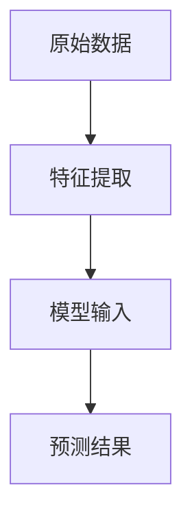
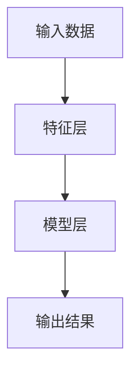
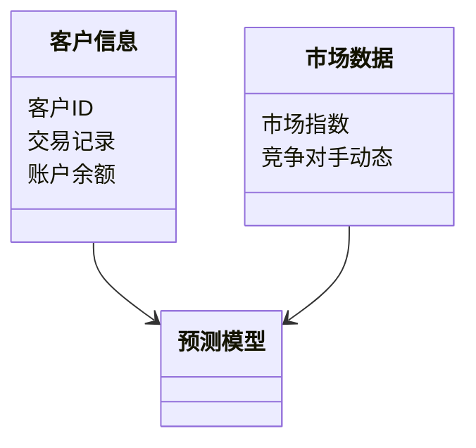
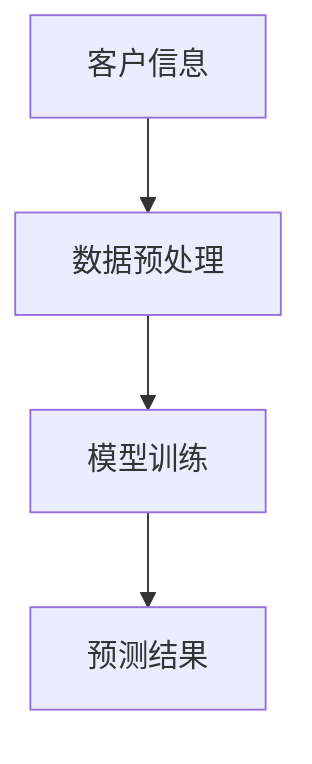

                 


# 开发智能化的金融产品交叉销售时机预测引擎

## 关键词：
金融产品，交叉销售，时机预测，人工智能，引擎开发

## 摘要：
本文详细探讨了如何利用人工智能技术开发金融产品交叉销售时机预测引擎。通过分析金融行业的背景与需求，结合时间序列分析和机器学习模型，提出了一种高效的预测方法。文章从数据流、特征工程、算法选择到系统架构，全面介绍了引擎的构建过程，并通过实际案例展示了其应用价值。

---

# 第一部分: 背景介绍

## 第1章: 问题背景与定义

### 1.1 问题背景

#### 1.1.1 金融产品交叉销售的背景
在金融行业中，交叉销售是提升客户满意度和增加收入的重要策略。通过分析客户的交易行为和市场趋势，金融机构可以预测最佳的销售时机，从而提高销售效率和客户忠诚度。

#### 1.1.2 交叉销售时机预测的重要性
传统的交叉销售通常依赖于人工判断，这种方法效率低且容易受主观因素影响。利用人工智能技术，可以实现精准的销售时机预测，帮助金融机构做出更明智的决策。

#### 1.1.3 当前金融行业中的挑战
随着市场竞争的加剧，金融机构需要更高效的方法来识别潜在客户和最佳销售时机。传统方法在数据处理和预测准确性方面存在局限性，亟需智能化解决方案。

### 1.2 问题定义

#### 1.2.1 交叉销售时机预测的定义
交叉销售时机预测是指通过分析客户的交易数据、市场趋势和客户行为，预测客户进行二次购买的最佳时机。

#### 1.2.2 引擎的目标与范围
引擎的目标是基于历史数据，利用机器学习模型预测客户在特定时间点进行交叉销售的可能性，并提供相应的决策支持。

#### 1.2.3 相关概念的界定
- **客户行为分析**：通过分析客户的交易记录和行为模式，识别客户的购买习惯和偏好。
- **时间序列分析**：通过对历史数据进行建模，预测未来的销售趋势和客户行为。

### 1.3 当前技术与市场现状

#### 1.3.1 人工智能在金融领域的应用现状
人工智能技术在金融领域的应用日益广泛，包括风险管理、投资决策和客户画像等方面。然而，交叉销售时机预测仍是一个有待深入探索的领域。

#### 1.3.2 交叉销售技术的市场分析
当前，许多金融机构已经开始尝试利用大数据和人工智能技术进行交叉销售。然而，由于数据质量和模型准确性的问题，实际效果仍有提升空间。

#### 1.3.3 数据驱动决策的优势
数据驱动决策能够帮助金融机构更精准地识别客户需求和市场趋势，从而提高销售效率和客户满意度。

### 1.4 技术基础与引擎架构

#### 1.4.1 人工智能与机器学习基础
人工智能和机器学习是引擎的核心技术基础。常用的算法包括支持向量机（SVM）、随机森林和神经网络等。

#### 1.4.2 时间序列分析简介
时间序列分析是一种通过分析历史数据来预测未来趋势的方法。常用模型包括ARIMA和LSTM。

#### 1.4.3 引擎的整体架构
引擎的整体架构包括数据采集、特征工程、模型训练和预测输出四个主要部分。各部分通过数据流进行连接，确保数据的高效处理和模型的准确预测。

---

## 第2章: 引擎的核心概念与联系

### 2.1 数据流与特征提取

#### 2.1.1 数据流图

数据流图展示了数据从原始数据到模型输入再到预测结果的整个流程。

#### 2.1.2 特征工程的重要性
特征工程是引擎开发的关键步骤，通过提取有意义的特征，可以提高模型的预测准确性和泛化能力。

### 2.2 模型结构与优化

#### 2.2.1 模型结构图

模型结构图展示了数据如何通过特征层和模型层进行处理，最终输出预测结果。

#### 2.2.2 模型优化策略
通过调整模型参数和选择合适的算法，可以提高模型的预测精度和运行效率。

### 2.3 核心算法与选择

#### 2.3.1 算法选择的依据
算法的选择需要考虑数据类型、预测精度和计算效率等因素。常用算法包括线性回归、决策树和时间序列模型。

---

## 第3章: 算法原理

### 3.1 时间序列分析

#### 3.1.1 ARIMA模型
ARIMA（自回归积分滑动平均模型）是一种常用的时间序列分析方法，适用于具有趋势和季节性特征的数据。

数学模型：
$$ ARIMA(p, d, q) $$

#### 3.1.2 LSTM网络
LSTM（长短期记忆网络）是一种基于循环神经网络的模型，适用于处理长序列数据。

### 3.2 机器学习模型

#### 3.2.1 随机森林
随机森林是一种基于决策树的集成学习方法，具有高准确性和强健性。

#### 3.2.2 XGBoost
XGBoost是一种基于梯度提升的算法，适用于分类和回归问题。

---

## 第4章: 系统架构设计

### 4.1 问题场景介绍

#### 4.1.1 客户画像
通过分析客户的交易记录和行为模式，构建客户画像，识别潜在的交叉销售机会。

#### 4.1.2 市场趋势分析
分析市场趋势和竞争对手的动态，为销售时机预测提供参考依据。

### 4.2 项目介绍

#### 4.2.1 项目目标
开发一个智能化的交叉销售时机预测引擎，帮助金融机构提高销售效率和客户满意度。

### 4.3 系统功能设计

#### 4.3.1 领域模型


#### 4.3.2 系统架构设计


#### 4.3.3 系统接口设计
系统接口设计需要考虑数据输入、模型调用和结果输出的规范。

#### 4.3.4 系统交互流程
```mermaid
sequenceDiagram
    客户请求 --> 数据采集模块
    数据采集模块 --> 数据预处理模块
    数据预处理模块 --> 模型训练模块
    模型训练模块 --> 预测结果
    预测结果 --> 客户响应
```

### 4.4 系统实现

#### 4.4.1 环境安装
开发环境需要安装Python、机器学习库（如scikit-learn、XGBoost）和数据处理工具（如Pandas）。

#### 4.4.2 核心实现代码
以下是引擎的核心代码示例：
```python
import pandas as pd
from sklearn.ensemble import RandomForestClassifier
from sklearn.metrics import accuracy_score

# 加载数据
data = pd.read_csv('data.csv')

# 特征工程
features = data[['feature1', 'feature2', 'feature3']]
target = data['target']

# 模型训练
model = RandomForestClassifier()
model.fit(features, target)

# 预测
predicted = model.predict(features)
print("准确率:", accuracy_score(target, predicted))
```

#### 4.4.3 代码解读与分析
代码首先加载数据，进行特征工程，然后训练模型并进行预测。准确率是评估模型性能的重要指标。

### 4.5 实际案例分析

#### 4.5.1 案例介绍
通过分析某银行客户的交易数据，预测最佳的交叉销售时机。

#### 4.5.2 数据分析与处理
使用Pandas对数据进行清洗和特征提取，构建适合模型输入的数据集。

#### 4.5.3 模型训练与预测
通过训练随机森林模型，预测客户在特定时间点进行交叉销售的可能性。

#### 4.5.4 案例结果与解读
模型预测结果显示，客户在特定时间点的购买概率较高，金融机构可以在此时进行交叉销售。

### 4.6 项目小结

#### 4.6.1 经验总结
项目实施过程中，数据质量对模型性能影响较大，特征工程是关键步骤。

#### 4.6.2 注意事项
在实际应用中，需要考虑数据隐私和模型的实时性问题。

---

## 第5章: 最佳实践与小结

### 5.1 最佳实践

#### 5.1.1 数据质量
确保数据的完整性和准确性，是提高模型预测精度的前提条件。

#### 5.1.2 模型调优
通过交叉验证和参数优化，可以提高模型的准确性和泛化能力。

#### 5.1.3 性能优化
在保证预测精度的前提下，优化模型的运行效率，降低计算成本。

### 5.2 小结

本文详细介绍了开发智能化的金融产品交叉销售时机预测引擎的背景、核心概念、算法原理和系统架构。通过实际案例展示了引擎的应用价值，并提出了数据质量、模型调优和性能优化的最佳实践建议。

---

## 作者信息

作者：AI天才研究院/AI Genius Institute & 禅与计算机程序设计艺术 /Zen And The Art of Computer Programming

---

通过以上内容，您可以深入了解如何开发智能化的金融产品交叉销售时机预测引擎，并将其应用于实际业务中。

