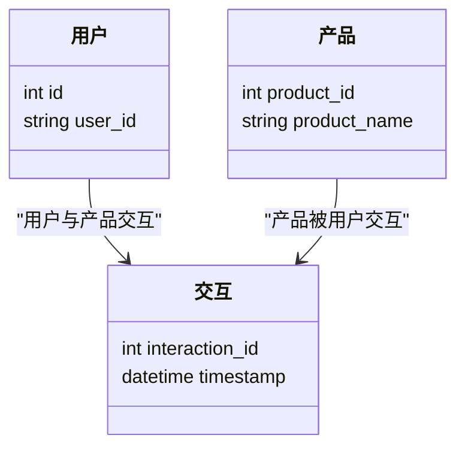
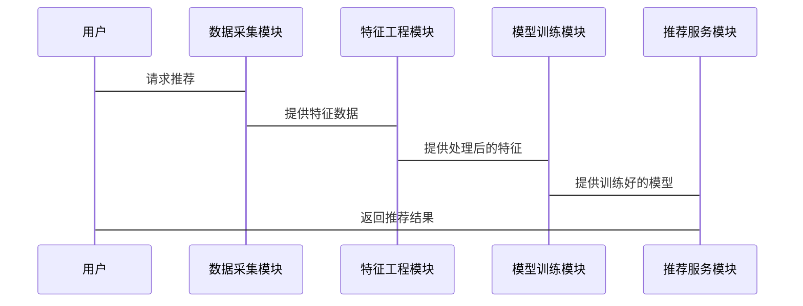

                 


# 开发智能化的金融产品推荐个性化引擎

> 关键词：金融推荐系统，个性化引擎，人工智能，协同过滤，深度学习，系统架构

> 摘要：本文将深入探讨如何开发一个智能化的金融产品推荐个性化引擎。从背景介绍到核心概念，从算法原理到系统架构设计，再到项目实战和最佳实践，我们将全面解析这一技术的实现过程。通过详细的技术分析和案例解读，帮助读者掌握开发智能化推荐引擎的核心方法和技巧。

---

# 第一部分: 智能化金融产品推荐引擎的背景与概念

# 第1章: 金融产品推荐系统概述

## 1.1 金融推荐系统的发展历程
### 1.1.1 传统金融推荐方式的局限性
传统的金融产品推荐主要依赖人工经验或简单的规则匹配，这种方式存在以下问题：
- **覆盖不足**：无法满足用户的个性化需求。
- **效率低下**：人工推荐耗时长，且容易受到主观因素影响。
- **数据利用不足**：难以充分利用大数据进行分析。

### 1.1.2 智能化推荐的兴起
随着人工智能和大数据技术的发展，智能化推荐逐渐成为金融行业的主流趋势。智能化推荐通过分析用户行为、市场数据和产品特征，提供更精准、个性化的推荐。

### 1.1.3 个性化推荐的核心价值
个性化推荐能够显著提升用户体验，帮助金融机构实现精准营销，同时提高用户满意度和忠诚度。

## 1.2 个性化推荐引擎的定义与特点
### 1.2.1 个性化推荐的定义
个性化推荐引擎是一种基于用户行为、产品特征和市场数据，利用算法和技术生成个性化金融产品推荐的系统。

### 1.2.2 引擎的核心特点
- **数据驱动**：依赖大量数据进行分析和建模。
- **实时性**：能够实时处理用户行为和市场变化。
- **个性化**：根据用户需求和偏好生成定制化推荐。

### 1.2.3 与传统推荐系统的主要区别
| 特性       | 传统推荐系统           | 智能化推荐引擎         |
|------------|-----------------------|-----------------------|
| 数据来源   | 单一数据源            | 多数据源（用户行为、产品特征等） |
| 技术方法   | 基于规则或简单统计    | 基于机器学习和深度学习 |
| 精准度     | 较低                  | 较高                  |
| 实时性     | 低                   | 高                   |

## 1.3 智能化推荐引擎的实现要素
### 1.3.1 数据来源与处理
智能化推荐引擎需要整合多源数据，包括：
- 用户行为数据（如点击、购买、浏览时间等）。
- 产品特征数据（如产品类型、收益率、风险等级等）。
- 市场数据（如市场波动、经济指标等）。

### 1.3.2 模型构建与优化
基于机器学习和深度学习算法，构建推荐模型，并通过不断优化提升推荐准确度。

### 1.3.3 系统集成与部署
将推荐引擎集成到金融系统中，确保实时性和稳定性。

## 1.4 本章小结
本章介绍了金融推荐系统的背景、智能化推荐的核心价值以及实现要素，为后续章节的深入分析奠定了基础。

---

# 第二部分: 个性化推荐引擎的核心概念与联系

# 第2章: 推荐系统的核心概念与联系

## 2.1 推荐系统的类型与分类
### 2.1.1 基于协同过滤的推荐
协同过滤是基于用户行为相似性进行推荐的一种方法，分为基于用户的协同过滤（UBCF）和基于物品的协同过滤（IBCF）。

#### 基于用户的协同过滤（UBCF）
- **步骤**：
  1. 找出与当前用户行为相似的其他用户。
  2. 推荐这些用户喜欢的产品。
- **优缺点**：
  - 优点：推荐结果具有较高的相似性。
  - 缺点：计算复杂度高，难以处理大规模数据。

#### 基于物品的协同过滤（IBCF）
- **步骤**：
  1. 找出与当前产品相似的其他产品。
  2. 推荐这些相似产品给用户。
- **优缺点**：
  - 优点：计算复杂度较低。
  - 缺点：推荐结果可能不够个性化。

### 2.1.2 基于内容的推荐
基于内容的推荐系统依赖于产品的特征信息，通过分析产品内容相似性进行推荐。

#### 示例：金融产品的收益率和风险等级分析
- **步骤**：
  1. 提取产品的特征（如收益率、风险等级）。
  2. 计算产品之间的相似性。
  3. 推荐相似产品给用户。

### 2.1.3 混合推荐模型
混合推荐模型结合了协同过滤和基于内容的推荐方法，通过集成两种方法的优点，提升推荐效果。

#### 示例：结合用户行为和产品特征的推荐
- **步骤**：
  1. 使用协同过滤找到相似用户。
  2. 结合产品特征进行推荐优化。

## 2.2 推荐系统的核心要素对比
### 2.2.1 数据特征对比表格
| 特征       | 描述                       |
|------------|----------------------------|
| 数据来源   | 用户行为、产品特征、市场数据 |
| 数据类型   | 结构化、非结构化           |
| 数据规模   | 大型、实时                 |

### 2.2.2 ER实体关系图
```mermaid
erDiagram
    user {
        <属性>
        id : int
        user_id : string
        }
    product {
        <属性>
        product_id : int
        product_name : string
        }
    interaction {
        <属性>
        interaction_id : int
        timestamp : datetime
        }
    user --> interaction : "用户与产品交互"
    product --> interaction : "产品被用户交互"
```

## 2.3 本章小结
本章通过分析推荐系统的类型和核心要素，帮助读者理解智能化推荐引擎的实现基础。

---

# 第三部分: 推荐引擎的算法原理与实现

# 第3章: 推荐算法原理与实现

## 3.1 协同过滤算法
### 3.1.1 协同过滤算法原理
协同过滤算法通过分析用户行为相似性，找到相似用户或相似产品进行推荐。

#### 优缺点：
- **优点**：推荐结果具有较高的相关性。
- **缺点**：计算复杂度高，难以处理大规模数据。

### 3.1.2 协同过滤算法实现
#### 使用Python实现协同过滤算法
```python
import numpy as np
from sklearn.metrics.pairwise import cosine_similarity

# 示例用户-产品评分矩阵
rating_matrix = np.array([
    [4, 3, 0],
    [3, 2, 4],
    [0, 4, 5],
    [2, 0, 3]
])

# 计算余弦相似性
similarity = cosine_similarity(rating_matrix)
```

### 3.1.3 协同过滤算法流程图
```mermaid
graph TD
    A[用户A] --> B[用户B] : 相似用户
    B --> C[产品C] : 推荐产品
```

## 3.2 基于矩阵分解的推荐算法
### 3.2.1 矩阵分解原理
矩阵分解是一种常用的推荐算法，通过分解用户-产品评分矩阵，提取潜在特征。

#### 数学模型：
$$ X = U \times V^T $$
其中，$X$ 是用户-产品评分矩阵，$U$ 和 $V$ 是潜在特征矩阵。

### 3.2.2 矩阵分解实现
#### 示例代码：
```python
import numpy as np

def matrix_factorization(X, k=2):
    # 初始化矩阵
    U = np.random.randn(X.shape[0], k)
    V = np.random.randn(X.shape[1], k)
    
    # 训练过程
    for _ in range(100):
        X_hat = np.dot(U, V.T)
        error = (X - X_hat)
        # 更新U和V
        U += learning_rate * (X.T @ error) / m
        V += learning_rate * (X @ error.T) / n
    return U, V
```

## 3.3 深度学习模型
### 3.3.1 基于神经网络的推荐模型
深度学习模型通过多层神经网络提取非线性特征，提升推荐准确性。

#### 示例代码：
```python
import tensorflow as tf
from tensorflow.keras.layers import Input, Dense, Concatenate
from tensorflow.keras.models import Model

# 输入层
user_input = Input(shape=(num_users,))
product_input = Input(shape=(num_products,))

# 潜在特征提取
user_features = Dense(64, activation='relu')(user_input)
product_features = Dense(64, activation='relu')(product_input)

# 合并特征
combined = Concatenate()([user_features, product_features])
output = Dense(1, activation='sigmoid')(combined)

# 定义模型
model = Model(inputs=[user_input, product_input], outputs=output)
model.compile(optimizer='adam', loss='binary_crossentropy')
```

## 3.4 本章小结
本章通过详细讲解协同过滤、矩阵分解和深度学习算法，为读者提供了推荐引擎实现的核心方法。

---

# 第四部分: 系统分析与架构设计方案

# 第4章: 系统分析与架构设计

## 4.1 问题场景介绍
### 4.1.1 金融产品推荐场景
金融产品推荐引擎需要满足以下需求：
- 实时性：能够快速响应用户请求。
- 个性化：根据用户需求和市场变化提供定制化推荐。

### 4.1.2 系统功能需求
- 数据采集：收集用户行为、产品特征和市场数据。
- 特征工程：提取和处理特征。
- 模型训练：训练推荐模型并优化。
- 推荐服务：提供实时推荐。

## 4.2 系统功能设计
### 4.2.1 领域模型设计


### 4.2.2 系统架构设计
```mermaid
--- 系统架构图 ---
```

## 4.3 系统接口设计
### 4.3.1 接口设计
- 数据接口：提供数据采集和处理接口。
- 模型接口：提供模型训练和预测接口。
- 推荐接口：提供实时推荐服务接口。

### 4.3.2 接口交互流程


## 4.4 本章小结
本章通过系统分析和架构设计，为推荐引擎的实现提供了理论基础和技术框架。

---

# 第五部分: 项目实战

# 第5章: 项目实战

## 5.1 环境安装与配置
### 5.1.1 环境搭建
- 安装Python、TensorFlow、Keras等依赖库。

### 5.1.2 数据集准备
- 收集和整理金融产品数据和用户行为数据。

## 5.2 系统核心实现
### 5.2.1 数据预处理
```python
import pandas as pd
from sklearn.preprocessing import StandardScaler

# 加载数据
data = pd.read_csv('financial_data.csv')

# 数据清洗
data.dropna(inplace=True)

# 特征标准化
scaler = StandardScaler()
scaled_data = scaler.fit_transform(data[['age', 'income', 'risk_tolerance']])
```

### 5.2.2 模型实现
```python
from tensorflow.keras.models import Sequential
from tensorflow.keras.layers import Dense, Dropout

# 模型构建
model = Sequential()
model.add(Dense(64, activation='relu', input_dim=3))
model.add(Dropout(0.5))
model.add(Dense(1, activation='sigmoid'))
model.compile(optimizer='adam', loss='binary_crossentropy', metrics=['accuracy'])
```

### 5.2.3 模型训练与优化
```python
# 训练模型
model.fit(x_train, y_train, epochs=100, batch_size=32, validation_data=(x_test, y_test))

# 模型评估
loss, accuracy = model.evaluate(x_test, y_test)
print(f"损失: {loss}, 准确率: {accuracy}")
```

## 5.3 代码解读与分析
### 5.3.1 核心代码解读
- 数据预处理：清洗和标准化数据。
- 模型构建：使用深度学习模型进行推荐。

### 5.3.2 代码功能分析
- 数据预处理：确保数据质量，提高模型训练效果。
- 模型训练：通过反向传播优化模型参数。
- 模型评估：验证模型性能，调整优化策略。

## 5.4 实际案例分析
### 5.4.1 案例背景
- 某用户的历史行为数据和市场数据。

### 5.4.2 推荐结果分析
- 根据模型预测，推荐最适合该用户的金融产品。

## 5.5 项目小结
本章通过实际项目实战，帮助读者掌握推荐引擎的实现过程和关键点。

---

# 第六部分: 最佳实践与小结

# 第6章: 最佳实践与小结

## 6.1 小结
- 推荐引擎的核心方法和实现步骤。
- 系统设计和优化的关键点。

## 6.2 注意事项
- 数据质量：确保数据准确性和完整性。
- 模型优化：不断调整和优化模型参数。
- 系统维护：定期更新模型和数据。

## 6.3 拓展阅读
- 推荐系统领域的最新研究和应用。

---

# 作者：AI天才研究院 & 禅与计算机程序设计艺术

---

通过以上目录，读者可以系统地了解如何开发智能化的金融产品推荐个性化引擎，从理论到实践，全面掌握其实现方法和技术细节。

