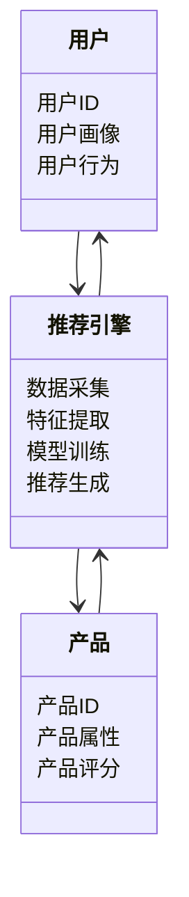

                 


# 开发智能化的金融产品推荐引擎

## 关键词：金融推荐引擎、智能化推荐、协同过滤、矩阵分解、深度学习、系统架构

## 摘要：  
本文将详细探讨开发智能化金融产品推荐引擎的核心技术与实现方案。通过分析金融推荐的独特性，结合协同过滤、矩阵分解和深度学习等算法，构建高效的推荐系统。文章从背景介绍到系统架构设计，再到项目实战，层层递进，帮助读者掌握智能化推荐引擎的开发精髓。

---

# 第一部分: 金融产品推荐引擎概述

## 第1章: 金融产品推荐引擎的背景与问题

### 1.1 金融推荐引擎的背景

#### 1.1.1 金融行业的数字化转型
- 传统金融行业的痛点：信息不对称、用户体验差、产品同质化严重。
- 数字化转型的核心：通过技术手段提升效率和用户体验。
- 智能化推荐引擎在金融行业中的地位：连接用户与产品的桥梁。

#### 1.1.2 传统金融推荐的局限性
- 传统推荐方式的不足：基于规则的推荐效率低、用户体验差。
- 用户需求的多样性：不同用户对金融产品的偏好差异大。
- 数据驱动的必要性：通过数据挖掘和分析，实现精准推荐。

#### 1.1.3 智能化推荐引擎的必要性
- 提升用户体验的核心手段：通过个性化推荐满足用户需求。
- 数据驱动的推荐优势：利用大数据和人工智能技术，实现精准推荐。
- 金融行业对推荐系统的特殊要求：高安全性、高实时性、高准确性。

### 1.2 问题描述与目标

#### 1.2.1 用户需求分析
- 用户行为分析：用户的交易记录、点击行为、搜索习惯等。
- 用户画像构建：基于用户属性和行为数据，构建用户画像。
- 用户需求的多样性：不同用户对金融产品的偏好差异大。

#### 1.2.2 金融产品的多样性
- 金融产品的分类：理财产品、基金、保险、股票等。
- 产品的复杂性：每个金融产品都有其独特属性和风险。
- 产品推荐的挑战：如何在众多产品中找到最适合用户的。

#### 1.2.3 推荐引擎的目标与核心问题
- 目标：提升用户体验、提高产品销售转化率、增强用户粘性。
- 核心问题：如何高效地匹配用户需求与金融产品。
- 实现路径：通过数据采集、特征提取、模型训练和推荐生成，实现智能化推荐。

### 1.3 问题解决与边界

#### 1.3.1 智能化推荐的核心思路
- 数据驱动：基于用户行为和产品特征，构建推荐模型。
- 算法驱动：利用机器学习和深度学习算法，提升推荐准确性。
- 个性化推荐：根据用户画像，实现千人千面的推荐。

#### 1.3.2 推荐引擎的边界与外延
- 系统边界：推荐引擎的核心功能与外部系统的接口。
- 外延功能：用户反馈收集、推荐效果监控、实时推荐等。
- 核心要素：用户数据、产品数据、推荐算法、推荐结果。

#### 1.3.3 核心要素与组成结构
- 核心要素：用户数据、产品数据、推荐算法、推荐结果。
- 组成结构：数据采集模块、特征提取模块、算法模块、推荐生成模块。
- 交互流程：用户请求 -> 数据采集 -> 特征提取 -> 算法处理 -> 推荐生成 -> 用户反馈。

---

## 第2章: 推荐引擎的核心概念与联系

### 2.1 核心概念原理

#### 2.1.1 推荐引擎的基本原理
- 推荐引擎的工作流程：数据采集、特征提取、模型训练、推荐生成。
- 核心技术：协同过滤、矩阵分解、深度学习。
- 金融领域的特殊性：数据稀疏性、实时性要求高、风险控制。

#### 2.1.2 智能化推荐的关键技术
- 数据挖掘：从海量数据中提取有价值的信息。
- 机器学习：利用算法训练推荐模型。
- 自然语言处理：处理文本数据，提取产品特征。

#### 2.1.3 金融领域的特殊性与挑战
- 数据稀疏性：金融行业用户数据量大但稀疏。
- 实时性要求：金融市场的变化快，推荐需要实时更新。
- 风险控制：推荐结果需要符合金融监管要求。

### 2.2 核心概念对比表

#### 传统推荐与智能化推荐的对比
| 对比维度 | 传统推荐 | 智能化推荐 |
|----------|----------|------------|
| 数据来源 | 单一数据源 | 多数据源融合 |
| 推荐方式 | 基于规则 | 基于算法模型 |
| 精准度 | 较低 | 较高 |

#### 不同推荐算法的特征对比
| 算法类型 | 协同过滤 | 矩阵分解 | 深度学习 |
|----------|----------|----------|----------|
| 优点 | 实现简单 | 推荐精准 | 能处理高维数据 |
| 缺点 | 对冷启动问题敏感 | 计算复杂 | 对数据量要求高 |

#### 金融产品推荐的独特性分析
- 产品多样性高：金融产品种类繁多，属性复杂。
- 用户需求差异大：不同用户对金融产品的偏好差异大。
- 风险控制要求高：推荐结果需要符合金融监管要求。

### 2.3 实体关系图

#### 使用 Mermaid 绘制推荐引擎的 ER 图
```mermaid
er
  actor: 用户
  product: 金融产品
  recommendation: 推荐记录
  rule: 推荐规则
  actor -[1..n]-> recommendation
  product -[1..n]-> recommendation
  rule -[1..n]-> recommendation
```

---

# 第三部分: 推荐算法原理

## 第3章: 协同过滤算法

### 3.1 协同过滤的基本原理

#### 1. 基于用户的协同过滤
- 基本思想：找到与目标用户相似的用户群体，推荐这些用户喜欢的产品。
- 相似度计算：使用余弦相似度、欧氏距离等方法计算用户相似度。

#### 2. 基于物品的协同过滤
- 基本思想：找到与目标产品相似的产品，推荐给目标用户。
- 相似度计算：使用余弦相似度、欧氏距离等方法计算产品相似度。

#### 3. 混合推荐的思路
- 混合推荐的优势：结合用户和产品的特征，推荐更精准。
- 实现方式：基于用户和产品的相似度，综合推荐结果。

### 3.2 协同过滤的数学模型

#### 用户相似度计算公式
$$similarity(u, v) = \frac{\sum_{i} (r_{u,i} - \bar{r}_u)(r_{v,i} - \bar{r}_v)}{\sqrt{\sum_{i} (r_{u,i} - \bar{r}_u)^2} \sqrt{\sum_{i} (r_{v,i} - \bar{r}_v)^2}}$$

#### 产品相似度计算公式
$$similarity(p, q) = \frac{\sum_{u} (r_{u,p} - \bar{r}_p)(r_{u,q} - \bar{r}_q)}{\sqrt{\sum_{u} (r_{u,p} - \bar{r}_p)^2} \sqrt{\sum_{u} (r_{u,q} - \bar{r}_q)^2}}$$

### 3.3 协同过滤的实现流程

#### 1. 数据预处理
- 数据清洗：处理缺失值、异常值。
- 特征提取：提取用户和产品的关键特征。

#### 2. 相似度计算
- 用户相似度计算：基于用户行为数据，计算用户相似度。
- 产品相似度计算：基于产品属性数据，计算产品相似度。

#### 3. 推荐生成
- 基于用户的协同过滤：找到相似用户的推荐列表。
- 基于产品的协同过滤：找到相似产品的推荐列表。
- 综合推荐：结合用户和产品的特征，生成最终推荐列表。

---

## 第4章: 基于矩阵分解的推荐算法

### 4.1 矩阵分解的基本原理

#### 1. SVD 算法的简介
- 奇异值分解（Singular Value Decomposition，SVD）：将用户-产品矩阵分解为三个低维矩阵的乘积。
- 矩阵分解的优势：能够捕捉用户和产品之间的潜在关联。

#### 2. 矩阵分解的应用场景
- 处理数据稀疏性问题。
- 提高推荐的准确性和多样性。

### 4.2 矩阵分解的数学模型

#### 潜在因子分解公式
$$X = U \cdot V^T$$
- $X$：用户-产品评分矩阵。
- $U$：用户潜在因子矩阵。
- $V^T$：产品潜在因子矩阵。

### 4.3 矩阵分解的实现流程

#### 1. 数据预处理
- 数据清洗：处理缺失值、异常值。
- 特征提取：提取用户和产品的关键特征。

#### 2. 模型训练
- 矩阵分解：使用 SVD 算法对用户-产品矩阵进行分解。
- 潜在因子提取：提取用户和产品的潜在因子。

#### 3. 推荐生成
- 用户潜在因子匹配：找到与用户潜在因子最匹配的产品。
- 产品潜在因子匹配：找到与产品潜在因子最匹配的用户。

---

# 第四部分: 系统分析与架构设计

## 第5章: 系统分析与架构设计

### 5.1 问题场景介绍

#### 1. 项目背景
- 金融产品的多样性：理财产品、基金、保险、股票等。
- 用户需求的多样性：不同用户对金融产品的偏好差异大。
- 推荐系统的必要性：通过智能化推荐提升用户体验和产品销售。

### 5.2 系统功能设计

#### 1. 领域模型类图


### 5.3 系统架构设计

#### 1. 系统架构图


---

## 第6章: 接口设计与交互流程

### 6.1 接口设计

#### 1. 推荐引擎接口
- 输入：用户ID、产品ID。
- 输出：推荐列表。

#### 2. 数据接口
- 输入：用户行为数据、产品属性数据。
- 输出：清洗后的数据、特征提取结果。

### 6.2 交互流程

#### 1. 用户请求
- 用户提交推荐请求。
- 推荐引擎接收请求。

#### 2. 数据采集
- 采集用户行为数据和产品属性数据。

#### 3. 特征提取
- 提取用户和产品的关键特征。

#### 4. 模型训练
- 使用协同过滤或矩阵分解算法训练模型。

#### 5. 推荐生成
- 根据模型生成推荐列表。

#### 6. 用户反馈
- 用户对推荐结果进行反馈，优化推荐模型。

---

# 第五部分: 项目实战

## 第7章: 项目实战与代码实现

### 7.1 环境安装

#### 1. 安装 Python
- 安装 Python 3.8 以上版本。
- 安装必要的库：numpy、pandas、scikit-learn。

### 7.2 核心代码实现

#### 1. 数据采集模块
```python
import pandas as pd

# 读取用户行为数据
user_behavior = pd.read_csv('user_behavior.csv')

# 读取产品属性数据
product_info = pd.read_csv('product_info.csv')
```

#### 2. 特征提取模块
```python
from sklearn.preprocessing import StandardScaler

# 提取用户特征
user_features = user_behavior[['age', 'gender', 'income']].values

# 标准化处理
scaler = StandardScaler()
user_features = scaler.fit_transform(user_features)
```

#### 3. 模型训练模块
```python
from sklearn.decomposition import PCA

# 训练 PCA 模型
pca = PCA(n_components=5)
user_factors = pca.fit_transform(user_features)
```

#### 4. 推荐生成模块
```python
def generate_recommendations(user_factors, product_factors):
    # 计算相似度
    similarity = (user_factors.dot(product_factors.T)).argsort()
    # 返回 top 5 推荐
    return similarity[:, -5:]
```

### 7.3 代码解读与分析

#### 1. 数据采集模块
- 读取用户行为数据和产品属性数据。
- 数据清洗和预处理。

#### 2. 特征提取模块
- 提取用户和产品的关键特征。
- 使用标准化处理，确保特征具有可比性。

#### 3. 模型训练模块
- 使用 PCA 算法进行矩阵分解。
- 提取用户和产品的潜在因子。

#### 4. 推荐生成模块
- 计算用户与产品的相似度。
- 返回最相似的 top N 产品。

### 7.4 实际案例分析

#### 1. 案例背景
- 某用户的基本信息：年龄 30 岁，性别男，收入中等。
- 用户行为数据：最近浏览了理财产品和基金。

#### 2. 推荐结果
- 根据用户特征和产品特征，推荐 5 款适合的理财产品和基金。

---

## 第8章: 总结与展望

### 8.1 最佳实践 tips

#### 1. 数据的重要性
- 数据质量直接影响推荐的准确性。
- 数据清洗和预处理是关键步骤。

#### 2. 模型的选择
- 根据数据特征选择合适的推荐算法。
- 协同过滤适用于中小数据集，矩阵分解适用于大数据集。

#### 3. 系统优化
- 提升推荐的实时性。
- 优化推荐的多样性。

### 8.2 小结

- 本文详细探讨了开发智能化金融产品推荐引擎的核心技术与实现方案。
- 从背景介绍到系统架构设计，再到项目实战，层层递进，帮助读者掌握智能化推荐引擎的开发精髓。

### 8.3 注意事项

- 数据安全：金融数据涉及用户隐私，必须做好数据加密和权限管理。
- 风险控制：推荐结果需要符合金融监管要求。
- 系统性能：确保推荐引擎的实时性和稳定性。

### 8.4 拓展阅读

- 推荐系统的研究现状与未来趋势。
- 深度学习在推荐系统中的应用。
- 金融领域的其他智能化技术。

---

## 作者：AI天才研究院/AI Genius Institute & 禅与计算机程序设计艺术/Zen And The Art of Computer Programming

