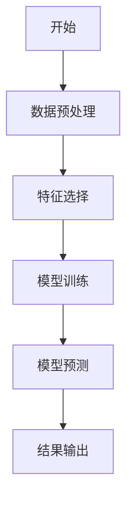
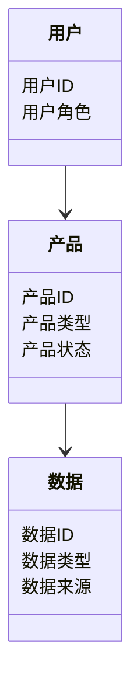
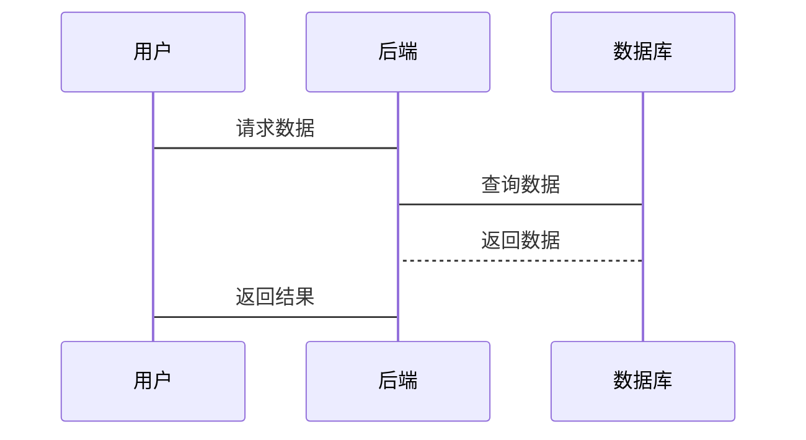

                 


# 开发智能化的金融产品生命周期管理与优化引擎

## 关键词：
- 金融产品生命周期管理
- 人工智能
- 大数据分析
- 优化引擎
- 系统架构设计
- 项目实战

## 摘要：
随着金融市场日益复杂，金融产品的生命周期管理需要更加智能化和高效。本文将详细探讨如何利用人工智能和大数据分析技术，构建一个智能化的金融产品生命周期管理与优化引擎。通过分析核心概念、算法原理、系统架构设计以及实际项目案例，本文为读者提供一套完整的解决方案，帮助他们在金融产品管理中实现智能化优化。

---

# 第1章：背景介绍

## 1.1 问题背景

### 1.1.1 传统金融产品管理的挑战
传统的金融产品管理依赖人工操作，存在效率低下、数据孤岛、难以实时优化等问题。随着市场的波动加剧，传统方法难以满足现代金融的需求。

### 1.1.2 现代金融市场的复杂性
现代金融市场数据量庞大，产品种类繁多，风险因素复杂。金融产品的生命周期管理需要实时监控、快速决策和智能优化。

### 1.1.3 金融产品生命周期管理的重要性
金融产品从设计、发行到终止，每个阶段都需要精准的管理。有效的生命周期管理能够降低风险、提高收益，优化资源配置。

## 1.2 问题描述

### 1.2.1 金融产品生命周期的定义
金融产品生命周期包括设计、发行、监控和终止四个阶段，每个阶段都需要高效的管理工具支持。

### 1.2.2 现有管理系统的不足
现有系统依赖人工操作，数据处理能力有限，难以应对复杂的数据分析和实时优化需求。

### 1.2.3 对优化引擎的需求
为了提高效率和准确性，需要引入智能化的优化引擎，利用AI和大数据技术实现金融产品的全生命周期管理。

## 1.3 问题解决

### 1.3.1 引入智能化技术的必要性
通过引入机器学习、自然语言处理等技术，优化引擎能够实时分析数据，提供决策支持。

### 1.3.2 智能化引擎的目标
目标是实现金融产品的全生命周期智能化管理，从设计到终止，每个阶段都能通过AI技术优化。

### 1.3.3 解决方案的可行性分析
基于现有技术，构建智能化优化引擎是可行的，能够显著提高金融产品的管理效率和准确性。

## 1.4 边界与外延

### 1.4.1 系统的边界
系统仅关注金融产品的生命周期管理，不涉及其他金融业务，如投资决策。

### 1.4.2 相关概念的外延
金融产品生命周期管理涉及数据采集、分析、监控等多个环节，这些环节是系统外延的一部分。

### 1.4.3 与其它系统的接口
系统需要与前端界面、数据库、外部API等接口对接，确保数据的实时传输和处理。

## 1.5 核心要素组成

### 1.5.1 数据流
数据流包括市场数据、产品数据、用户反馈等，是优化引擎的核心输入。

### 1.5.2 业务流程
业务流程包括数据采集、分析、优化建议生成和执行，确保每个阶段的顺利进行。

### 1.5.3 关键性能指标
关键性能指标包括处理速度、准确率、响应时间等，是衡量优化引擎性能的重要标准。

---

# 第2章：核心概念与联系

## 2.1 核心概念原理

### 2.1.1 金融产品生命周期管理
通过系统化的方法，对金融产品的生命周期进行监控和优化，确保产品在市场中的表现最佳。

### 2.1.2 AI驱动的优化引擎
利用人工智能技术，实时分析数据，提供优化建议，帮助决策者做出最佳选择。

### 2.1.3 大数据分析技术
通过对海量数据的处理和分析，提取有价值的信息，支持优化引擎的决策过程。

## 2.2 概念属性特征对比

| 概念 | 特征1 | 特征2 | 特征3 |
|------|-------|-------|-------|
| 传统方法 | 依赖人工 | 数据处理能力有限 | 延迟性高 |
| 现代技术 | AI驱动 | 数据处理能力强 | 实时性高 |

## 2.3 ER实体关系图
```mermaid
erDiagram
    user {
        用户ID
        用户角色
    }
    product {
        产品ID
        产品类型
        产品状态
    }
    data {
        数据ID
        数据类型
        数据来源
    }
    user -->
    product
    product -->
    data
```

---

# 第3章：算法原理讲解

## 3.1 机器学习模型

### 3.1.1 线性回归模型
线性回归是一种简单而强大的回归模型，用于预测连续型变量。

$$ y = \beta_0 + \beta_1x_1 + \beta_2x_2 + \ldots + \beta_nx_n $$

### 3.1.2 随机森林模型
随机森林是一种基于决策树的集成学习方法，能够处理高维数据。

### 3.1.3 算法流程


### 3.1.4 Python代码实现
```python
from sklearn.linear_model import LinearRegression
import numpy as np

# 示例数据
X = np.array([[1], [2], [3], [4]])
y = [2, 4, 6, 8]

# 训练模型
model = LinearRegression()
model.fit(X, y)

# 预测
print(model.predict(np.array([[5]])))
```

---

# 第4章：系统分析与架构设计

## 4.1 系统功能设计

### 4.1.1 领域模型


### 4.1.2 系统架构设计


### 4.1.3 系统接口设计


---

# 第5章：项目实战

## 5.1 环境安装

### 5.1.1 安装Python
```bash
python --version
pip install --upgrade pip
```

### 5.1.2 安装依赖库
```bash
pip install numpy pandas scikit-learn
```

## 5.2 核心代码实现

### 5.2.1 数据处理
```python
import pandas as pd

# 读取数据
data = pd.read_csv('data.csv')

# 数据清洗
data.dropna(inplace=True)
```

### 5.2.2 模型训练
```python
from sklearn.model_selection import train_test_split
from sklearn.ensemble import RandomForestRegressor

# 划分数据集
X_train, X_test, y_train, y_test = train_test_split(data.drop('target', axis=1), data['target'], test_size=0.2)

# 训练模型
model = RandomForestRegressor()
model.fit(X_train, y_train)

# 评估模型
print(model.score(X_test, y_test))
```

## 5.3 案例分析
通过实际案例，分析优化引擎在金融产品管理中的应用，展示其在提高效率和准确率方面的优势。

---

# 第6章：高级主题

## 6.1 模型优化
### 6.1.1 超参数调优
使用网格搜索等方法优化模型性能。

### 6.1.2 模型部署
将优化引擎部署到生产环境，确保其稳定运行。

## 6.2 性能调优
优化代码性能，提高处理速度和响应时间。

## 6.3 安全性与扩展性
确保系统安全性，支持高并发和大规模数据处理。

---

# 第7章：总结与展望

## 7.1 总结
通过本文的介绍，读者能够系统地了解如何开发智能化的金融产品生命周期管理与优化引擎，掌握核心技术和实现方法。

## 7.2 展望
未来，随着AI和大数据技术的不断发展，智能化优化引擎将在金融领域发挥更大的作用，为金融产品管理带来更多的创新和突破。

---

# 作者：AI天才研究院/AI Genius Institute & 禅与计算机程序设计艺术 /Zen And The Art of Computer Programming

