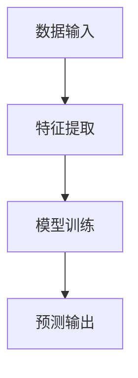
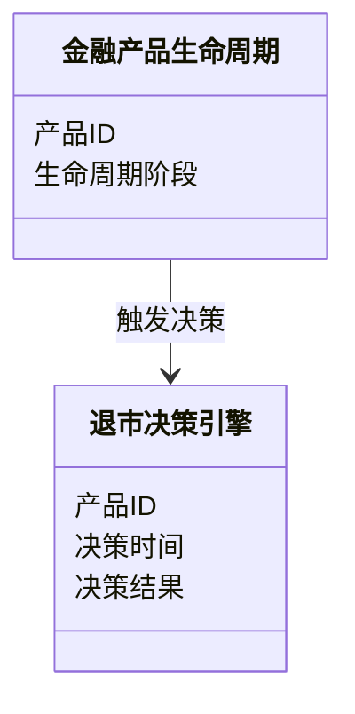
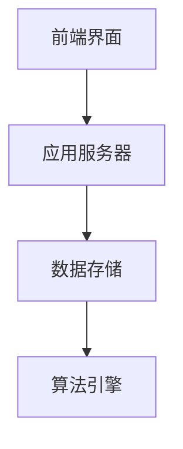
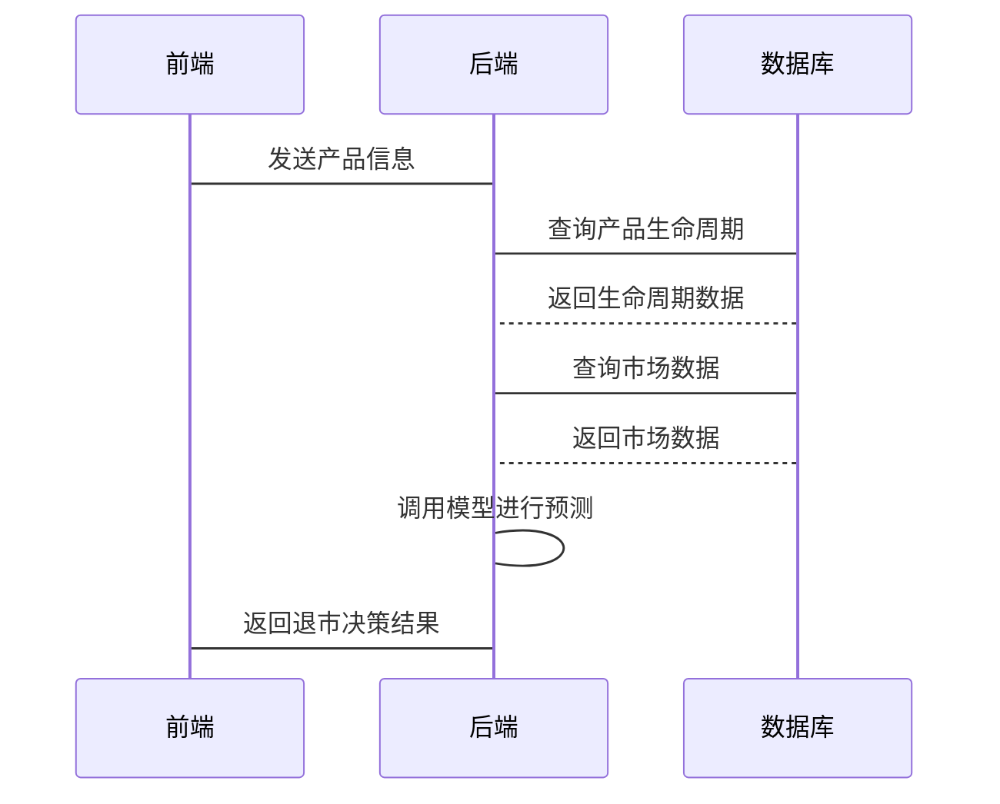

                 


# 开发智能化的金融产品生命周期管理与退市决策引擎

> 关键词：金融产品生命周期，退市决策引擎，人工智能，机器学习，系统架构

> 摘要：本文详细探讨了开发智能化的金融产品生命周期管理与退市决策引擎的关键技术与实现方案。通过分析金融产品的生命周期管理与退市决策的核心问题，结合智能化技术，提出了一种基于机器学习的解决方案，并通过实际案例展示了如何构建高效的金融产品生命周期管理与退市决策引擎。

---

# 第一部分：金融产品生命周期管理与退市决策引擎概述

## 第1章：背景介绍

### 1.1 金融产品生命周期管理的重要性

#### 1.1.1 金融产品的定义与分类
金融产品是金融市场中的核心要素，包括股票、债券、基金、衍生品等。不同类型的金融产品具有不同的生命周期和管理需求。

#### 1.1.2 金融产品生命周期的阶段划分
金融产品的生命周期通常包括发行、流通、终止三个主要阶段。每个阶段都需要精确的管理与监控。

#### 1.1.3 退市机制的意义与作用
退市机制是金融市场健康运行的重要保障，通过及时淘汰不符合条件的金融产品，维护市场秩序和投资者利益。

### 1.2 退市决策引擎的必要性

#### 1.2.1 退市决策的复杂性与挑战
退市决策涉及多方利益，需要综合考虑市场表现、法律法规、投资者行为等多种因素。

#### 1.2.2 智能化退市决策的优势
通过智能化技术，可以提高退市决策的效率和准确性，减少人为错误和主观因素的影响。

#### 1.2.3 退市决策对金融市场的影响
科学的退市决策能够维护市场公平，保护投资者权益，促进金融市场健康稳定发展。

---

## 第2章：核心概念与联系

### 2.1 核心概念原理

#### 2.1.1 金融产品生命周期管理的原理
金融产品生命周期管理通过实时数据采集、分析和决策，确保产品在各个阶段的合规性和有效性。

#### 2.1.2 退市决策引擎的工作机制
退市决策引擎通过收集和分析市场数据，利用机器学习算法生成退市决策建议。

#### 2.1.3 智能化决策的核心算法
智能化决策基于深度学习和自然语言处理技术，能够从海量数据中提取关键特征，生成最优决策。

### 2.2 核心概念属性特征对比表

| 概念 | 属性 | 特征 |
|------|------|------|
| 金融产品生命周期 | 时间跨度 | 长 |
| 退市决策引擎 | 输入数据 | 多样性 |
| 智能化决策 | 算法类型 | 高复杂度 |

### 2.3 ER实体关系图

```mermaid
erDiagram
    actor 投资者 {
        string 资产ID
        string 投资金额
    }
    actor 金融机构 {
        string 产品ID
        string 产品类型
    }
    entity 产品生命周期 {
        string 产品ID
        date 生命周期阶段
    }
    entity 退市决策引擎 {
        string 产品ID
        date 决策时间
        boolean 决策结果
    }
    投资者 --> 产品生命周期 : 持有产品
    金融机构 --> 产品生命周期 : 发行产品
    产品生命周期 --> 退市决策引擎 : 触发决策
```

---

## 第3章：算法原理讲解

### 3.1 退市决策算法选择

#### 3.1.1 机器学习算法的应用
机器学习算法（如支持向量机、随机森林）在金融产品生命周期管理中被广泛应用，用于预测市场趋势和风险。

#### 3.1.2 深度学习模型的优势
深度学习模型（如LSTM、Transformer）能够捕捉金融数据中的复杂模式，提高退市决策的准确性。

#### 3.1.3 算法流程图



### 3.2 算法实现与数学模型

#### 3.2.1 线性回归模型
$$ y = \beta_0 + \beta_1x + \epsilon $$

#### 3.2.2 支持向量机模型
$$ \text{最大化} \quad \frac{1}{2} \|w\|^2 $$
$$ \text{满足} \quad y_i(w \cdot x_i + b) \geq 1 \quad \forall i $$

#### 3.2.3 随机森林算法
通过集成学习，随机森林能够有效处理高维数据，减少过拟合风险。

---

## 第4章：系统分析与架构设计

### 4.1 应用场景介绍

#### 4.1.1 金融产品的生命周期管理
系统实时监控金融产品的市场表现，确保产品在各个阶段的合规性。

#### 4.1.2 退市决策引擎的应用
基于市场数据和模型预测，生成退市决策建议，减少人为干预。

### 4.2 系统功能设计

#### 4.2.1 领域模型



#### 4.2.2 系统架构设计



### 4.3 接口设计与交互流程

#### 4.3.1 系统接口
- 数据输入接口：接收市场数据和产品信息。
- 模型调用接口：调用机器学习模型进行预测。
- 结果输出接口：返回退市决策结果。

#### 4.3.2 交互流程



---

## 第5章：项目实战

### 5.1 环境安装与配置

#### 5.1.1 Python环境安装
使用Anaconda安装Python 3.8及以上版本。

#### 5.1.2 依赖库安装
安装numpy、pandas、scikit-learn、tensorflow等库。

### 5.2 核心代码实现

#### 5.2.1 数据预处理代码

```python
import pandas as pd
import numpy as np

# 加载数据
data = pd.read_csv('financial_data.csv')

# 数据清洗
data = data.dropna()
data = pd.get_dummies(data)
```

#### 5.2.2 模型训练代码

```python
from sklearn.model import SVC
from sklearn.preprocessing import StandardScaler

# 特征提取
X = data.drop('target', axis=1)
y = data['target']

# 标准化
scaler = StandardScaler()
X_scaled = scaler.fit_transform(X)

# 训练模型
model = SVC()
model.fit(X_scaled, y)
```

#### 5.2.3 模型预测代码

```python
# 预测结果
y_pred = model.predict(X_scaled)

# 输出决策结果
print('退市决策结果:', y_pred)
```

### 5.3 代码解读与分析

#### 5.3.1 数据预处理
数据预处理包括数据清洗和特征工程，确保模型输入的数据质量。

#### 5.3.2 模型训练
使用支持向量机模型进行训练，标准化处理后的数据能够提高模型性能。

#### 5.3.3 模型预测
通过训练好的模型，对新数据进行预测，生成退市决策结果。

### 5.4 实际案例分析

#### 5.4.1 案例背景
某金融产品在市场上表现不佳，需判断是否需要退市。

#### 5.4.2 数据分析
分析产品市场表现、投资者行为和法律法规要求，生成退市建议。

#### 5.4.3 模型输出
模型预测结果为“退市”，建议产品在指定日期终止交易。

---

## 第6章：最佳实践与总结

### 6.1 小结

#### 6.1.1 核心要点总结
- 金融产品生命周期管理是金融市场健康运行的关键。
- 智能化退市决策引擎能够提高决策效率和准确性。

#### 6.1.2 项目实现的关键步骤
- 数据收集与预处理
- 模型选择与训练
- 系统设计与实现

### 6.2 注意事项

#### 6.2.1 数据质量的重要性
数据清洗和特征工程是模型性能的关键因素。

#### 6.2.2 模型选择的策略
根据具体场景选择合适的算法，避免过度复杂化。

### 6.3 拓展阅读

#### 6.3.1 推荐书籍
- 《机器学习实战》
- 《金融数据分析与建模》

#### 6.3.2 技术博客
- [深入浅出机器学习](https://zhuanlan.zhihu.com/p/...)
- [金融数据分析入门](https://www.cnblogs.com/...)

---

# 结语

开发智能化的金融产品生命周期管理与退市决策引擎是一项复杂的系统工程，需要结合金融知识与人工智能技术，通过深入分析和实践，才能构建高效的解决方案。希望本文能够为相关领域的读者提供有价值的参考和启发。

---

**作者：AI天才研究院/AI Genius Institute & 禅与计算机程序设计艺术 /Zen And The Art of Computer Programming**

