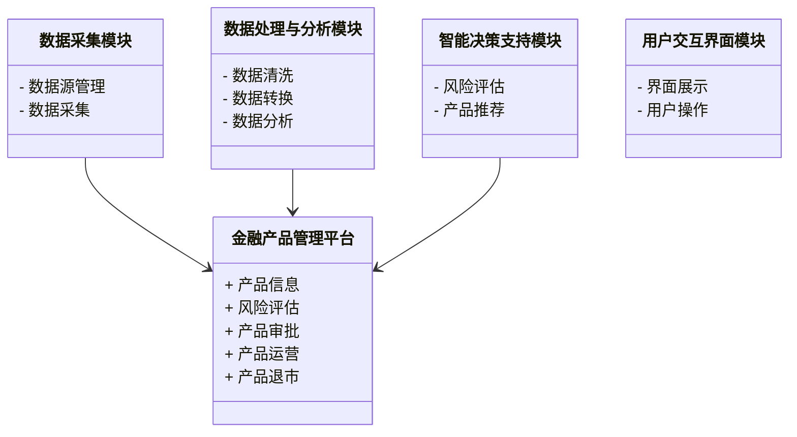
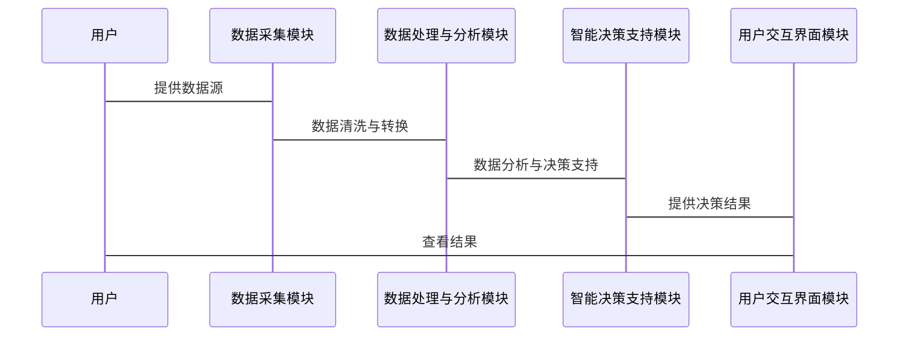

                 


# 开发智能化的金融产品生命周期管理平台

> 关键词：金融产品生命周期、智能化管理平台、人工智能、大数据分析、系统架构设计、算法实现

> 摘要：本文详细探讨了开发智能化的金融产品生命周期管理平台的背景、核心概念、技术基础、系统架构设计、算法实现及项目实战。通过分析金融产品的生命周期管理中的挑战，提出利用人工智能和大数据分析技术构建智能化管理平台的解决方案。文章还详细讲解了系统架构设计、算法原理及其实现，最后通过实际案例展示了平台的应用效果和价值。

---

## 第1章：金融产品生命周期管理平台的背景与目标

### 1.1 金融产品的生命周期概述

金融产品的生命周期是指从产品设计、审批、发行、运营到退市的整个过程。传统上，这一过程依赖人工操作，存在效率低、风险高、成本高等问题。随着人工智能和大数据技术的快速发展，利用智能化平台优化金融产品生命周期管理成为行业趋势。

#### 1.1.1 金融产品的定义与分类

金融产品是指以货币、证券、保险、基金等形式提供的金融服务。根据功能和风险，金融产品可以分为以下几类：

- **存款类产品**：如活期存款、定期存款。
- **贷款类产品**：如个人贷款、企业贷款。
- **证券类产品**：如股票、债券。
- **保险类产品**：如人寿保险、财产保险。
- **基金类产品**：如共同基金、指数基金。

#### 1.1.2 金融产品生命周期的阶段划分

金融产品的生命周期通常分为以下几个阶段：

1. **产品设计**：确定产品类型、风险等级、收益目标等。
2. **产品审批**：通过内部审核和监管机构审批。
3. **产品发行**：向市场推广并吸引投资者。
4. **产品运营**：监控产品表现，进行风险控制。
5. **产品退市**：根据市场反馈或监管要求终止产品。

#### 1.1.3 传统金融产品管理的挑战与痛点

传统金融产品管理面临以下挑战：

- **效率低下**：人工审批和监控耗时长，容易出错。
- **风险控制不足**：难以及时发现和处理潜在风险。
- **数据孤岛**：各部门数据分散，难以有效整合和分析。
- **成本高昂**：需要大量人工参与，增加了运营成本。

### 1.2 智能化管理的必要性

#### 1.2.1 人工智能在金融领域的应用现状

人工智能技术在金融领域的应用日益广泛，包括智能投顾、风险管理、信用评估等。利用AI技术可以提高金融产品管理的效率和准确性。

#### 1.2.2 大数据技术对金融产品管理的推动作用

大数据技术可以帮助金融机构收集、存储和分析海量数据，从而优化产品设计、风险控制和市场推广。

#### 1.2.3 智能化管理平台的目标与价值

智能化管理平台的目标是通过AI和大数据技术，优化金融产品生命周期中的各个环节，降低运营成本，提高效率和风险控制能力。其价值体现在以下几个方面：

- **提高效率**：自动化处理流程，减少人工干预。
- **降低风险**：通过实时监控和预警，及时发现潜在风险。
- **增强决策能力**：基于数据分析提供精准的决策支持。
- **提升客户体验**：通过个性化服务提高客户满意度。

---

## 第2章：核心概念与技术基础

### 2.1 核心概念解析

#### 2.1.1 金融产品管理平台的定义

金融产品管理平台是一个用于管理金融产品全生命周期的信息化系统，通过整合数据、分析和决策支持，优化产品管理流程。

#### 2.1.2 AI驱动的智能化管理

AI驱动的智能化管理是指利用机器学习、自然语言处理等技术，实现金融产品管理的自动化和智能化。

#### 2.1.3 大数据分析技术在金融产品管理中的应用

大数据分析技术可以帮助金融机构从海量数据中提取有价值的信息，用于产品设计、风险评估和市场推广。

#### 2.1.4 核心概念对比分析

| 概念                | 传统管理方式                | 智能化管理方式                |
|---------------------|-----------------------------|------------------------------|
| 数据采集            | 手动录入，数据量小          | 自动采集，数据量大          |
| 数据处理            | 简单统计，缺乏深度分析      | 多维度分析，深度挖掘        |
| 决策支持            | 依赖人工经验                | 基于数据驱动，自动推荐      |

#### 2.1.5 系统架构的核心要素

- **数据采集模块**：负责从各种渠道采集金融产品的相关数据。
- **数据处理与分析模块**：对采集到的数据进行清洗、转换和分析。
- **智能决策支持模块**：基于分析结果提供决策支持。
- **用户交互界面模块**：提供友好的用户界面，方便用户操作。

---

## 第3章：算法原理与数学模型

### 3.1 算法原理

#### 3.1.1 基于规则的分类算法

基于规则的分类算法通过预定义的规则对金融产品进行分类。例如，可以根据产品的收益率和风险等级制定分类规则。

#### 3.1.2 基于机器学习的分类算法

机器学习算法通过训练数据模型，自动学习分类规则。常用的算法包括逻辑回归、决策树、支持向量机（SVM）等。

#### 3.1.3 算法选择与优化策略

- **算法选择**：根据具体需求和数据特点选择合适的算法。
- **算法优化**：通过参数调整、特征选择等方法提高算法性能。

### 3.2 数学模型与公式

#### 3.2.1 逻辑回归模型

逻辑回归是一种常用的分类算法，其数学模型如下：

$$ P(y=1|x) = \frac{1}{1 + e^{-\beta x}} $$

其中，$x$ 是输入特征向量，$\beta$ 是模型参数。

#### 3.2.2 决策树模型

决策树是一种基于树状结构的分类算法，每个节点代表一个特征，每条边代表一个决策。

#### 3.2.3 支持向量机模型

支持向量机是一种高效的分类算法，其数学模型如下：

$$ \text{maximize} \quad \frac{1}{2}\|w\|^2 $$
$$ \text{subject to} \quad y_i(w \cdot x_i + b) \geq 1 $$

其中，$w$ 是权重向量，$b$ 是偏置项，$y_i$ 是标签。

### 3.3 算法实现与优化

#### 3.3.1 算法实现步骤

1. **数据预处理**：清洗数据，处理缺失值和异常值。
2. **特征选择**：选择对分类有重要作用的特征。
3. **模型训练**：使用训练数据训练模型。
4. **模型评估**：通过测试数据评估模型性能。
5. **模型优化**：调整参数，提高模型性能。

#### 3.3.2 算法优化方法

- **参数调整**：通过网格搜索等方法找到最佳参数。
- **特征工程**：通过特征提取、降维等方法优化特征。
- **集成学习**：通过集成多个模型提高性能。

#### 3.3.3 实验结果与分析

通过实验可以发现，基于机器学习的分类算法在金融产品分类中表现优于基于规则的算法，尤其是在数据量较大的情况下。

---

## 第4章：系统分析与架构设计

### 4.1 问题场景分析

#### 4.1.1 金融产品生命周期管理中的典型问题

- 数据分散，难以有效整合。
- 风险监控不及时，容易引发风险事件。
- 产品设计缺乏数据支持，难以满足市场需求。

#### 4.1.2 平台需要解决的核心问题

- 数据集成与共享。
- 实时监控与预警。
- 智能化决策支持。

#### 4.1.3 问题解决的预期目标

- 提高金融产品管理效率。
- 降低金融产品管理风险。
- 提升金融机构的市场竞争力。

### 4.2 系统功能设计

#### 4.2.1 领域模型设计



#### 4.2.2 系统架构设计

```mermaid
--- architecture
title 系统架构设计

actor 用户
participant 数据采集模块
participant 数据处理与分析模块
participant 智能决策支持模块
participant 用户交互界面模块

用户 -> 数据采集模块: 提供数据源
数据采集模块 -> 数据处理与分析模块: 数据清洗与转换
数据处理与分析模块 -> 智能决策支持模块: 数据分析与决策支持
智能决策支持模块 -> 用户交互界面模块: 提供决策结果
用户 -> 用户交互界面模块: 查看结果
```

#### 4.2.3 系统接口设计

- **数据接口**：提供数据采集和处理的API接口。
- **决策接口**：提供风险评估和产品推荐的API接口。
- **用户接口**：提供用户操作的API接口。

#### 4.2.4 系统交互设计



---

## 第5章：项目实战

### 5.1 环境配置

- **编程语言**：Python 3.8+
- **开发框架**：Django或Flask
- **机器学习库**：Scikit-learn
- **数据处理工具**：Pandas、NumPy
- **开发环境**：Jupyter Notebook或VS Code

### 5.2 核心代码实现

#### 5.2.1 数据预处理

```python
import pandas as pd
import numpy as np

# 读取数据
data = pd.read_csv('financial_products.csv')

# 处理缺失值
data = data.dropna()

# 处理异常值
data = data[(data['收益'] >= 0) & (data['风险'] <= 5)]
```

#### 5.2.2 特征提取

```python
from sklearn.feature_selection import SelectKBest
from sklearn.feature_selection import chi2

# 特征提取
selector = SelectKBest(score_func=chi2, k=3)
selected_features = selector.fit_transform(data)
```

#### 5.2.3 模型训练

```python
from sklearn.linear_model import LogisticRegression

# 模型训练
model = LogisticRegression()
model.fit(selected_features, data['类别'])
```

#### 5.2.4 模型评估

```python
from sklearn.metrics import accuracy_score

# 模型预测
y_pred = model.predict(selected_features)

# 模型评估
print(accuracy_score(data['类别'], y_pred))
```

### 5.3 实际案例分析

通过实际案例分析，展示了平台在金融产品生命周期管理中的应用效果。例如，利用平台对某金融产品的风险进行评估和预警，帮助机构及时采取措施，避免潜在风险。

---

## 第6章：总结与展望

### 6.1 总结

本文详细探讨了开发智能化的金融产品生命周期管理平台的背景、核心概念、技术基础、系统架构设计、算法实现及项目实战。通过分析金融产品的生命周期管理中的挑战，提出利用人工智能和大数据分析技术构建智能化管理平台的解决方案。

### 6.2 注意事项与最佳实践

- **数据安全**：确保数据的安全性和隐私性。
- **模型更新**：定期更新模型，保持其准确性。
- **用户体验**：提供友好的用户界面，提高用户体验。

### 6.3 拓展与未来研究方向

- **模型优化**：进一步优化算法，提高模型性能。
- **多模态数据融合**：结合文本、图像等多种数据源，提高分析能力。
- **实时分析**：实现实时数据分析，提高风险监控能力。

---

## 作者：AI天才研究院/AI Genius Institute & 禅与计算机程序设计艺术 /Zen And The Art of Computer Programming

---

感谢您的阅读！希望本文对您开发智能化的金融产品生命周期管理平台有所帮助。

