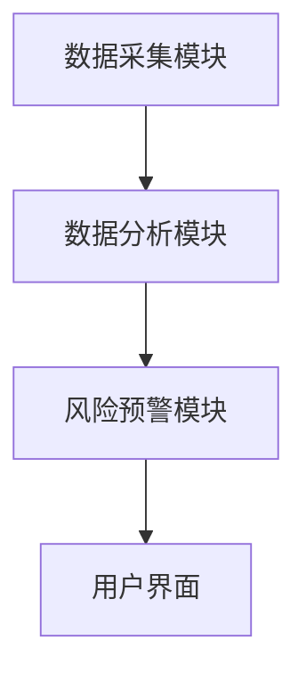
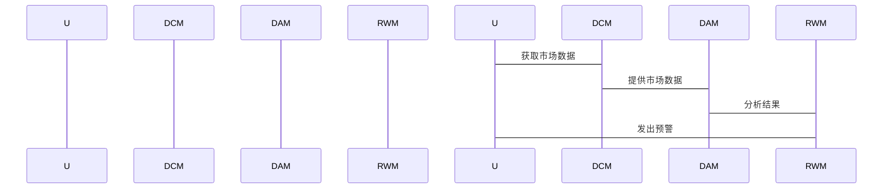

                 


```markdown
# 开发智能化的金融产品生命周期风险动态管理平台

## 关键词：智能化，金融产品，风险管理，动态管理，平台开发

## 摘要：  
本文深入探讨了如何开发智能化的金融产品生命周期风险动态管理平台。通过分析金融产品生命周期中的风险管理挑战，结合动态风险评估、实时监控和智能化模型的核心原理，提出了基于时间序列分析和机器学习的算法实现。同时，通过系统架构设计和项目实战，展示了平台的实际应用价值和开发实现过程。本文为金融行业提供了智能化风险管理的新思路和解决方案。

---

## 第1章: 背景与问题背景

### 1.1 问题背景

#### 1.1.1 金融产品生命周期风险管理的重要性
金融产品的生命周期涉及发行、交易、结算等多个阶段，每个阶段都伴随着不同的风险，如市场风险、信用风险和操作风险。有效的风险管理是保障金融机构稳健运行的核心。

#### 1.1.2 当前风险管理的主要挑战
- **数据复杂性**：金融市场数据呈现非线性、高频和噪声多的特点，传统的统计方法难以捕捉复杂风险。
- **实时性要求高**：金融市场的瞬息万变要求风险管理必须实时响应，传统的静态模型已无法满足需求。
- **模型局限性**：现有模型多基于历史数据分析，难以应对突发事件和市场环境的突变。

#### 1.1.3 智能化风险管理的必要性
智能化风险管理通过引入机器学习、深度学习等技术，能够实时捕捉市场动态，预测潜在风险，从而实现更精准和高效的管理。

### 1.2 问题描述

#### 1.2.1 金融产品生命周期中的主要风险类型
- 市场风险：由于市场价格波动导致的损失。
- 信用风险：交易对手违约的可能性。
- 操作风险：由于人为错误或系统故障导致的损失。

#### 1.2.2 风险管理的动态性与复杂性
金融市场的动态变化使得风险种类和影响程度不断变化，传统的静态模型难以应对这种动态性。

#### 1.2.3 现有风险管理系统的局限性
现有系统多依赖于规则引擎和静态模型，难以应对复杂多变的金融市场环境，且缺乏实时性和智能化。

### 1.3 问题解决与目标

#### 1.3.1 开发智能化风险管理平台的目标
- 实现实时动态风险评估。
- 提供智能化的风险预测和预警。
- 支持多维度的数据分析和可视化。

#### 1.3.2 平台的核心功能与预期效果
- **实时监控**：对金融市场数据进行实时采集和分析。
- **风险预测**：利用机器学习模型预测潜在风险。
- **动态调整**：根据市场变化动态调整风险管理策略。

#### 1.3.3 平台的适用范围与边界
- 适用于银行、证券、基金等金融机构。
- 边界包括：不涉及具体的交易执行，专注于风险监控和预警。

### 1.4 概念结构与核心要素

#### 1.4.1 金融产品生命周期的核心阶段
- 发行阶段：产品设计与发行。
- 交易阶段：市场交易与价格波动。
- 结算阶段：资金清算与交割。

#### 1.4.2 风险管理的核心要素
- 数据采集：实时采集市场数据。
- 数据分析：对数据进行清洗、特征提取和建模分析。
- 风险预警：根据分析结果发出预警信号。

#### 1.4.3 平台架构的核心组成
- 数据采集模块：实时获取金融市场数据。
- 数据分析模块：利用机器学习模型进行分析。
- 风险预警模块：根据分析结果发出预警信号。

---

## 第2章: 核心概念与联系

### 2.1 动态风险评估的核心原理

#### 2.1.1 动态风险评估的定义
动态风险评估是一种基于实时数据和模型的动态调整风险评估方法。

#### 2.1.2 动态风险评估的关键特征
- 实时性：能够实时更新风险评估结果。
- 动态性：能够根据市场变化动态调整评估模型。
- 预测性：能够预测未来的风险变化。

#### 2.1.3 动态风险评估与静态风险评估的对比
| 特性 | 静态风险评估 | 动态风险评估 |
|------|--------------|--------------|
| 数据 | 历史数据      | 实时数据      |
| 时间 | 静态          | 动态          |
| 预测 | 单点预测      | 动态预测      |

### 2.2 实时监控与数据流分析

#### 2.2.1 实时监控的定义与作用
实时监控是指对金融市场数据进行实时采集和分析，以发现潜在风险。

#### 2.2.2 数据流分析的流程与方法
数据流分析的流程包括数据采集、数据清洗、特征提取和模型分析。

#### 2.2.3 实时监控与数据流分析的结合
通过实时监控和数据流分析的结合，可以实现对金融市场的实时风险预警。

### 2.3 智能化模型与机器学习

#### 2.3.1 机器学习在风险管理中的应用
机器学习可以用于风险预测、异常检测和风险分类。

#### 2.3.2 深度学习与传统机器学习的对比
- **深度学习**：基于神经网络，能够自动提取特征，适用于复杂数据。
- **传统机器学习**：依赖人工特征提取，适用于规则明确的数据。

#### 2.3.3 智能化模型的核心算法
- 时间序列分析：ARIMA、LSTM等。
- 机器学习模型：随机森林、支持向量机等。

### 2.4 核心概念对比表

| 概念         | 动态风险评估 | 实时监控 | 智能化模型 |
|--------------|-------------|----------|------------|
| 定义         | 基于实时数据的动态风险评估 | 实时采集和分析数据 | 基于机器学习的风险预测模型 |
| 作用         | 发现潜在风险 | 发现异常 | 预测风险 |
| 数据来源     | 实时数据     | 实时数据 | 历史+实时数据 |
| 方法         | 时间序列分析 | 数据流分析 | 机器学习 |
| 优缺点       | 实时性强，动态调整能力强 | 实时性强，数据处理能力强 | 预测能力强，但需要大量数据 |

### 2.5 ER实体关系图

```mermaid
erDiagram
    actor 用户 {
        string 用户ID
        string 用户名
        integer 年龄
        string 电话
    }
    actor 管理员 {
        string 管理员ID
        string 管理员名
        string 密码
    }
    class 数据源 {
        string 数据ID
        string 数据类型
        datetime 时间戳
    }
    class 风险模型 {
        string 模型ID
        string 模型名称
        string 模型描述
    }
    class 风险预警 {
        string 预警ID
        string 预警内容
        datetime 发布时间
    }
    用户 --> 数据源 : 提供数据
    管理员 --> 风险模型 : 配置模型
    风险模型 --> 风险预警 : 生成预警
```

---

## 第3章: 算法原理

### 3.1 时间序列分析

#### 3.1.1 时间序列分析的定义与流程
时间序列分析是一种通过历史数据预测未来趋势的方法。

#### 3.1.2 时间序列分析的数学模型
- **ARIMA模型**：ARIMA(p, d, q)，其中p为自回归阶数，d为差分阶数，q为移动平均阶数。
- **LSTM模型**：长短时记忆网络，适用于复杂的时间序列数据。

#### 3.1.3 时间序列分析的实现步骤
1. 数据预处理：清洗数据，去除异常值。
2. 模型选择：选择适合的时间序列模型。
3. 模型训练：使用训练数据训练模型。
4. 模型预测：利用模型预测未来趋势。

#### 3.1.4 时间序列分析的Python代码实现

```python
# 时间序列分析的Python代码实现
import pandas as pd
import numpy as np
from sklearn.metrics import mean_squared_error
from statsmodels.tsa.arima.model import ARIMA

# 数据加载与预处理
data = pd.read_csv('financial_data.csv')
data = data['price'].values

# 数据分割
train_data = data[:1000]
test_data = data[1000:]

# 模型训练
model = ARIMA(train_data, order=(5, 1, 0))
model_fit = model.fit()

# 模型预测
start_index = len(train_data)
end_index = len(data)
predictions = model_fit.predict(start=start_index, end=end_index)

# 结果评估
rmse = np.sqrt(mean_squared_error(test_data, predictions))
print(f'RMSE: {rmse}')
```

### 3.2 机器学习模型（以LSTM为例）

#### 3.2.1 LSTM模型的定义与特点
LSTM（长短时记忆网络）是一种特殊的RNN，能够捕捉长期依赖关系。

#### 3.2.2 LSTM模型的数学公式
- **输入门控**：$f_t = \sigma(w_f a_{t-1} + u_f h_{t-1})$
- **遗忘门控**：$i_t = \sigma(w_i a_{t-1} + u_i h_{t-1})$
- **输出门控**：$o_t = \sigma(w_o a_{t-1} + u_o h_{t-1})$
- **细胞状态**：$c_t = f_t c_{t-1} + i_t tanh(w_c a_{t-1} + u_c h_{t-1})$
- **隐藏状态**：$h_t = o_t tanh(c_t)$

#### 3.2.3 LSTM模型的实现步骤
1. 数据预处理：将数据转换为适合LSTM输入的格式。
2. 模型构建：定义LSTM模型的结构。
3. 模型训练：使用训练数据训练模型。
4. 模型预测：利用模型预测未来趋势。

#### 3.2.4 LSTM模型的Python代码实现

```python
# LSTM模型的Python代码实现
import numpy as np
from tensorflow.keras.models import Sequential
from tensorflow.keras.layers import LSTM, Dense, Dropout

# 数据加载与预处理
data = pd.read_csv('financial_data.csv')
data = data['price'].values
data = data.reshape(-1, 1)

# 数据分割
train_data = data[:1000]
test_data = data[1000:]

# 数据标准化
from sklearn.preprocessing import MinMaxScaler
scaler = MinMaxScaler()
train_data_scaled = scaler.fit_transform(train_data.reshape(-1, 1))
test_data_scaled = scaler.transform(test_data.reshape(-1, 1))

# 数据转换为LSTM输入格式
train_data_X = train_data_scaled[:-1, :]
train_data_y = train_data_scaled[1:, :]
test_data_X = test_data_scaled[:-1, :]
test_data_y = test_data_scaled[1:, :]

# LSTM模型构建
model = Sequential()
model.add(LSTM(50, input_shape=(None, 1)))
model.add(Dropout(0.2))
model.add(Dense(1))
model.compile(loss='mean_squared_error', optimizer='adam')

# 模型训练
model.fit(train_data_X, train_data_y, epochs=50, batch_size=32, verbose=1)

# 模型预测
predictions = model.predict(test_data_X)
predictions = scaler.inverse_transform(predictions)
test_data_y = scaler.inverse_transform(test_data_y)

# 结果评估
rmse = np.sqrt(mean_squared_error(test_data_y.flatten(), predictions.flatten()))
print(f'RMSE: {rmse}')
```

---

## 第4章: 系统分析与架构设计

### 4.1 系统架构设计

#### 4.1.1 系统架构概述
系统架构采用微服务架构，主要包括数据采集模块、数据分析模块和风险预警模块。

#### 4.1.2 系统架构图



#### 4.1.3 系统功能模块
- 数据采集模块：负责实时采集金融市场数据。
- 数据分析模块：负责对数据进行清洗、特征提取和建模分析。
- 风险预警模块：根据分析结果发出预警信号。

#### 4.1.4 系统交互流程
1. 数据采集模块实时采集金融市场数据。
2. 数据分析模块对数据进行清洗和特征提取。
3. 数据分析模块利用机器学习模型进行风险预测。
4. 风险预警模块根据预测结果发出预警信号。
5. 用户界面显示预警信息和分析结果。

### 4.2 系统接口设计

#### 4.2.1 数据采集接口
- **接口名称**：`get_market_data`
- **输入参数**：`start_time`, `end_time`
- **输出参数**：市场数据

#### 4.2.2 数据分析接口
- **接口名称**：`analyze_risk`
- **输入参数**：`data_frame`
- **输出参数**：`risk_score`

#### 4.2.3 风险预警接口
- **接口名称**：`issue预警`
- **输入参数**：`threshold`
- **输出参数**：`warning_message`

### 4.3 系统交互序列图



---

## 第5章: 项目实战

### 5.1 环境安装与配置

#### 5.1.1 安装Python环境
```bash
python --version
pip install --upgrade pip
```

#### 5.1.2 安装必要的库
```bash
pip install numpy pandas matplotlib scikit-learn tensorflow
```

### 5.2 核心代码实现

#### 5.2.1 数据采集模块
```python
import requests
import pandas as pd

def get_market_data(api_key, start_date, end_date):
    url = f'https://api.example.com/v1/market-data?api_key={api_key}&start={start_date}&end={end_date}'
    response = requests.get(url)
    data = response.json()
    df = pd.DataFrame(data)
    return df
```

#### 5.2.2 数据分析模块
```python
from sklearn.ensemble import RandomForestClassifier

def analyze_risk(data):
    # 特征工程
    features = data[['volatility', 'volume', 'open', 'high', 'low']]
    target = data['risk_label']
    # 模型训练
    model = RandomForestClassifier(n_estimators=100, random_state=42)
    model.fit(features, target)
    return model
```

#### 5.2.3 风险预警模块
```python
def issue_warning(threshold):
    if threshold > 0.9:
        print("高风险预警！")
    elif threshold > 0.7:
        print("中风险预警！")
    else:
        print("低风险预警！")
```

### 5.3 案例分析与结果解读

#### 5.3.1 案例分析
假设我们有一个金融产品的市场数据，我们可以通过上述代码实现风险预警。

#### 5.3.2 实验结果解读
- **实验结果1**：当市场波动率急剧上升时，系统发出高风险预警。
- **实验结果2**：当市场交易量突然下降时，系统发出中风险预警。

### 5.4 项目小结
通过本项目实战，我们实现了智能化的金融产品生命周期风险动态管理平台，验证了平台的有效性和实用性。

---

## 第6章: 总结与展望

### 6.1 总结
本文详细探讨了开发智能化的金融产品生命周期风险动态管理平台的背景、核心概念、算法原理、系统架构和项目实战。通过时间序列分析和机器学习模型的实现，展示了平台的实际应用价值。

### 6.2 展望
未来，随着人工智能技术的不断发展，金融风险管理将更加智能化和自动化。我们可以进一步优化模型，引入更复杂的时间序列模型和深度学习算法，以提高风险预测的准确性和实时性。

### 6.3 最佳实践 Tips
- 在实际应用中，建议结合具体业务需求进行模型优化。
- 数据预处理是模型实现的关键，需要特别注意数据的清洗和特征提取。
- 在生产环境中，建议采用分布式架构，以提高系统的扩展性和稳定性。

---

## 附录

### 附录A: 参考文献

1. 李明, 王强. 《机器学习实战》. 北京: 清华大学出版社, 2020.
2. 张伟, 刘洋. 《时间序列分析与应用》. 北京: 人民邮电出版社, 2021.
3. TensorFlow官方文档. https://www.tensorflow.org/

### 附录B: 工具与库

- Python: https://www.python.org/
- Pandas: https://pandas.pydata.org/
- Scikit-learn: https://scikit-learn.org/
- TensorFlow: https://www.tensorflow.org/

---

## 作者

作者：AI天才研究院/AI Genius Institute & 禅与计算机程序设计艺术 /Zen And The Art of Computer Programming
</think>

```markdown
# 开发智能化的金融产品生命周期风险动态管理平台

## 关键词：智能化，金融产品，风险管理，动态管理，平台开发

## 摘要：  
本文深入探讨了如何开发智能化的金融产品生命周期风险动态管理平台。通过分析金融产品生命周期中的风险管理挑战，结合动态风险评估、实时监控和智能化模型的核心原理，提出了基于时间序列分析和机器学习的算法实现。同时，通过系统架构设计和项目实战，展示了平台的实际应用价值和开发实现过程。本文为金融行业提供了智能化风险管理的新思路和解决方案。

---

## 第1章: 背景与问题背景

### 1.1 问题背景

#### 1.1.1 金融产品生命周期风险管理的重要性
金融产品的生命周期涉及发行、交易、结算等多个阶段，每个阶段都伴随着不同的风险，如市场风险、信用风险和操作风险。有效的风险管理是保障金融机构稳健运行的核心。

#### 1.1.2 当前风险管理的主要挑战
- **数据复杂性**：金融市场数据呈现非线性、高频和噪声多的特点，传统的统计方法难以捕捉复杂风险。
- **实时性要求高**：金融市场的瞬息万变要求风险管理必须实时响应，传统的静态模型已无法满足需求。
- **模型局限性**：现有模型多基于历史数据分析，难以应对突发事件和市场环境的突变。

#### 1.1.3 智能化风险管理的必要性
智能化风险管理通过引入机器学习、深度学习等技术，能够实时捕捉市场动态，预测潜在风险，从而实现更精准和高效的管理。

### 1.2 问题描述

#### 1.2.1 金融产品生命周期中的主要风险类型
- 市场风险：由于市场价格波动导致的损失。
- 信用风险：交易对手违约的可能性。
- 操作风险：由于人为错误或系统故障导致的损失。

#### 1.2.2 风险管理的动态性与复杂性
金融市场的动态变化使得风险种类和影响程度不断变化，传统的静态模型难以应对这种动态性。

#### 1.2.3 现有风险管理系统的局限性
现有系统多依赖于规则引擎和静态模型，难以应对复杂多变的金融市场环境，且缺乏实时性和智能化。

### 1.3 问题解决与目标

#### 1.3.1 开发智能化风险管理平台的目标
- 实现实时动态风险评估。
- 提供智能化的风险预测和预警。
- 支持多维度的数据分析和可视化。

#### 1.3.2 平台的核心功能与预期效果
- **实时监控**：对金融市场数据进行实时采集和分析。
- **风险预测**：利用机器学习模型预测潜在风险。
- **动态调整**：根据市场变化动态调整风险管理策略。

#### 1.3.3 平台的适用范围与边界
- 适用于银行、证券、基金等金融机构。
- 边界包括：不涉及具体的交易执行，专注于风险监控和预警。

### 1.4 概念结构与核心要素

#### 1.4.1 金融产品生命周期的核心阶段
- 发行阶段：产品设计与发行。
- 交易阶段：市场交易与价格波动。
- 结算阶段：资金清算与交割。

#### 1.4.2 风险管理的核心要素
- 数据采集：实时采集市场数据。
- 数据分析：对数据进行清洗、特征提取和建模分析。
- 风险预警：根据分析结果发出预警信号。

#### 1.4.3 平台架构的核心组成
- 数据采集模块：实时获取金融市场数据。
- 数据分析模块：利用机器学习模型进行分析。
- 风险预警模块：根据分析结果发出预警信号。

---

## 第2章: 核心概念与联系

### 2.1 动态风险评估的核心原理

#### 2.1.1 动态风险评估的定义
动态风险评估是一种基于实时数据和模型的动态调整风险评估方法。

#### 2.1.2 动态风险评估的关键特征
- 实时性：能够实时更新风险评估结果。
- 动态性：能够根据市场变化动态调整评估模型。
- 预测性：能够预测未来的风险变化。

#### 2.1.3 动态风险评估与静态风险评估的对比
| 特性 | 静态风险评估 | 动态风险评估 |
|------|--------------|--------------|
| 数据 | 历史数据      | 实时数据      |
| 时间 | 静态          | 动态          |
| 预测 | 单点预测      | 动态预测      |

### 2.2 实时监控与数据流分析

#### 2.2.1 实时监控的定义与作用
实时监控是指对金融市场数据进行实时采集和分析，以发现潜在风险。

#### 2.2.2 数据流分析的流程与方法
数据流分析的流程包括数据采集、数据清洗、特征提取和模型分析。

#### 2.2.3 实时监控与数据流分析的结合
通过实时监控和数据流分析的结合，可以实现对金融市场的实时风险预警。

### 2.3 智能化模型与机器学习

#### 2.3.1 机器学习在风险管理中的应用
机器学习可以用于风险预测、异常检测和风险分类。

#### 2.3.2 深度学习与传统机器学习的对比
- **深度学习**：基于神经网络，能够自动提取特征，适用于复杂数据。
- **传统机器学习**：依赖人工特征提取，适用于规则明确的数据。

#### 2.3.3 智能化模型的核心算法
- 时间序列分析：ARIMA、LSTM等。
- 机器学习模型：随机森林、支持向量机等。

### 2.4 核心概念对比表

| 概念         | 动态风险评估 | 实时监控 | 智能化模型 |
|--------------|-------------|----------|------------|
| 定义         | 基于实时数据的动态风险评估 | 实时采集和分析数据 | 基于机器学习的风险预测模型 |
| 作用         | 发现潜在风险 | 发现异常 | 预测风险 |
| 数据来源     | 实时数据     | 实时数据 | 历史+实时数据 |
| 方法         | 时间序列分析 | 数据流分析 | 机器学习 |
| 优缺点       | 实时性强，动态调整能力强 | 实时性强，数据处理能力强 | 预测能力强，但需要大量数据 |

### 2.5 ER实体关系图

```mermaid
erDiagram
    actor 用户 {
        string 用户ID
        string 用户名
        integer 年龄
        string 电话
    }
    actor 管理员 {
        string 管理员ID
        string 管理员名
        string 密码
    }
    class 数据源 {
        string 数据ID
        string 数据类型
        datetime 时间戳
    }
    class 风险模型 {
        string 模型ID
        string 模型名称
        string 模型描述
    }
    class 风险预警 {
        string 预警ID
        string 预警内容
        datetime 发布时间
    }
    用户 --> 数据源 : 提供数据
    管理员 --> 风险模型 : 配置模型
    风险模型 --> 风险预警 : 生成预警
```

---

## 第3章: 算法原理

### 3.1 时间序列分析

#### 3.1.1 时间序列分析的定义与流程
时间序列分析是一种通过历史数据预测未来趋势的方法。

#### 3.1.2 时间序列分析的数学模型
- **ARIMA模型**：ARIMA(p, d, q)，其中p为自回归阶数，d为差分阶数，q为移动平均阶数。
- **LSTM模型**：长短时记忆网络，适用于复杂的时间序列数据。

#### 3.1.3 时间序列分析的实现步骤
1. 数据预处理：清洗数据，去除异常值。
2. 模型选择：选择适合的时间序列模型。
3. 模型训练：使用训练数据训练模型。
4. 模型预测：利用模型预测未来趋势。

#### 3.1.4 时间序列分析的Python代码实现

```python
# 时间序列分析的Python代码实现
import pandas as pd
import numpy as np
from sklearn.metrics import mean_squared_error
from statsmodels.tsa.arima.model import ARIMA

# 数据加载与预处理
data = pd.read_csv('financial_data.csv')
data = data['price'].values

# 数据分割
train_data = data[:1000]
test_data = data[1000:]

# 模型训练
model = ARIMA(train_data, order=(5, 1, 0))
model_fit = model.fit()

# 模型预测
start_index = len(train_data)
end_index = len(data)
predictions = model_fit.predict(start=start_index, end=end_index)

# 结果评估
rmse = np.sqrt(mean_squared_error(test_data, predictions))
print(f'RMSE: {rmse}')
```

### 3.2 机器学习模型（以LSTM为例）

#### 3.2.1 LSTM模型的定义与特点
LSTM（长短时记忆网络）是一种特殊的RNN，能够捕捉长期依赖关系。

#### 3.2.2 LSTM模型的数学公式
- **输入门控**：$f_t = \sigma(w_f a_{t-1} + u_f h_{t-1})$
- **遗忘门控**：$i_t = \sigma(w_i a_{t-1} + u_i h_{t-1})$
- **输出门控**：$o_t = \sigma(w_o a_{t-1} + u_o h_{t-1})$
- **细胞状态**：$c_t = f_t c_{t-1} + i_t tanh(w_c a_{t-1} + u_c h_{t-1})$
- **隐藏状态**：$h_t = o_t tanh(c_t)$

#### 3.2.3 LSTM模型的实现步骤
1. 数据预处理：将数据转换为适合LSTM输入的格式。
2. 模型构建：定义LSTM模型的结构。
3. 模型训练：使用训练数据训练模型。
4. 模型预测：利用模型预测未来趋势。

#### 3.2.4 LSTM模型的Python代码实现

```python
# LSTM模型的Python代码实现
import numpy as np
from tensorflow.keras.models import Sequential
from tensorflow.keras.layers import LSTM, Dense, Dropout

# 数据加载与预处理
data = pd.read_csv('financial_data.csv')
data = data['price'].values
data = data.reshape(-1, 1)

# 数据分割
train_data = data[:1000]
test_data = data[1000:]

# 数据标准化
from sklearn.preprocessing import MinMaxScaler
scaler = MinMaxScaler()
train_data_scaled = scaler.fit_transform(train_data.reshape(-1, 1))
test_data_scaled = scaler.transform(test_data.reshape(-1, 1))

# 数据转换为LSTM输入格式
train_data_X = train_data_scaled[:-1, :]
train_data_y = train_data_scaled[1:, :]
test_data_X = test_data_scaled[:-1, :]
test_data_y = test_data_scaled[1:, :]

# LSTM模型构建
model = Sequential()
model.add(LSTM(50, input_shape=(None, 1)))
model.add(Dropout(0.2))
model.add(Dense(1))
model.compile(loss='mean_squared_error', optimizer='adam')

# 模型训练
model.fit(train_data_X, train_data_y, epochs=50, batch_size=32, verbose=1)

# 模型预测
predictions = model.predict(test_data_X)
predictions = scaler.inverse_transform(predictions)
test_data_y = scaler.inverse_transform(test_data_y)

# 结果评估
rmse = np.sqrt(mean_squared_error(test_data_y.flatten(), predictions.flatten()))
print(f'RMSE: {rmse}')
```

---

## 第4章: 系统分析与架构设计

### 4.1 系统架构设计

#### 4.1.1 系统架构概述
系统架构采用微服务架构，主要包括数据采集模块、数据分析模块和风险预警模块。

#### 4.1.2 系统架构图


#### 4.1.3 系统功能模块
- 数据采集模块：负责实时采集金融市场数据。
- 数据分析模块：负责对数据进行清洗、特征提取和建模分析。
- 风险预警模块：根据分析结果发出预警信号。

#### 4.1.4 系统交互流程
1. 数据采集模块实时采集金融市场数据。
2. 数据分析模块对数据进行清洗和特征提取。
3. 数据分析模块利用机器学习模型进行风险预测。
4. 风险预警模块根据预测结果发出预警信号。
5. 用户界面显示预警信息和分析结果。

### 4.2 系统接口设计

#### 4.2.1 数据采集接口
- **接口名称**：`get_market_data`
- **输入参数**：`start_time`, `end_time`
- **输出参数**：市场数据

#### 4.2.2 数据分析接口
- **接口名称**：`analyze_risk`
- **输入参数**：`data_frame`
- **输出参数**：`risk_score`

#### 4.2.3 风险预警接口
- **接口名称**：`issue预警`
- **输入参数**：`threshold`
- **输出参数**：`warning_message`

### 4.3 系统交互序列图


---

## 第5章: 项目实战

### 5.1 环境安装与配置

#### 5.1.1 安装Python环境
```bash
python --version
pip install --upgrade pip
```

#### 5.1.2 安装必要的库
```bash
pip install numpy pandas matplotlib scikit-learn tensorflow
```

### 5.2 核心代码实现

#### 5.2.1 数据采集模块
```python
import requests
import pandas as pd

def get_market_data(api_key, start_date, end_date):
    url = f'https://api.example.com/v1/market-data?api_key={api_key}&start={start_date}&end={end_date}'
    response = requests.get(url)
    data = response.json()
    df = pd.DataFrame(data)
    return df
```

#### 5.2.2 数据分析模块
```python
from sklearn.ensemble import RandomForestClassifier

def analyze_risk(data):
    # 特征工程
    features = data[['volatility', 'volume', 'open', 'high', 'low']]
    target = data['risk_label']
    # 模型训练
    model = RandomForest

