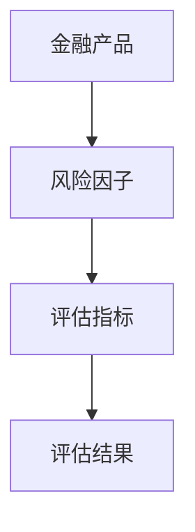
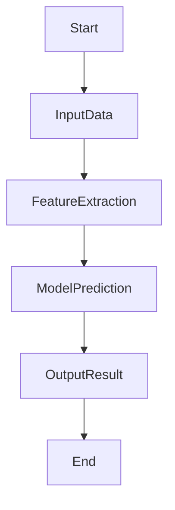

                 


# 开发智能化的金融产品生命周期风险动态评估平台

## 关键词：
金融产品，生命周期，风险评估，动态评估，人工智能，系统架构，风险模型

## 摘要：
本文详细探讨了开发智能化金融产品生命周期风险动态评估平台的关键技术与实现方案。首先介绍了平台的背景与核心概念，包括金融产品的生命周期管理、风险评估的重要性以及动态评估的需求。接着，深入分析了风险动态评估模型的原理，详细讲解了算法实现和系统架构设计。通过实际案例分析，展示了如何通过环境安装、代码实现和案例解读来构建和应用该平台。最后，总结了开发过程中的最佳实践、注意事项和未来扩展方向。

---

# 第一部分: 金融产品生命周期风险动态评估平台背景与核心概念

## 第1章: 金融产品生命周期风险动态评估平台概述

### 1.1 问题背景
#### 1.1.1 金融产品的生命周期管理
金融产品的生命周期包括发行、运行和终止三个阶段。每个阶段都需要对产品进行风险评估，以确保其安全性和合规性。

#### 1.1.2 风险评估的重要性
风险评估是金融产品管理的核心环节，直接关系到产品的市场表现和投资者利益。传统评估方法存在静态、滞后等问题，难以应对市场变化。

#### 1.1.3 动态评估的需求
随着市场的波动和产品复杂性的增加，静态评估已无法满足需求。动态评估能够实时捕捉市场变化，提供更精准的风险分析。

### 1.2 问题描述
#### 1.2.1 传统风险评估的局限性
传统方法依赖固定模型，缺乏灵活性和实时性，难以应对复杂多变的市场环境。

#### 1.2.2 动态风险评估的必要性
动态评估能够实时更新评估结果，及时发现潜在风险，帮助决策者采取措施。

#### 1.2.3 平台开发的目标与意义
开发智能化平台旨在提高风险评估的效率和准确性，降低金融风险，提升产品竞争力。

### 1.3 问题解决
#### 1.3.1 智能化评估的核心思想
利用人工智能技术，构建动态模型，实时分析数据，提供精准评估。

#### 1.3.2 数据驱动的风险分析
通过大数据分析，提取关键风险因子，构建评估模型，实现智能化分析。

#### 1.3.3 技术实现路径
采用机器学习算法，构建动态评估系统，实现自动化、实时化的风险监控。

### 1.4 边界与外延
#### 1.4.1 平台的功能边界
平台专注于风险评估，不涉及产品发行和终止的具体操作。

#### 1.4.2 与相关系统的接口关系
平台需要与数据源、交易系统等接口对接，获取实时数据。

#### 1.4.3 动态评估的适用范围
适用于各类金融产品，包括股票、债券、基金等。

### 1.5 核心概念结构与组成
#### 1.5.1 核心要素分析
核心要素包括金融产品、风险因子、评估指标和评估结果。

#### 1.5.2 概念之间的关系
金融产品与风险因子密切相关，评估指标是风险因子的量化表现，评估结果是最终输出。

#### 1.5.3 系统整体架构
系统由数据采集、模型构建、评估引擎和结果展示四部分组成。

---

## 第2章: 风险动态评估模型原理

### 2.1 风险评估模型的核心原理
#### 2.1.1 数据采集与预处理
通过API接口获取金融产品的实时数据，清洗和归一化处理。

#### 2.1.2 风险因子分析
提取市场、信用、流动性等多维度风险因子，构建特征向量。

#### 2.1.3 模型构建与训练
采用机器学习算法，训练风险评估模型，优化模型性能。

### 2.2 动态评估方法
#### 2.2.1 时间序列分析
利用ARIMA模型预测未来风险趋势，实现动态评估。

#### 2.2.2 实时数据处理
采用流数据处理技术，实时更新评估结果。

#### 2.2.3 在线评估机制
通过API接口，实时返回评估结果，支持高频交易。

### 2.3 实体关系图（ER图）



---

# 第三部分: 算法原理讲解

## 第3章: 风险动态评估算法

### 3.1 算法流程
#### 3.1.1 数据输入
通过API接口获取实时数据，清洗和预处理。

#### 3.1.2 特征提取
提取关键风险因子，构建特征向量。

#### 3.1.3 模型预测
利用训练好的模型，预测风险评分。

#### 3.1.4 结果输出
返回评估结果，支持决策。

### 3.2 算法实现



### 3.3 数学模型

#### 3.3.1 风险评分公式
$$ \text{风险评分} = \sum_{i=1}^{n} w_i x_i $$
其中，$w_i$ 是因子权重，$x_i$ 是因子值。

#### 3.3.2 ARIMA模型
$$ \text{ARIMA}(p, d, q) $$
用于时间序列预测，捕捉趋势和季节性变化。

#### 3.3.3 机器学习模型
采用随机森林或XGBoost算法，训练风险分类模型。

---

## 第4章: 系统分析与架构设计方案

### 4.1 问题场景介绍
平台需要支持多金融产品，实时处理大量数据，提供高并发访问。

### 4.2 系统功能设计
#### 4.2.1 数据采集模块
负责采集和预处理数据，确保数据准确性。

#### 4.2.2 模型构建模块
训练和优化风险评估模型，支持在线更新。

#### 4.2.3 评估引擎模块
实时处理数据，生成评估结果，支持API调用。

#### 4.2.4 结果展示模块
可视化评估结果，提供图表和报告，支持用户查询。

### 4.3 系统架构设计

```mermaid
graph TD
    User --> API Gateway
    API Gateway --> Data采集模块
    API Gateway --> 模型构建模块
    API Gateway --> 评估引擎模块
    评估引擎模块 --> 数据存储模块
    数据存储模块 --> 结果展示模块
```

### 4.4 接口与交互设计

```mermaid
graph TD
    User --> API Gateway
    API Gateway --> Data采集模块
    API Gateway --> 模型构建模块
    API Gateway --> 评估引擎模块
    评估引擎模块 --> 结果展示模块
```

---

## 第5章: 项目实战

### 5.1 环境安装
安装Python、Jupyter Notebook、scikit-learn、pandas、numpy、Mermaid等工具。

### 5.2 核心实现

```python
import pandas as pd
from sklearn.ensemble import RandomForestClassifier
from sklearn.metrics import accuracy_score

# 数据加载
data = pd.read_csv('金融产品数据.csv')

# 特征提取
X = data.drop('风险标签', axis=1)
y = data['风险标签']

# 模型训练
model = RandomForestClassifier()
model.fit(X, y)

# 预测评估
y_pred = model.predict(X)
print('准确率:', accuracy_score(y, y_pred))
```

### 5.3 案例分析
以某基金产品为例，展示如何通过平台进行风险评估，分析结果并优化模型。

---

## 第6章: 总结与扩展

### 6.1 最佳实践
定期更新模型，监控数据质量，优化算法性能。

### 6.2 小结
本文详细讲解了平台开发的关键技术，从理论到实践，帮助读者掌握开发过程。

### 6.3 注意事项
确保数据安全，遵守金融监管规定，定期维护系统。

### 6.4 拓展阅读
推荐相关书籍和论文，鼓励读者深入学习和研究。

---

# 作者：AI天才研究院/AI Genius Institute & 禅与计算机程序设计艺术 /Zen And The Art of Computer Programming

