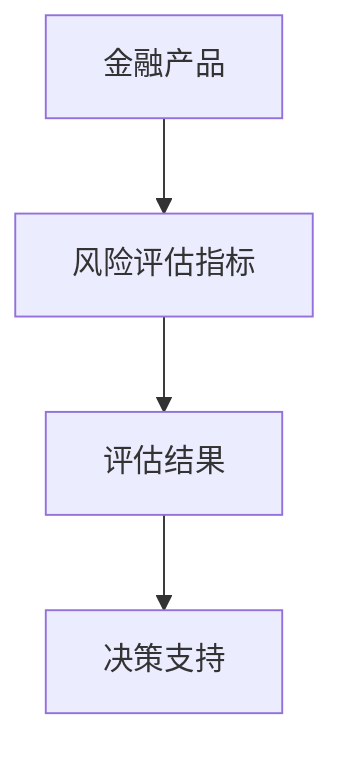
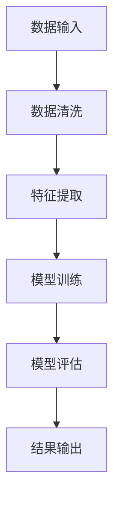
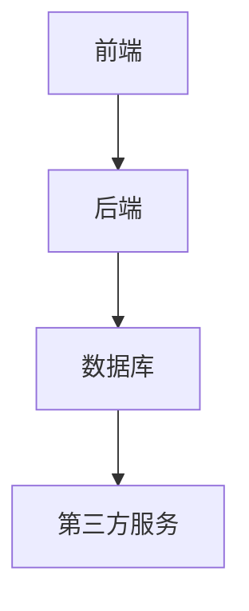

                 


# 开发智能化的金融产品生命周期风险评估平台

> 关键词：金融产品，风险评估，智能化，机器学习，系统架构，项目实战

> 摘要：本文详细介绍了开发智能化的金融产品生命周期风险评估平台的核心内容与实现方法。从背景介绍、核心概念与联系、算法原理与实现、系统分析与架构设计到项目实战，全面阐述了如何利用人工智能和大数据技术构建一个高效的金融风险评估系统。通过具体案例分析和代码实现，展示了平台的实际应用场景和价值。

---

## 第一部分：背景介绍

### 第1章：问题背景

#### 1.1 金融产品的生命周期概述
金融产品的生命周期包括发行、流通、终止三个主要阶段，每个阶段都需要进行风险评估。

#### 1.2 风险评估的重要性
- 风险评估是金融决策的核心环节。
- 传统方法依赖人工经验，效率低且准确性不足。

#### 1.3 智能化技术的应用趋势
- 人工智能和大数据技术的快速发展为金融风险评估提供了新的解决方案。

### 第2章：问题描述

#### 2.1 传统风险评估的局限性
- 数据量有限，难以捕捉市场变化。
- 人工经验依赖，主观性强。

#### 2.2 数据驱动的风险评估需求
- 利用大数据技术进行实时分析和预测。

#### 2.3 智能化平台的目标与意义
- 提高风险评估的效率和准确性。
- 实现金融产品的全生命周期管理。

---

## 第二部分：核心概念与联系

### 第3章：核心概念与联系

#### 3.1 核心概念原理
- 人工智能在风险评估中的应用：通过机器学习模型进行预测和分类。
- 大数据分析技术：利用大数据平台处理和分析海量金融数据。
- 机器学习模型：构建预测模型，识别潜在风险。

#### 3.2 实体关系图


---

## 第三部分：算法原理与实现

### 第4章：算法原理

#### 4.1 机器学习算法的选择
- 随机森林：适用于分类问题，能够处理高维数据。
- 神经网络：适用于复杂的非线性关系。

#### 4.2 算法流程图


#### 4.3 数学模型与公式
- 风险评估模型：$$P(\text{风险事件}) = \sum_{i=1}^{n} \beta_i X_i$$

---

## 第四部分：系统分析与架构设计

### 第5章：系统分析

#### 5.1 问题场景介绍
- 平台的目标用户：金融机构的风险管理部门。
- 使用场景：实时监控和预测金融产品的风险。

#### 5.2 系统功能设计
```mermaid
classDiagram
    class 数据访问层 {
        数据库连接
        数据查询
    }
    class 业务逻辑层 {
        风险评估逻辑
        数据处理
    }
    class 表现层 {
        用户界面
        数据可视化
    }
    数据访问层 <-->> 业务逻辑层
    业务逻辑层 <-->> 表现层
```

#### 5.3 系统架构设计


---

## 第五部分：项目实战

### 第6章：项目实战

#### 6.1 环境安装
- 安装Python、Jupyter Notebook、Scikit-learn等工具。

#### 6.2 核心代码实现
```python
import pandas as pd
from sklearn.ensemble import RandomForestClassifier
from sklearn.metrics import accuracy_score

# 数据加载
data = pd.read_csv('financial_products.csv')

# 特征工程
X = data.drop('risk', axis=1)
y = data['risk']

# 模型训练
model = RandomForestClassifier()
model.fit(X, y)

# 模型评估
predictions = model.predict(X)
print("准确率：", accuracy_score(y, predictions))
```

#### 6.3 案例分析
- 案例：银行理财产品风险评估。
- 实施步骤：数据收集、特征提取、模型训练、结果分析。

---

## 第六部分：总结与展望

### 第7章：总结与展望

#### 7.1 最佳实践
- 数据质量是关键，确保数据的完整性和准确性。
- 模型优化：定期更新模型，引入新的数据和特征。

#### 7.2 小结
智能化的金融产品生命周期风险评估平台通过结合人工智能和大数据技术，显著提高了风险评估的效率和准确性。

#### 7.3 注意事项
- 数据隐私保护：遵守相关法律法规，确保数据安全。
- 模型解释性：选择易于解释的模型，便于业务人员理解。

#### 7.4 拓展阅读
- 推荐阅读《机器学习实战》和《大数据分析与应用》。

---

作者：AI天才研究院/AI Genius Institute & 禅与计算机程序设计艺术 /Zen And The Art of Computer Programming

