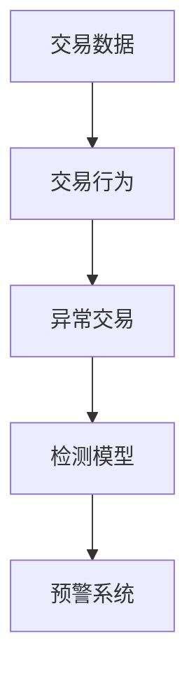
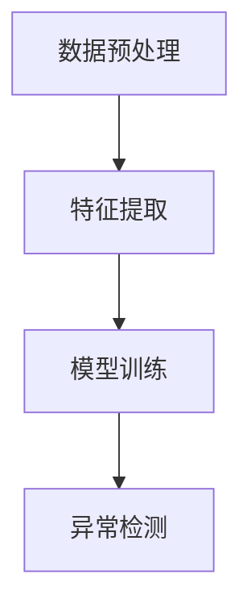
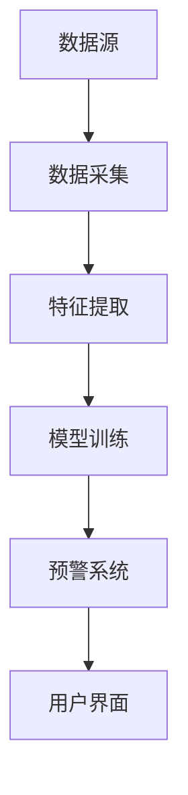
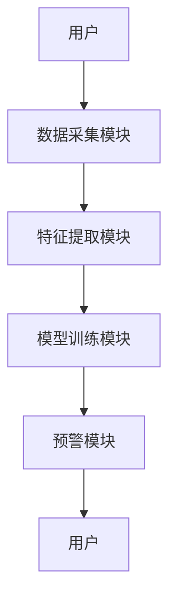

                 


# 开发智能化的金融市场异常交易检测模型

## 关键词：
金融市场、异常交易检测、人工智能、机器学习、深度学习、金融风险管理

## 摘要：
金融市场异常交易检测是维护市场公平、防范金融风险的重要手段。本文从背景、原理、算法、系统架构到实战应用，全面探讨如何利用智能化技术构建高效的异常交易检测模型，分析其核心概念、算法原理、系统设计及实践案例，为金融从业者提供理论与实践指导。

---

# 第1章: 异常交易检测的背景与意义

## 1.1 问题背景
### 1.1.1 金融市场异常交易的定义与特征
金融市场异常交易是指偏离正常市场行为的交易活动，常见类型包括市场操纵、 insider trading、洗钱等。其特征包括交易量突增、价格异常波动、交易时间异常等。

### 1.1.2 异常交易对金融市场的影响
异常交易破坏市场公平性，影响资产定价，引发系统性风险。例如，2010年“闪电崩盘”事件导致道琼斯指数瞬间下跌近千点。

### 1.1.3 异常交易检测的法律与监管要求
各国监管机构如SEC、FINRA等要求金融机构建立交易监控系统，及时发现并报告异常交易行为。

## 1.2 问题描述
### 1.2.1 异常交易检测的核心目标
通过分析交易数据，识别异常交易行为，及时预警和处理。

### 1.2.2 异常交易的类型与场景
包括高频交易异常、市场操纵、虚假交易等，常见于股票、期货、外汇等市场。

### 1.2.3 异常交易检测的挑战与难点
数据量大、实时性要求高、异常样本少、噪声干扰多等。

## 1.3 问题解决思路
### 1.3.1 数据驱动的异常检测方法
利用大数据分析技术，从海量交易数据中提取特征，识别异常模式。

### 1.3.2 智能化算法的应用价值
机器学习和深度学习算法能有效处理非线性关系，提升检测精度。

### 1.3.3 多模态数据的融合分析
结合市场数据、用户行为数据、新闻事件等多源信息，提高检测准确率。

## 1.4 边界与外延
### 1.4.1 异常交易与正常交易的区分
通过统计测试和阈值设定，明确正常与异常的边界。

### 1.4.2 异常交易检测的边界条件
包括时间窗口、交易量、价格波动幅度等参数设置。

### 1.4.3 相关领域的外延扩展
如反洗钱、 fraud detection等领域的检测方法与技术有相似性。

## 1.5 核心概念结构与要素
### 1.5.1 检测模型的核心要素
包括数据源、特征提取、模型训练、预警系统等。

### 1.5.2 数据流与模型交互关系
数据流：交易数据→特征提取→模型输入→异常判定→预警输出。

### 1.5.3 模型评估与优化机制
通过AUC、召回率、F1分数等指标评估模型性能，并采用交叉验证优化参数。

## 1.6 本章小结
本章介绍了异常交易检测的背景、意义、核心概念及技术挑战，为后续章节奠定了基础。

---

# 第2章: 异常交易检测的核心概念

## 2.1 异常交易检测的原理与方法
### 2.1.1 统计分析法
基于统计分布，如均值、标准差，识别偏离正常分布的交易行为。

### 2.1.2 机器学习法
使用监督学习（如SVM、随机森林）或无监督学习（如聚类分析）模型进行分类或聚类。

### 2.1.3 深度学习法
利用神经网络（如RNN、LSTM）捕捉时间序列中的复杂模式。

## 2.2 核心概念的属性特征对比
| 特征 | 统计方法 | 机器学习 | 深度学习 |
|------|-----------|-----------|-----------|
| 适用场景 | 小规模、低维度 | 中大规模、高维度 | 高维、时间序列数据 |
| 模型复杂度 | 低 | 中 | 高 |
| 训练数据需求 | 少 | 中 | 大 |

## 2.3 实体关系图架构


## 2.4 本章小结
本章通过对比分析不同方法的优缺点，帮助读者理解如何选择合适的检测技术。

---

# 第3章: 基于统计的异常检测算法

## 3.1 算法原理
### 3.1.1 马尔可夫链模型
$$ P(A|B) = \frac{P(B|A)P(A)}{P(B)} $$
通过状态转移概率识别异常交易行为。

### 3.1.2 高斯混合模型
$$ P(x) = \sum_{i=1}^k w_i \mathcal{N}(\mu_i, \sigma_i^2) $$
将交易数据聚类为多个高斯分布，识别异常点。

### 3.1.3 Isolation Forest算法
$$ score = \text{outlier score}(x) $$
通过构建隔离树快速识别异常样本。

## 3.2 算法流程图


## 3.3 实际案例分析
例如，分析某段时间内的股票交易数据，发现价格波动异常的交易行为，并标记为异常。

## 3.4 本章小结
本章详细讲解了基于统计的异常检测算法及其应用，为后续章节打下基础。

---

# 第4章: 机器学习算法在异常交易检测中的应用

## 4.1 算法原理
### 4.1.1 支持向量机(SVM)
$$ \text{max} \{ \frac{1}{2}\|w\|^2 \} \quad \text{subject to} \quad y_i(w\cdot x_i + b) \geq 1 $$
通过非线性映射识别交易行为。

### 4.1.2 随机森林
$$ \text{特征重要性} = \sum (\text{增益} \times \text{分裂次数}) $$
通过特征重要性分析识别异常交易特征。

### 4.1.3 神经网络
$$ y = \sigma(wx + b) $$
利用神经网络多层结构捕捉复杂交易模式。

## 4.2 算法流程图


## 4.3 本章小结
本章通过机器学习算法展示了如何提升异常交易检测的准确性和鲁棒性。

---

# 第5章: 深度学习在异常交易检测中的应用

## 5.1 算法原理
### 5.1.1 RNN
$$ a_t = \tanh(W_{hh}a_{t-1} + W_{xh}x_t + b_h) $$
用于分析时间序列数据。

### 5.1.2 LSTM
$$ f_t = \sigma(W_{ff}a_{t-1} + W_{xf}x_t + b_f) $$
通过长短期记忆解决RNN梯度消失问题。

### 5.1.3 Transformer
$$ \text{多头注意力机制} = \sum_{i=1}^n \text{head}_i $$
用于捕捉全局交易模式。

## 5.2 算法流程图


## 5.3 本章小结
深度学习在处理复杂交易数据中展现出强大的能力，为异常交易检测提供了新思路。

---

# 第6章: 系统分析与架构设计

## 6.1 问题场景介绍
### 6.1.1 交易数据流
交易数据包括时间戳、交易金额、用户ID等。

## 6.2 系统功能设计
### 6.2.1 数据采集模块
实现交易数据的实时采集与预处理。

### 6.2.2 特征提取模块
提取交易金额、时间间隔、用户行为等特征。

### 6.2.3 模型训练模块
基于训练数据集，训练异常检测模型。

### 6.2.4 预警模块
实时监控交易数据，触发异常预警。

## 6.3 系统架构设计


## 6.4 系统接口设计
### 6.4.1 数据接口
REST API接口，提供交易数据输入和输出。

### 6.4.2 预警接口
实时预警接口，支持多种通知方式。

## 6.5 系统交互序列图


## 6.6 本章小结
本章详细设计了异常交易检测系统的架构与接口，确保系统的高效运行。

---

# 第7章: 项目实战与案例分析

## 7.1 环境安装
### 7.1.1 安装Python环境
使用Anaconda安装Python 3.8及以上版本。

### 7.1.2 安装依赖库
安装numpy、pandas、scikit-learn、tensorflow等库。

## 7.2 核心实现代码
### 7.2.1 数据预处理
```python
import pandas as pd
data = pd.read_csv('transaction.csv')
data_preprocessed = data.dropna()
```

### 7.2.2 特征提取
```python
from sklearn.preprocessing import StandardScaler
scaler = StandardScaler()
features = scaler.fit_transform(data_preprocessed)
```

### 7.2.3 模型训练
```python
from sklearn.ensemble import IsolationForest
model = IsolationForest(random_state=42)
model.fit(features)
```

### 7.2.4 异常检测
```python
import numpy as np
scores = model.score_samples(features)
threshold = np.quantile(scores, 0.05)
anomalies = np.where(scores < threshold)
```

## 7.3 实际案例分析
以某银行的交易数据为例，通过模型识别出异常交易行为，并生成预警报告。

## 7.4 本章小结
本章通过实际项目展示了如何将理论应用于实践，帮助读者掌握异常交易检测的实现过程。

---

# 第8章: 最佳实践与小结

## 8.1 最佳实践
### 8.1.1 数据预处理
确保数据清洗和特征工程的质量。

### 8.1.2 模型选择
根据数据特征选择合适的算法，避免过度拟合。

### 8.1.3 实时性优化
采用流数据处理技术，确保实时检测能力。

## 8.2 注意事项
### 8.2.1 数据隐私保护
遵守数据隐私法规，保护用户隐私。

### 8.2.2 模型解释性
选择可解释性高的模型，便于分析和优化。

## 8.3 拓展阅读
推荐相关书籍和论文，深入学习异常检测技术。

## 8.4 本章小结
总结全文内容，强调异常交易检测的重要性，并展望未来发展方向。

---

# 作者：AI天才研究院 & 禅与计算机程序设计艺术

---

以上是《开发智能化的金融市场异常交易检测模型》的技术博客文章目录大纲，按照逻辑清晰、结构紧凑、简单易懂的原则，详细阐述了从背景到实战的全过程。后续可以根据实际需求进一步扩展内容，添加具体的代码实现、案例分析和详细的技术细节。

