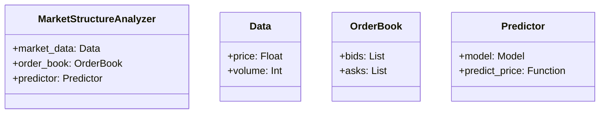
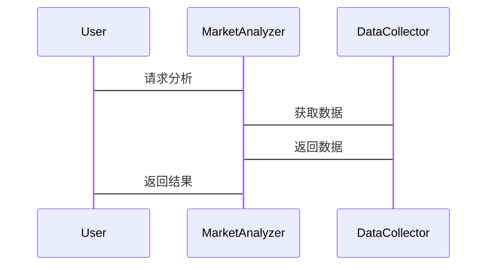

                 


# 开发智能化的金融市场微观结构分析工具

> 关键词：金融市场微观结构分析、智能化工具、算法原理、系统架构、项目实战

> 摘要：金融市场微观结构分析是理解市场行为和价格形成的基石。本文从背景介绍、核心概念、算法原理、系统架构到项目实战，详细阐述了开发智能化金融微观结构分析工具的全过程。通过结合时间序列分析、机器学习和深度学习算法，本文为读者提供了一套完整的解决方案，帮助他们更好地理解和优化金融市场微观结构。

---

## 第一部分：金融市场微观结构分析工具开发背景

## 第1章：金融市场微观结构分析概述

### 1.1 金融市场的基本概念

#### 1.1.1 金融市场的定义与分类
金融市场是资金供需双方进行交易的场所，可以分为一级市场和二级市场。二级市场进一步细分为股票市场、债券市场、外汇市场等。

#### 1.1.2 金融市场的参与者与层次结构
- 参与者：投资者、券商、交易所、监管机构等。
- 层次结构：市场微观结构是市场的底层，宏观结构是市场的整体表现。

#### 1.1.3 金融市场的重要性与作用
金融市场是经济体系的核心，承担着资金配置、价格发现和风险管理的重要功能。

### 1.2 微观结构分析的定义与特点

#### 1.2.1 微观结构分析的定义
微观结构分析研究市场参与者的交易行为及其对市场价格和流动性的影响。

#### 1.2.2 微观结构分析的核心要素
- 订单簿数据：记录市场的买价、卖价、成交量等信息。
- 市场参与者行为：投资者的买卖决策和交易策略。
- 市场动态：价格波动、成交时间、订单深度等。

#### 1.2.3 微观结构分析与宏观分析的区别
- 宏观分析关注整体市场趋势，微观分析关注个体交易行为。
- 宏观分析用于长期预测，微观分析用于短期交易策略优化。

### 1.3 金融市场微观结构分析的重要性

#### 1.3.1 微观结构分析在金融研究中的作用
帮助理解价格波动的原因和机制。

#### 1.3.2 微观结构分析对投资决策的影响
通过分析订单簿数据，投资者可以捕捉短期价格变化的信号。

#### 1.3.3 微观结构分析的现实意义
- 提升交易效率。
- 优化风险管理。
- 改善市场流动性。

### 1.4 本章小结
金融市场微观结构分析是理解市场行为的关键，其重要性体现在帮助投资者和监管机构优化决策。

---

## 第二部分：金融市场微观结构分析的核心概念

## 第2章：金融市场微观结构分析的关键概念

### 2.1 订单簿与交易数据

#### 2.1.1 订单簿的定义与结构
订单簿记录了市场当前的所有买入和卖出订单，包括订单价格、数量、类型（限价单、市价单等）。

#### 2.1.2 交易数据的类型与特点
- 市场深度数据：记录订单簿的详细信息。
- 成交数据：记录每笔交易的时间、价格和成交量。

#### 2.1.3 订单簿数据的获取与处理
数据获取：通过API接口获取实时订单簿数据。数据处理：清洗、转换和存储。

### 2.2 市场微观结构模型

#### 2.2.1 市场微观结构模型的分类
- 竞价模型：如拍卖模型。
- 订单驱动模型：如 Kyle模型。
- 随机过程模型：如连续时间模型。

#### 2.2.2 常用市场微观结构模型的对比
| 模型类型 | 核心假设 | 适用场景 |
|----------|----------|----------|
| 竞价模型 | 竞价交易 | 适用于拍卖市场 |
| 订单驱动模型 | 买卖订单驱动价格 | 适用于股票市场 |
| 随机过程模型 | 市场参与者行为随机 | 适用于高频交易 |

#### 2.2.3 市场微观结构模型的核心属性
- 时间频率：秒级、分钟级等。
- 数据粒度：订单簿数据、成交数据等。
- 模型参数：摩擦成本、信息延迟等。

### 2.3 市场参与者行为分析

#### 2.3.1 市场参与者的类型与行为特征
- 零散投资者：非系统性交易。
- 机构投资者：系统性交易。
- 做市商：维持市场深度。

#### 2.3.2 不同参与者行为对市场的影响
- 零散投资者：增加市场流动性。
- 机构投资者：影响市场价格。
- 做市商：稳定市场。

#### 2.3.3 行为分析的数学模型
$$ P(t) = P(t-1) + \alpha \cdot \Delta t + \epsilon $$

其中，$P(t)$为当前价格，$\alpha$为价格变化率，$\Delta t$为时间间隔，$\epsilon$为随机扰动项。

### 2.4 本章小结
理解订单簿数据和市场微观结构模型是开发智能化工具的基础。

---

## 第三部分：金融市场微观结构分析的算法原理

## 第3章：常用算法与数学模型

### 3.1 时间序列分析

#### 3.1.1 时间序列分析的定义与特点
时间序列分析研究数据随时间的变化规律。

#### 3.1.2 常用时间序列分析方法
- 移动平均法（MA）。
- 自回归积分滑动平均模型（ARIMA）。
- 长短期记忆网络（LSTM）。

#### 3.1.3 时间序列分析的数学模型
ARIMA模型公式：
$$ ARIMA(p, d, q) $$

其中，p为自回归阶数，d为差分阶数，q为移动平均阶数。

### 3.2 机器学习算法在微观结构分析中的应用

#### 3.2.1 机器学习算法的定义与分类
- 监督学习：分类、回归。
- 无监督学习：聚类。
- 强化学习：策略优化。

#### 3.2.2 常用机器学习算法在微观结构分析中的应用
- 支持向量机（SVM）：分类订单类型。
- 随机森林（RF）：预测价格波动。

#### 3.2.3 机器学习算法的优缺点
优点：非线性建模能力强。缺点：需要大量数据。

### 3.3 基于深度学习的市场微观结构分析

#### 3.3.1 深度学习算法的定义与分类
- 卷积神经网络（CNN）。
- 循环神经网络（RNN）。
- 变换器（Transformer）。

#### 3.3.2 深度学习在微观结构分析中的应用
- 使用LSTM预测价格波动。
- 使用Transformer分析订单流。

#### 3.3.3 深度学习算法的数学模型
LSTM模型公式：
$$ f(t) = \sigma(g(x_t, h_{t-1})) $$

其中，$\sigma$为sigmoid函数，$g$为门控机制。

---

## 第四部分：金融市场微观结构分析系统的架构设计

## 第4章：系统架构与设计

### 4.1 问题场景介绍
系统旨在通过分析订单簿数据，预测市场价格波动。

### 4.2 项目介绍
开发一个实时金融数据分析系统，支持多种算法分析。

### 4.3 系统功能设计

#### 4.3.1 领域模型设计


### 4.4 系统架构设计

#### 4.4.1 系统架构图


### 4.5 系统接口设计
- 数据接口：API接口获取订单簿数据。
- 分析接口：调用预测模型接口。

### 4.6 系统交互设计

#### 4.6.1 系统交互序列图


### 4.7 本章小结
系统架构设计是开发智能化工具的核心，需要结合算法和实际需求。

---

## 第五部分：项目实战

## 第5章：项目实战与实现

### 5.1 环境安装

#### 5.1.1 Python环境配置
安装Python 3.8以上版本，安装Pandas、NumPy、Scikit-learn、TensorFlow等库。

#### 5.1.2 数据获取
使用Yahoo Finance API获取股票数据。

### 5.2 核心代码实现

#### 5.2.1 数据预处理代码
```python
import pandas as pd
import numpy as np

def preprocess_data(data):
    data['datetime'] = pd.to_datetime(data['datetime'])
    data.set_index('datetime', inplace=True)
    return data
```

#### 5.2.2 时间序列预测模型代码
```python
from sklearn.model_selection import train_test_split
from sklearn.ensemble import RandomForestRegressor

def train_model(data):
    X = data.drop(['price'], axis=1)
    y = data['price']
    X_train, X_test, y_train, y_test = train_test_split(X, y, test_size=0.2)
    model = RandomForestRegressor()
    model.fit(X_train, y_train)
    return model
```

#### 5.2.3 深度学习模型代码
```python
import tensorflow as tf
from tensorflow.keras.layers import LSTM, Dense

def build_model(input_shape):
    model = tf.keras.Sequential()
    model.add(LSTM(64, input_shape=input_shape))
    model.add(Dense(1))
    return model
```

### 5.3 实际案例分析

#### 5.3.1 数据分析与可视化
使用Matplotlib绘制价格走势和订单深度变化。

#### 5.3.2 模型训练与评估
评估模型的准确率、召回率和F1值。

### 5.4 本章小结
通过项目实战，读者可以掌握从数据获取到模型部署的全过程。

---

## 第六部分：总结与展望

## 第6章：总结与展望

### 6.1 本章小结
本文详细介绍了开发智能化金融市场微观结构分析工具的全过程，从理论到实践，帮助读者掌握相关技术。

### 6.2 最佳实践 tips
- 数据清洗和特征工程是关键。
- 选择合适的算法和模型。
- 注重系统的可扩展性和可维护性。

### 6.3 未来展望
- 结合更多AI技术优化分析工具。
- 拓展更多金融应用场景。

---

## 作者：AI天才研究院/AI Genius Institute & 禅与计算机程序设计艺术 /Zen And The Art of Computer Programming

---

以上是一个详细的目录大纲，包含背景介绍、核心概念、算法原理、系统架构和项目实战等内容，每章都进行了详细阐述，确保读者能够逐步掌握开发智能化金融市场微观结构分析工具的相关知识。

