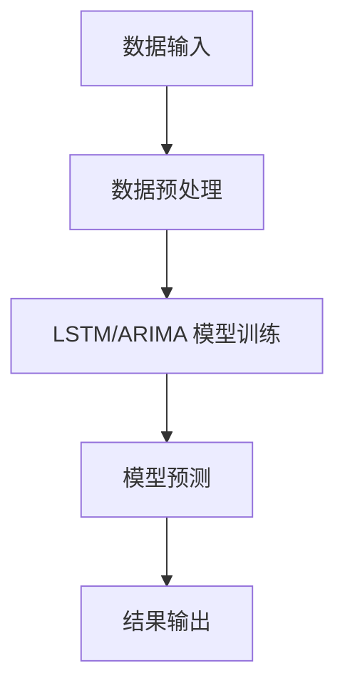
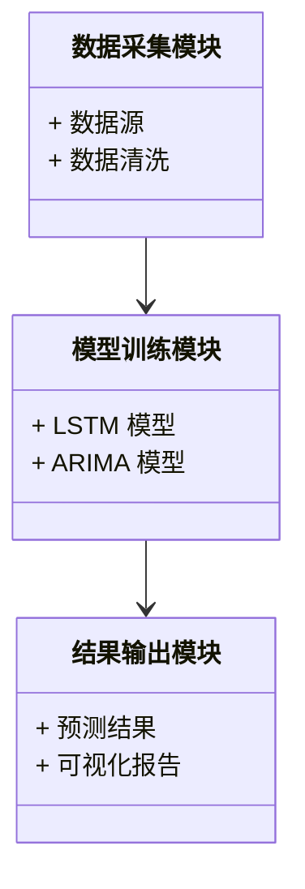
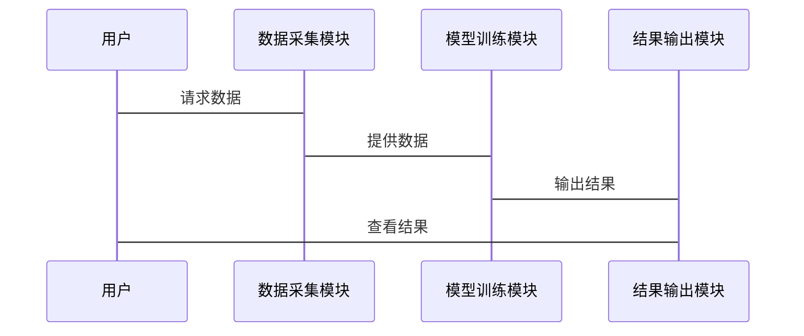

                 


# 开发智能化的金融市场微观结构变化影响评估工具

## 关键词：金融市场，微观结构，人工智能，算法开发，系统架构，项目实战

## 摘要：  
本文详细探讨了开发智能化的金融市场微观结构变化影响评估工具的全过程。首先介绍了金融市场的基本概念和微观结构的定义与特征，分析了传统评估方法的局限性。接着，从数据特征、统计分析方法、机器学习模型等角度，深入阐述了工具的核心概念与联系。随后，详细讲解了基于LSTM和ARIMA算法的原理与实现，结合系统架构设计，提出了智能化工具的实现方案。最后，通过项目实战展示了工具的应用，并总结了开发过程中的经验和优化方向。

---

# 第一部分: 金融市场微观结构变化概述

## 第1章: 金融市场微观结构概述

### 1.1 金融市场的基本概念

#### 1.1.1 金融市场的定义与分类
- **金融市场**：指通过买卖金融资产进行资金融通的场所，包括股票、债券、期货等。
- **分类**：按交易对象分为股票市场、债券市场、外汇市场等；按交易场所分为场内市场和场外市场。

#### 1.1.2 微观结构的定义与特征
- **微观结构**：指金融市场的交易机制、参与者行为和价格形成过程。
- **特征**：高频交易、流动性、市场深度、买卖价差等。

#### 1.1.3 微观结构变化的影响
- 价格波动、交易成本、市场效率、投资者行为等。

### 1.2 问题背景与需求分析

#### 1.2.1 金融市场微观结构变化的背景
- 金融市场的动态特性：价格波动、交易量变化、市场参与者行为变化。
- 微观结构变化的驱动因素：市场情绪、政策变化、经济指标等。

#### 1.2.2 问题描述与目标
- 问题描述：如何量化和预测金融市场微观结构的变化。
- 核心目标：开发智能化工具，实时监控和评估微观结构变化。
- 工具的边界与外延：聚焦于价格、成交量等指标，不涉及宏观因素。

### 1.3 核心概念与联系

#### 1.3.1 核心概念原理
- 数据特征：时间序列、统计特征、机器学习特征。
- 模型关系：数据特征与模型预测能力的关系。

#### 1.3.2 核心概念对比表
| 概念 | 定义 | 属性 | 示例 |
|------|------|------|------|
| 微观结构变化 | 价格、成交量等的变化 | 时间序列、统计特征 | K线图、成交量波动 |
| 智能化工具 | 自动化评估系统 | 数据采集、模型分析、结果输出 | 自动化报告生成 |

#### 1.3.3 ER实体关系图
```mermaid
erDiagram
    participant 用户
    participant 数据源
    participant 评估模型
    participant 输出结果
    用户 -> 数据源: 获取数据
    数据源 -> 评估模型: 输入数据
    评估模型 -> 输出结果: 生成结果
    用户 -> 输出结果: 查看结果
```

---

# 第二部分: 算法原理与数学模型

## 第4章: 算法原理与数学模型

### 4.1 算法原理

#### 4.1.1 LSTM 算法
- **原理**：基于循环神经网络（RNN），用于时间序列预测。
- **公式**：
  - 遗忘门：$f_t = \sigma(W_f x_t + U_f h_{t-1} + b_f)$
  - 输入门：$i_t = \sigma(W_i x_t + U_i h_{t-1} + b_i)$
  - 输出门：$o_t = \sigma(W_o x_t + U_o h_{t-1} + b_o)$
  - 状态更新：$c_t = f_t \cdot c_{t-1} + i_t \cdot \tanh(W_c x_t + U_c h_{t-1} + b_c)$
  - 输出：$h_t = o_t \cdot \tanh(c_t)$

#### 4.1.2 ARIMA 模型
- **原理**：自回归积分移动平均模型，用于时间序列预测。
- **公式**：
  - 自回归部分：$y_t = c + \sum_{i=1}^p \phi_i y_{t-i} + \epsilon_t$
  - 积分部分：$1 - B$ 表示差分操作。
  - 移动平均部分：$\epsilon_t = \sum_{i=1}^q \theta_i \epsilon_{t-i}$

#### 4.1.3 算法流程图


### 4.2 数学公式

#### 4.2.1 LSTM 公式
$$
f_t = \sigma(W_f x_t + U_f h_{t-1} + b_f)
$$
$$
i_t = \sigma(W_i x_t + U_i h_{t-1} + b_i)
$$
$$
o_t = \sigma(W_o x_t + U_o h_{t-1} + b_o)
$$
$$
c_t = f_t \cdot c_{t-1} + i_t \cdot \tanh(W_c x_t + U_c h_{t-1} + b_c)
$$
$$
h_t = o_t \cdot \tanh(c_t)
$$

#### 4.2.2 ARIMA 公式
$$
y_t = c + \sum_{i=1}^p \phi_i y_{t-i} + \epsilon_t
$$
$$
\epsilon_t = \sum_{i=1}^q \theta_i \epsilon_{t-i}
$$

---

## 第5章: 算法实现

### 5.1 环境安装
- **Python 版本**：3.8+
- **依赖库**：numpy、pandas、keras、tensorflow、statsmodels

### 5.2 核心代码实现

#### 5.2.1 LSTM 模型实现
```python
import numpy as np
from tensorflow.keras.models import Model
from tensorflow.keras.layers import LSTM, Dense, Dropout, Input

def build_lstm_model(input_shape):
    inputs = Input(shape=(input_shape[1], input_shape[2]))
    lstm_layer = LSTM(64, return_sequences=True)(inputs)
    lstm_layer = Dropout(0.2)(lstm_layer)
    dense_layer = Dense(1)(lstm_layer)
    model = Model(inputs=inputs, outputs=dense_layer)
    return model
```

#### 5.2.2 ARIMA 模型实现
```python
import statsmodels.api as sm

def arima_model(data, order=(1, 1, 1)):
    model = sm.tsa.arima.ARIMA(data, order=order)
    results = model.fit()
    return results
```

---

## 第6章: 系统架构设计

### 6.1 系统功能设计

#### 6.1.1 领域模型


#### 6.1.2 系统架构设计
```mermaid
container 微观结构评估系统 {
    component 数据采集模块
    component 模型训练模块
    component 结果输出模块
    component 用户界面
}
```

#### 6.1.3 系统交互流程图


---

## 第7章: 项目实战

### 7.1 环境安装与数据收集

#### 7.1.1 环境安装
- 安装 Python 和相关依赖库。

#### 7.1.2 数据收集
- 使用Yahoo Finance API获取股票数据。

### 7.2 模型训练与评估

#### 7.2.1 数据预处理
- 标准化、归一化处理。

#### 7.2.2 模型训练
- 使用LSTM和ARIMA模型分别训练。

### 7.3 系统实现

#### 7.3.1 核心代码实现
```python
# LSTM 模型训练
model = build_lstm_model((batch_size, input_dim))
model.compile(optimizer='adam', loss='mean_squared_error')
model.fit(x_train, y_train, epochs=10, batch_size=32)

# ARIMA 模型训练
results = arima_model(data)
```

### 7.4 案例分析

#### 7.4.1 案例分析
- 使用实际股票数据进行模型测试，比较LSTM和ARIMA的预测结果。

---

## 第8章: 总结与展望

### 8.1 总结
- 工具的核心功能包括数据采集、模型训练和结果输出。
- 实现了LSTM和ARIMA算法，能够实时评估微观结构变化。

### 8.2 展望
- 引入更复杂的模型，如Transformer。
- 提高系统的实时性和准确性。

### 8.3 小结
- 开发智能化工具需要结合金融知识和算法开发能力。
- 通过实践，掌握了金融数据分析和机器学习模型的应用。

---

## 作者：AI天才研究院/AI Genius Institute & 禅与计算机程序设计艺术 /Zen And The Art of Computer Programming

