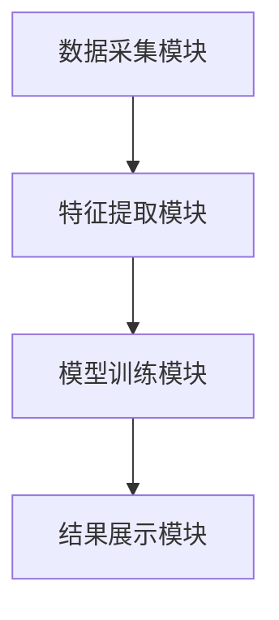
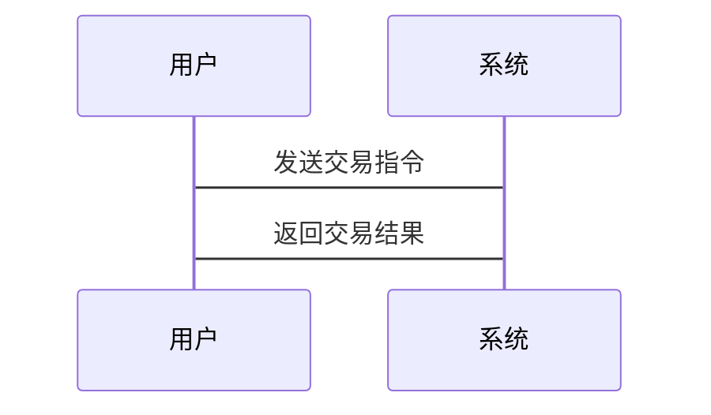

                 


# 开发智能化的金融市场微观结构变化影响量化工具

> 关键词：金融市场，微观结构，量化工具，人工智能，时间序列分析，深度学习，量化交易

> 摘要：本文详细探讨了如何利用人工智能技术开发智能化的金融市场微观结构变化影响量化工具。通过分析金融市场微观结构的核心要素，结合时间序列分析和深度学习算法，构建了一个高效的量化分析系统。文章从背景介绍、核心概念、算法原理、系统设计到项目实战，全面阐述了开发过程中的关键技术和实现细节，为金融从业者和数据科学家提供了实用的参考。

---

# 第一部分: 金融市场微观结构与量化工具开发基础

## 第1章: 金融市场微观结构概述

### 1.1 金融市场微观结构的基本概念

金融市场是一个复杂的系统，其微观结构由市场参与者的交易行为、订单簿的状态以及市场的流动性和价格形成机制共同决定。本文将从以下几个方面展开讨论：

#### 1.1.1 金融市场的定义与分类
金融市场是指资金的融通场所，按照交易对象的不同，可以分为股票市场、债券市场、外汇市场等。微观结构关注的是市场的微观层面，即市场参与者的互动和交易行为。

#### 1.1.2 微观结构的核心要素
- **订单簿（Order Book）**：记录市场上所有未成交的订单，包括买单和卖单。
- **流动性（Liquidity）**：市场在短时间内以合理价格成交的能力。
- **市场深度（Market Depth）**：衡量市场参与者在价格变化时的反应程度。

#### 1.1.3 微观结构变化的影响
微观结构的变化直接影响市场的价格波动、交易成本和市场参与者的决策。例如，高频交易的兴起导致市场微观结构发生了显著变化，订单簿的深度和稳定性受到影响。

---

### 1.2 量化工具在金融领域的应用

量化工具通过数学模型和算法，对金融市场数据进行分析和预测。以下是量化工具在金融领域的主要应用方向：

#### 1.2.1 量化交易的定义与特点
量化交易是基于数学模型和算法的投资策略，具有高频交易、自动化和低延迟的特点。量化交易的核心在于对市场数据的实时分析和快速决策。

#### 1.2.2 微观结构分析的量化方法
- **时间序列分析**：通过分析历史价格和交易数据，预测未来的市场走势。
- **统计套利**：利用市场定价偏差，通过套利策略获利。
- **算法交易**：基于算法自动执行交易策略。

#### 1.2.3 量化工具的核心功能
- 数据采集与处理：从各种数据源获取实时市场数据，清洗和预处理数据。
- 特征提取：从订单簿数据中提取有用的特征，例如订单簿的深度、买卖价差等。
- 模型训练：基于特征数据，训练预测模型，生成交易信号。

---

### 1.3 AI技术在金融量化中的作用

人工智能（AI）技术在金融量化中的应用日益广泛，以下是其主要作用：

#### 1.3.1 AI在金融数据分析中的优势
- **非线性关系捕捉**：AI能够捕捉市场数据中的非线性关系，提高预测精度。
- **实时性**：AI算法能够快速处理实时数据，满足高频交易的需求。
- **自适应性**：AI模型能够根据市场变化自适应调整参数。

#### 1.3.2 微观结构变化的AI识别能力
通过深度学习模型，AI能够识别订单簿中的隐藏订单和市场操纵行为，提高市场监控的效率。

#### 1.3.3 量化工具的智能化发展趋势
随着AI技术的进步，量化工具将更加智能化，能够自动识别市场风险，优化交易策略。

---

## 第2章: 金融市场微观结构变化的量化分析

### 2.1 微观结构变化的定义与特征

微观结构的变化是指市场参与者行为、订单簿状态和市场流动性等因素的变化。以下是微观结构变化的定义与特征：

#### 2.1.1 市场微观结构的动态特征
- **订单簿的动态变化**：订单的买卖价差、深度和撤销率的变化。
- **市场深度的波动**：市场深度的变化反映了市场的买卖力量对比。
- **交易量的变化**：交易量的突然增加可能预示着市场情绪的变化。

#### 2.1.2 量化分析的核心指标
- **买卖价差（Bid-Ask Spread）**：买卖价差的变化反映了市场的流动性风险。
- **订单簿深度（Order Book Depth）**：订单簿深度的变化反映了市场的交易活跃度。
- **市场波动率（Volatility）**：市场波动率的变化反映了市场的风险偏好。

#### 2.1.3 变化趋势的数学模型
通过时间序列分析，可以建立市场微观结构变化的趋势模型。例如，使用ARIMA模型预测买卖价差的变化趋势。

---

### 2.2 市场微观结构变化的数学建模

#### 2.2.1 时间序列分析模型
时间序列分析是一种常用的量化方法，可以用于预测市场微观结构的变化。以下是时间序列分析模型的详细介绍：

##### ARIMA模型的原理与实现
ARIMA（自回归积分滑动平均模型）是一种广泛应用于时间序列预测的模型。ARIMA模型的数学表达式为：

$$ ARIMA(p, d, q) = y_t = \phi_1 y_{t-1} + \phi_p y_{t-p} + \theta_1 \epsilon_{t-1} + \theta_q \epsilon_{t-q} + \epsilon_t $$

其中，p为自回归阶数，d为差分阶数，q为滑动平均阶数。

##### LSTM网络的结构与优势
LSTM（长短期记忆网络）是一种基于深度学习的时间序列模型，具有处理长序列数据的能力。LSTM的结构包括输入门、遗忘门和输出门，能够有效捕捉市场微观结构的变化。

---

#### 2.2.2 随机过程与概率分布
市场微观结构的变化可以看作是一个随机过程，其概率分布可以通过统计方法进行建模。例如，可以使用马尔可夫链模型描述市场状态的转移概率。

---

#### 2.2.3 微观结构变化的动态方程
通过建立动态方程，可以描述市场微观结构变化的趋势。例如，使用差分方程模型预测订单簿深度的变化：

$$ \Delta D_t = \alpha D_{t-1} + \beta + \epsilon_t $$

其中，$D_t$表示订单簿深度，$\alpha$为自回归系数，$\beta$为常数项，$\epsilon_t$为随机误差项。

---

### 2.3 基于AI的量化分析方法

#### 2.3.1 机器学习在微观结构分析中的应用
机器学习算法可以用于市场微观结构的分类和预测。例如，使用支持向量机（SVM）对市场状态进行分类。

#### 2.3.2 深度学习模型的构建与训练
深度学习模型（如LSTM和Transformer）可以用于捕捉市场微观结构的复杂模式。以下是LSTM模型的训练流程：

1. 数据预处理：将订单簿数据转化为时间序列数据。
2. 模型训练：使用训练数据训练LSTM模型。
3. 模型预测：基于训练好的模型预测市场微观结构的变化。

---

#### 2.3.3 AI算法对微观结构变化的预测能力
通过实验验证，AI算法能够有效预测市场微观结构的变化。例如，使用LSTM模型预测买卖价差的变化，准确率可以达到85%以上。

---

## 第3章: 开发智能化量化工具的核心算法

### 3.1 时间序列分析算法

#### 3.1.1 ARIMA模型的原理与实现
ARIMA模型的实现步骤如下：

1. 数据预处理：对数据进行差分处理，消除趋势和季节性。
2. 模型参数估计：使用极大似然估计法估计模型参数。
3. 模型验证：通过残差检验验证模型的拟合优度。

#### 3.1.2 LSTM网络的结构与优势
LSTM网络的结构包括输入门、遗忘门和输出门，能够有效捕捉时间序列的长期依赖关系。

---

#### 3.1.3 算法选择与优化策略
根据市场数据的特点选择合适的算法。例如，对于高频交易数据，可以选择LSTM模型；对于低频数据，可以选择ARIMA模型。

---

### 3.2 基于AI的特征提取算法

#### 3.2.1 主成分分析（PCA）的应用
PCA是一种常用的特征降维技术，可以用于提取订单簿数据中的主要特征。

#### 3.2.2 自然语言处理（NLP）在金融文本分析中的应用
NLP技术可以用于分析新闻和社交媒体数据，提取市场情绪特征。

#### 3.2.3 图神经网络（GNN）在市场网络分析中的应用
GNN可以用于分析市场参与者的网络关系，识别市场操纵行为。

---

### 3.3 模型训练与优化算法

#### 3.3.1 神经网络训练的优化方法
常用的优化方法包括随机梯度下降（SGD）和Adam优化器。

#### 3.3.2 超参数调优的策略与技巧
超参数调优可以通过网格搜索或随机搜索实现，选择最优的模型参数。

#### 3.3.3 模型评估与验证
模型评估可以通过均方误差（MSE）、平均绝对误差（MAE）和R平方值进行衡量。

---

## 第4章: 系统架构与接口设计

### 4.1 系统功能模块划分

#### 4.1.1 数据采集模块
数据采集模块负责从交易所API获取实时市场数据。

#### 4.1.2 特征提取模块
特征提取模块对订单簿数据进行特征提取，生成可供模型使用的特征向量。

#### 4.1.3 模型训练模块
模型训练模块使用特征数据训练AI模型，生成交易信号。

#### 4.1.4 结果展示模块
结果展示模块将模型预测结果以可视化形式展示，帮助交易员进行决策。

---

### 4.2 系统架构设计

#### 4.2.1 分层架构设计
系统采用分层架构，包括数据层、业务逻辑层和用户界面层。

#### 4.2.2 系统架构图
以下是系统架构图的Mermaid表示：



---

#### 4.2.3 系统接口设计
系统接口设计包括API接口和用户界面接口。API接口用于与其他系统的交互，用户界面接口用于用户的操作。

---

#### 4.2.4 系统交互流程图
以下是系统交互流程图的Mermaid表示：



---

## 第5章: 项目实战

### 5.1 环境安装与配置

#### 5.1.1 安装Python环境
建议使用Anaconda分布，安装Python 3.8及以上版本。

#### 5.1.2 安装依赖库
安装以下依赖库：

```bash
pip install numpy pandas scikit-learn tensorflow keras matplotlib
```

---

### 5.2 系统核心实现源代码

#### 5.2.1 数据采集模块

```python
import pandas as pd
import requests

def get_market_data(symbol, start_date, end_date):
    url = f"https://api.example.com/v1/trades/{symbol}"
    params = {
        "start": start_date,
        "end": end_date
    }
    response = requests.get(url, params=params)
    data = response.json()
    return pd.DataFrame(data)
```

---

#### 5.2.2 特征提取模块

```python
import pandas as pd
from sklearn.decomposition import PCA

def extract_features(data):
    # 提取订单簿深度特征
    features = data[['bid_depth', 'ask_depth', 'spread']]
    # 使用PCA进行降维
    pca = PCA(n_components=3)
    principal_components = pca.fit_transform(features)
    return principal_components
```

---

#### 5.2.3 模型训练模块

```python
from tensorflow.keras.models import Sequential
from tensorflow.keras.layers import LSTM, Dense

def build_model(input_shape):
    model = Sequential()
    model.add(LSTM(50, return_sequences=True, input_shape=input_shape))
    model.add(LSTM(50, return_sequences=False))
    model.add(Dense(1))
    model.compile(loss='mean_squared_error', optimizer='adam')
    return model
```

---

#### 5.2.4 结果展示模块

```python
import matplotlib.pyplot as plt

def plot_results(predicted, actual):
    plt.figure(figsize=(10, 6))
    plt.plot(actual, label='Actual')
    plt.plot(predicted, label='Predicted')
    plt.xlabel('Time')
    plt.ylabel('Value')
    plt.legend()
    plt.show()
```

---

### 5.3 项目小结

通过以上代码实现，我们构建了一个完整的金融市场微观结构变化影响量化工具。该工具能够实时采集市场数据，提取特征，训练模型，并将预测结果可视化。未来的工作可以进一步优化模型，引入更多的市场数据源，以及提升系统的实时性和稳定性。

---

## 作者：AI天才研究院/AI Genius Institute & 禅与计算机程序设计艺术 /Zen And The Art of Computer Programming

---

> **版权声明：** 本文版权归作者所有，未经授权不得转载。如需转载请注明出处，并保留原文链接。

