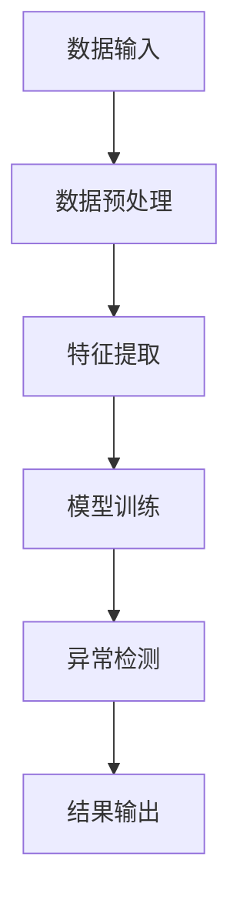
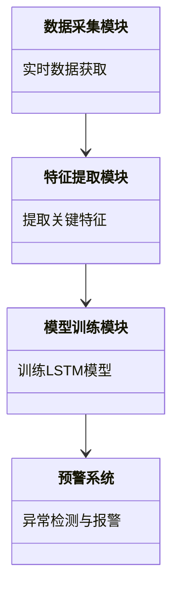

                 


# 开发智能化的金融市场微观结构变化检测工具

> 关键词：金融市场，微观结构，AI，时间序列分析，异常检测，深度学习

> 摘要：本文深入探讨了如何利用人工智能技术开发金融市场微观结构变化检测工具。通过分析金融市场的核心要素，结合时间序列分析和深度学习算法，构建了一个智能化的检测系统，并详细介绍了系统架构设计和实际案例分析。

---

## 第一部分: 金融市场微观结构变化检测工具的背景与核心概念

### 第1章: 问题背景与目标

#### 1.1 问题背景
金融市场是现代经济的核心，其微观结构变化直接影响市场的稳定性和效率。传统的金融市场分析依赖于人工经验，难以捕捉复杂多变的市场动态。近年来，人工智能技术的发展为金融市场分析提供了新的工具和方法。

#### 1.2 问题描述
金融市场微观结构变化指的是市场参与者行为、交易量、价格波动等微观层面的变化，这些变化可能预示着市场的潜在风险或机会。传统的检测方法依赖于统计分析和经验判断，存在效率低、误判率高的问题。

#### 1.3 解决方案与目标
本工具旨在通过AI技术，实时检测金融市场微观结构的变化，帮助交易员和投资者做出更明智的决策。工具的核心目标包括：
- **实时监测**：实时捕捉市场微观结构的变化。
- **异常检测**：识别异常交易行为和市场波动。
- **预警系统**：提供及时的预警信息，帮助用户规避风险。

#### 1.4 核心概念与组成
- **核心要素**：包括交易量、价格波动、订单簿深度、市场参与者的行为模式等。
- **AI算法**：利用深度学习模型（如LSTM）和时间序列分析方法。
- **系统架构**：包括数据采集、特征提取、模型训练、预警系统等模块。

---

## 第二部分: 核心算法与数学模型

### 第2章: 时间序列分析与异常检测算法

#### 2.1 时间序列分析的基本原理
时间序列分析是金融市场微观结构变化检测的核心方法之一。通过对历史数据的分析，可以预测未来的变化趋势。

- **ARIMA模型**：
  - **公式**：ARIMA(p, d, q)模型用于捕捉时间序列的线性依赖关系。
  - **示例**：假设某股票价格序列服从ARIMA(1,1,1)模型，可以通过历史价格数据预测未来价格变化。

- **LSTM网络**：
  - **结构**：LSTM（长短期记忆网络）通过门控机制捕捉长期依赖关系。
  - **优势**：适合处理非线性、复杂的时间序列数据。

#### 2.2 基于深度学习的异常检测
- **异常检测的定义**：识别偏离正常模式的数据点。
- **LSTM在异常检测中的应用**：
  - **流程**：通过LSTM模型学习正常模式，识别异常点。
  - **示例**：检测突然的交易量激增，可能预示着市场操纵或重大新闻事件。

#### 2.3 算法流程图


---

## 第三部分: 系统架构与项目实战

### 第3章: 系统架构设计

#### 3.1 项目介绍
- **项目目标**：开发一个智能化的金融市场微观结构变化检测工具。
- **核心模块**：
  - 数据采集模块：实时采集市场数据。
  - 特征提取模块：提取关键特征（如交易量、价格波动）。
  - 模型训练模块：训练AI模型。
  - 预警系统：实时检测并发出预警信号。

#### 3.2 系统功能设计
- **功能模块**：
  - 数据采集：从交易所获取实时数据。
  - 特征提取：计算交易量、价格波动等指标。
  - 模型训练：使用LSTM网络训练模型。
  - 预警系统：检测异常情况并发出警报。

#### 3.3 系统架构图


#### 3.4 接口设计
- **API接口**：
  - 数据接口：提供实时数据查询。
  - 模型接口：提供预测结果和异常检测结果。

#### 3.5 交互设计
- **用户界面**：
  - 数据可视化：展示实时市场数据。
  - 预警界面：显示异常检测结果。

---

## 第四部分: 项目实战

### 第4章: 实战案例分析

#### 4.1 环境安装
- **工具安装**：安装Python、TensorFlow、Keras、Pandas等库。

#### 4.2 代码实现
```python
import numpy as np
import pandas as pd
from tensorflow.keras.models import Sequential
from tensorflow.keras.layers import LSTM, Dense

# 数据加载
data = pd.read_csv('market_data.csv')

# 数据预处理
features = data[['交易量', '价格波动']]
labels = data['异常标志']

# 模型训练
model = Sequential()
model.add(LSTM(64, input_shape=(None, 2)))
model.add(Dense(1, activation='sigmoid'))
model.compile(optimizer='adam', loss='binary_crossentropy')
model.fit(features, labels, epochs=10, batch_size=32)
```

#### 4.3 案例分析
- **案例一**：某股票突然出现大量卖单，模型检测到异常并发出预警。
- **案例二**：市场出现突发新闻，导致价格波动异常，模型快速识别并发出警报。

---

## 第五部分: 最佳实践与总结

### 第5章: 总结与展望

#### 5.1 小结
本文详细介绍了如何利用AI技术开发金融市场微观结构变化检测工具，涵盖了算法原理、系统架构设计和项目实战。

#### 5.2 注意事项
- 数据质量：确保数据的准确性和完整性。
- 模型调优：根据实际情况不断优化模型参数。
- 风险控制：结合多模型结果进行综合判断。

#### 5.3 拓展阅读
- 《时间序列分析与应用》
- 《深度学习在金融中的应用》

---

作者：AI天才研究院（AI Genius Institute） & 禅与计算机程序设计艺术（Zen And The Art of Computer Programming）

