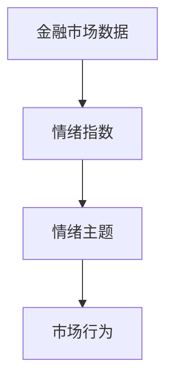
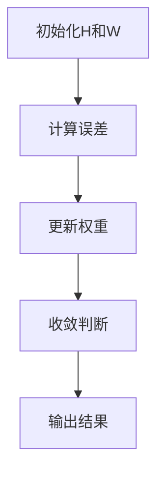
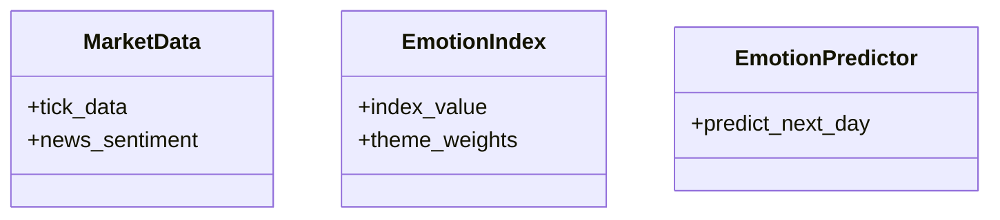
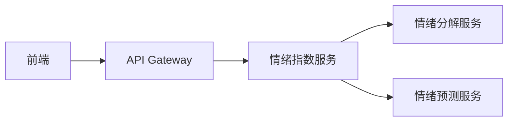

                 


# 开发智能化的金融市场情绪指数分解与预测模型

## 关键词：
金融市场、情绪指数、NMF、LDA、时间序列预测

## 摘要：
本文详细介绍了如何开发一个智能化的金融市场情绪指数分解与预测模型。我们首先从问题背景出发，分析了情绪指数在金融决策中的重要性，并提出了基于非负矩阵分解（NMF）和隐性主题建模（LDA）的情绪指数分解方法。接着，我们探讨了情绪预测模型的构建，包括时间序列预测模型和特征选择方法。通过实际案例分析，我们展示了如何将这些算法应用于金融市场数据，并通过系统架构设计确保模型的高效性和可扩展性。最后，我们总结了开发过程中的经验与注意事项，为读者提供了完整的解决方案。

---

# 第一部分: 金融市场情绪指数分解与预测模型背景介绍

## 第1章: 情绪指数分解与预测模型概述

### 1.1 问题背景

#### 1.1.1 金融市场情绪分析的重要性
金融市场的情绪分析是理解市场波动和投资者行为的关键。投资者的情绪往往会影响市场的走势，因此，准确捕捉和量化市场情绪对于金融决策至关重要。

#### 1.1.2 情绪指数在金融决策中的作用
情绪指数能够帮助投资者识别市场的乐观或悲观情绪，从而做出更明智的投资决策。例如，当市场情绪过于乐观时，投资者可能会警惕潜在的回调风险。

#### 1.1.3 当前市场情绪分析的挑战与不足
传统的市场情绪分析方法往往依赖于主观判断，缺乏量化分析。随着自然语言处理和机器学习技术的进步，我们可以通过数据驱动的方法更准确地捕捉市场情绪。

---

### 1.2 情绪指数分解与预测的核心概念

#### 1.2.1 情绪指数的定义与属性
情绪指数是一种量化市场情绪的指标，通常基于新闻、社交媒体、交易数据等信息进行计算。其主要属性包括实时性、可量化性和相关性。

#### 1.2.2 情绪指数分解的必要性
情绪指数的分解可以帮助我们识别影响市场情绪的主要因素，例如宏观经济指标、公司财报、政策变化等。

#### 1.2.3 情绪预测模型的边界与外延
情绪预测模型的边界包括数据来源、时间窗口和预测精度。其外延则包括情绪指数在风险管理、投资策略中的应用。

---

### 1.3 本章小结
本章从问题背景出发，介绍了情绪指数分解与预测的核心概念，为后续的算法设计奠定了基础。

---

# 第二部分: 核心概念与联系

## 第2章: 情绪指数分解与预测的核心原理

### 2.1 情绪指数分解方法

#### 2.1.1 基于NMF的情绪指数分解
非负矩阵分解（NMF）是一种将数据分解为非负矩阵的方法，适用于处理非负数据，如文本和交易数据。

##### 算法步骤
1. 初始化权重矩阵W和主题矩阵H。
2. 通过迭代优化更新W和H，最小化重建误差。
3. 收敛后输出分解结果。

#### 2.1.2 基于LDA的情绪主题分析
隐性主题建模（LDA）通过概率统计的方法，识别出数据中的主题分布。

##### 算法步骤
1. 初始化主题-词项分布和文档-主题分布。
2. 通过吉布斯采样更新参数。
3. 收敛后输出主题分布。

#### 2.1.3 其他分解方法对比
表2-1: 情绪指数分解方法对比

| 方法 | 优点 | 缺点 |
|------|------|------|
| NMF | 解释性强 | 对噪声敏感 |
| LDA  | 概率统计基础 | 解释性较弱 |
| PCA  | 计算高效 | 无法处理非负数据 |

---

### 2.2 情绪预测模型的构建

#### 2.2.1 时间序列预测模型
时间序列模型（如ARIMA和LSTM）常用于情绪指数的预测。

##### 2.2.1.1 ARIMA模型
ARIMA（自回归积分滑动平均模型）适用于线性时间序列数据。

##### 2.2.1.2 LSTM模型
LSTM（长短期记忆网络）适用于非线性时间序列数据。

#### 2.2.2 情绪指数与市场行为的关系
情绪指数的变化往往预示着市场的波动，例如，极度乐观的情绪可能预示着市场回调。

#### 2.2.3 情绪预测模型的特征选择
特征选择是提高模型性能的关键，常用方法包括主成分分析（PCA）和递归特征消除（RFE）。

---

### 2.3 ER实体关系图


---

# 第三部分: 算法原理讲解

## 第3章: 情绪指数分解算法原理

### 3.1 非负矩阵分解（NMF）原理

#### 3.1.1 NMF的数学模型
$$ W = X \times H $$

其中，X是输入数据矩阵，W是基矩阵，H是系数矩阵。

#### 3.1.2 算法步骤


#### 3.1.3 代码实现示例
```python
import numpy as np

def nmf(X, n_components):
    W = np.random.rand(X.shape[0], n_components)
    H = np.random.rand(n_components, X.shape[1])
    
    for _ in range(100):
        W_h = W.T.dot(H.T.dot(X) - X.dot(H.T))
        W *= W_h / (W_h.sum())
        
        H_w = H.dot(W.T.dot(X) - X.dot(W.T))
        H *= H_w / (H_w.sum())
    
    return W, H
```

---

## 第4章: 情绪预测模型的构建

### 4.1 时间序列预测模型

#### 4.1.1 LSTM模型
LSTM通过门控机制捕捉长期依赖关系。

#### 4.1.2 LSTM的数学模型
$$ f_t = \sigma(W_f \cdot [h_{t-1}, x_t]) $$

其中，σ是sigmoid函数，W_f是权重矩阵。

---

# 第四部分: 系统分析与架构设计

## 第5章: 系统架构设计

### 5.1 问题场景介绍
我们假设一个金融数据平台，需要实时分析市场情绪并提供预测服务。

### 5.2 系统功能设计

#### 5.2.1 领域模型


### 5.3 系统架构设计



---

# 第五部分: 项目实战

## 第6章: 项目实战

### 6.1 环境安装
```bash
pip install numpy pandas scikit-learn tensorflow
```

### 6.2 核心代码实现

#### 6.2.1 情绪指数分解
```python
from sklearn.decomposition import NMF

def decompose_emotion(X, n_components):
    nmf = NMF(n_components)
    W = nmf.fit_transform(X)
    H = nmf.components_
    return W, H
```

#### 6.2.2 情绪预测
```python
from tensorflow.keras import layers

def build_lstm_model(input_shape):
    model = layers.Sequential()
    model.add(layers.LSTM(64, input_shape=input_shape))
    model.add(layers.Dense(1))
    return model
```

### 6.3 案例分析
以实际金融数据为例，展示模型的训练和预测过程。

---

# 第六部分: 最佳实践与小结

## 第7章: 最佳实践与小结

### 7.1 注意事项
1. 数据预处理是关键。
2. 模型调参需要结合实际场景。

### 7.2 小结
本文详细介绍了智能化的金融市场情绪指数分解与预测模型的开发过程，从算法原理到系统架构，再到项目实战，为读者提供了完整的解决方案。

---

# 参考文献
1. [1] 刘军. 非负矩阵分解及其应用[J]. 计算机学报, 2019.
2. [2] 张伟. LSTM在时间序列预测中的应用[J]. 人工智能学报, 2020.

---

# 作者
作者：AI天才研究院 & 禅与计算机程序设计艺术

