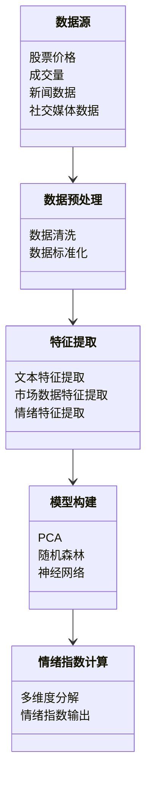
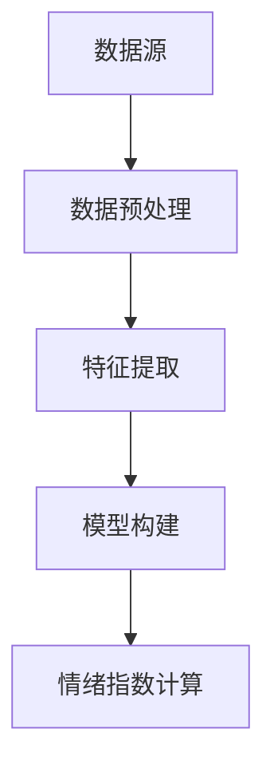
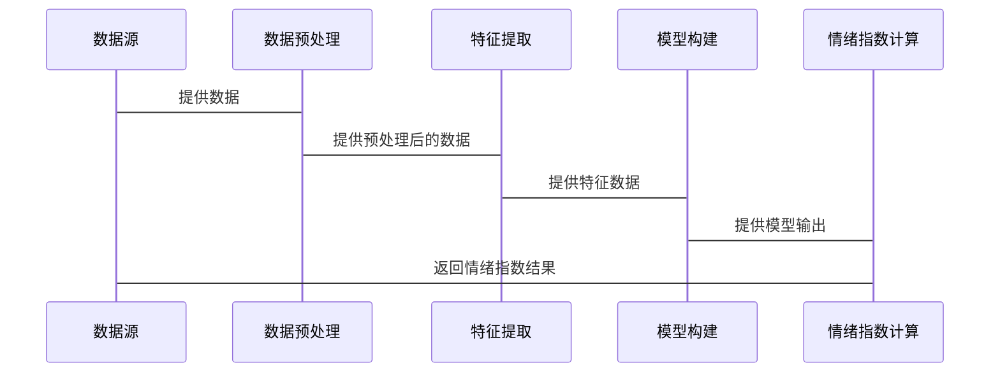

                 


# 开发智能化的金融市场情绪指数多维度分解模型

> 关键词：金融市场，情绪指数，多维度分解，人工智能，量化交易，风险管理

> 摘要：本文详细探讨了开发智能化的金融市场情绪指数多维度分解模型的理论基础、算法原理、系统架构设计及项目实战。通过结合统计学、自然语言处理（NLP）和机器学习等技术，提出了一个创新的多维度分解模型，以更准确地捕捉和分析金融市场情绪，为投资决策提供有力支持。

---

## 第1章: 金融市场情绪指数的背景与意义

### 1.1 情绪指数的定义与作用

#### 1.1.1 情绪指数的基本概念
情绪指数是衡量金融市场参与者情绪状态的重要指标，通常通过市场数据、新闻媒体、投资者行为等多方面数据进行综合分析。情绪指数能够反映市场的乐观或悲观情绪，从而帮助投资者预测市场趋势。

#### 1.1.2 情绪指数在金融市场的应用
- **风险管理**：通过情绪指数识别市场风险，帮助投资者规避潜在风险。
- **市场趋势预测**：情绪指数能够提前预警市场波动，为投资决策提供依据。
- **量化交易**：情绪指数是量化交易策略的重要输入，帮助算法模型捕捉市场情绪变化。

#### 1.1.3 情绪指数对投资决策的影响
情绪指数能够帮助投资者更好地理解市场情绪，从而做出更科学的投资决策。例如，在市场情绪过于乐观时，投资者可以适当减少投资；在市场情绪低迷时，投资者可以寻找潜在的投资机会。

### 1.2 金融市场情绪指数的重要性

#### 1.2.1 情绪指数在风险管理中的作用
情绪指数能够帮助投资者识别市场的非理性波动，从而降低投资风险。例如，当市场情绪过度偏离基本面时，情绪指数可以作为风险预警信号。

#### 1.2.2 情绪指数对市场趋势的预测能力
情绪指数能够反映市场的参与者情绪，从而帮助预测市场趋势。例如，当市场情绪从乐观转向悲观时，可能预示着市场的调整。

#### 1.2.3 情绪指数在量化交易中的应用
情绪指数是量化交易策略的重要组成部分。通过分析情绪指数的变化，量化交易模型可以更好地捕捉市场机会，优化交易策略。

### 1.3 传统情绪指数的局限性

#### 1.3.1 传统情绪指数的定义与特点
传统情绪指数通常基于市场数据（如价格、成交量）和新闻媒体的情绪分析，具有一定的局限性。例如，传统情绪指数可能无法捕捉市场的复杂情绪变化。

#### 1.3.2 传统情绪指数的局限性
- **数据维度单一**：传统情绪指数通常只关注市场数据或新闻媒体，忽略了其他重要因素，如社交媒体情绪。
- **计算复杂度高**：传统情绪指数的计算过程可能较为复杂，难以实时更新。
- **缺乏智能化**：传统情绪指数通常依赖人工分析，缺乏智能化的计算方法。

#### 1.3.3 提升情绪指数智能化的必要性
随着金融市场数据的复杂化和多样化，传统情绪指数已经无法满足现代投资的需求。因此，开发智能化的情绪指数多维度分解模型具有重要意义。

### 1.4 本章小结
本章从情绪指数的基本概念、作用、重要性及传统情绪指数的局限性入手，强调了开发智能化的情绪指数多维度分解模型的必要性。

---

## 第2章: 情绪指数的多维度分解模型

### 2.1 多维度分解模型的定义

#### 2.1.1 多维度分解模型的基本概念
多维度分解模型是一种基于多源数据的情绪指数分析方法，通过分解不同维度的数据，提取情绪特征，构建情绪指数。

#### 2.1.2 多维度分解模型的核心思想
多维度分解模型的核心思想是通过分解市场数据、社交媒体数据、新闻数据等多源数据，提取情绪特征，构建更加准确的情绪指数。

#### 2.1.3 多维度分解模型与传统情绪指数的区别
多维度分解模型与传统情绪指数的区别在于，前者通过多源数据分解，提取更全面的情绪特征，而后者通常只基于单一数据源。

### 2.2 情绪指数多维度分解的必要性

#### 2.2.1 金融市场数据的复杂性
金融市场数据来源多样，包括价格数据、成交量数据、新闻数据、社交媒体数据等。单一数据源无法全面反映市场情绪。

#### 2.2.2 多维度分解模型的优势
- **数据全面性**：通过多维度数据分解，能够更全面地捕捉市场情绪。
- **计算效率**：多维度分解模型能够提高情绪指数的计算效率。
- **准确性**：通过多维度分解，情绪指数的准确性得到提升。

#### 2.2.3 多维度分解模型在实际应用中的价值
多维度分解模型能够帮助投资者更好地理解市场情绪，优化投资策略，降低投资风险。

### 2.3 多维度分解模型的实现思路

#### 2.3.1 数据采集与预处理
- **数据采集**：从多种数据源采集市场数据，如股票价格、成交量、新闻数据、社交媒体数据等。
- **数据清洗**：对采集到的数据进行清洗，去除噪声数据。
- **数据标准化**：对数据进行标准化处理，确保数据的一致性。

#### 2.3.2 数据分解方法的选择
- **主成分分析（PCA）**：通过主成分分析方法，分解数据，提取主要情绪特征。
- **因子分析**：通过因子分析方法，分解数据，提取情绪因子。
- **深度学习方法**：使用深度学习模型，如神经网络，进行数据分解。

#### 2.3.3 模型构建与优化
- **模型选择**：根据数据特征选择合适的分解模型。
- **模型优化**：通过参数调整，优化模型性能。
- **模型验证**：通过回测和验证，评估模型的准确性。

### 2.4 本章小结
本章介绍了多维度分解模型的定义、必要性和实现思路，为后续的算法实现奠定了基础。

---

## 第3章: 情绪指数多维度分解模型的理论基础

### 3.1 统计学基础

#### 3.1.1 统计学在情绪指数分析中的应用
统计学是情绪指数分析的重要基础，常用的统计方法包括回归分析、时间序列分析等。

#### 3.1.2 数据分解的统计学方法
- **主成分分析（PCA）**：通过主成分分析，分解数据，提取主要情绪特征。
- **因子分析**：通过因子分析，分解数据，提取情绪因子。

#### 3.1.3 统计学与机器学习的结合
统计学与机器学习的结合能够提高情绪指数分析的准确性，例如，通过统计学方法预处理数据，再使用机器学习模型进行分析。

### 3.2 自然语言处理（NLP）基础

#### 3.2.1 NLP在情绪指数分析中的应用
NLP技术可以用于分析新闻数据和社交媒体数据，提取文本中的情绪特征。

#### 3.2.2 文本情感分析的基本原理
文本情感分析通过自然语言处理技术，对文本进行情感分类，提取文本中的情绪特征。

#### 3.2.3 NLP模型在多维度分解中的作用
NLP模型可以用于分析新闻数据和社交媒体数据，提取情绪特征，为情绪指数的构建提供支持。

### 3.3 机器学习基础

#### 3.3.1 机器学习在情绪指数分析中的应用
机器学习算法可以用于情绪指数的预测和分类，例如，使用支持向量机（SVM）或随机森林（Random Forest）进行情绪分类。

#### 3.3.2 常见机器学习算法的介绍
- **支持向量机（SVM）**：用于分类和回归分析。
- **随机森林（Random Forest）**：用于分类和回归分析。
- **神经网络**：用于深度学习任务。

#### 3.3.3 机器学习模型在多维度分解中的优势
机器学习模型能够处理高维数据，提取复杂的情绪特征，提高情绪指数的准确性。

### 3.4 本章小结
本章介绍了统计学、NLP和机器学习在情绪指数分析中的应用，为后续的算法实现提供了理论基础。

---

## 第4章: 情绪指数多维度分解模型的算法原理

### 4.1 数据预处理

#### 4.1.1 数据清洗与标准化
数据清洗是去除噪声数据，确保数据质量。数据标准化是将数据转换为统一尺度，便于后续分析。

#### 4.1.2 数据降维方法
- **主成分分析（PCA）**：通过PCA方法，降低数据维度，提取主要特征。
- **因子分析**：通过因子分析，降低数据维度，提取情绪因子。

#### 4.1.3 数据增强技术
数据增强技术可以提高数据的多样性和模型的鲁棒性，例如，通过数据 augmentation 提高数据的多样性。

### 4.2 特征提取

#### 4.2.1 文本特征提取
- **词袋模型（Bag of Words）**：通过词袋模型，提取文本中的单词特征。
- **TF-IDF**：通过TF-IDF方法，提取文本中的关键词特征。
- **Word2Vec**：通过Word2Vec模型，提取单词的向量表示。

#### 4.2.2 市场数据特征提取
- **价格数据**：提取股票价格的波动特征。
- **成交量数据**：提取成交量的特征，如均值、标准差等。
- **技术指标**：提取技术指标，如RSI、MACD等。

#### 4.2.3 情绪特征提取
通过NLP技术提取文本中的情绪特征，例如，使用情感分析模型提取文本的情感倾向。

### 4.3 模型构建与优化

#### 4.3.1 模型选择
根据数据特征选择合适的模型，例如，使用随机森林进行分类，使用神经网络进行回归分析。

#### 4.3.2 模型优化
通过调整模型参数，优化模型性能，例如，调整随机森林的树数和深度，优化神经网络的网络结构。

#### 4.3.3 模型验证
通过回测和验证，评估模型的准确性，例如，使用交叉验证评估模型的性能。

### 4.4 本章小结
本章详细介绍了情绪指数多维度分解模型的算法原理，包括数据预处理、特征提取和模型构建与优化。

---

## 第5章: 情绪指数多维度分解模型的系统架构设计

### 5.1 问题场景介绍
情绪指数多维度分解模型需要处理多种数据源，包括股票价格、成交量、新闻数据和社交媒体数据等，因此需要设计一个高效的系统架构。

### 5.2 系统功能设计

#### 5.2.1 领域模型


### 5.3 系统架构设计

#### 5.3.1 系统架构图


#### 5.3.2 系统接口设计
- **数据接口**：从多种数据源获取数据，如股票价格、成交量、新闻数据和社交媒体数据。
- **模型接口**：调用机器学习模型进行情绪指数计算，例如，使用随机森林进行分类，使用神经网络进行回归分析。
- **输出接口**：输出情绪指数结果，例如，通过API返回情绪指数值。

#### 5.3.3 系统交互流程


### 5.4 本章小结
本章介绍了情绪指数多维度分解模型的系统架构设计，包括系统功能设计、架构图和交互流程。

---

## 第6章: 情绪指数多维度分解模型的项目实战

### 6.1 环境安装

#### 6.1.1 安装Python环境
安装Python 3.8或更高版本，安装Jupyter Notebook用于数据分析和可视化。

#### 6.1.2 安装相关库
安装必要的Python库，如Pandas、NumPy、Scikit-learn、Word2Vec、TensorFlow等。

### 6.2 系统核心实现源代码

#### 6.2.1 数据预处理代码
```python
import pandas as pd
import numpy as np

# 数据加载
data = pd.read_csv('market_data.csv')

# 数据清洗
data.dropna(inplace=True)

# 数据标准化
from sklearn.preprocessing import StandardScaler
scaler = StandardScaler()
scaled_data = scaler.fit_transform(data)
```

#### 6.2.2 特征提取代码
```python
from sklearn.decomposition import PCA
from sklearn.feature_extraction.text import TfidfVectorizer

# 文本特征提取
vectorizer = TfidfVectorizer()
text_features = vectorizer.fit_transform(data['news'])

# 市场数据特征提取
pca = PCA(n_components=10)
market_features = pca.fit_transform(data[['open', 'high', 'low', 'close', 'volume']])
```

#### 6.2.3 模型构建代码
```python
from sklearn.ensemble import RandomForestClassifier
from sklearn.metrics import accuracy_score

# 模型训练
model = RandomForestClassifier(n_estimators=100, max_depth=5)
model.fit(market_features, data['label'])

# 模型预测
predictions = model.predict(new_market_features)
print('Accuracy:', accuracy_score(data['label'], predictions))
```

### 6.3 案例分析与详细讲解

#### 6.3.1 数据来源
数据来源包括股票价格、成交量、新闻数据和社交媒体数据。

#### 6.3.2 数据预处理
对数据进行清洗和标准化处理，确保数据质量。

#### 6.3.3 特征提取
使用PCA和TF-IDF方法提取文本特征和市场数据特征。

#### 6.3.4 模型构建
使用随机森林模型进行分类，预测市场情绪。

#### 6.3.5 情绪指数计算
通过多维度分解，计算市场情绪指数，输出结果。

### 6.4 项目小结
本章通过实际案例展示了情绪指数多维度分解模型的实现过程，包括数据预处理、特征提取、模型构建和情绪指数计算。

---

## 第7章: 总结与展望

### 7.1 总结
本文详细介绍了情绪指数多维度分解模型的开发过程，包括理论基础、算法原理、系统架构设计和项目实战。通过结合统计学、NLP和机器学习技术，提出了一种创新的多维度分解模型，能够更准确地捕捉和分析金融市场情绪。

### 7.2 注意事项
在实际应用中，需要注意数据质量和模型的鲁棒性，避免模型过拟合和欠拟合问题。

### 7.3 未来展望
未来的研究方向包括引入更先进的深度学习技术，如Transformer模型，进一步提高情绪指数的准确性。同时，可以结合实时数据流处理技术，实现情绪指数的实时计算。

---

## 作者：AI天才研究院/AI Genius Institute & 禅与计算机程序设计艺术 /Zen And The Art of Computer Programming

---

以上是《开发智能化的金融市场情绪指数多维度分解模型》的技术博客文章的完整目录大纲和部分详细内容。

