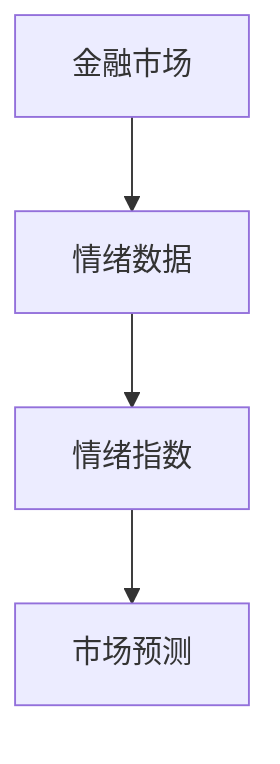
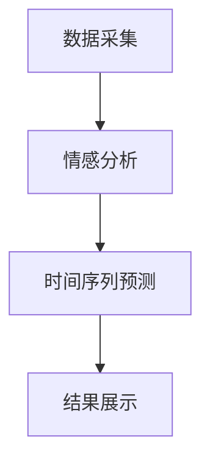

                 


# 开发智能化的金融市场情绪指数模型

> **关键词**：金融市场，情绪指数，情绪分析，自然语言处理，时间序列分析，深度学习，系统架构

> **摘要**：本文系统地探讨了开发智能化金融市场情绪指数模型的各个方面。从背景和核心概念出发，分析了情绪指数模型的构建要素和算法原理，包括基于规则、机器学习和深度学习的情感分析方法，以及时间序列预测模型。结合系统架构设计，详细讲解了从数据采集到结果展示的实现流程，并通过实战案例展示模型的应用。最后，总结了开发经验和未来发展方向。

---

## 第1章 金融市场情绪指数模型的背景与意义

### 1.1 金融市场的基本概念

#### 1.1.1 金融市场的定义与分类

金融市场是资金、证券和衍生品交易的场所，分为场内市场和场外市场。参与者包括投资者、机构、经纪商和监管机构。

#### 1.1.2 金融市场的参与者及其行为特征

主要参与者有机构投资者、散户、做市商和监管机构。机构投资者通常进行长期投资，而散户则更关注短期波动。

#### 1.1.3 金融市场中的情绪与市场行为的关系

情绪影响投资者决策，从而影响市场波动。例如，恐慌情绪可能导致抛售，乐观情绪引发买入。

### 1.2 情绪指数模型的定义与作用

#### 1.2.1 情绪指数的定义

情绪指数是衡量市场情绪的量化指标，反映了投资者的乐观或悲观程度。

#### 1.2.2 情绪指数在金融分析中的作用

情绪指数帮助预测市场趋势，辅助投资决策，评估市场风险。

#### 1.2.3 情绪指数与其他市场指标的区别与联系

区别在于情绪指数反映主观因素，而其他指标如成交量反映交易活动。情绪指数可与其他指标结合分析。

### 1.3 本章小结

本章介绍了金融市场的基本概念和情绪指数的作用，强调情绪在市场中的重要性。

---

## 第2章 情绪指数模型的核心概念

### 2.1 数据来源与特征

#### 2.1.1 文本数据来源：新闻、社交媒体、评论

文本数据来源包括新闻标题、社交媒体帖子和投资者评论。这些数据反映了市场参与者的观点。

#### 2.1.2 非文本数据来源：市场数据、交易数据

非文本数据如股票价格、成交量和订单数据，提供市场行为信息。

#### 2.1.3 数据特征分析

情绪数据具有时间性、相关性和情绪极性特征。

### 2.2 情绪指数模型的构建要素

#### 2.2.1 情感分析模型

用于分析文本中的情感倾向，分为正面、负面和中性。

#### 2.2.2 时间序列分析模型

用于分析情绪指数的时间变化，预测未来走势。

#### 2.2.3 综合指数计算方法

结合情感分析和时间序列分析，计算综合情绪指数。

### 2.3 情绪指数模型的属性特征对比

#### 2.3.1 情感强度

不同强度的情绪对市场的影响程度不同，强度高的情绪影响更大。

#### 2.3.2 情绪稳定性

情绪的波动性和持续性影响其对市场的短期和长期影响。

#### 2.3.3 市场相关性

情绪指数与价格和成交量的相关性影响其预测能力。

### 2.4 ER实体关系图



### 2.5 本章小结

本章分析了情绪指数模型的数据来源、构建要素和属性特征，为后续开发奠定基础。

---

## 第3章 情绪分析算法

### 3.1 基于规则的情感分析

#### 3.1.1 情感词典的构建

使用中文情感词典，将词语分为积极、消极和中性。

#### 3.1.2 基于规则的情感强度计算

根据关键词匹配，计算文本的情感强度。

#### 3.1.3 示例：中文情感词典的使用

```python
# 示例代码
def calculate_sentiment(text, positive_words, negative_words):
    positive = sum(1 for word in text.split() if word in positive_words)
    negative = sum(1 for word in text.split() if word in negative_words)
    return positive - negative
```

### 3.2 基于机器学习的情感分析

#### 3.2.1 文本特征提取：TF-IDF、Word2Vec

使用TF-IDF提取关键词，或Word2Vec生成词向量。

#### 3.2.2 常用算法：SVM、随机森林

SVM适用于小数据，随机森林适合大数据。

#### 3.2.3 示例：使用SVM进行情感分类

```python
from sklearn.svm import SVC
from sklearn.feature_extraction.text import TfidfVectorizer

vectorizer = TfidfVectorizer()
X = vectorizer.fit_transform(corpus)
model = SVC()
model.fit(X, labels)
```

### 3.3 基于深度学习的情感分析

#### 3.3.1 常用模型：LSTM、Transformer

Transformer在捕捉长距离依赖方面表现更好。

#### 3.3.2 模型训练流程

数据预处理、模型训练、评估和优化。

#### 3.3.3 示例：使用BERT进行情感分类

```python
import torch
from transformers import BertTokenizer, BertModel

tokenizer = BertTokenizer.from_pretrained('bert-base-chinese')
model = BertModel.from_pretrained('bert-base-chinese')
```

### 3.4 本章小结

本章详细介绍了情感分析的三种方法，包括规则、机器学习和深度学习。

---

## 第4章 时间序列分析算法

### 4.1 常用时间序列模型

#### 4.1.1 ARIMA模型

适用于线性时间序列数据。

#### 4.1.2 GARCH模型

用于捕捉波动率的变化。

#### 4.1.3 LSTM在时间序列中的应用

LSTM适合捕捉非线性模式。

### 4.2 情绪指数的时间序列建模

#### 4.2.1 数据预处理：平稳性检验、差分

确保数据平稳，减少趋势和季节性影响。

#### 4.2.2 模型选择与验证

通过AIC和BIC准则选择模型。

#### 4.2.3 示例：使用ARIMA预测情绪指数

```python
from statsmodels.tsa.arima_model import ARIMA

model = ARIMA(train_data, order=(5,1,0))
model_fit = model.fit()
 forecast = model_fit.forecast(steps=5)[0]
```

### 4.3 本章小结

本章介绍了时间序列模型及其在情绪指数预测中的应用。

---

## 第5章 系统架构设计

### 5.1 系统功能模块划分

#### 5.1.1 数据采集模块

从新闻网站和社交媒体获取数据。

#### 5.1.2 情感分析模块

处理文本数据，计算情感倾向。

#### 5.1.3 时间序列预测模块

基于历史情绪指数预测未来走势。

#### 5.1.4 结果展示模块

可视化情绪指数和预测结果。

### 5.2 系统架构设计图



### 5.3 系统功能设计

使用领域模型类图展示各模块之间的关系。

```mermaid
classDiagram
    class 数据采集模块 {
        void 采集数据()
    }
    class 情感分析模块 {
        float 计算情感强度()
    }
    class 时间序列预测模块 {
        float[] 预测指数()
    }
    class 结果展示模块 {
        void 显示结果()
    }
    数据采集模块 -> 情感分析模块: 传递数据
    情感分析模块 -> 时间序列预测模块: 提供情感数据
    时间序列预测模块 -> 结果展示模块: 提供预测结果
```

### 5.4 本章小结

本章设计了系统的架构，明确了各模块的功能和交互流程。

---

## 第6章 项目实战

### 6.1 环境配置

#### 6.1.1 安装必要的库

使用Python和相关库如NLTK、TensorFlow。

### 6.2 系统核心实现源代码

#### 6.2.1 数据预处理代码

```python
import pandas as pd

def preprocess_data(data):
    # 假设data是DataFrame，包含文本列和日期列
    data['date'] = pd.to_datetime(data['date'])
    data.set_index('date', inplace=True)
    return data
```

#### 6.2.2 情感分析代码

```python
from transformers import pipeline

sentiment_pipeline = pipeline("sentiment-analysis")
def analyze_sentiment(text):
    return sentiment_pipeline(text)[0]['label']
```

#### 6.2.3 时间序列预测代码

```python
from statsmodels.tsa.arima_model import ARIMA

def predict_emotion_index(history):
    model = ARIMA(history, order=(5,1,0))
    model_fit = model.fit()
    forecast = model_fit.forecast(steps=1)[0]
    return forecast
```

### 6.3 实际案例分析

#### 6.3.1 数据来源

使用新闻网站和社交媒体的数据进行分析。

#### 6.3.2 数据分析与结果展示

使用可视化工具展示情绪指数的变化趋势。

### 6.4 本章小结

本章通过实际案例展示了系统的实现过程和应用效果。

---

## 第7章 总结与展望

### 7.1 开发过程中的经验总结

确保数据质量和模型调优的重要性。

### 7.2 最佳实践 tips

选择合适的数据源和模型，定期更新模型。

### 7.3 本章小结

总结了开发经验，并展望了未来的发展方向。

---

## 作者

作者：AI天才研究院/AI Genius Institute & 禅与计算机程序设计艺术/Zen And The Art of Computer Programming

