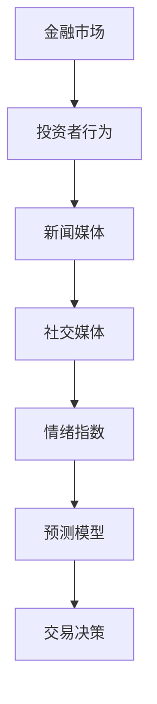
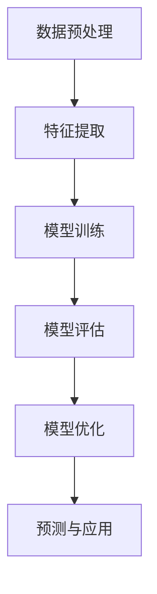
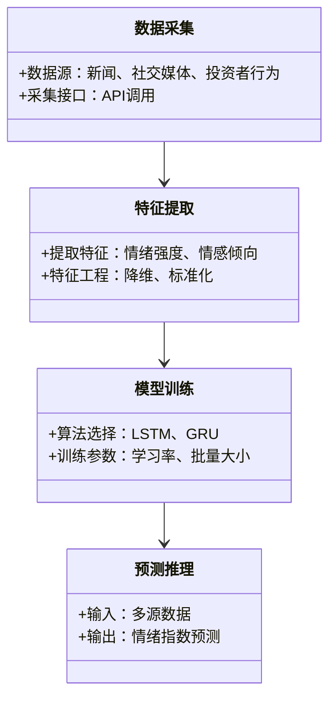
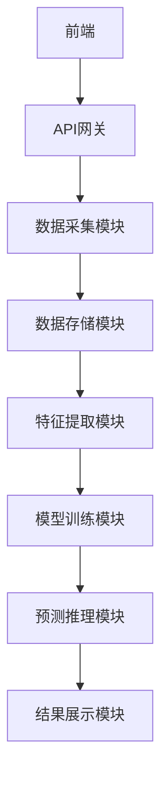
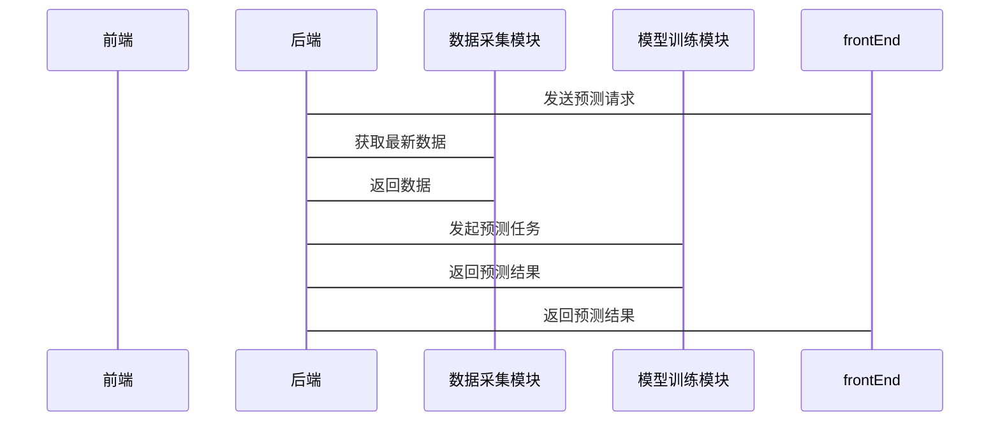

                 


# 开发智能化的金融市场情绪指数预测模型

## 关键词：金融市场情绪指数，预测模型，人工智能，机器学习，深度学习，时间序列分析

## 摘要：本文详细介绍了如何开发一个智能化的金融市场情绪指数预测模型。从问题背景、核心概念、算法原理到系统设计与项目实战，文章逐步分析了情绪指数预测的关键要素与实现方法。通过多源数据融合、智能算法优化和系统架构设计，本文展示了如何构建一个高效、准确的情绪指数预测系统，为投资者提供数据驱动的决策支持。

---

# 第一部分: 金融市场情绪指数预测模型背景介绍

## 第1章: 问题背景与描述

### 1.1 情绪指数的定义与作用

#### 1.1.1 什么是金融市场情绪指数
金融市场情绪指数是反映市场参与者情绪状态的量化指标，通常通过新闻、社交媒体、投资者行为等数据计算得出。情绪指数能够帮助投资者理解市场的乐观或悲观情绪，从而辅助投资决策。

#### 1.1.2 情绪指数在投资决策中的作用
情绪指数能够帮助投资者预测市场的短期波动，发现市场趋势，优化投资组合，并在市场恐慌时提供预警信号。

#### 1.1.3 情绪指数的分类与特点
情绪指数可以分为新闻情绪指数、社交媒体情绪指数、投资者行为情绪指数等。其特点包括实时性、数据驱动性和可量化性。

### 1.2 问题描述与目标

#### 1.2.1 当前情绪指数预测的痛点
传统的情绪指数预测方法依赖单一数据源，预测精度低，且难以捕捉市场的复杂情绪变化。此外，市场数据的实时性和多样性对模型的计算能力提出了更高要求。

#### 1.2.2 智能化情绪指数预测的需求
随着人工智能技术的发展，市场参与者希望利用多源数据和智能算法，构建一个更精准、实时的智能化情绪指数预测模型。

#### 1.2.3 本项目的目标与意义
本项目旨在通过整合新闻、社交媒体、投资者行为等多种数据源，利用机器学习和深度学习算法，构建一个智能化的情绪指数预测模型，为投资者提供更准确的市场情绪分析。

### 1.3 问题解决思路

#### 1.3.1 数据驱动与模型驱动的结合
通过收集和分析多源数据，结合统计模型和机器学习模型，构建一个综合的情绪指数预测系统。

#### 1.3.2 多源数据融合与特征提取
从新闻、社交媒体、投资者行为等数据中提取情绪特征，通过特征工程优化模型性能。

#### 1.3.3 智能算法的选择与优化
选择适合情绪预测的算法，如LSTM、GRU等，通过参数调优和模型优化提升预测精度。

### 1.4 情绪指数预测的边界与外延

#### 1.4.1 情绪指数的适用范围
情绪指数适用于短期市场预测，但不适用于长期趋势预测。

#### 1.4.2 情绪指数的局限性
情绪指数受数据质量和实时性影响较大，且市场情绪受到多种复杂因素的影响，难以完全捕捉。

#### 1.4.3 情绪指数与其他市场指标的关系
情绪指数可以与市场价、成交量等指标结合，提供更全面的市场分析。

### 1.5 情绪指数预测的核心要素

#### 1.5.1 数据来源与处理
从新闻、社交媒体、投资者行为等多源数据中提取情绪特征。

#### 1.5.2 模型构建与训练
利用机器学习和深度学习算法构建情绪指数预测模型。

#### 1.5.3 模型评估与优化
通过回测、交叉验证等方法评估模型性能，并进行参数调优和模型优化。

#### 1.5.4 模型部署与应用
将模型部署到实际应用场景中，提供实时情绪指数预测服务。

---

## 第2章: 情绪指数预测的核心概念与联系

### 2.1 核心概念原理

#### 2.1.1 情绪指数的核心计算方法
情绪指数通常通过加权平均、情感分析等方法计算得出。

#### 2.1.2 智能化预测模型的原理
智能化预测模型通过特征提取、模型训练和预测推理，实现情绪指数的智能化预测。

#### 2.1.3 数据特征与模型性能的关系
数据特征的丰富性直接影响模型的预测精度，特征工程是提升模型性能的关键。

### 2.2 核心概念属性特征对比

#### 2.2.1 数据特征对比表
| 数据来源 | 特征类型 | 特征描述 |
|----------|----------|----------|
| 新闻      | 情感强度  | 新闻标题的情感倾向 |
| 社交媒体  | 情感热度  | 社交媒体帖子的热度 |
| 投资者行为 | 交易量    | 投资者交易量的变化 |

#### 2.2.2 模型性能对比表
| 模型类型 | 预测精度 | 训练时间 | 实时预测能力 |
|----------|----------|----------|--------------|
| 线性回归  | 中等      | 快速      | 一般          |
| LSTM      | 高       | 较慢      | 较好          |
| GRU       | 高       | 较快      | 优秀          |

#### 2.2.3 不同情绪指数的对比分析
| 情绪指数类型 | 数据来源 | 适用场景 | 优缺点 |
|--------------|----------|----------|----------|
| 新闻情绪      | 新闻      | 短期预测  | 数据量大 |
| 社交情绪      | 社交媒体  | 短期预测  | 实时性强 |
| 投资者情绪    | 投资者行为 | 长期预测  | 数据稳定性好 |

### 2.3 ER实体关系图



---

## 第3章: 情绪指数预测的算法原理

### 3.1 算法原理概述

#### 3.1.1 时间序列分析的基本原理
时间序列分析通过研究数据的时序特征，预测未来趋势。常用方法包括ARIMA、LSTM等。

#### 3.1.2 机器学习算法在情绪预测中的应用
机器学习算法如随机森林、支持向量机等，可以用于分类和回归任务。

#### 3.1.3 深度学习模型的优势
深度学习模型如LSTM、GRU等，能够捕捉复杂的时间依赖关系，适合处理金融市场的情绪预测。

### 3.2 算法流程图



### 3.3 算法实现代码

#### 示例代码：时间序列预测模型

```python
import numpy as np
import pandas as pd
from sklearn.model_selection import train_test_split
from sklearn.linear_model import LinearRegression

def predict_emotion_index(data):
    # 数据预处理
    X = data[['news_volume', 'social_media_trend']]
    y = data['emotion_index']
    
    # 划分训练集与测试集
    X_train, X_test, y_train, y_test = train_test_split(X, y, test_size=0.2, random_state=42)
    
    # 模型训练
    model = LinearRegression()
    model.fit(X_train, y_train)
    
    # 模型预测
    y_pred = model.predict(X_test)
    
    return y_pred

# 示例数据
data = pd.DataFrame({
    'news_volume': [10, 20, 30, 40, 50],
    'social_media_trend': [0.5, 0.6, 0.4, 0.7, 0.3],
    'emotion_index': [0.3, 0.6, 0.4, 0.8, 0.2]
})

# 调用函数
predictions = predict_emotion_index(data)
print("预测结果:", predictions)
```

### 3.4 算法数学模型与公式

#### 3.4.1 线性回归模型
$$ y = \beta_0 + \beta_1x_1 + \beta_2x_2 + \epsilon $$

#### 3.4.2 LSTM模型
LSTM通过门控机制捕捉时间序列的长程依赖关系，模型结构如下：
$$
i_t = \sigma(W_i x_t + U_i h_{t-1} + b_i)
$$
$$
f_t = \sigma(W_f x_t + U_f h_{t-1} + b_f)
$$
$$
o_t = \sigma(W_o x_t + U_o h_{t-1} + b_o)
$$
$$
h_t = i_t \cdot \tanh(W_c x_t + U_c h_{t-1} + b_c)
$$

---

## 第4章: 系统分析与架构设计方案

### 4.1 问题场景介绍

#### 4.1.1 系统目标
构建一个智能化的情绪指数预测系统，支持多源数据输入，提供实时情绪指数预测。

#### 4.1.2 项目介绍
通过数据采集、特征提取、模型训练和预测推理，构建一个完整的智能化预测系统。

### 4.2 系统功能设计

#### 4.2.1 领域模型设计


#### 4.2.2 系统架构设计


#### 4.2.3 接口与交互设计


---

## 第5章: 项目实战

### 5.1 环境安装与配置

#### 5.1.1 安装依赖
```bash
pip install numpy pandas scikit-learn keras tensorflow
```

#### 5.1.2 配置数据源
配置新闻API、社交媒体API等数据源接口。

### 5.2 核心代码实现

#### 5.2.1 数据采集模块

```python
import requests

def get_news_data(api_key):
    url = f"https://api.news.com/articles?api_key={api_key}"
    response = requests.get(url)
    return response.json()

news_data = get_news_data("your_api_key")
```

#### 5.2.2 特征提取模块

```python
from sklearn.feature_extraction.text import TfidfVectorizer

vectorizer = TfidfVectorizer()
X = vectorizer.fit_transform(text_data)
```

#### 5.2.3 模型训练模块

```python
from tensorflow.keras.models import Sequential
from tensorflow.keras.layers import LSTM, Dense

model = Sequential()
model.add(LSTM(64, input_shape=(timesteps, features)))
model.add(Dense(1))
model.compile(loss='mean_squared_error', optimizer='adam')
model.fit(X_train, y_train, epochs=10, batch_size=32)
```

#### 5.2.4 预测推理模块

```python
predictions = model.predict(X_test)
```

### 5.3 案例分析与解读

#### 5.3.1 数据来源与处理
从新闻、社交媒体等多源数据中提取情绪特征，进行数据清洗和特征工程。

#### 5.3.2 模型训练与评估
通过回测和交叉验证评估模型性能，优化模型参数。

#### 5.3.3 实际案例分析
以某段时间的市场数据为例，展示模型的预测结果与实际情绪指数的对比。

### 5.4 项目总结与优化

#### 5.4.1 项目总结
通过本项目，我们成功构建了一个智能化的情绪指数预测系统，验证了多源数据融合和智能算法的有效性。

#### 5.4.2 优化方向
进一步优化模型性能，引入更复杂的情感分析模型，如Transformer架构。

---

## 第6章: 最佳实践与小结

### 6.1 最佳实践

#### 6.1.1 数据采集
确保数据的多样性和实时性，选择可靠的API接口。

#### 6.1.2 特征工程
通过降维和标准化处理，提升模型的训练效率和预测精度。

#### 6.1.3 模型选择
根据具体场景选择合适的算法，如LSTM适合时间序列数据。

#### 6.1.4 模型部署
将模型部署到云平台，提供实时预测服务。

### 6.2 小结

通过本文的详细分析与实战，我们掌握了智能化情绪指数预测模型的开发方法，从数据采集到模型部署，完整地实现了系统设计与优化。

### 6.3 注意事项

- 数据隐私与合规性：确保数据采集和处理符合相关法律法规。
- 模型鲁棒性：加强模型的容错能力和异常处理。
- 性能优化：提升模型的计算效率，降低延迟。

### 6.4 拓展阅读

- 《深度学习》—— Ian Goodfellow
- 《时间序列分析》—— 王振东
- 《机器学习实战》—— 周志华

---

# 作者：AI天才研究院/AI Genius Institute & 禅与计算机程序设计艺术 /Zen And The Art of Computer Programming

