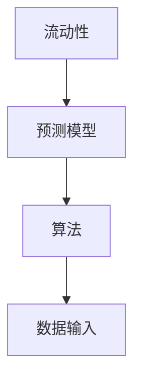
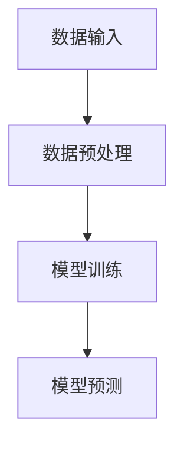
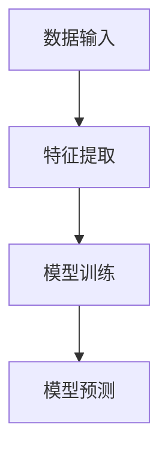
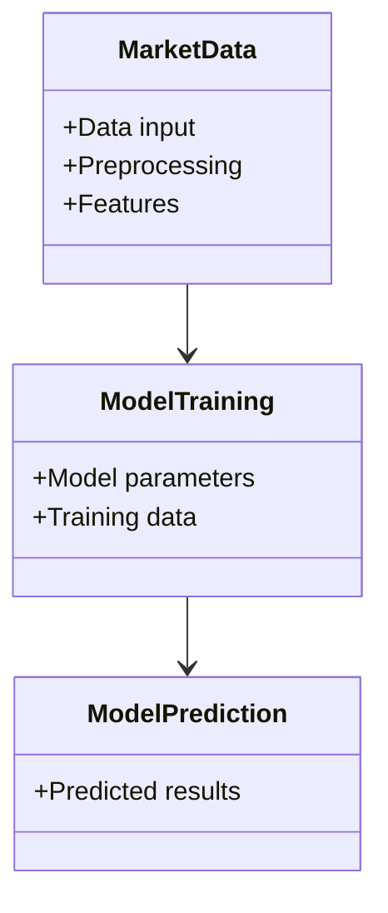
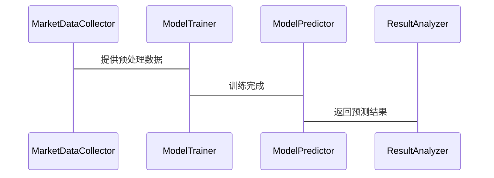

                 


```markdown
# 开发智能化的金融市场流动性预测工具

> 关键词：金融市场流动性预测，人工智能，时间序列分析，机器学习，系统架构设计

> 摘要：金融市场流动性预测是金融风险管理中的关键任务，本文探讨了如何利用人工智能技术开发智能化的流动性预测工具。文章详细介绍了流动性预测的背景、核心概念、算法原理、系统架构设计以及实际项目开发过程，提供了从理论到实践的全面指导。

---

## 第1章: 金融市场流动性预测工具概述

### 1.1 问题背景与重要性

#### 1.1.1 金融市场流动性问题的背景
金融市场流动性是指资产在短时间内以合理价格买卖的能力。流动性不足可能导致资产价格大幅波动，增加市场风险。有效的流动性预测工具可以帮助投资者和机构做出更明智的决策。

#### 1.1.2 流动性预测的必要性与应用场景
流动性预测在多种场景中至关重要，如高频交易、风险管理、投资组合优化等。例如，银行需要预测短期流动性需求以维持资金稳定性。

#### 1.1.3 智能化预测工具的潜力与价值
传统方法依赖经验判断，而智能化工具利用大数据和机器学习，能够更准确地捕捉市场趋势，提高预测的准确性。

### 1.2 问题描述与目标

#### 1.2.1 流动性预测的核心问题
预测市场波动性、交易量和订单簿变化，评估资产的买卖难度。

#### 1.2.2 智能化预测工具的目标
开发一个能够实时分析市场数据，预测流动性风险，并提供决策支持的工具。

#### 1.2.3 边界与外延
工具专注于预测市场流动性，不涉及信用风险等其他风险类型。

### 1.3 核心概念与联系

#### 1.3.1 核心概念原理
- **流动性**：资产的买卖难度。
- **预测模型**：基于历史数据预测未来流动性。
- **算法**：用于处理数据和生成预测。

#### 1.3.2 核心概念属性特征对比表格
| 概念         | 属性                     | 特征描述                                                                 |
|--------------|--------------------------|--------------------------------------------------------------------------|
| 流动性       | 时间性                   | 取决于时间段，如日内、周内波动。                                        |
| 预测模型     | 数据依赖性               | 依赖历史数据，模型性能受数据质量影响。                                  |
| 算法         | 可解释性                 | 有些算法（如线性回归）易于解释，而深度学习模型复杂且难解释。            |

#### 1.3.3 ER实体关系图架构（Mermaid流程图）


---

## 第2章: 流动性预测工具的核心算法原理

### 2.1 算法原理讲解

#### 2.1.1 时间序列分析算法（Mermaid流程图）


#### 2.1.2 机器学习模型（Mermaid流程图）


### 2.2 算法实现与数学模型

#### 2.2.1 时间序列分析的数学模型（ARIMA模型）
ARIMA模型用于预测未来值，公式为：
$$ARIMA(p, d, q) = y_t - \sum_{i=1}^p \phi_i y_{t-i} - \sum_{j=1}^q \theta_j e_{t-j} = 0$$

#### 2.2.2 机器学习模型的数学公式（如LSTM）
LSTM单元公式：
$$f_t = \sigma(W_f \cdot [h_{t-1}, x_t])$$
$$i_t = \sigma(W_i \cdot [h_{t-1}, x_t])$$
$$o_t = \sigma(W_o \cdot [h_{t-1}, x_t])$$
$$c_t = f_t \cdot c_{t-1} + i_t \cdot tanh(W_c \cdot [h_{t-1}, x_t])$$
$$h_t = o_t \cdot tanh(c_t)$$

#### 2.2.3 示例代码实现
```python
import numpy as np
from statsmodels.tsa.arima.model import ARIMA

# 示例数据
data = np.array([100, 90, 80, 70, 60])

# 模型训练
model = ARIMA(data, order=(1, 1, 0))
model_fit = model.fit()

# 预测
forecast = model_fit.forecast(steps=5)
print(forecast)
```

---

## 第3章: 系统分析与架构设计方案

### 3.1 项目背景与目标

#### 3.1.1 项目背景
开发一个实时监测市场流动性的工具，帮助机构进行风险控制。

#### 3.1.2 项目目标
实现一个能够处理大规模数据，提供准确预测结果的系统。

### 3.2 系统功能设计

#### 3.2.1 领域模型类图（Mermaid类图）


#### 3.2.2 系统架构设计（Mermaid架构图）


#### 3.2.3 系统接口设计
- 数据输入接口：接收市场数据。
- 预测结果接口：输出预测结果。

#### 3.2.4 系统交互流程（Mermaid序列图）


---

## 第4章: 项目实战

### 4.1 环境安装与配置

#### 4.1.1 开发环境搭建
安装Python、Jupyter Notebook、NumPy和Pandas库。

#### 4.1.2 数据获取与预处理
从数据源获取市场数据，并进行清洗和标准化。

### 4.2 核心代码实现

#### 4.2.1 数据预处理代码
```python
import pandas as pd
import numpy as np

# 数据加载
data = pd.read_csv('market_data.csv')

# 数据清洗
data.dropna(inplace=True)
data = data.iloc[:, [0, 4, 5]]
```

#### 4.2.2 模型训练代码
```python
from statsmodels.tsa.arima.model import ARIMA

# 训练模型
model = ARIMA(data['price'], order=(5, 1, 0))
model_fit = model.fit()
```

#### 4.2.3 模型预测代码
```python
# 预测未来5天
forecast = model_fit.forecast(steps=5)
print(forecast)
```

### 4.3 代码解读与分析

#### 4.3.1 关键代码段解读
- 数据预处理：选择相关特征，删除缺失值。
- 模型训练：使用ARIMA模型，参数设置为(5, 1, 0)。

#### 4.3.2 代码优化建议
- 调整ARIMA参数，尝试其他模型如LSTM。

### 4.4 实际案例分析

#### 4.4.1 数据来源与特征分析
使用历史价格数据，分析波动性和交易量。

#### 4.4.2 模型训练与评估
评估模型的准确性，计算MAE、MSE等指标。

#### 4.4.3 模型预测与结果分析
展示预测结果与实际数据的对比，分析模型的有效性。

### 4.5 项目小结

#### 4.5.1 项目总结
成功开发了一个基于ARIMA模型的流动性预测工具。

#### 4.5.2 经验与教训
数据质量至关重要，模型选择影响结果。

---

## 第5章: 最佳实践与注意事项

### 5.1 最佳实践 tips

#### 5.1.1 数据质量的重要性
确保数据准确、完整，避免偏差。

#### 5.1.2 模型选择的策略
根据数据特性选择合适的模型，进行交叉验证。

#### 5.1.3 模型调优的技巧
调整超参数，进行网格搜索或随机搜索。

### 5.2 小结与展望

#### 5.2.1 本书内容总结
系统介绍了从背景到实现的全过程。

#### 5.2.2 未来研究方向
探索深度学习模型，结合NLP技术分析市场情绪。

### 5.3 注意事项

#### 5.3.1 数据隐私与合规性
确保数据来源合法，遵守相关法规。

#### 5.3.2 模型的局限性
模型可能受市场变化影响，需定期更新。

#### 5.3.3 实际应用中的风险
预测结果仅供参考，需结合其他因素综合判断。

### 5.4 拓展阅读

#### 5.4.1 相关领域推荐书籍
- 《机器学习实战》
- 《时间序列分析》

#### 5.4.2 其他参考资料与工具
- Python的Scikit-learn库
- TensorFlow框架

#### 5.4.3 进一步学习的方向
深度学习、强化学习在金融中的应用。

---

## 作者

作者：AI天才研究院/AI Genius Institute & 禅与计算机程序设计艺术 /Zen And The Art of Computer Programming
```

