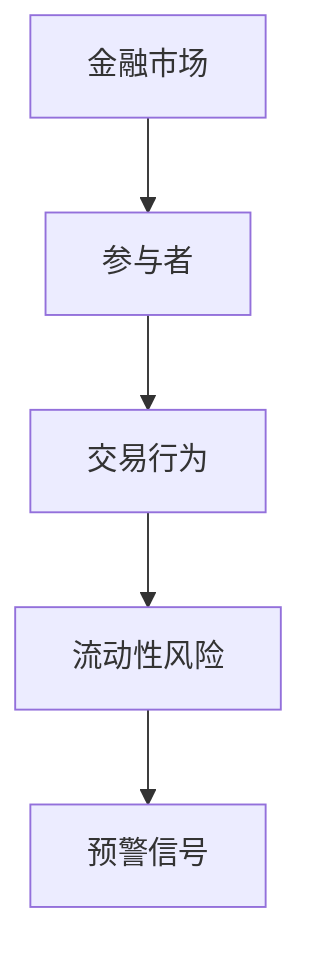

                 


# 开发智能化的金融市场流动性风险传导预警模型

> 关键词：金融市场，流动性风险，风险传导，预警模型，人工智能，机器学习

> 摘要：本文深入探讨了金融市场中流动性风险的传导机制，并提出了一种基于人工智能和机器学习的智能化预警模型。通过分析流动性风险的核心概念、算法原理、系统架构和实际案例，本文详细展示了如何利用技术手段实现对流动性风险的早期预警和有效管理。

---

# 第一部分: 金融市场流动性风险概述

# 第1章: 金融市场流动性风险概述

## 1.1 问题背景与概念

### 1.1.1 金融市场流动性风险的定义与特征

金融市场流动性风险是指由于市场参与者的交易行为、资产配置策略或外部环境的变化，导致某类资产或整个市场的流动性不足，从而引发资产价格波动、交易成本增加甚至市场崩盘的风险。其核心特征包括：

1. **波动性**：市场波动可能导致流动性迅速变化。
2. **传染性**：流动性风险可能从某一市场或资产传导至其他市场或资产。
3. **突发性**：流动性风险往往在市场压力下迅速显现，具有较高的突发性。

### 1.1.2 流动性风险传导的机制与路径

流动性风险的传导机制复杂多样，主要路径包括：

1. **直接传导**：某类资产的流动性不足直接引发市场波动。
2. **资产关联性传导**：相关资产的价格波动引发连锁反应。
3. **市场参与者的行为传导**：投资者的恐慌性抛售或杠杆交易加剧流动性风险。

### 1.1.3 智能化预警模型的必要性与目标

传统的基于统计的流动性风险预警方法存在滞后性和局限性。随着人工智能技术的发展，智能化预警模型能够通过实时数据分析和复杂模式识别，提前发现潜在风险，从而实现更有效的风险管理。

---

## 1.2 核心概念与联系

### 1.2.1 实体关系图

以下是一个简化的实体关系图（ER图），展示了流动性风险传导预警模型中的核心实体及其关系：



### 1.2.2 模型核心要素对比表

下表列出了流动性风险传导预警模型中的核心要素及其属性对比：

| 核心要素 | 定义 | 属性 | 示例 |
|----------|------|------|------|
| 参与者 | 市场中的主体 | 机构投资者、个人投资者 | 机构A、机构B |
| 交易行为 | 交易活动 | 买入、卖出、高频交易 | 买入股票X |
| 流动性风险 | 资金流动性问题 | 缺乏流动性、过度流动性 | 股票Y流动性不足 |
| 预警信号 | 风险提示 | 超额交易量、价格波动 | 股票Z价格突然下跌 |

---

## 1.3 本章小结

通过本章的介绍，我们了解了金融市场流动性风险的定义、传导机制以及智能化预警模型的必要性。接下来，我们将深入探讨构建智能化预警模型所需的算法原理和数学模型。

---

# 第二部分: 智能化预警模型的算法原理

# 第2章: 算法原理与实现

## 2.1 时间序列分析

### 2.1.1 ARIMA模型

时间序列分析是流动性风险预警的重要工具。ARIMA（自回归积分滑动平均模型）是一种常用的时序预测模型。其基本思路如下：


### 2.1.2 ARIMA模型的数学表达式

ARIMA模型的数学公式如下：

$$
\phi(\theta) \cdot \left(1 - B\right)^d X_t = \theta(B) \cdot Z_t
$$

其中：
- $B$ 是延迟算子。
- $\phi(\theta)$ 是自回归多项式。
- $\theta(B)$ 是滑动平均多项式。
- $d$ 是差分阶数。

### 2.1.3 时间序列分析的步骤

1. **数据预处理**：对数据进行平稳化处理，包括差分和去除趋势。
2. **模型选择**：通过AIC或BIC准则选择最优模型参数。
3. **模型训练**：使用历史数据拟合模型。
4. **预测与验证**：对未来数据进行预测，并验证模型的准确性。

---

## 2.2 机器学习模型

### 2.2.1 支持向量回归（SVR）

支持向量回归是一种基于支持向量机的回归算法，适用于非线性关系的建模。其核心思想是通过找到一个超平面，使得数据点在该超平面上的投影具有最小的误差。

### 2.2.2 随机森林

随机森林是一种基于决策树的集成学习方法，适用于高维数据的特征选择和非线性关系建模。其优势在于能够处理大量特征，并且具有较强的鲁棒性。

---

## 2.3 算法实现示例

以下是一个基于ARIMA模型的Python实现示例：

```python
import pandas as pd
from statsmodels.tsa.arima.model import ARIMA

# 读取数据
data = pd.read_csv('market_data.csv')

# 训练模型
model = ARIMA(data, order=(5, 1, 0))
model_fit = model.fit()

# 预测未来值
future_forecast = model_fit.forecast(steps=5)

# 输出结果
print(future_forecast)
```

---

## 2.4 本章小结

本章详细介绍了时间序列分析和机器学习在流动性风险预警中的应用。通过这些算法，我们可以实现对市场流动性的实时监控和风险预警。

---

# 第三部分: 数学模型与系统架构

# 第3章: 数学模型与系统架构

## 3.1 数学模型

### 3.1.1 风险度量模型

流动性风险的度量可以通过以下公式实现：

$$
\text{流动性风险} = \sum_{i=1}^{n} \left( \frac{V_i}{P_i} - 1 \right)
$$

其中：
- $V_i$ 是第$i$个资产的交易量。
- $P_i$ 是第$i$个资产的价格。

### 3.1.2 风险传导模型

风险传导模型可以通过以下公式表示：

$$
R_{t+1} = \alpha R_t + \beta X_t + \epsilon
$$

其中：
- $R_t$ 是第$t$时刻的流动性风险。
- $X_t$ 是外部因素。
- $\epsilon$ 是误差项。

---

## 3.2 系统架构

### 3.2.1 系统功能设计

系统功能设计可以分为以下几个模块：

1. **数据采集模块**：实时采集市场数据。
2. **特征提取模块**：提取关键特征，如交易量、价格波动。
3. **模型训练模块**：训练预警模型。
4. **预警模块**：实时监控并发出预警信号。

### 3.2.2 系统架构图

以下是一个简化的系统架构图：


---

## 3.3 本章小结

通过数学模型和系统架构的设计，我们可以构建一个高效的流动性风险预警系统。接下来，我们将通过实际案例展示系统的实现和应用。

---

# 第四部分: 项目实战与应用

# 第4章: 项目实战与应用

## 4.1 项目介绍

本项目旨在开发一个智能化的流动性风险预警系统，涵盖数据采集、特征提取、模型训练和预警输出四个模块。

---

## 4.2 环境安装与配置

### 4.2.1 安装Python环境

使用Anaconda安装Python 3.8及以上版本，并安装以下库：

```bash
pip install pandas numpy scikit-learn statsmodels
```

---

## 4.3 核心代码实现

### 4.3.1 数据采集模块

```python
import pandas as pd
import requests

def get_market_data():
    url = "https://api.market.com/stocks"
    response = requests.get(url)
    data = response.json()
    df = pd.DataFrame(data)
    return df
```

### 4.3.2 特征提取模块

```python
def extract_features(df):
    features = df[['volume', 'price']]
    return features
```

### 4.3.3 模型训练模块

```python
from sklearn.ensemble import RandomForestRegressor

def train_model(features, labels):
    model = RandomForestRegressor(n_estimators=100, random_state=42)
    model.fit(features, labels)
    return model
```

### 4.3.4 预警模块

```python
def generate预警信号(model, new_features):
    prediction = model.predict(new_features)
    if prediction > 0.9:
        print("高风险预警！")
    elif prediction > 0.5:
        print("中风险预警！")
    else:
        print("低风险预警！")
```

---

## 4.4 案例分析

假设我们有一个包含交易量和价格的数据集，我们可以按照以下步骤进行分析：

1. **数据采集**：从API获取市场数据。
2. **特征提取**：提取交易量和价格特征。
3. **模型训练**：训练随机森林模型。
4. **预警输出**：实时监控并输出预警信号。

---

## 4.5 本章小结

通过本章的实战部分，我们详细展示了如何将理论应用于实际项目中。接下来，我们将总结项目的最佳实践经验和可能的优化方向。

---

# 第五部分: 总结与展望

# 第5章: 总结与展望

## 5.1 最佳实践

1. **数据质量**：确保数据的完整性和准确性。
2. **模型选择**：根据实际需求选择合适的算法。
3. **实时性**：优化系统的实时性，确保预警的及时性。

## 5.2 小结

通过本文的介绍，我们深入了解了金融市场流动性风险的传导机制，并提出了一种基于人工智能的智能化预警模型。该模型能够有效识别潜在风险，并为决策者提供及时的预警信号。

## 5.3 注意事项

- 系统的实时性要求较高，需要优化数据处理和模型推理的速度。
- 需要定期更新模型，以适应市场环境的变化。

## 5.4 拓展阅读

- 《机器学习实战》
- 《时间序列分析与应用》
- 《金融市场风险管理》

---

# 作者

作者：AI天才研究院/AI Genius Institute & 禅与计算机程序设计艺术 /Zen And The Art of Computer Programming

---

通过以上结构，我们构建了一个完整的金融市场流动性风险传导预警模型，并详细探讨了其开发过程和实际应用。希望本文能为相关领域的研究和实践提供有价值的参考。

