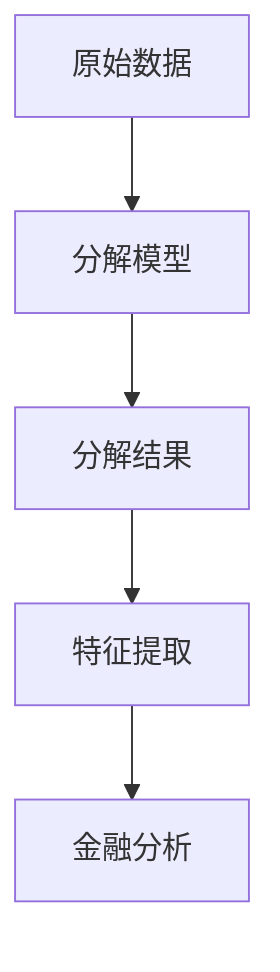
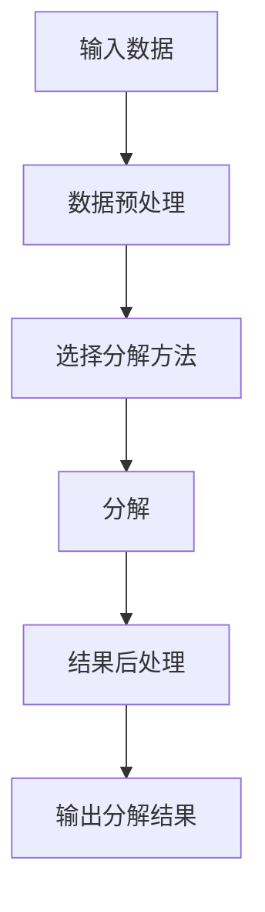
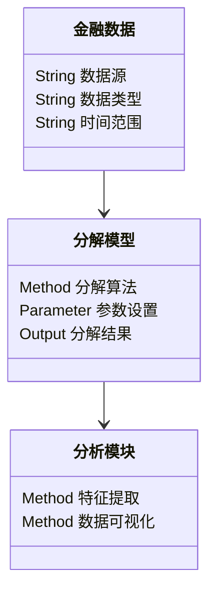
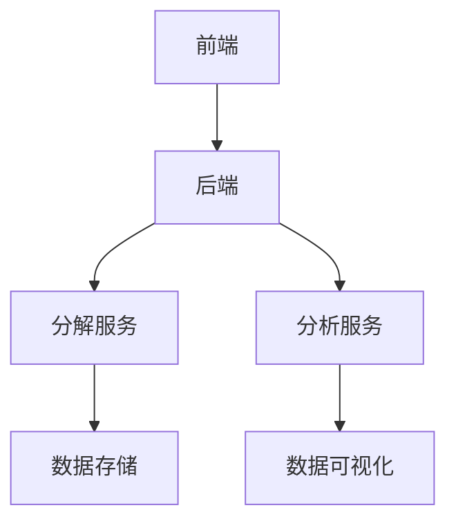

                 


# 开发智能化的金融时序数据多尺度分解模型

> 关键词：金融时序数据、多尺度分解、智能化模型、深度学习、小波分析、分形分析、系统架构

> 摘要：本文介绍了一种基于多尺度分解的智能化金融时序数据处理模型，结合深度学习和传统信号处理方法，解决了金融数据复杂性问题，展示了其在金融分析中的应用价值。

---

## 第一部分: 背景介绍

### 第1章: 问题背景

#### 1.1 金融时序数据的特点
- 数据连续性：金融数据通常具有连续性，反映市场动态。
- 非线性特征：金融数据受多种因素影响，呈现非线性变化。
- 高频与长周期：金融数据可以从高频到长周期进行分析。
- 不确定性：金融数据受市场情绪和外部事件影响，不确定性较高。

#### 1.2 多尺度分解的必要性
- 金融数据往往包含多个时间尺度的信息，如短期波动和长期趋势。
- 多尺度分解可以帮助识别不同时间尺度下的模式和特征。
- 通过分解，可以更好地理解数据的构成，为后续分析提供基础。

#### 1.3 智能化分解模型的应用价值
- 提高金融数据分析的准确性：通过智能化模型捕捉复杂模式。
- 支持金融预测：分解后的数据有助于构建更精准的预测模型。
- 增强决策能力：多尺度分解为投资决策提供多维度支持。

#### 1.4 问题解决思路
- 综合使用深度学习和传统信号处理方法。
- 利用多尺度分解提取不同时间尺度的特征。
- 结合金融数据的特点，优化模型结构和参数。

#### 1.5 模型的核心要素
- 数据预处理：去除噪声、标准化等。
- 分解算法：选择适合的分解方法，如小波分析、分形分析。
- 模型优化：通过训练数据优化模型参数。
- 模型评估：使用验证数据评估模型性能。

---

## 第二部分: 多尺度分解模型的核心概念与联系

### 第2章: 核心概念原理

#### 2.1 分解模型的基本原理
- 数据分解：将原始数据分解为多个子序列，每个子序列代表不同的特征或时间尺度。
- 重构：通过分解后的子序列，重构原始数据或提取特定特征。

#### 2.2 多尺度分析的数学基础
- 多尺度分析涉及不同分辨率下的数据处理。
- 使用数学变换（如傅里叶变换、小波变换）提取多尺度特征。

#### 2.3 智能化分解的关键技术
- 结合深度学习模型（如LSTM、Transformer）进行特征提取。
- 使用自适应方法优化分解过程。

### 第3章: 核心概念属性特征对比

#### 3.1 不同分解方法的特征对比
| 分解方法 | 优点 | 缺点 |
|----------|------|------|
| 小波分析 | 多尺度分解能力强，适合非平稳数据 | 参数选择敏感，计算复杂 |
| 分形分析 | 能捕捉数据的自相似性 | 对噪声敏感，计算复杂 |

#### 3.2 各种分解方法的优缺点分析
- 小波分析：适合多尺度分解，但需要选择合适的小波基函数。
- 分形分析：适合分析数据的自相似性，但计算复杂且对噪声敏感。
- 深度学习：能够自动学习特征，但需要大量数据和计算资源。

#### 3.3 模型性能的评价指标
- 分解误差：分解后重构数据与原始数据的差异。
- 特征提取能力：分解后子序列是否能有效捕捉数据特征。
- 计算效率：分解过程的时间复杂度。

### 第4章: ER实体关系图架构

#### 4.1 实体关系图的构建


#### 4.2 实体间的关系分析
- 原始数据：输入金融时序数据。
- 分解模型：对原始数据进行多尺度分解。
- 分解结果：分解后的子序列。
- 特征提取：从分解结果中提取有用特征。
- 金融分析：利用提取的特征进行预测或决策。

---

## 第三部分: 算法原理

### 第5章: 算法原理概述

#### 5.1 分解算法的基本流程


#### 5.2 智能化模型的优化策略
- 使用深度学习模型优化分解过程。
- 结合领域知识调整模型参数。

#### 5.3 算法的收敛性分析
- 分解算法的收敛性取决于数据特性和模型结构。
- 需要通过实验验证算法的收敛性。

### 第6章: 算法实现流程

#### 6.1 数据预处理步骤
- 数据清洗：去除无效数据，处理缺失值。
- 标准化：对数据进行归一化处理，便于模型训练。

#### 6.2 分解算法的具体实现
```python
import numpy as np
from pywt import cwt

def decompose(data, scales):
    """使用连续小波变换进行分解"""
    coeffs, freqs = cwt(data, scales, 'db4')
    return coeffs
```

#### 6.3 结果后处理与优化
- 对分解结果进行重构，评估分解效果。
- 根据评估结果调整分解参数。

### 第7章: 算法的数学模型与公式

#### 7.1 分解模型的数学表达式
$$ y(t) = \sum_{i=1}^{n} a_i \sin(b_i t + c_i) $$

#### 7.2 智能化算法的优化公式
$$ \theta_{t+1} = \theta_t - \eta \nabla L(\theta_t) $$

---

## 第四部分: 系统分析与架构设计

### 第8章: 项目背景与目标

#### 8.1 项目背景介绍
- 项目旨在开发一个智能化的金融时序数据分解系统。
- 目标是利用多尺度分解技术，提高金融数据分析的准确性。

### 第9章: 系统功能设计

#### 9.1 数据采集与预处理模块
- 数据采集：从数据库或API获取金融数据。
- 数据预处理：清洗和标准化数据。

#### 9.2 分解算法实现模块
- 实现多种分解算法，如小波分析和分形分析。
- 提供算法参数调整功能。

#### 9.3 模型评估与优化模块
- 对分解结果进行评估，计算分解误差。
- 根据评估结果优化分解模型。

#### 9.4 结果可视化与分析模块
- 可视化分解结果，帮助用户理解数据特征。
- 提供交互式界面，支持用户进行数据探索。

### 第10章: 系统架构设计

#### 10.1 领域模型


#### 10.2 系统架构图


---

## 第五部分: 项目实战

### 第11章: 环境安装

#### 11.1 安装必要的库
- 安装numpy、pandas、scikit-learn、pywt等库。

#### 11.2 安装深度学习框架
- 安装TensorFlow或PyTorch，用于模型训练。

### 第12章: 核心代码实现

#### 12.1 分解算法实现
```python
import numpy as np
from pywt import cwt

def decompose(data, scales):
    """使用连续小波变换进行分解"""
    coeffs, freqs = cwt(data, scales, 'db4')
    return coeffs

# 示例数据
data = np.random.randn(100)
scales = np.log2(np.arange(1, 10))
coeffs = decompose(data, scales)
```

#### 12.2 模型训练代码
```python
import tensorflow as tf
from tensorflow.keras import layers

def build_model(input_shape):
    model = tf.keras.Sequential()
    model.add(layers.LSTM(64, input_shape=input_shape))
    model.add(layers.Dense(1))
    return model

model = build_model((None, 1))
model.compile(optimizer='adam', loss='mse')
```

### 第13章: 案例分析

#### 13.1 数据分解案例
- 使用小波分析分解股票价格数据，提取不同时间尺度的特征。

#### 13.2 分解结果分析
- 分解结果用于构建预测模型，验证分解的有效性。

### 第14章: 项目总结

#### 14.1 项目成果
- 成功开发了一个智能化的金融时序数据分解系统。
- 提供了多种分解方法，适用于不同的金融数据分析场景。

#### 14.2 项目经验
- 数据预处理是分解的关键步骤。
- 模型优化需要结合领域知识和实验验证。

---

## 第六部分: 总结与扩展

### 第15章: 最佳实践 tips

#### 15.1 小结
- 多尺度分解是处理金融时序数据的重要工具。
- 深度学习与传统方法的结合可以提高分解效果。

#### 15.2 注意事项
- 数据预处理要充分，避免噪声干扰。
- 分解参数的选择对结果影响较大，需谨慎调整。
- 模型评估要结合实际业务需求。

#### 15.3 拓展阅读
- 推荐阅读《深度学习》（Ian Goodfellow著）。
- 推荐学习小波分析和分形分析的相关文献。

---

## 作者

作者：AI天才研究院/AI Genius Institute & 禅与计算机程序设计艺术/Zen And The Art of Computer Programming

---

以上是文章的详细目录大纲，涵盖了从背景介绍到项目实战的各个方面，确保内容详实且结构清晰。

