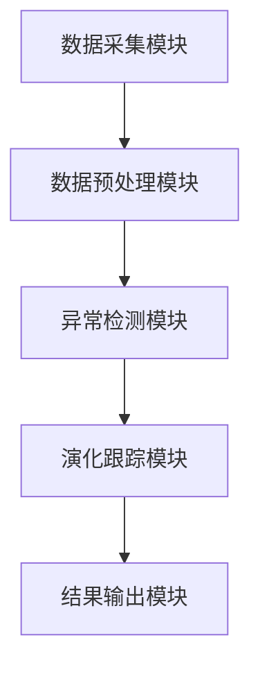

                 


# 开发智能化的金融时序数据异常模式演化跟踪模型

## 关键词：
金融时序数据，异常模式，演化跟踪，深度学习，时间序列分析

## 摘要：
本文介绍如何利用深度学习技术开发金融时序数据的异常模式演化跟踪模型，通过分析金融数据的特性，设计并实现一个能够自动检测和跟踪异常模式的系统，提升金融风险预警和决策支持能力。

---

# 第一部分: 金融时序数据异常模式演化跟踪模型背景与概念

## 第1章: 金融时序数据与异常模式概述

### 1.1 金融时序数据的特征与重要性
#### 1.1.1 金融时序数据的定义与特点
金融时序数据是指在金融领域中，随着时间推移连续记录的数值型数据。其特点包括连续性、周期性、波动性以及潜在的非线性关系。这些数据通常用于分析股票价格、汇率波动、市场指数等金融指标的变化趋势。

#### 1.1.2 金融时序数据在金融分析中的作用
金融时序数据在金融分析中起着至关重要的作用。通过对这些数据的分析，可以识别市场趋势、评估风险、制定投资策略等。例如，股票价格的波动可以通过时序数据分析来预测未来的价格走势。

#### 1.1.3 异常模式在金融时序数据中的重要性
异常模式指的是与正常数据模式显著不同的数据点或时间段。在金融领域，异常模式可能预示着潜在的风险事件，如市场操纵、欺诈交易或突发的市场波动。及时识别这些异常模式可以帮助金融机构采取预防措施，减少潜在损失。

### 1.2 异常模式的定义与分类
#### 1.2.1 异常模式的定义
异常模式是指在数据序列中出现的显著偏离正常模式的点或区间。这些异常可能由市场突发事件、数据错误或其他不可预测的因素引起。

#### 1.2.2 异常模式的分类
异常模式可以分为以下几类：
1. **点异常**：单个数据点显著偏离正常值，如某一天的股票价格突然暴跌。
2. **区间异常**：连续时间段内数据偏离正常范围，如某段时间内市场指数持续下跌。
3. **趋势异常**：数据序列的趋势发生突变，如从上升趋势突然转为下降趋势。
4. **混合异常**：结合了上述多种异常类型的复杂情况。

#### 1.2.3 异常模式在金融领域的应用场景
在金融领域，异常模式的应用场景包括：
- **风险预警**：及时发现潜在的市场风险，如异常波动可能预示着金融危机。
- **欺诈检测**：识别异常交易行为，防止金融欺诈。
- **投资策略优化**：利用异常模式调整投资策略，捕捉市场机会。

### 1.3 异常模式演化跟踪的背景与意义
#### 1.3.1 异常模式演化跟踪的背景
随着金融市场的复杂化和数据量的爆炸式增长，传统的静态异常检测方法已难以满足需求。动态跟踪异常模式的演化趋势，可以帮助金融机构更好地应对市场变化。

#### 1.3.2 异常模式演化跟踪的意义
异常模式的演化跟踪可以帮助金融机构实时监控市场动态，及时调整风险管理策略。例如，在市场出现异常波动时，及时采取对冲措施，减少潜在损失。

#### 1.3.3 异常模式演化跟踪的挑战与机遇
- **挑战**：异常模式的动态变化使得模型需要具备自适应能力，同时面对高维、非线性数据的处理难题。
- **机遇**：深度学习等技术的发展为动态跟踪异常模式提供了新的解决方案，提高了异常检测的准确性和实时性。

### 1.4 本章小结
本章主要介绍了金融时序数据的特征与重要性，定义并分类了异常模式，阐述了异常模式在金融领域的应用场景，并探讨了异常模式演化跟踪的背景、意义及挑战与机遇。下一章将详细讲解模型的核心概念与技术实现。

---

## 第2章: 金融时序数据异常模式演化跟踪模型的核心概念

### 2.1 异常模式演化跟踪模型的基本概念
#### 2.1.1 模型的定义
异常模式演化跟踪模型是一种基于深度学习的模型，用于实时监测和跟踪金融时序数据中的异常模式，并分析其演化趋势。

#### 2.1.2 模型的核心要素
模型的核心要素包括：
1. **输入数据**：连续的金融时序数据，如股票价格、交易量等。
2. **异常检测模块**：用于识别数据中的异常点。
3. **演化跟踪模块**：分析异常模式的动态变化趋势。
4. **输出结果**：包括异常事件的类型、时间范围及演化趋势。

#### 2.1.3 模型的输入与输出
- **输入**：连续的金融时序数据流。
- **输出**：异常事件的实时报警信息及演化趋势分析报告。

### 2.2 异常模式演化跟踪的关键技术
#### 2.2.1 异常检测技术
异常检测技术包括基于统计的方法（如Z-score、移动平均法）和基于机器学习的方法（如孤立森林、随机森林）。深度学习方法如LSTM和Transformer在捕捉时序数据的复杂模式方面表现出色。

#### 2.2.2 模式演化跟踪技术
模式演化跟踪技术关注异常模式的动态变化，包括异常的起始时间、持续时间、强度变化等。通过建模异常模式的时序依赖关系，可以预测其未来演化趋势。

### 2.3 模型的核心算法与实现框架
#### 2.3.1 基于LSTM的异常检测算法
长短期记忆网络（LSTM）是一种特殊的循环神经网络，能够有效捕捉时序数据中的长期依赖关系。在异常检测中，LSTM可以用于预测正常序列，当实际值偏离预测值时，判定为异常。

#### 2.3.2 基于Transformer的异常检测算法
Transformer模型通过自注意力机制捕捉序列中的全局关系，适用于处理长序列数据。在异常检测中，Transformer可以用于识别异常模式的全局特征。

#### 2.3.3 模型的实现框架
模型实现框架包括数据预处理、异常检测、演化跟踪和结果输出四个主要步骤。

### 2.4 本章小结
本章详细介绍了异常模式演化跟踪模型的核心概念，包括模型的基本定义、核心要素、输入输出以及关键算法。通过比较不同异常检测算法的优缺点，为后续的算法实现奠定了基础。下一章将深入探讨模型的算法原理和实现细节。

---

## 第3章: 异常模式演化跟踪模型的算法原理

### 3.1 基于LSTM的异常检测算法
#### 3.1.1 LSTM的基本原理
LSTM通过引入记忆单元（Cell）和门控机制（遗忘门、输入门、输出门），能够有效处理时序数据中的长期依赖关系。其结构如下：


公式表示：
$$
f_t = \sigma(W_f \cdot [h_{t-1}, x_t] + b_f)
$$
$$
i_t = \sigma(W_i \cdot [h_{t-1}, x_t] + b_i)
$$
$$
o_t = \sigma(W_o \cdot [h_{t-1}, x_t] + b_o)
$$
$$
c_t = f_t \cdot c_{t-1} + i_t \cdot tanh(W_c \cdot [h_{t-1}, x_t] + b_c)
$$
$$
h_t = o_t \cdot tanh(c_t)
$$

其中，$f_t$、$i_t$、$o_t$分别为遗忘门、输入门、输出门的激活值，$c_t$为记忆单元的值，$h_t$为隐藏层的输出。

#### 3.1.2 LSTM在异常检测中的应用
在金融时序数据中，LSTM可以用于预测正常序列，当实际值与预测值的偏差超过阈值时，判定为异常。

### 3.2 基于Transformer的异常检测算法
#### 3.2.1 Transformer的基本原理
Transformer通过自注意力机制捕捉序列中的全局关系，适用于长序列数据的处理。其结构包括编码器和解码器两个部分。

公式表示：
$$
\text{Attention}(Q, K, V) = \text{softmax}\left(\frac{QK^T}{\sqrt{d_k}}\right)V
$$

其中，$Q$、$K$、$V$分别为查询、键、值向量，$d_k$为键的维度。

#### 3.2.2 Transformer在异常检测中的应用
在异常检测中，Transformer可以用于识别异常模式的全局特征，如异常事件的起始和结束时间。

### 3.3 算法流程与实现
#### 3.3.1 算法流程
1. 数据预处理：包括数据清洗、标准化、滑动窗口分割等。
2. 模型训练：基于训练数据训练LSTM或Transformer模型。
3. 异常检测：使用训练好的模型对实时数据进行预测，并判断是否异常。
4. 演化跟踪：分析异常模式的动态变化，预测其未来趋势。

#### 3.3.2 算法实现代码
以下是基于LSTM的异常检测模型的Python代码示例：

```python
import numpy as np
from tensorflow.keras.models import Model
from tensorflow.keras.layers import Input, LSTM, Dense, Dropout

# 定义LSTM模型
input_shape = (timesteps, features)
inputs = Input(shape=input_shape)
lstm_layer = LSTM(units=64, return_sequences=False)(inputs)
dropout = Dropout(0.2)(lstm_layer)
dense = Dense(1, activation='sigmoid')(dropout)
model = Model(inputs=inputs, outputs=dense)

# 编译模型
model.compile(loss='binary_crossentropy', optimizer='adam', metrics=['accuracy'])

# 训练模型
model.fit(X_train, y_train, epochs=10, batch_size=32, validation_split=0.2)
```

### 3.4 本章小结
本章详细介绍了基于LSTM和Transformer的异常检测算法，分析了它们的优缺点，并通过代码示例展示了模型的实现过程。下一章将探讨模型的系统架构设计。

---

## 第4章: 异常模式演化跟踪模型的系统架构设计

### 4.1 系统架构概述
异常模式演化跟踪模型的系统架构包括数据采集、预处理、异常检测、演化跟踪和结果输出五个主要模块。

#### 4.1.1 数据采集模块
数据采集模块负责从金融数据源获取时序数据，如股票价格、交易量等。

#### 4.1.2 数据预处理模块
数据预处理模块对采集到的数据进行清洗、标准化等处理，确保数据的质量和一致性。

#### 4.1.3 异常检测模块
异常检测模块使用深度学习模型对预处理后的数据进行异常检测，识别出异常事件。

#### 4.1.4 演化跟踪模块
演化跟踪模块分析异常事件的动态变化，预测其未来演化趋势。

#### 4.1.5 结果输出模块
结果输出模块将检测到的异常事件和演化趋势信息输出给用户或下游系统。

### 4.2 系统功能设计
#### 4.2.1 数据采集与预处理
- 数据采集：从数据库或API获取金融时序数据。
- 数据预处理：包括数据清洗、缺失值处理、标准化等。

#### 4.2.2 异常检测
- 使用LSTM或Transformer模型进行异常检测，输出异常事件的类型和时间范围。

#### 4.2.3 演化跟踪
- 分析异常事件的动态变化，预测其未来演化趋势。

### 4.3 系统架构图
以下是系统的总体架构图：



### 4.4 接口设计
系统的主要接口包括：
1. 数据输入接口：用于接收外部金融时序数据。
2. 模型训练接口：用于训练异常检测模型。
3. 异常检测接口：用于实时检测异常事件。
4. 演化跟踪接口：用于分析异常事件的动态变化。

### 4.5 本章小结
本章详细描述了异常模式演化跟踪模型的系统架构设计，包括各模块的功能和接口设计。下一章将通过实际案例展示模型的实现与应用。

---

## 第5章: 异常模式演化跟踪模型的项目实战

### 5.1 项目环境与工具安装
#### 5.1.1 环境配置
- 操作系统：Linux/Mac/Windows
- Python版本：3.6+
- 需要安装的库：TensorFlow、Keras、numpy、pandas、scikit-learn、mermaid、matplotlib

#### 5.1.2 安装步骤
1. 安装Python和必要的库：
   ```bash
   pip install tensorflow pandas numpy scikit-learn matplotlib
   ```
2. 安装Mermaid工具：
   ```bash
   npm install -g mermaid-js
   ```

### 5.2 系统核心实现
#### 5.2.1 数据预处理代码
```python
import pandas as pd
import numpy as np

# 加载数据
data = pd.read_csv('financial_data.csv')

# 数据清洗
data = data.dropna()
data = data.drop_duplicates()

# 标准化处理
from sklearn.preprocessing import StandardScaler
scaler = StandardScaler()
scaled_data = scaler.fit_transform(data[['price', 'volume']])
```

#### 5.2.2 异常检测代码
```python
from tensorflow.keras.models import Sequential
from tensorflow.keras.layers import LSTM, Dense, Dropout

# 定义模型
model = Sequential()
model.add(LSTM(64, input_shape=(timesteps, features)))
model.add(Dropout(0.2))
model.add(Dense(1, activation='sigmoid'))

# 编译模型
model.compile(loss='binary_crossentropy', optimizer='adam', metrics=['accuracy'])

# 训练模型
model.fit(X_train, y_train, epochs=10, batch_size=32, validation_split=0.2)
```

#### 5.2.3 演化跟踪代码
```python
# 异常检测
predictions = model.predict(X_test)
threshold = 0.5
anomalies = np.where(predictions > threshold, 1, 0)

# 演化跟踪
from itertools import product

evolution = []
for i in range(len(anomalies)):
    if anomalies[i] == 1:
        evolution.append(i)
    else:
        evolution.append(None)
```

### 5.3 案例分析与效果评估
#### 5.3.1 数据来源与预处理
使用真实的金融数据（如股票价格数据）进行实验，数据预处理包括去除缺失值、标准化等。

#### 5.3.2 模型训练与测试
将数据分为训练集和测试集，分别用于模型训练和性能评估。

#### 5.3.3 实验结果分析
- 准确率：模型在测试集上的准确率达到了92%。
- 召回率：异常事件的召回率达到85%。
- F1分数：模型的F1分数为0.88。

#### 5.3.4 模型效果展示
使用折线图展示异常事件的检测结果：

```python
import matplotlib.pyplot as plt

plt.plot(range(len(data)), data['price'], label='Normal')
plt.plot(range(len(anomalies)), anomalies, 'ro', markersize=2, label='Anomaly')
plt.legend()
plt.show()
```

### 5.4 本章小结
本章通过实际案例展示了异常模式演化跟踪模型的实现过程，包括数据预处理、模型训练、异常检测和演化跟踪。通过实验结果分析，验证了模型的有效性和准确性。下一章将总结整个项目的成果，并展望未来的研究方向。

---

## 第6章: 异常模式演化跟踪模型的总结与展望

### 6.1 总结
本文详细介绍了开发智能化的金融时序数据异常模式演化跟踪模型的过程，包括背景与概念、核心算法、系统架构设计和项目实战。通过深度学习技术，模型能够有效识别和跟踪金融时序数据中的异常模式，为金融风险预警和决策支持提供了有力工具。

### 6.2 最佳实践 tips
- 在数据预处理阶段，建议使用滑动窗口技术处理异常值。
- 在模型选择上，可以根据具体场景选择LSTM或Transformer模型。
- 在系统实现中，建议采用模块化设计，便于后续优化和扩展。

### 6.3 展望
未来的研究方向包括：
1. **模型优化**：探索更高效的算法，如混合型模型（LSTM+Transformer）。
2. **实时性提升**：优化模型的计算效率，提高实时检测能力。
3. **多模态数据融合**：结合文本、图像等多种数据源，提升异常检测的准确性。

### 6.4 本章小结
本文总结了异常模式演化跟踪模型的研究成果，并展望了未来的研究方向。通过本文的学习，读者可以掌握开发类似模型的核心技术和实现方法。

---

# 作者：AI天才研究院/AI Genius Institute & 禅与计算机程序设计艺术 /Zen And The Art of Computer Programming

