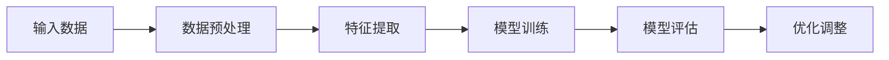
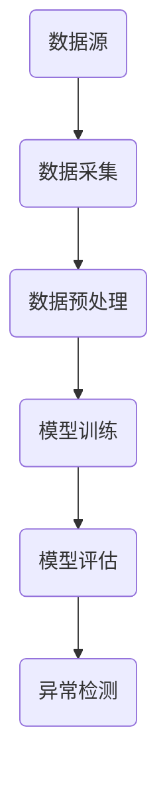
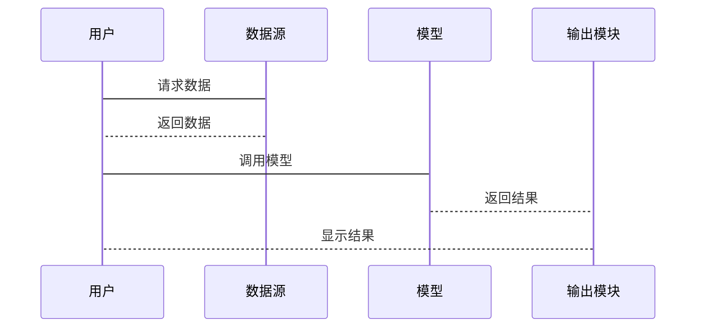

                 


# 开发智能化的金融时序数据异常模式识别模型

## 关键词：金融数据，异常检测，时序数据，深度学习，LSTM，GRU

## 摘要：  
在金融领域，时序数据的异常模式识别是保障金融安全、优化交易策略的重要手段。本文将详细介绍如何开发一个基于深度学习的金融时序数据异常模式识别模型，从背景分析到算法实现，再到系统架构设计，最后通过项目实战验证模型的有效性。

---

# 目录

## 第一部分：背景与概述

### 第1章：问题背景与数据特点

#### 1.1 问题背景
- 金融市场的波动性与不确定性
- 异常交易的潜在风险
- 异常模式识别的现实意义

#### 1.2 数据特点
- 时间序列数据的连续性与周期性
- 数据的高维度与复杂性
- 异常数据的稀疏性与多样性

#### 1.3 问题解决
- 异常模式识别的核心目标
- 边界条件与实现约束

### 第1章小结  
通过本章，我们明确了金融时序数据异常模式识别的重要性和基本特点。

---

## 第二部分：核心概念与系统架构

### 第2章：核心概念

#### 2.1 数据特征
- 基本统计特征（均值、标准差等）
- 时间序列特征（趋势、周期性等）

#### 2.2 异常模式
- 点异常、集体异常、上下文异常
- 异常模式的分类与对比

#### 2.3 模型框架
- 输入输出定义
- 模型的核心模块（数据预处理、特征提取、异常检测）

#### 2.4 实体关系图（ER图）
```mermaid
erd
    title 实体关系图
    User {
        id
        username
        password
    }
    Transaction {
        id
        amount
        time
        user_id
    }
    Model {
        id
        name
        type
        input_type
    }
    Model.isTrainedBy -> Transaction
```

### 第2章小结  
本章详细介绍了金融时序数据异常模式识别的核心概念，为后续的算法设计奠定了基础。

---

## 第三部分：算法原理与数学模型

### 第3章：深度学习算法原理

#### 3.1 LSTM网络
- LSTM的结构与优势
- 遗忘门、输入门与输出门的数学公式
$$
f_{\text{forget}}(x_t, h_{t-1}) = \sigma(W_f x_t + U_f h_{t-1} + b_f)
$$

#### 3.2 GRU网络
- GRU的结构与优势
- 门控机制的数学公式
$$
z_t = \sigma(W_z x_t + U_z h_{t-1} + b_z)
$$

#### 3.3 算法对比
- LSTM与GRU的对比分析
- 其他异常检测算法的对比

#### 3.4 模型训练流程


### 第3章小结  
本章详细讲解了LSTM和GRU的原理及优缺点，为后续模型的选择提供了依据。

---

## 第四部分：系统架构设计

### 第4章：系统架构

#### 4.1 系统功能设计
- 数据采集模块
- 数据预处理模块
- 模型训练模块
- 模型评估模块
- 异常检测模块

#### 4.2 系统架构图


#### 4.3 接口设计
- 数据输入接口
- 模型调用接口
- 结果输出接口

#### 4.4 交互流程


### 第4章小结  
本章详细设计了系统的架构，确保各模块协同工作，为项目的实施提供了指导。

---

## 第五部分：项目实战

### 第5章：项目实战

#### 5.1 环境安装
- Python版本要求
- 依赖库安装（如TensorFlow、Keras）

#### 5.2 核心代码实现
```python
import numpy as np
from tensorflow.keras.models import Sequential
from tensorflow.keras.layers import LSTM, Dense, GRU

model = Sequential()
model.add(LSTM(64, input_shape=(None, 1)))
model.add(Dense(1))
model.compile(loss='mean_squared_error', optimizer='adam')
model.fit(X_train, y_train, epochs=10, batch_size=32)
```

#### 5.3 案例分析
- 数据集的获取与处理
- 模型训练与评估
- 实际案例的分析与解读

#### 5.4 小结
通过本章的实战，我们验证了模型的有效性，并总结了经验教训。

---

## 第六部分：优化与展望

### 第6章：优化与展望

#### 6.1 模型优化
- 超参数调优
- 模型的可解释性优化
- 多模态数据的融合

#### 6.2 实际应用
- 金融风险控制
- 交易策略优化
- 监控系统的应用

#### 6.3 未来研究
- 更复杂异常模式的识别
- 多任务学习的应用
- 自适应模型的开发

### 第6章小结  
本章总结了项目的成果，并展望了未来的研究方向。

---

## 作者：AI天才研究院/AI Genius Institute & 禅与计算机程序设计艺术 /Zen And The Art of Computer Programming

---

以上是《开发智能化的金融时序数据异常模式识别模型》的详细目录大纲，涵盖了从背景分析到系统实现的全过程。每个章节内容丰富，结构清晰，适合技术人员和研究人员深入学习与实践。

