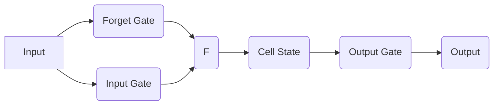
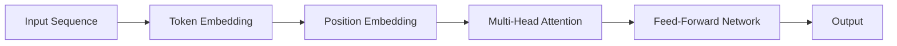
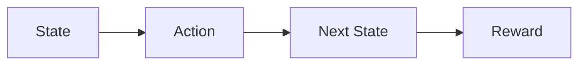

                 


# 开发智能化的金融时序数据预测模型

> 关键词：金融时序数据预测，人工智能，深度学习，LSTM，Transformer，强化学习

> 摘要：本文将详细探讨如何利用人工智能技术开发智能化的金融时序数据预测模型。从基础概念到高级算法，从模型构建到实际应用，本文将带领读者深入了解金融时序数据预测的核心技术和实践方法。

---

# 目录

1. [金融时序数据预测的背景与重要性](#金融时序数据预测的背景与重要性)
2. [AI模型在金融时序数据预测中的应用](#AI模型在金融时序数据预测中的应用)
3. [时序数据的特征工程](#时序数据的特征工程)
4. [基于深度学习的金融时序数据预测模型](#基于深度学习的金融时序数据预测模型)
5. [强化学习在金融预测中的应用](#强化学习在金融预测中的应用)
6. [金融时序数据预测系统的架构设计](#金融时序数据预测系统的架构设计)
7. [项目实战：开发一个金融时序数据预测模型](#项目实战开发一个金融时序数据预测模型)
8. [总结与展望](#总结与展望)

---

## 1. 金融时序数据预测的背景与重要性

### 1.1 金融时序数据的定义与特点
金融时序数据是指在金融市场上随时间变化的数值型数据，例如股票价格、汇率、债券收益率等。这些数据具有以下特点：
- **时间依赖性**：数据点之间存在时间相关性。
- **趋势性**：数据可能呈现长期上升或下降的趋势。
- **周期性**：数据可能受到季节性或经济周期的影响。
- **随机性**：金融市场受多种不可预测因素影响，数据往往具有随机性。

### 1.2 金融预测模型的核心目标
金融时序数据预测的核心目标是通过分析历史数据，预测未来的市场走势，从而为投资决策提供支持。具体目标包括：
- 提高预测的准确性。
- 减少预测的波动性。
- 提供可解释的预测结果。

### 1.3 AI驱动金融预测的必要性
传统金融预测方法（如统计模型）在处理非线性关系和复杂模式时表现有限。AI技术，特别是深度学习，能够捕捉复杂的时序模式，提高预测精度。

---

## 2. AI模型在金融时序数据预测中的应用

### 2.1 深度学习模型在金融预测中的应用
深度学习模型，尤其是循环神经网络（RNN）及其变体，如长短期记忆网络（LSTM）和Transformer，广泛应用于金融时序数据预测。

#### 2.1.1 LSTM网络在时序预测中的应用
LSTM通过门控机制有效处理长期依赖关系，适合捕捉金融数据中的长期趋势。

**LSTM结构图：**


#### 2.1.2 Transformer模型在金融时序数据中的应用
Transformer通过自注意力机制捕捉全局依赖关系，适用于高频金融数据的预测。

**Transformer结构图：**


### 2.2 强化学习在金融预测中的应用
强化学习通过模拟交易策略，优化投资组合，实现收益最大化。

**强化学习交易策略流程图：**


---

## 3. 时序数据的特征工程

### 3.1 时序数据预处理
- **数据清洗**：处理缺失值、异常值。
- **标准化/归一化**：统一数据尺度，便于模型训练。

### 3.2 时序数据特征提取
- **移动平均线（MA）**：平滑数据，识别趋势。
- **相对强弱指数（RSI）**：衡量市场超买或超卖状态。

### 3.3 数据的工程化处理
- **滑动窗口**：将时序数据转换为固定长度的窗口输入模型。
- **特征组合**：结合技术指标和市场情绪数据，丰富模型输入。

---

## 4. 基于深度学习的金融时序数据预测模型

### 4.1 深度学习模型的构建
- **模型结构**：设计适合时序数据的网络结构，如多层LSTM。
- **训练策略**：使用历史数据训练模型，调整超参数。

### 4.2 深度学习模型的训练与优化
- **早停法**：防止过拟合。
- **交叉验证**：评估模型泛化能力。

### 4.3 深度学习模型的评估与验证
- **评估指标**：MSE、MAE、R²。
- **回测分析**：验证模型在历史数据上的表现。

---

## 5. 强化学习在金融预测中的应用

### 5.1 强化学习的基本概念
- **状态空间**：市场当前状态（价格、交易量等）。
- **动作空间**：买卖决策。
- **奖励函数**：基于收益计算奖励。

### 5.2 强化学习在金融交易中的应用
- **策略优化**：通过强化学习优化交易策略。
- **动态调整**：根据市场变化实时调整策略。

---

## 6. 金融时序数据预测系统的架构设计

### 6.1 系统功能设计
- **数据采集**：从金融数据源获取实时数据。
- **特征提取**：生成模型输入特征。
- **模型预测**：输出预测结果。
- **结果展示**：可视化预测结果。

### 6.2 系统架构设计


---

## 7. 项目实战：开发一个金融时序数据预测模型

### 7.1 环境搭建
- **安装依赖**：TensorFlow、Keras、Pandas。

### 7.2 核心代码实现
```python
import numpy as np
import pandas as pd
from tensorflow.keras.models import Sequential
from tensorflow.keras.layers import LSTM, Dense, Dropout

# 数据预处理
data = pd.read_csv('stock_prices.csv')
features = data[['open', 'high', 'low', 'close']]
labels = data['next_day_price']

# 滑动窗口
window_size = 30
X = []
Y = []
for i in range(len(features) - window_size):
    X.append(features[i:i+window_size])
    Y.append(labels[i+window_size])

# 转换为 numpy 数组
X = np.array(X)
Y = np.array(Y)

# 模型构建
model = Sequential()
model.add(LSTM(64, return_sequences=True, input_shape=(window_size, 4)))
model.add(Dropout(0.2))
model.add(LSTM(32))
model.add(Dropout(0.2))
model.add(Dense(1))

# 模型训练
model.compile(loss='mean_squared_error', optimizer='adam')
model.fit(X, Y, epochs=50, batch_size=32)
```

### 7.3 实际案例分析
- 使用历史股票价格数据训练模型。
- 预测未来几天的价格走势。
- 对比预测结果与实际数据，评估模型性能。

---

## 8. 总结与展望

### 8.1 总结
本文详细介绍了开发智能化金融时序数据预测模型的全过程，从数据处理到模型构建，再到系统部署，为读者提供了全面的指导。

### 8.2 展望
未来，随着AI技术的进步，金融预测模型将更加智能化和个性化。结合实时数据流处理和强化学习，模型将能够更好地适应复杂多变的金融市场。

---

**作者：AI天才研究院 & 禅与计算机程序设计艺术**

