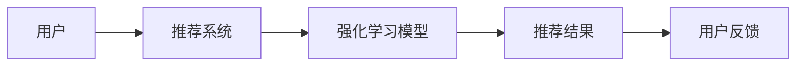
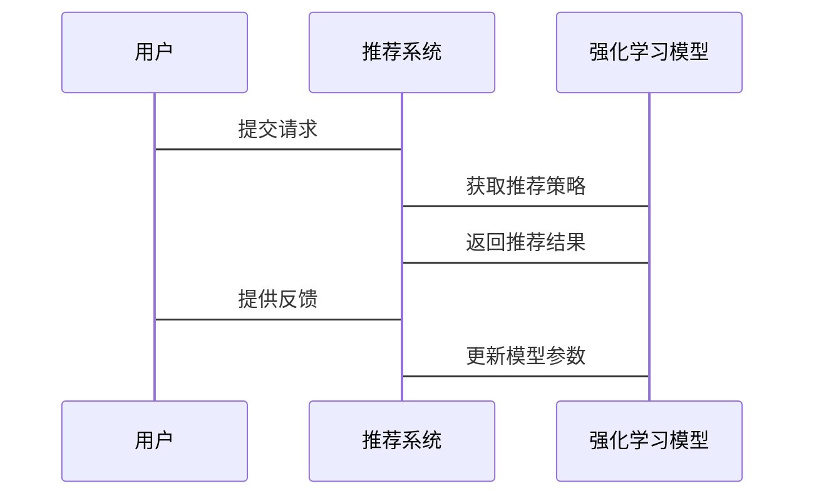

                 


# 强化学习在AI Agent个性化推荐中的应用

## 关键词
强化学习, AI Agent, 个性化推荐, 推荐系统, 算法原理, 系统设计, 实战案例

## 摘要
本文系统阐述了强化学习在AI Agent个性化推荐中的应用，从理论基础到算法实现，再到系统设计和项目实战，全面解析强化学习如何提升推荐系统的智能化水平。通过详细的技术分析和实际案例，本文揭示了强化学习在推荐系统中的独特优势和广泛前景。

---

## 第一部分: 强化学习与AI Agent概述

### 第1章: 强化学习的定义与核心概念

#### 1.1 强化学习的基本概念
##### 1.1.1 什么是强化学习
强化学习（Reinforcement Learning, RL）是一种机器学习范式，其中智能体通过与环境交互来学习策略，以最大化累积奖励。智能体通过试错的方式探索环境，逐步优化行为策略。

##### 1.1.2 强化学习的核心要素
- **状态（State）**：环境在某一时刻的观察。
- **动作（Action）**：智能体在给定状态下采取的行为。
- **奖励（Reward）**：智能体采取某个动作后获得的反馈，用于指导优化策略。
- **策略（Policy）**：智能体在给定状态下选择动作的概率分布。
- **值函数（Value Function）**：衡量某个状态下采取某种策略的期望收益。

##### 1.1.3 强化学习与监督学习的区别
| 特性 | 监督学习 | 强化学习 |
|------|----------|----------|
| 数据 | 标签数据 | 环境反馈 |
| 目标 | 最小化损失 | 最大化累积奖励 |
| 交互 | 非实时 | 实时动态 |

##### 1.1.4 强化学习在AI Agent中的应用
强化学习为AI Agent提供了动态决策的能力，使其能够根据实时反馈优化行为，广泛应用于游戏AI、机器人控制和推荐系统等领域。

#### 1.2 AI Agent的基本原理
##### 1.2.1 AI Agent的定义
AI Agent是一种智能实体，能够感知环境并采取行动以实现目标。Agent可以是软件程序、机器人或其他智能系统。

##### 1.2.2 AI Agent的分类
- **简单反射Agent**：基于当前输入做出反应。
- **基于模型的规划Agent**：维护环境模型，进行规划。
- **强化学习Agent**：通过与环境交互学习策略。

##### 1.2.3 AI Agent的核心功能
- **感知**：接收环境输入。
- **决策**：基于当前状态做出决策。
- **行动**：执行动作并获得反馈。

##### 1.2.4 AI Agent与强化学习的结合
强化学习为AI Agent提供了一种动态优化决策的机制，使其能够在复杂环境中自主学习和适应。

### 第2章: 强化学习在个性化推荐中的应用背景

#### 2.1 个性化推荐的定义与挑战
##### 2.1.1 个性化推荐的定义
个性化推荐是根据用户行为和偏好，推荐符合其兴趣的内容或产品。

##### 2.1.2 个性化推荐的核心问题
- **数据稀疏性**：用户数据有限时，推荐难度增加。
- **实时性要求**：推荐需要快速响应。
- **用户偏好变化**：用户的兴趣可能随时间变化。

##### 2.1.3 个性化推荐的挑战
- **数据量大**：处理海量数据需要高效算法。
- **模型复杂性**：推荐模型需考虑多种因素。
- **实时性要求**：推荐系统需要快速响应。

##### 2.1.4 强化学习在个性化推荐中的优势
强化学习通过实时反馈优化推荐策略，能够动态适应用户行为变化。

#### 2.2 强化学习在推荐系统中的应用现状
##### 2.2.1 基于强化学习的推荐系统
- **DQN（Deep Q-Networks）**：用于序列推荐。
- **PG（Policy Gradient）**：优化策略以最大化奖励。
- **A2C（Advantage Actor-Critic）**：结合Actor-Critic架构。

##### 2.2.2 基于强化学习的推荐算法
| 算法 | 核心思想 | 应用场景 |
|------|----------|----------|
| Q-Learning | 通过经验回放更新Q值 | 离线推荐 |
| DQN | 使用深度网络近似Q值 | 在线推荐 |
| PG | 优化策略参数 | 序列推荐 |

##### 2.2.3 强化学习在推荐系统中的发展趋势
- **多智能体协作**：多个Agent协同推荐。
- **结合图神经网络**：利用图结构信息提升推荐效果。
- **强化学习与联邦学习结合**：跨数据源推荐。

### 第3章: 强化学习的核心概念与数学模型

#### 3.1 强化学习的基本原理
##### 3.1.1 状态、动作、奖励的定义
- **状态（s）**：用户的行为、环境特征。
- **动作（a）**：推荐某个物品。
- **奖励（r）**：用户对推荐的反馈。

##### 3.1.2 马尔可夫决策过程（MDP）
MDP定义为一个五元组：(S, A, P, R, γ)，其中：
- S：状态空间。
- A：动作空间。
- P：状态转移概率。
- R：奖励函数。
- γ：折扣因子。

##### 3.1.3 动作价值函数（Q-value）
Q值定义为在状态s采取动作a后，未来累积奖励的期望值：
$$ Q(s, a) = r + γ \cdot \max_{a'} Q(s', a') $$

##### 3.1.4 策略评估与优化
策略评估通过动态规划计算状态价值，策略优化通过贪心算法选择最优动作。

#### 3.2 强化学习算法的数学模型
##### 3.2.1 Q-Learning算法
Q-Learning的更新公式：
$$ Q(s, a) \leftarrow Q(s, a) + \alpha [r + γ \max Q(s', a') - Q(s, a)] $$

##### 3.2.2 Deep Q-Networks（DQN）
使用深度神经网络近似Q值函数，通过经验回放和目标网络优化。

---

## 第二部分: 强化学习在个性化推荐中的算法实现

### 第4章: 基于强化学习的推荐算法实现

#### 4.1 Q-Learning算法实现
##### 4.1.1 算法流程
1. 初始化Q表。
2. 接收当前状态s。
3. 根据策略选择动作a。
4. 执行动作a，获得奖励r和新状态s'。
5. 更新Q表：Q(s, a) += α(r + γ·max Q(s', a') - Q(s, a))。

##### 4.1.2 代码实现
```python
class QLearning:
    def __init__(self, state_size, action_size, alpha=0.1, gamma=0.9):
        self.state_size = state_size
        self.action_size = action_size
        self.Q = np.zeros((state_size, action_size))
        self.alpha = alpha
        self.gamma = gamma

    def get_action(self, state):
        return np.argmax(self.Q[state])

    def update(self, state, action, reward, next_state):
        target = reward + self.gamma * np.max(self.Q[next_state])
        self.Q[state][action] += self.alpha * (target - self.Q[state][action])
```

#### 4.2 Deep Q-Networks（DQN）实现
##### 4.2.1 算法流程
1. 环境与主网络交互，记录经验。
2. 采样经验，更新目标网络。
3. 使用经验回放训练主网络。

##### 4.2.2 代码实现
```python
import torch
import torch.nn as nn

class DQN:
    def __init__(self, state_size, action_size, hidden_size=64):
        self.state_size = state_size
        self.action_size = action_size
        self.main_network = nn.Sequential(
            nn.Linear(state_size, hidden_size),
            nn.ReLU(),
            nn.Linear(hidden_size, action_size)
        )
        self.target_network = nn.Sequential(
            nn.Linear(state_size, hidden_size),
            nn.ReLU(),
            nn.Linear(hidden_size, action_size)
        )
        self.optimizer = torch.optim.Adam(self.main_network.parameters())

    def forward(self, state):
        return self.main_network(state)

    def update(self, batch_states, batch_actions, batch_rewards, batch_next_states):
        current_q = self.main_network(batch_states).gather(1, batch_actions)
        next_q = self.target_network(batch_next_states).max(1)[0].detach()
        target_q = batch_rewards + self.gamma * next_q
        loss = torch.mean((target_q - current_q).pow(2))
        self.optimizer.zero_grad()
        loss.backward()
        self.optimizer.step()
```

---

## 第三部分: 强化学习在个性化推荐中的系统设计

### 第5章: 系统分析与架构设计方案

#### 5.1 系统功能设计
##### 5.1.1 用户建模
用户建模包括用户画像、偏好分析和行为建模。

##### 5.1.2 内容建模
内容建模涉及物品特征提取和语义分析。

##### 5.1.3 推荐生成
基于强化学习的推荐生成策略，包括序列推荐和个性化推荐。

#### 5.2 系统架构设计
##### 5.2.1 系统架构图


##### 5.2.2 系统接口设计
- **输入接口**：接收用户行为和环境信息。
- **输出接口**：输出推荐结果和反馈信息。

##### 5.2.3 系统交互流程


---

## 第四部分: 强化学习在个性化推荐中的项目实战

### 第6章: 项目实战

#### 6.1 环境安装
安装必要的库：
```bash
pip install numpy torch matplotlib
```

#### 6.2 系统核心实现
##### 6.2.1 环境类实现
```python
class Environment:
    def __init__(self):
        self.state = 0

    def step(self, action):
        # 返回新的状态和奖励
        reward = action == self.state
        self.state = (self.state + 1) % 2
        return self.state, reward
```

##### 6.2.2 强化学习类实现
```python
class Agent:
    def __init__(self, state_size, action_size):
        self.state_size = state_size
        self.action_size = action_size
        self.Q = np.zeros((state_size, action_size))

    def take_action(self, state):
        return np.argmax(self.Q[state])

    def update_Q(self, state, action, reward, next_state):
        self.Q[state][action] += 0.1 * (reward + 0.95 * np.max(self.Q[next_state]) - self.Q[state][action])
```

##### 6.2.3 训练过程
```python
env = Environment()
agent = Agent(2, 2)

for episode in range(100):
    state = env.state
    action = agent.take_action(state)
    next_state, reward = env.step(action)
    agent.update_Q(state, action, reward, next_state)
```

#### 6.3 实验分析
##### 6.3.1 训练结果
绘制Q表的变化曲线：
```python
import matplotlib.pyplot as plt

plt.plot(range(100), Q_values)
plt.xlabel('Episode')
plt.ylabel('Q Value')
plt.show()
```

---

## 第五部分: 总结与展望

### 第7章: 总结与展望

#### 7.1 最佳实践 tips
- **选择合适的算法**：根据场景选择Q-Learning或DQN。
- **处理稀疏性**：使用经验回放缓解数据稀疏问题。
- **实时优化**：在线更新模型以适应用户行为变化。

#### 7.2 小结
强化学习通过实时反馈优化推荐策略，显著提升了个性化推荐的准确性和用户满意度。

#### 7.3 注意事项
- **数据质量**：确保数据足够多样。
- **模型复杂度**：平衡模型性能与计算成本。
- **用户隐私**：保护用户数据隐私。

#### 7.4 拓展阅读
- 《Reinforcement Learning: Theory and Algorithms》
- 《Deep Learning for Reinforcement Learning》

---

## 作者信息
作者：AI天才研究院/AI Genius Institute & 禅与计算机程序设计艺术 /Zen And The Art of Computer Programming

---

以上是基于强化学习在AI Agent个性化推荐中的应用的详细内容，涵盖了从理论到实践的各个方面，希望对读者有所帮助。

