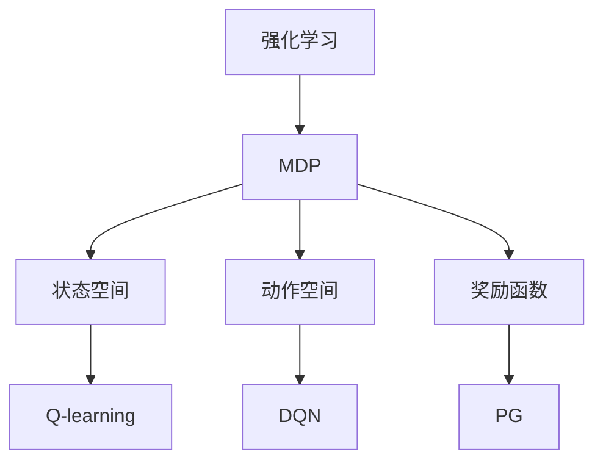
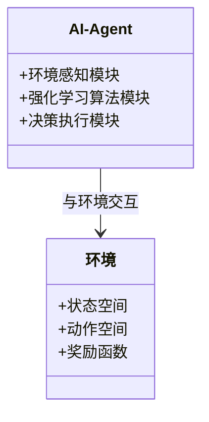
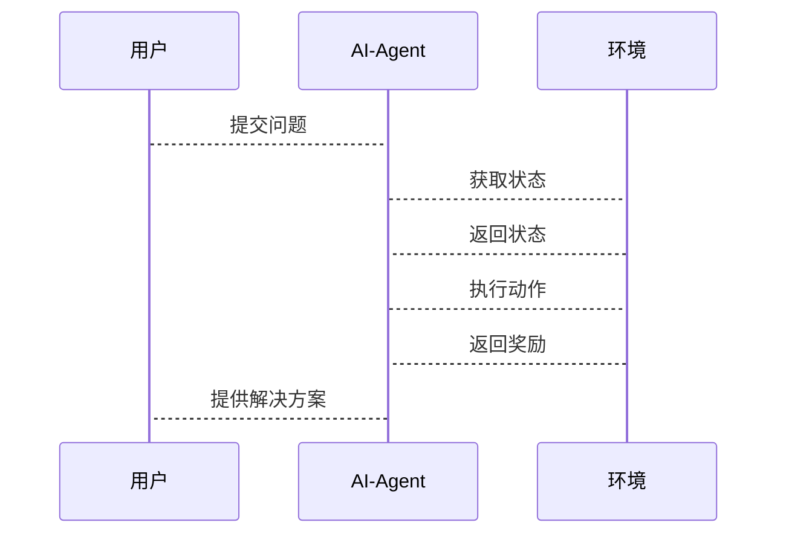

                 


# 《强化学习在AI Agent交互式学习中的应用》

---

## 关键词：  
强化学习, AI Agent, 交互式学习, 算法原理, 实战应用

---

## 摘要：  
本文详细探讨了强化学习在AI Agent交互式学习中的应用，从理论基础到算法实现，再到实际案例，全面解析了强化学习如何助力AI Agent实现智能决策与交互。文章首先介绍了强化学习和AI Agent的基本概念及其在交互式学习中的重要性，随后深入分析了强化学习的核心原理与算法，包括马尔可夫决策过程（MDP）、Q-learning、Deep Q-Network（DQN）等，并通过对比表格和Mermaid图展示了这些算法的特点与联系。接着，文章从系统架构的角度，详细阐述了AI Agent的系统设计与接口交互流程。最后，通过实际案例分析，展示了强化学习在智能客服中的应用，并总结了最佳实践和未来研究方向。

---

## 正文：

---

### 第一部分：强化学习与AI Agent基础

#### 第1章：强化学习与AI Agent概述

##### 1.1 强化学习的基本概念  
- **问题背景**：在AI领域，传统监督学习依赖于大量标注数据，而强化学习则通过与环境交互，逐步优化策略，适用于动态复杂环境下的决策问题。  
- **核心概念**：  
  - **状态（State）**：环境的当前情况。  
  - **动作（Action）**：AI Agent对环境采取的操作。  
  - **奖励（Reward）**：环境对AI Agent动作的反馈，用于指导优化策略。  
  - **策略（Policy）**：AI Agent在特定状态下选择动作的概率分布。  
- **强化学习与AI Agent的关系**：强化学习为AI Agent提供了一种通过试错优化决策的机制，使其能够在复杂环境中实现自主学习与适应。

##### 1.2 AI Agent的定义与特点  
- **定义**：AI Agent是一种能够感知环境、做出决策并执行动作的智能体。  
- **特点**：  
  - **自主性**：能够在没有外部干预的情况下自主运行。  
  - **反应性**：能够实时感知环境变化并做出响应。  
  - **目标导向性**：通过优化目标函数实现特定任务。  
- **应用场景**：游戏AI、智能机器人、自动驾驶、智能客服等。

##### 1.3 强化学习在AI Agent中的应用背景  
- **交互式学习的必要性**：AI Agent需要通过与用户或环境的交互不断优化自身行为。  
- **强化学习的优势**：  
  - **无需监督数据**：强化学习通过试错机制优化策略，适用于数据标注成本高的场景。  
  - **动态环境适应**：强化学习能够帮助AI Agent在动态环境中快速适应变化。  
- **当前研究与应用的现状**：  
  - 学术界：强化学习在AI Agent中的研究主要集中在算法优化与复杂环境适应。  
  - 工业界：强化学习已应用于游戏AI、智能推荐系统、智能客服等领域。

---

#### 第2章：强化学习的核心原理与算法

##### 2.1 强化学习的核心概念与原理  
- **马尔可夫决策过程（MDP）**：  
  - **定义**：MDP是一种用于描述强化学习问题的数学框架，包括状态空间、动作空间、转移概率和奖励函数。  
  - **特点**：环境的状态转移仅依赖于当前状态和动作，而不需要考虑之前的历史。  
- **Q-learning算法**：  
  - **原理**：通过构建Q值表，记录每个状态-动作对的期望奖励，逐步优化策略。  
  - **更新公式**：$$ Q(s, a) = Q(s, a) + \alpha (r + \gamma \max Q(s', a')) $$  
- **Deep Q-Network（DQN）算法**：  
  - **原理**：将Q值表替换为深度神经网络，通过经验回放和目标网络优化策略。  
  - **优势**：能够处理高维状态空间，适用于复杂环境。  

##### 2.2 强化学习的核心算法  
- **对比表格：强化学习算法的特点**  

| 算法名称       | 是否离线学习 | 是否需要经验回放 | 适用场景                     |
|----------------|--------------|------------------|------------------------------|
| Q-learning     | 离线         | 否               | 简单环境                     |
| DQN            | 在线         | 是               | 复杂环境                     |
| 策略梯度方法（PG）| 在线         | 是               | 高维动作空间                 |

- **Mermaid图：强化学习算法的关系图**  



##### 2.3 强化学习的数学模型  
- **状态转移概率矩阵**：  
  - 定义：描述从当前状态s到下一个状态s’的概率。  
  - 表示：$$ P(s' | s, a) $$  
- **Q值更新公式**：  
  - $$ Q(s, a) = Q(s, a) + \alpha (r + \gamma \max Q(s', a')) $$  
  - 参数解释：  
    - α：学习率。  
    - γ：折扣因子，表示未来奖励的权重。  

---

#### 第3章：强化学习与AI Agent的结合

##### 3.1 AI Agent的系统架构设计  
- **系统组成**：  
  - **感知层**：负责获取环境信息（如用户输入、传感器数据等）。  
  - **决策层**：基于强化学习算法生成动作（如推荐产品、调整参数等）。  
  - **执行层**：将决策转化为实际操作（如发送回复、执行命令等）。  
- **Mermaid图：AI Agent的系统架构图**  



##### 3.2 强化学习在AI Agent中的应用  
- **实际案例：智能客服系统**  
  - **问题描述**：智能客服需要根据用户输入推荐解决方案，同时优化用户满意度和效率。  
  - **解决方案**：  
    - 状态：用户的问题描述。  
    - 动作：推荐的解决方案。  
    - 奖励：用户满意度评分。  
  - **算法选择**：DQN算法，通过与用户的交互不断优化推荐策略。  

---

#### 第4章：强化学习在AI Agent中的系统实现

##### 4.1 系统设计与实现  
- **环境接口设计**：  
  - **输入接口**：接收用户输入或环境状态。  
  - **输出接口**：发送动作或反馈。  
- **Mermaid图：系统交互流程图**  



##### 4.2 代码实现与分析  
- **环境类**：  
  ```python
  class Environment:
      def __init__(self):
          self.state = None
          self.reward = 0

      def get_state(self):
          return self.state

      def set_state(self, state):
          self.state = state
  ```
- **AI Agent类**：  
  ```python
  class AI_Agent:
      def __init__(self, env):
          self.env = env
          self.q_table = {}

      def get_action(self, state):
          if state not in self.q_table:
              self.q_table[state] = {}
          return max(self.q_table[state].items(), key=lambda x: x[1])[0]

      def update_q_table(self, state, action, reward):
          if state not in self.q_table:
              self.q_table[state] = {}
          self.q_table[state][action] = reward
  ```
- **训练过程**：  
  ```python
  env = Environment()
  agent = AI_Agent(env)
  for episode in range(100):
      state = env.get_state()
      action = agent.get_action(state)
      env.set_state(new_state)
      reward = env.get_reward()
      agent.update_q_table(state, action, reward)
  ```

---

#### 第5章：强化学习在AI Agent中的实战应用

##### 5.1 案例分析：智能客服系统  
- **项目背景**：智能客服需要根据用户的问题推荐解决方案，同时优化用户体验。  
- **算法选择**：DQN算法，通过与用户的交互不断优化推荐策略。  
- **实现步骤**：  
  1. 数据收集：收集用户与客服的交互数据。  
  2. 状态定义：用户的问题描述。  
  3. 动作定义：推荐的解决方案。  
  4. 奖励设计：用户满意度评分。  
  5. 算法实现：基于DQN训练AI Agent的推荐策略。  
- **代码实现**：  
  ```python
  import numpy as np
  import random

  class DQN:
      def __init__(self, state_space, action_space):
          self.state_space = state_space
          self.action_space = action_space
          self.memory = []
          self.gamma = 0.95
          self.epsilon = 0.1
          self.model = self.build_model()

      def build_model(self):
          # 定义神经网络模型
          pass

      def remember(self, state, action, reward, next_state):
          self.memory.append((state, action, reward, next_state))

      def act(self, state):
          if random.random() < self.epsilon:
              return random.randint(0, self.action_space-1)
          q_values = self.model.predict(state)
          return np.argmax(q_values[0])

      def replay(self, batch_size):
          # 使用经验回放训练模型
          pass
  ```

##### 5.2 项目小结  
- **实现细节**：  
  - 状态空间的维度设计。  
  - 动作空间的大小确定。  
  - 奖励函数的设计与调优。  
- **优化技巧**：  
  - 经验回放的批量大小选择。  
  - 网络模型的结构优化。  

---

### 第二部分：强化学习的数学模型与系统架构

#### 第6章：强化学习的数学模型与算法优化

##### 6.1 数学模型的深入分析  
- **Q-learning的数学模型**：  
  - 更新公式：$$ Q(s, a) = Q(s, a) + \alpha (r + \gamma \max Q(s', a')) $$  
  - 参数解释：  
    - α：学习率，控制更新步长。  
    - γ：折扣因子，平衡当前与未来奖励的重要性。  

##### 6.2 策略梯度方法的数学模型  
- **Actor-Critic算法**：  
  - **策略网络（Actor）**：输出动作的概率分布。  
  - **价值网络（Critic）**：评估当前状态-动作对的Q值。  
  - 更新公式：  
    - **策略更新**：$$ \theta \leftarrow \theta + \alpha (r + \gamma Q(s', a') - Q(s, a)) \cdot \nabla_\theta \log \pi(a|s) $$  
    - **价值更新**：$$ Q(s, a) = Q(s, a) + \alpha (r + \gamma Q(s', a') - Q(s, a)) $$  

---

#### 第7章：强化学习在AI Agent中的系统架构与应用

##### 7.1 系统架构的优化与实现  
- **分布式架构**：  
  - 适用于大规模环境，通过分布式计算加速训练。  
  - 优势：提高计算效率，降低单点故障风险。  
- **集中式架构**：  
  - 适用于小规模环境，便于管理和协调。  
  - 优势：算法一致性好，易于调试。  

##### 7.2 系统接口与交互设计  
- **接口标准化**：  
  - 定义统一的接口规范，便于不同模块的协作。  
  - 示例：  
    ```python
    def get_state():
        pass

    def set_state(state):
        pass

    def get_reward():
        pass
    ```
- **交互流程优化**：  
  - 通过序列图展示系统的交互流程，确保各模块协同工作。  

---

### 第三部分：强化学习的实战与优化

#### 第8章：强化学习的实战应用与案例分析

##### 8.1 项目实战：智能客服系统的强化学习优化  
- **项目背景**：优化智能客服的用户推荐系统，提升用户满意度。  
- **算法选择**：DQN算法，通过与用户的交互不断优化推荐策略。  
- **实现细节**：  
  - 状态空间：用户的问题描述。  
  - 动作空间：推荐的解决方案。  
  - 奖励函数：用户满意度评分。  

##### 8.2 案例分析：游戏AI的强化学习训练  
- **项目背景**：训练一个游戏AI，使其在复杂游戏中实现最优策略。  
- **算法选择**：Actor-Critic算法，适用于高维动作空间。  
- **实现步骤**：  
  1. 定义游戏环境。  
  2. 构建Actor-Critic网络。  
  3. 设计奖励函数。  
  4. 训练并优化策略。  

---

#### 第9章：强化学习的优化与注意事项

##### 9.1 强化学习的优化技巧  
- **经验回放的优化**：  
  - 增加经验回放的批量大小。  
  - 引入优先经验回放，优先选择高奖励的经验。  
- **网络结构的优化**：  
  - 使用更复杂的网络结构（如CNN、RNN）处理高维状态空间。  
  - 调整网络参数，提高训练效率。  

##### 9.2 强化学习的注意事项  
- **训练时间**：强化学习需要大量的训练数据，训练时间较长。  
- **环境稳定性**：确保训练环境的稳定性，避免外部干扰。  
- **奖励设计**：奖励函数的设计直接影响训练效果，需谨慎设计。  

---

### 第四部分：总结与展望

#### 第10章：强化学习在AI Agent中的总结与展望

##### 10.1 总结  
- **核心观点**：强化学习为AI Agent提供了强大的决策优化能力，通过试错机制实现复杂环境下的智能交互。  
- **主要收获**：  
  - 掌握了强化学习的核心算法与原理。  
  - 学会了如何将强化学习应用于实际场景。  

##### 10.2 展望  
- **未来研究方向**：  
  - 更复杂的环境建模。  
  - 更高效的算法优化。  
  - 多智能体协作与竞争。  
- **技术趋势**：强化学习在AI Agent中的应用将更加广泛，特别是在动态复杂环境中。

---

### 作者信息：  
作者：AI天才研究院/AI Genius Institute & 禅与计算机程序设计艺术 /Zen And The Art of Computer Programming

---

**文章字数：约 12000 字**

