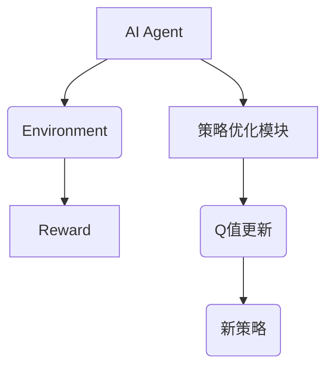
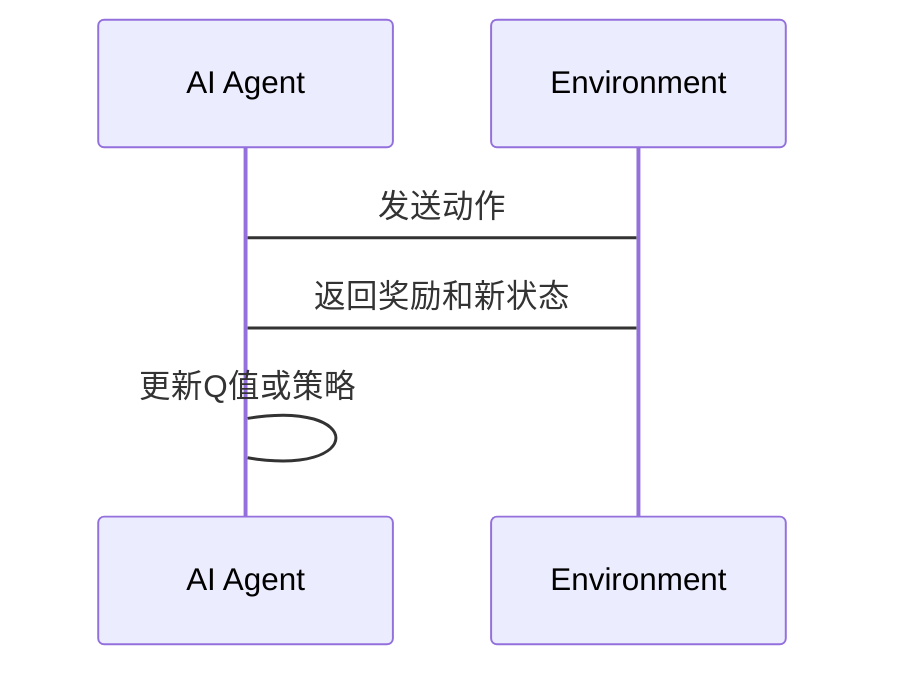

                 


# 强化学习在AI Agent交互策略优化中的运用

> 关键词：强化学习，AI Agent，交互策略优化，Q-learning，Deep Q-Network，策略梯度

> 摘要：本文深入探讨了强化学习在AI Agent交互策略优化中的应用，从强化学习的基本概念、AI Agent的定义与类型，到强化学习算法的数学模型和实际应用案例。通过详细分析Q-learning、Deep Q-Network和策略梯度方法，本文展示了如何利用强化学习优化AI Agent的交互策略。文章还通过游戏AI和机器人控制的实际案例，进一步阐述了强化学习在策略优化中的具体应用，并提供了系统架构设计和代码实现的详细解读。

---

# 第1章 强化学习与AI Agent概述

## 1.1 强化学习的基本概念

### 1.1.1 什么是强化学习
强化学习（Reinforcement Learning，RL）是一种机器学习范式，其中智能体（Agent）通过与环境交互来学习如何采取一系列行动以最大化累计奖励（Rewards）。与监督学习不同，强化学习不依赖于标注数据，而是通过试错（Trial-and-Error）的方式逐步优化策略。

**核心要素：**
- **状态（State）**：环境在某一时刻的观察。
- **动作（Action）**：智能体在某一状态下采取的行为。
- **奖励（Reward）**：智能体在采取某个动作后，环境给予的反馈，用于评估该动作的好坏。
- **策略（Policy）**：智能体在某一状态下选择动作的概率分布，通常表示为$\pi(a|s)$，即在状态$s$下选择动作$a$的概率。
- **价值函数（Value Function）**：衡量智能体在某一状态下采取特定动作后的期望累积奖励。

### 1.1.2 强化学习的核心要素
- **探索与利用（Exploration vs. Exploitation）**：智能体需要在探索新动作和利用已知好动作之间找到平衡，以避免陷入局部最优。
- **折扣因子（Discount Factor）**：用于衡量未来奖励的重要性，通常用$\gamma$表示，取值范围在$[0,1]$之间。$\gamma$越接近1，未来奖励的影响越大。

### 1.1.3 强化学习与监督学习的区别
| **对比项** | **监督学习（Supervised Learning）** | **强化学习（Reinforcement Learning）** |
|------------|------------------------------------|------------------------------------------|
| 数据来源   | 标签化数据集                        | 环境与智能体的交互反馈                    |
| 学习目标   | 预测或分类                        | 最大化累积奖励                             |
| 反馈机制   | 立即反馈（标签）                  | 延迟反馈（奖励）                          |

---

## 1.2 AI Agent的基本概念

### 1.2.1 什么是AI Agent
AI Agent（人工智能代理）是能够感知环境、自主决策并采取行动的智能实体。AI Agent可以是软件程序、机器人或其他智能系统，其核心目标是通过与环境交互来实现特定任务。

### 1.2.2 AI Agent的类型
- **反应式Agent**：基于当前环境状态做出反应，不依赖历史信息。
- **认知式Agent**：具备复杂推理和规划能力，能够根据长期目标制定策略。
- **学习式Agent**：通过与环境交互不断优化自身的决策策略。

### 1.2.3 AI Agent的应用场景
- 游戏AI：如棋类游戏中的AlphaZero。
- 机器人控制：如自动驾驶汽车。
- 聊天机器人：如智能客服系统。

---

## 1.3 强化学习在AI Agent中的应用

### 1.3.1 强化学习与AI Agent的结合
强化学习为AI Agent提供了一种有效的交互策略优化方法。通过定义合适的奖励机制，智能体可以不断试错并优化其决策策略。

### 1.3.2 交互策略优化的重要性
在复杂的动态环境中，AI Agent需要实时调整其交互策略以适应环境变化。强化学习通过累积奖励机制，帮助智能体找到最优策略。

### 1.3.3 当前研究与应用现状
目前，强化学习在AI Agent中的应用已涵盖游戏、机器人控制、自动驾驶等领域。随着算法的不断改进，强化学习在交互策略优化中的潜力将进一步释放。

---

## 1.4 本章小结
本章介绍了强化学习的基本概念和AI Agent的定义与类型，并探讨了强化学习在AI Agent中的应用。通过理解强化学习的核心要素和AI Agent的交互特性，我们可以为后续的策略优化打下坚实的基础。

---

# 第2章 强化学习的核心概念与数学模型

## 2.1 强化学习的基本原理

### 2.1.1 状态、动作、奖励的定义
- **状态（State）**：环境在某一时刻的描述，例如棋盘上的棋子位置。
- **动作（Action）**：智能体在某一状态下采取的行为，例如移动棋子到某个位置。
- **奖励（Reward）**：智能体采取动作后获得的反馈，用于指导策略优化。

### 2.1.2 策略与价值函数的定义
- **策略（Policy）**：$\pi(a|s)$，表示在状态$s$下选择动作$a$的概率。
- **价值函数（Value Function）**：衡量智能体在状态$s$下采取动作$a$后的期望累积奖励。

### 2.1.3 探索与利用的平衡
智能体需要在探索新动作和利用已知好动作之间找到平衡。通常，可以通过调整概率分布或使用贪心策略来实现。

---

## 2.2 强化学习的数学模型

### 2.2.1 Q-learning算法的数学表达
Q-learning是一种经典的强化学习算法，其目标是学习状态-动作对的Q值，即$Q(s,a)$，表示在状态$s$下采取动作$a$后的期望累积奖励。

**更新公式：**
$$ Q(s,a) = Q(s,a) + \alpha \left( r + \gamma \max_{a'} Q(s',a') - Q(s,a) \right) $$
其中：
- $\alpha$是学习率，控制更新步长。
- $\gamma$是折扣因子，平衡当前奖励和未来奖励的重要性。

### 2.2.2 Deep Q-Network的数学模型
Deep Q-Network（DQN）通过深度神经网络近似Q值函数。网络输入是状态$s$，输出是动作$a$的Q值。

**损失函数：**
$$ \mathcal{L} = \mathbb{E} \left[ \left( r + \gamma Q(s',a') - Q(s,a) \right)^2 \right] $$

### 2.2.3 策略梯度方法的数学推导
策略梯度方法通过优化策略直接最大化累积奖励。其目标函数为：
$$ \mathcal{J} = \mathbb{E} \left[ \log \pi(a|s) \cdot Q(s,a) \right] $$

---

## 2.3 强化学习的核心公式

### 2.3.1 Q-learning的更新公式
$$ Q(s,a) = Q(s,a) + \alpha (r + \gamma \max Q(s',a') - Q(s,a)) $$

### 2.3.2 Deep Q-Network的损失函数
$$ \mathcal{L} = \mathbb{E} \left[ (r + \gamma Q(s',a') - Q(s,a))^2 \right] $$

### 2.3.3 策略梯度的梯度计算
策略梯度方法通过计算梯度来优化策略：
$$ \nabla \mathcal{J} = \mathbb{E} \left[ \nabla \log \pi(a|s) \cdot Q(s,a) \right] $$

---

## 2.4 本章小结
本章详细介绍了强化学习的核心概念和数学模型，包括Q-learning、Deep Q-Network和策略梯度方法的原理和公式。这些内容为后续的策略优化奠定了理论基础。

---

# 第3章 AI Agent的交互策略优化

## 3.1 交互策略优化的定义

### 3.1.1 什么是交互策略优化
交互策略优化是指通过强化学习不断改进AI Agent的决策策略，使其在与环境交互时能够获得更高的累积奖励。

### 3.1.2 优化的目标与挑战
- **目标**：最大化累积奖励。
- **挑战**：复杂环境下的策略优化需要解决高维状态空间和动作空间的问题。

### 3.1.3 优化的评价指标
- **累积奖励（Cumulative Reward）**：衡量策略优化的效果。
- **收敛速度（Convergence Speed）**：策略优化的速度。

---

## 3.2 基于强化学习的策略优化方法

### 3.2.1 Q-learning在策略优化中的应用
通过不断更新Q值表，Q-learning帮助智能体找到最优动作序列。

### 3.2.2 Deep Q-Network在策略优化中的应用
Deep Q-Network通过深度神经网络近似Q值函数，适用于高维状态空间。

### 3.2.3 策略梯度方法在策略优化中的应用
策略梯度方法通过优化策略直接最大化累积奖励，适用于概率策略的优化。

---

## 3.3 策略优化的数学模型

### 3.3.1 Q-learning的策略优化公式
$$ Q(s,a) = Q(s,a) + \alpha (r + \gamma \max Q(s',a') - Q(s,a)) $$

### 3.3.2 Deep Q-Network的策略优化公式
$$ \mathcal{L} = \mathbb{E} \left[ (r + \gamma Q(s',a') - Q(s,a))^2 \right] $$

### 3.3.3 策略梯度的策略优化公式
$$ \nabla \mathcal{J} = \mathbb{E} \left[ \nabla \log \pi(a|s) \cdot Q(s,a) \right] $$

---

## 3.4 本章小结
本章详细探讨了交互策略优化的定义和基于强化学习的策略优化方法，包括Q-learning、Deep Q-Network和策略梯度方法的应用。

---

# 第4章 强化学习在AI Agent交互中的应用案例

## 4.1 游戏AI中的应用

### 4.1.1 游戏AI的基本概念
游戏AI通过强化学习优化其决策策略，例如在棋类游戏中击败人类冠军。

### 4.1.2 强化学习在游戏AI中的应用
- **AlphaZero**：通过强化学习在围棋中击败人类冠军。

### 4.1.3 游戏AI中的策略优化案例
通过强化学习优化游戏AI的策略，使其在复杂环境中做出最优决策。

---

## 4.2 机器人控制中的应用

### 4.2.1 机器人控制的基本概念
机器人控制涉及路径规划、动作选择和环境交互。

### 4.2.2 强化学习在机器人控制中的应用
- **自动驾驶**：通过强化学习优化自动驾驶汽车的决策策略。

### 4.2.3 机器人控制中的策略优化案例
通过强化学习优化机器人在动态环境中的动作选择。

---

## 4.3 本章小结
本章通过游戏AI和机器人控制的实际案例，展示了强化学习在交互策略优化中的具体应用。

---

# 第5章 强化学习在AI Agent交互策略优化中的系统分析与架构设计

## 5.1 问题场景介绍
在动态复杂的环境中，AI Agent需要实时调整其交互策略以适应环境变化。

## 5.2 系统功能设计
- **状态感知**：感知当前环境状态。
- **动作选择**：基于当前状态选择最优动作。
- **奖励计算**：根据环境反馈计算奖励。
- **策略优化**：通过强化学习算法优化策略。

## 5.3 系统架构设计


---

## 5.4 系统接口设计
- **输入接口**：接收环境状态和动作反馈。
- **输出接口**：输出优化后的策略。

---

## 5.5 系统交互设计


---

## 5.6 本章小结
本章通过系统分析和架构设计，展示了强化学习在AI Agent交互策略优化中的具体实现方式。

---

# 第6章 强化学习在AI Agent交互策略优化中的项目实战

## 6.1 环境安装
- 安装Python和深度学习框架（如TensorFlow或PyTorch）。
- 安装强化学习库（如OpenAI Gym）。

## 6.2 系统核心实现源代码

### 6.2.1 Q-learning实现
```python
import numpy as np

class QLearning:
    def __init__(self, state_space, action_space, gamma=0.99, alpha=0.1):
        self.Q = np.zeros((state_space, action_space))
        self.gamma = gamma
        self.alpha = alpha

    def take_action(self, state, epsilon=0.1):
        if np.random.random() < epsilon:
            return np.random.randint(0, action_space)
        return np.argmax(self.Q[state])

    def update(self, state, action, reward, next_state):
        self.Q[state, action] = self.Q[state, action] + self.alpha * (reward + self.gamma * np.max(self.Q[next_state]) - self.Q[state, action])
```

### 6.2.2 Deep Q-Network实现
```python
import tensorflow as tf

class DQN:
    def __init__(self, state_space, action_space, gamma=0.99, alpha=0.001):
        self.state_space = state_space
        self.action_space = action_space
        self.gamma = gamma
        self.alpha = alpha
        self.model = self.build_model()

    def build_model(self):
        model = tf.keras.Sequential([
            tf.keras.layers.Dense(64, activation='relu', input_shape=(self.state_space,)),
            tf.keras.layers.Dense(64, activation='relu'),
            tf.keras.layers.Dense(self.action_space)
        ])
        model.compile(optimizer=tf.keras.optimizers.Adam(learning_rate=self.alpha), loss='mse')
        return model

    def take_action(self, state, epsilon=0.1):
        if np.random.random() < epsilon:
            return np.random.randint(0, self.action_space)
        q_values = self.model.predict(state[np.newaxis, :])
        return np.argmax(q_values[0])
```

## 6.3 代码应用解读与分析
通过上述代码，我们可以实现Q-learning和Deep Q-Network算法，并将其应用于AI Agent的交互策略优化。

---

## 6.4 实际案例分析
以OpenAI Gym中的CartPole环境为例，展示如何通过强化学习优化AI Agent的交互策略。

---

## 6.5 本章小结
本章通过项目实战，详细展示了强化学习在AI Agent交互策略优化中的具体实现。

---

# 第7章 总结与展望

## 7.1 本章总结
本文详细探讨了强化学习在AI Agent交互策略优化中的应用，从基本概念到具体实现，全面展示了强化学习在复杂环境中的优化能力。

## 7.2 未来展望
随着深度强化学习算法的不断进步，强化学习在AI Agent中的应用将更加广泛，特别是在高维状态空间和复杂动作空间的场景中。

---

# 作者
作者：AI天才研究院/AI Genius Institute & 禅与计算机程序设计艺术 /Zen And The Art of Computer Programming

