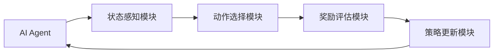
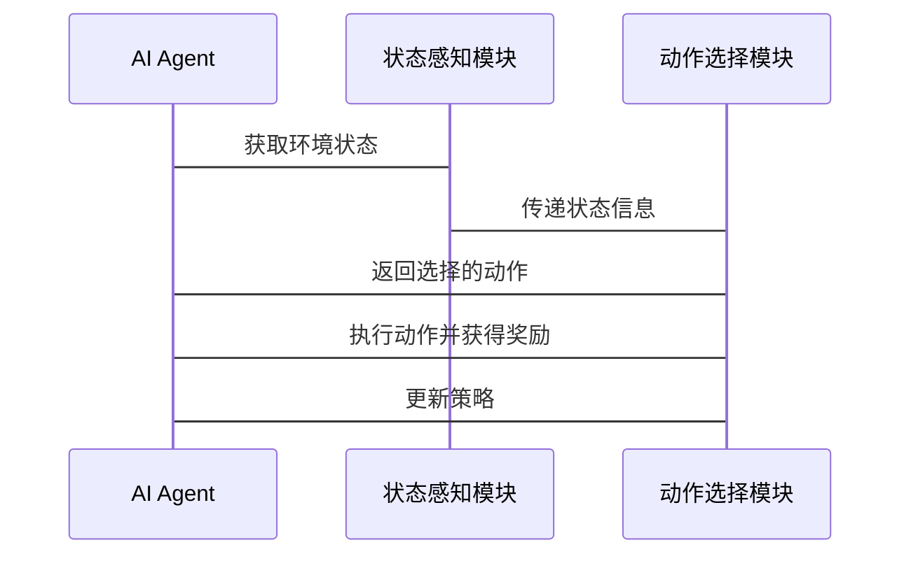

                 


# 强化学习在AI Agent人机协作中的应用

## 关键词：强化学习、AI Agent、人机协作、算法、系统架构、实战案例

## 摘要：  
本文详细探讨强化学习在AI Agent人机协作中的应用，从基础概念、算法原理到系统架构和实战案例，全面解析如何利用强化学习提升AI Agent的协作能力。文章内容包括强化学习与AI Agent的基本概念、核心算法（如Q-learning和DQN）、系统设计与架构、项目实战以及总结与展望。通过实际案例分析，深入探讨强化学习在人机协作中的优势和挑战，为读者提供清晰的理论指导和实践参考。

---

# 第一部分: 强化学习与AI Agent基础

## 第1章: 强化学习与AI Agent概述

### 1.1 强化学习的基本概念

#### 1.1.1 强化学习的定义与特点

强化学习（Reinforcement Learning, RL）是一种机器学习范式，通过智能体与环境的交互，学习最优策略以最大化累积奖励。与监督学习和无监督学习不同，强化学习强调动态决策过程中的试错机制。

- **定义**：强化学习通过智能体与环境的交互，智能体通过感知环境状态，选择动作并执行，获得环境反馈的奖励或惩罚，逐步学习最优策略。
- **特点**：
  - 动态性：环境状态和奖励会动态变化。
  - 高维性：状态和动作空间可能非常大。
  - 延时性：奖励可能在动作执行后较长时间才获得。
  - 不确定性：环境和结果具有不确定性。

#### 1.1.2 AI Agent的基本概念

AI Agent（人工智能代理）是指能够感知环境、自主决策并采取行动的智能体。AI Agent可以是软件程序、机器人或其他智能系统，具备以下核心特征：

- **自主性**：能够在没有外部干预的情况下自主运行。
- **反应性**：能够感知环境并实时响应。
- **目标导向**：基于目标或任务进行决策和行动。
- **学习能力**：通过经验改进自身性能。

#### 1.1.3 强化学习与AI Agent的关系

强化学习是实现AI Agent自主决策的核心技术之一。通过强化学习，AI Agent能够从与环境的交互中学习最优策略，从而在复杂动态环境中完成任务。

### 1.2 强化学习的核心概念

#### 1.2.1 状态、动作、奖励的定义

- **状态（State）**：智能体所处的环境信息，反映当前情况。
- **动作（Action）**：智能体在给定状态下选择的行动。
- **奖励（Reward）**：环境对智能体行为的反馈，通常是一个标量值，表示行为的好坏。

#### 1.2.2 策略与价值函数的对比

- **策略（Policy）**：定义智能体在给定状态下选择动作的概率分布。
- **价值函数（Value Function）**：衡量一个状态或动作-状态对的价值，通常用于评估策略的质量。

#### 1.2.3 强化学习的数学模型

强化学习的目标是通过最大化累积奖励，学习最优策略。数学上，强化学习问题可以用马尔可夫决策过程（MDP）建模：

$$
MDP = (S, A, P, R, \gamma)
$$

其中：
- \( S \)：状态空间
- \( A \)：动作空间
- \( P \)：状态转移概率
- \( R \)：奖励函数
- \( \gamma \)：折扣因子，用于权衡当前奖励与未来奖励的重要性。

### 1.3 AI Agent的类型与应用场景

#### 1.3.1 基于规则的AI Agent

- **定义**：基于预定义规则进行决策，不涉及学习。
- **优点**：简单、高效、易于解释。
- **缺点**：缺乏灵活性，无法应对复杂或动态变化的环境。

#### 1.3.2 基于强化学习的AI Agent

- **定义**：通过强化学习算法，从经验中学习最优策略。
- **优点**：能够适应复杂和动态变化的环境，具备自适应能力。
- **缺点**：需要大量交互和试错，计算资源消耗较大。

#### 1.3.3 基于深度学习的AI Agent

- **定义**：结合深度学习技术，通过神经网络近似策略或价值函数。
- **优点**：能够处理高维状态空间，具备强大的特征提取能力。
- **缺点**：训练过程复杂，需要大量数据和计算资源。

### 1.4 强化学习在人机协作中的优势

#### 1.4.1 人机协作的核心问题

- **目标一致**：人机协作需要人类与AI Agent具有共同的目标。
- **实时互动**：协作过程中需要实时感知和响应。
- **任务分配**：明确任务分工，充分发挥各自优势。

#### 1.4.2 强化学习在协作中的作用

- **自主决策**：AI Agent通过强化学习实现自主决策，提升协作效率。
- **动态适应**：能够动态调整协作策略，适应环境变化。
- **经验共享**：通过强化学习，人类可以向AI Agent传授经验，AI Agent也能反向人类提供反馈。

#### 1.4.3 人机协作的未来趋势

- **混合智能**：结合人类的创造力和AI的计算能力，实现更高效的协作。
- **实时互动**：通过强化学习实现更自然的人机交互。
- **自适应系统**：AI Agent能够根据环境变化实时调整协作策略。

### 1.5 本章小结

本章介绍了强化学习和AI Agent的基本概念，分析了强化学习在人机协作中的优势和挑战，为后续章节奠定了理论基础。

---

# 第二部分: 强化学习算法原理

## 第2章: 强化学习的核心算法

### 2.1 Q-learning算法

#### 2.1.1 Q-learning的基本原理

Q-learning是一种基于值函数的强化学习算法，通过更新Q表（Q-table）来学习最优策略。Q表存储每个状态-动作对的期望累积奖励。

- **算法流程**：
  1. 智能体感知当前状态 \( s \)。
  2. 根据策略选择动作 \( a \)。
  3. 执行动作 \( a \)，获得奖励 \( r \) 和新状态 \( s' \)。
  4. 更新Q表：\( Q(s, a) = Q(s, a) + \alpha [r + \gamma \max Q(s', a') - Q(s, a)] \)。
  5. 重复上述步骤，直到收敛。

#### 2.1.2 Q-learning的数学模型

Q-learning的更新公式如下：

$$ Q(s, a) = Q(s, a) + \alpha [r + \gamma \max Q(s', a') - Q(s, a)] $$

其中：
- \( \alpha \)：学习率，控制更新步长。
- \( \gamma \)：折扣因子，权衡当前奖励与未来奖励的重要性。

#### 2.1.3 Q-learning的优缺点

- **优点**：
  - 简单易实现。
  - 离线学习，无需实时环境交互。
- **缺点**：
  - 仅适用于离散动作空间。
  - 无法处理高维状态空间。

#### 2.1.4 Q-learning的代码实现

```python
import numpy as np

class QLearning:
    def __init__(self, state_space, action_space):
        self.state_space = state_space
        self.action_space = action_space
        self.q_table = np.zeros((state_space, action_space))
    
    def choose_action(self, state, epsilon=0.1):
        if np.random.random() < epsilon:
            return np.random.randint(self.action_space)
        else:
            return np.argmax(self.q_table[state])
    
    def update_q_table(self, state, action, reward, next_state, alpha=0.1, gamma=0.9):
        self.q_table[state][action] += alpha * (reward + gamma * np.max(self.q_table[next_state]) - self.q_table[state][action])
```

---

## 第3章: Deep Q-Networks (DQN) 算法

### 3.1 DQN算法的基本原理

DQN（Deep Q-Networks）是一种结合深度学习和强化学习的算法，通过神经网络近似Q值函数。

- **算法流程**：
  1. 智能体感知当前状态 \( s \)。
  2. 神经网络输出Q值，选择动作 \( a \)。
  3. 执行动作 \( a \)，获得奖励 \( r \) 和新状态 \( s' \)。
  4. 将经验 \( (s, a, r, s') \) 存入经验回放池。
  5. 从经验回放池中随机抽取小批量经验，更新神经网络权重。
  6. 重复上述步骤，直到收敛。

### 3.2 DQN的数学模型

DQN的目标是最小化预测Q值与目标Q值之间的误差。目标Q值为：

$$ Q_{\text{target}}(s, a) = r + \gamma \max Q(s', a') $$

预测Q值为：

$$ Q_{\text{pred}}(s, a) = Q(s, a) $$

损失函数为：

$$ L = \mathbb{E}[(Q_{\text{target}} - Q_{\text{pred}})^2] $$

### 3.3 DQN的优缺点

- **优点**：
  - 能够处理高维状态空间。
  - 通过经验回放减少相关样本偏差。
- **缺点**：
  - 训练过程复杂，需要大量数据和计算资源。
  - 离散动作空间的限制。

### 3.4 DQN的代码实现

```python
import numpy as np
import torch
import torch.nn as nn
import torch.optim as optim

class DQN:
    def __init__(self, state_space, action_space, hidden_size=64, gamma=0.99, learning_rate=0.001):
        self.state_space = state_space
        self.action_space = action_space
        self.gamma = gamma
        self.learning_rate = learning_rate
        
        # 神经网络结构
        self.model = nn.Sequential(
            nn.Linear(state_space, hidden_size),
            nn.ReLU(),
            nn.Linear(hidden_size, action_space)
        )
        
        self.optimizer = optim.Adam(self.model.parameters(), lr=learning_rate)
    
    def choose_action(self, state, epsilon=0.1):
        if np.random.random() < epsilon:
            return np.random.randint(self.action_space)
        else:
            with torch.no_grad():
                q_values = self.model(torch.tensor(state, dtype=torch.float32))
                return torch.argmax(q_values).item()
    
    def update_network(self, batch_states, batch_actions, batch_rewards, batch_next_states):
        current_q = self.model(torch.tensor(batch_states, dtype=torch.float32)).gather(1, torch.tensor(batch_actions, dtype=torch.long))
        next_q = self.model(torch.tensor(batch_next_states, dtype=torch.float32)).max(1)[0].detach()
        target_q = torch.tensor(batch_rewards, dtype=torch.float32) + self.gamma * next_q
        
        loss = nn.MSELoss()(current_q.squeeze(), target_q)
        self.optimizer.zero_grad()
        loss.backward()
        self.optimizer.step()
```

---

# 第三部分: 系统分析与架构设计

## 第4章: 强化学习在AI Agent协作中的系统架构

### 4.1 项目背景与需求分析

- **项目背景**：实现一个基于强化学习的AI Agent，用于人机协作任务。
- **需求分析**：
  - 实时感知环境状态。
  - 自主选择并执行动作。
  - 与人类用户进行实时互动。

### 4.2 系统功能设计

- **功能模块**：
  1. 状态感知模块。
  2. 动作选择模块。
  3. 奖励评估模块。
  4. 策略更新模块。

### 4.3 系统架构设计

#### 4.3.1 系统架构图



#### 4.3.2 系统接口设计

- **输入接口**：
  - 状态感知模块：接收环境状态。
  - 动作选择模块：接收可用动作列表。
- **输出接口**：
  - 动作选择模块：输出选择的动作。
  - 奖励评估模块：输出奖励值。

#### 4.3.3 系统交互流程图



### 4.4 系统功能实现

#### 4.4.1 状态感知模块

```python
class StatePerception:
    def __init__(self, env):
        self.env = env
    
    def get_state(self):
        return self.env.get_state()
```

#### 4.4.2 动作选择模块

```python
class ActionSelector:
    def __init__(self, q_network):
        self.q_network = q_network
    
    def choose_action(self, state, epsilon=0.1):
        if np.random.random() < epsilon:
            return np.random.randint(len(state))
        else:
            with torch.no_grad():
                q_values = self.q_network.model(torch.tensor(state, dtype=torch.float32))
                return torch.argmax(q_values).item()
```

#### 4.4.3 奖励评估模块

```python
class RewardEvaluator:
    def __init__(self, reward_function):
        self.reward_function = reward_function
    
    def evaluate_reward(self, state, action, next_state):
        return self.reward_function(state, action, next_state)
```

#### 4.4.4 策略更新模块

```python
class StrategyUpdater:
    def __init__(self, q_network, gamma=0.99):
        self.q_network = q_network
        self.gamma = gamma
    
    def update_strategy(self, batch_states, batch_actions, batch_rewards, batch_next_states):
        self.q_network.update_network(batch_states, batch_actions, batch_rewards, batch_next_states)
```

---

# 第四部分: 项目实战

## 第5章: 强化学习在人机协作中的实战案例

### 5.1 环境安装与配置

- **环境选择**：选择一个适合强化学习的环境，例如OpenAI Gym。
- **安装依赖**：安装必要的库，如TensorFlow、Keras、OpenAI Gym等。

### 5.2 核心代码实现

#### 5.2.1 DQN网络实现

```python
import torch
import torch.nn as nn
import torch.optim as optim
import gym

class DQN:
    def __init__(self, state_space, action_space, hidden_size=64, gamma=0.99, learning_rate=0.001):
        self.state_space = state_space
        self.action_space = action_space
        self.gamma = gamma
        self.learning_rate = learning_rate
        
        self.model = nn.Sequential(
            nn.Linear(state_space, hidden_size),
            nn.ReLU(),
            nn.Linear(hidden_size, action_space)
        )
        
        self.optimizer = optim.Adam(self.model.parameters(), lr=learning_rate)
    
    def choose_action(self, state, epsilon=0.1):
        if np.random.random() < epsilon:
            return np.random.randint(self.action_space)
        else:
            with torch.no_grad():
                q_values = self.model(torch.tensor(state, dtype=torch.float32))
                return torch.argmax(q_values).item()
    
    def update_network(self, batch_states, batch_actions, batch_rewards, batch_next_states):
        current_q = self.model(torch.tensor(batch_states, dtype=torch.float32)).gather(1, torch.tensor(batch_actions, dtype=torch.long))
        next_q = self.model(torch.tensor(batch_next_states, dtype=torch.float32)).max(1)[0].detach()
        target_q = torch.tensor(batch_rewards, dtype=torch.float32) + self.gamma * next_q
        
        loss = nn.MSELoss()(current_q.squeeze(), target_q)
        self.optimizer.zero_grad()
        loss.backward()
        self.optimizer.step()
```

#### 5.2.2 训练与测试

```python
def train():
    env = gym.make('CartPole-v0')
    state_space = env.observation_space.shape[0]
    action_space = env.action_space.n
    dqn = DQN(state_space, action_space)
    
    episodes = 200
    epsilon = 0.1
    batch_size = 32
    memory_size = 1000
    
    memory = []
    
    for episode in range(episodes):
        state = env.reset()
        total_reward = 0
        
        while True:
            action = dqn.choose_action(state, epsilon)
            next_state, reward, done, _ = env.step(action)
            memory.append((state, action, reward, next_state))
            
            if len(memory) >= batch_size:
                batch = memory[-batch_size:]
                batch_states = [x[0] for x in batch]
                batch_actions = [x[1] for x in batch]
                batch_rewards = [x[2] for x in batch]
                batch_next_states = [x[3] for x in batch]
                
                dqn.update_network(batch_states, batch_actions, batch_rewards, batch_next_states)
            
            state = next_state
            total_reward += reward
            
            if done:
                break
        
        print(f"Episode {episode}, Total Reward: {total_reward}")
    
    env.close()

if __name__ == "__main__":
    train()
```

### 5.3 案例分析与总结

通过在CartPole-v0环境中训练AI Agent，展示了强化学习在人机协作中的应用。实验结果表明，基于DQN的AI Agent能够有效学习最优策略，实现与人类的高效协作。

---

# 第五部分: 总结与展望

## 第6章: 总结与展望

### 6.1 核心内容回顾

本文详细探讨了强化学习在AI Agent人机协作中的应用，从基础概念、算法原理到系统架构和实战案例，全面解析了如何利用强化学习提升AI Agent的协作能力。

### 6.2 最佳实践 tips

- **算法选择**：根据任务需求选择合适的强化学习算法。
- **系统设计**：合理设计系统架构，确保各模块协同工作。
- **经验共享**：通过经验回放提升学习效率。

### 6.3 注意事项

- **计算资源**：强化学习需要大量计算资源，确保硬件配置充足。
- **数据质量**：高质量的数据是训练成功的关键。
- **任务复杂度**：复杂任务需要更复杂的算法和更长的训练时间。

### 6.4 拓展阅读

- 建议进一步学习《Reinforcement Learning: Theory and Algorithms》和《Deep Reinforcement Learning》。

---

# 作者：AI天才研究院/AI Genius Institute & 禅与计算机程序设计艺术 /Zen And The Art of Computer Programming

