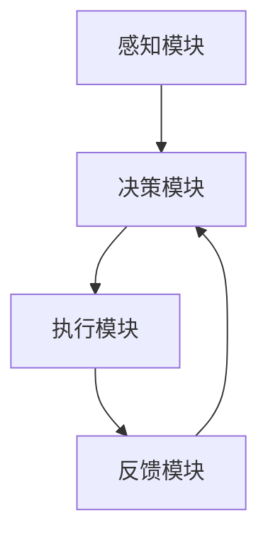
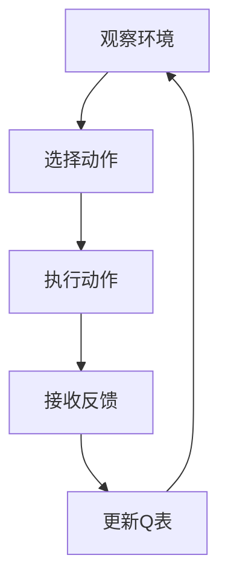

                 


```markdown
# 强化学习在AI Agent任务规划中的实践

> 关键词：强化学习，AI Agent，任务规划，马尔可夫决策过程，Q-learning，策略梯度

> 摘要：本文深入探讨了强化学习在AI Agent任务规划中的实践应用，从基础概念到算法原理，再到系统架构和项目实战，全面解析了强化学习在任务规划中的核心作用。通过具体案例分析，展示了如何利用强化学习提升AI Agent的任务规划能力，为读者提供了一个从理论到实践的完整指南。

---

# 第一部分：强化学习与AI Agent概述

## 第1章：强化学习与AI Agent概述

### 1.1 强化学习的基本概念

#### 1.1.1 强化学习的定义与特点
强化学习（Reinforcement Learning，RL）是一种机器学习范式，其中智能体通过与环境交互来学习如何做出最优决策。其特点是基于试错机制，通过不断探索和利用环境来优化策略。强化学习的核心在于通过最大化累积奖励来优化决策过程。

- **定义**：强化学习是一种通过试错机制，使智能体在与环境交互中学习最优策略的学习方法。
- **特点**：
  - 基于奖励的反馈机制
  - 需要处理动态和不确定的环境
  - 策略的优化是一个渐进的过程

#### 1.1.2 AI Agent的定义与分类
AI Agent（人工智能代理）是指能够感知环境并采取行动以实现目标的智能实体。AI Agent可以根据其智能水平和决策能力分为多种类型：

- **反应式Agent**：基于当前感知做出反应，不依赖内部状态。
- **认知式Agent**：具备复杂推理和规划能力，能够根据任务目标进行决策。
- **学习式Agent**：能够通过与环境交互不断优化自身行为。

#### 1.1.3 强化学习在AI Agent中的作用
强化学习为AI Agent提供了在动态和不确定环境中进行任务规划的能力。通过强化学习，AI Agent可以在复杂环境中自主学习最优策略，实现高效的任务规划和执行。

---

### 1.2 任务规划的核心概念

#### 1.2.1 任务规划的定义
任务规划是指智能体根据环境信息和任务目标，制定一系列行动步骤以完成任务的过程。任务规划的核心在于如何在动态环境中制定高效的行动策略。

- **定义**：任务规划是智能体在动态环境中制定行动步骤以实现目标的过程。
- **关键要素**：
  - 状态空间：环境中的所有可能状态。
  - 动作空间：智能体可以执行的所有动作。
  - 奖励函数：对智能体行为的反馈机制。

#### 1.2.2 任务规划的类型
任务规划可以分为多种类型，常见的包括：

- **单任务规划**：专注于完成单一任务。
- **多任务规划**：需要同时或依次完成多个任务。
- **动态任务规划**：在动态变化的环境中进行任务规划。

#### 1.2.3 强化学习在任务规划中的应用前景
强化学习在任务规划中的应用前景广阔，尤其是在动态和复杂环境中。通过强化学习，AI Agent可以实现自适应的任务规划，提高任务执行的效率和成功率。

---

## 第2章：强化学习的基本原理

### 2.1 马尔可夫决策过程（MDP）

#### 2.1.1 MDP的定义与特点
马尔可夫决策过程（Markov Decision Process，MDP）是一种数学模型，用于描述强化学习中的决策过程。MDP假设当前状态仅依赖于当前状态，而不依赖于到达该状态的历史路径。

- **定义**：MDP是一个元组（S, A, P, R, γ），其中：
  - S：状态空间
  - A：动作空间
  - P：状态转移概率
  - R：奖励函数
  - γ：折扣因子

- **特点**：
  - 马尔可夫性质：当前状态仅依赖于当前状态，不依赖历史。
  - 动态性：状态转移概率和奖励函数是已知的。

#### 2.1.2 贝尔曼方程
贝尔曼方程（Bellman Equation）是强化学习中的核心方程，用于描述最优价值函数的性质。

$$ V(s) = \max_{a} [ R(s,a) + \gamma \sum_{s'} P(s'|s,a) V(s') ] $$

其中：
- \( V(s) \)：状态s的最优价值函数。
- \( R(s,a) \)：在状态s下执行动作a的即时奖励。
- \( P(s'|s,a) \)：从状态s执行动作a后转移到状态s'的概率。
- \( \gamma \)：折扣因子，表示未来奖励的折扣程度。

#### 2.1.3 动作价值函数（Q函数）
动作价值函数（Q-value Function）描述了在状态s执行动作a后，后续奖励的期望值。

$$ Q(s,a) = R(s,a) + \gamma \sum_{s'} P(s'|s,a) Q(s',a) $$

---

### 2.2 Q-learning算法

#### 2.2.1 Q-learning的基本原理
Q-learning是一种基于Q值的强化学习算法，适用于离散状态和动作空间的环境。

- **核心思想**：通过不断更新Q值表，使得智能体能够学习到最优策略。
- **更新公式**：

$$ Q(s,a) = Q(s,a) + \alpha [ r + \gamma \max Q(s',a') - Q(s,a) ] $$

其中：
- \( \alpha \)：学习率，控制更新步长。
- \( r \)：即时奖励。
- \( \gamma \)：折扣因子。

#### 2.2.2 Q-learning的数学公式
Q-learning的更新公式可以表示为：

$$ Q(s,a) = (1 - \alpha) Q(s,a) + \alpha (r + \gamma \max Q(s',a')) $$

---

### 2.3 策略梯度方法

#### 2.3.1 策略梯度的基本思想
策略梯度（Policy Gradient）方法直接优化策略，通过计算策略的梯度来更新参数。

- **核心思想**：通过最大化期望奖励，优化策略参数θ。

#### 2.3.2 策略梯度的数学推导
策略梯度的损失函数可以表示为：

$$ L(\theta) = - \mathbb{E}_{\tau \sim \pi_\theta} [ \log \pi_\theta(a|s) Q_\pi(s,a) ] $$

其中：
- \( \tau \)：策略π生成的轨迹。
- \( Q_\pi(s,a) \)：策略π下的Q值。

---

### 2.4 本章小结
本章详细介绍了强化学习的基本原理，包括马尔可夫决策过程、贝尔曼方程、Q-learning算法和策略梯度方法。这些理论为后续的AI Agent任务规划奠定了基础。

---

## 第3章：强化学习在AI Agent任务规划中的应用

### 3.1 基于强化学习的任务规划算法

#### 3.1.1 基于Q-learning的任务规划
Q-learning算法在任务规划中的应用广泛，适用于离散动作空间的环境。

- **优缺点**：
  - 优点：实现简单，收敛性好。
  - 缺点：适用于离散动作空间，扩展性有限。

#### 3.1.2 基于策略梯度的任务规划
策略梯度方法适用于连续动作空间的环境，能够直接优化策略参数。

- **优缺点**：
  - 优点：适用于连续动作空间，优化效果好。
  - 缺点：实现复杂，收敛性较差。

#### 3.1.3 基于Actor-Critic架构的任务规划
Actor-Critic架构结合了策略梯度和Q-learning的优势，能够同时优化策略和价值函数。

- **优缺点**：
  - 优点：收敛性好，适用于复杂环境。
  - 缺点：实现复杂，计算资源需求较高。

---

### 3.2 多目标任务规划

#### 3.2.1 多目标任务规划的定义
多目标任务规划是指同时或依次完成多个任务的规划问题。

- **关键挑战**：
  - 任务之间的依赖关系。
  - 任务优先级的动态变化。

#### 3.2.2 多目标任务规划的强化学习方法
多目标任务规划可以通过强化学习中的多目标优化方法实现。

- **方法**：
  - 使用多目标Q-learning算法。
  - 通过策略网络同时优化多个任务。

---

### 3.3 动态环境下的任务规划

#### 3.3.1 动态环境的定义
动态环境是指环境状态和奖励函数随时间变化的环境。

- **特点**：
  - 状态转移概率动态变化。
  - 奖励函数动态变化。

#### 3.3.2 动态环境下的强化学习方法
动态环境下的强化学习可以通过以下方法实现：

- **方法**：
  - 使用适应性策略。
  - 结合模型预测和强化学习。

---

## 第4章：AI Agent任务规划系统的架构设计

### 4.1 系统功能设计

#### 4.1.1 系统功能模块划分
AI Agent任务规划系统可以划分为以下几个功能模块：

- **感知模块**：感知环境状态。
- **决策模块**：基于强化学习算法制定行动策略。
- **执行模块**：执行决策模块制定的行动。
- **反馈模块**：接收环境反馈并更新模型参数。

#### 4.1.2 系统功能流程图



---

### 4.2 系统架构设计

#### 4.2.1 系统架构图


---

### 4.3 本章小结
本章详细介绍了AI Agent任务规划系统的架构设计，包括功能模块划分和系统架构图。这些设计为后续的项目实战奠定了基础。

---

## 第5章：项目实战

### 5.1 环境配置

#### 5.1.1 环境介绍
以一个简单的迷宫环境为例，展示如何配置强化学习环境。

- **迷宫环境**：迷宫是一个网格状的环境，智能体需要从起点走到终点。

#### 5.1.2 环境安装
需要安装以下依赖：

```bash
pip install gym
pip install numpy
pip install matplotlib
```

---

### 5.2 系统核心实现源代码

#### 5.2.1 环境配置
迷宫环境的配置代码如下：

```python
import gym
env = gym.make('Maze-v0')
env.reset()
```

#### 5.2.2 Q-learning算法实现
Q-learning算法的实现代码如下：

```python
class QLearningAgent:
    def __init__(self, env):
        self.env = env
        self.q_table = np.zeros(env.observation_space.shape)
    
    def act(self, observation):
        return np.argmax(self.q_table[observation])
    
    def update(self, observation, action, reward, next_observation):
        self.q_table[observation, action] = self.q_table[observation, action] + \
            alpha * (reward + gamma * np.max(self.q_table[next_observation]) - self.q_table[observation, action])
```

#### 5.2.3 系统交互流程图



---

### 5.3 代码应用解读与分析

#### 5.3.1 代码解读
上述代码实现了Q-learning算法的基本功能，包括动作选择和Q表更新。

- **动作选择**：通过np.argmax选择Q值最大的动作。
- **Q表更新**：通过Q-learning算法更新Q表。

#### 5.3.2 实际案例分析
以迷宫环境为例，展示如何通过Q-learning算法实现任务规划。

---

## 第6章：总结与展望

### 6.1 本章总结
本文详细探讨了强化学习在AI Agent任务规划中的实践应用，从基础理论到算法实现，再到系统架构设计，全面解析了强化学习在任务规划中的核心作用。

### 6.2 最佳实践 tips
- **算法选择**：根据环境特点选择合适的算法。
- **系统设计**：注重系统的模块化和可扩展性。
- **环境配置**：合理配置环境，确保算法的高效运行。

### 6.3 未来展望
随着强化学习技术的不断发展，AI Agent的任务规划能力将得到进一步提升。未来的研究方向包括多目标任务规划和动态环境下的任务规划。

---

## 作者信息

作者：AI天才研究院/AI Genius Institute & 禅与计算机程序设计艺术 /Zen And The Art of Computer Programming

---

感谢您的阅读！希望本文对您理解强化学习在AI Agent任务规划中的实践有所帮助。
```

