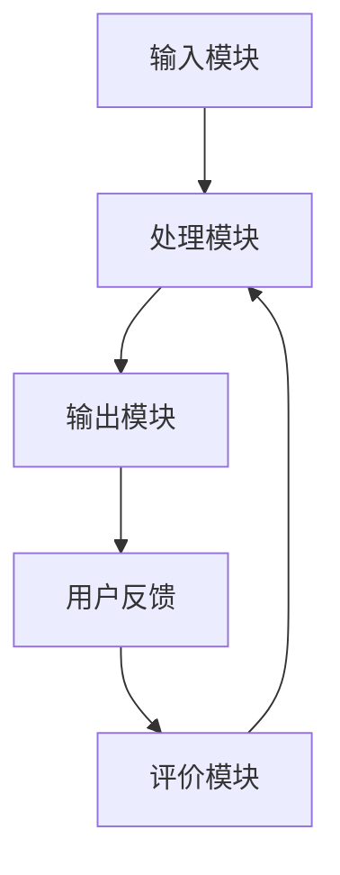

                 


# 强化学习在AI Agent对话生成中的创新应用

> 关键词：强化学习，AI Agent，对话生成，奖励机制，算法实现，系统架构

> 摘要：本文深入探讨了强化学习在AI Agent对话生成中的创新应用，从理论基础到实际案例，全面分析了强化学习如何提升对话生成的性能和自然度。文章详细讲解了强化学习的核心概念、对话生成模型的设计、奖励机制的实现，以及系统架构和项目实战，为读者提供了从理论到实践的完整指南。

---

## 第一部分: 强化学习与AI Agent对话生成概述

### 第1章: 强化学习与AI Agent的基本概念

#### 1.1 强化学习的定义与特点
- 1.1.1 强化学习的基本概念：强化学习是一种机器学习范式，通过智能体与环境的交互，利用奖励信号来学习策略，以最大化累积奖励。
- 1.1.2 强化学习的核心特点：探索与利用、延迟奖励、非平稳环境、高维状态空间。
- 1.1.3 强化学习与监督学习的区别：监督学习基于标注数据，强化学习基于奖励信号。

#### 1.2 AI Agent的基本概念
- 1.2.1 AI Agent的定义：AI Agent是一个能够感知环境并采取行动以实现目标的智能体。
- 1.2.2 AI Agent的核心功能：感知、决策、行动、学习。
- 1.2.3 AI Agent的应用场景：对话系统、游戏AI、机器人控制、推荐系统。

#### 1.3 强化学习在AI Agent对话生成中的应用背景
- 1.3.1 对话生成的挑战：上下文理解、多样性、一致性、生成效率。
- 1.3.2 强化学习在对话生成中的优势：动态奖励、长期依赖建模、自适应策略。
- 1.3.3 当前研究现状与未来趋势：基于DRL的对话生成、多轮对话优化、个性化对话。

### 第2章: 强化学习的核心理论与算法

#### 2.1 马尔可夫决策过程（MDP）
- 2.1.1 状态空间：环境中的所有可能状态。
- 2.1.2 行动空间：智能体可执行的所有动作。
- 2.1.3 奖励函数：定义每个状态和动作对的奖励。
- 2.1.4 动作与状态转移：智能体选择动作，环境根据动作转移至新状态。

#### 2.2 策略与价值函数
- 2.2.1 策略函数：π(a|s)表示在状态s下选择动作a的概率。
- 2.2.2 价值函数：V(s)表示在状态s下策略的期望累积奖励。
- 2.2.3 策略梯度方法：通过梯度上升优化策略，如REINFORCE算法。

#### 2.3 常见的强化学习算法
- 2.3.1 Q-Learning：基于值迭代的无模型算法，适用于离散环境。
- 2.3.2 Deep Q-Networks (DQN)：使用深度神经网络近似Q值函数，处理高维状态空间。
- 2.3.3 Policy Gradient Methods：直接优化策略的梯度，适用于连续动作空间。
- 2.3.4 Actor-Critic Methods：结合策略和价值评估，如PPO和A2C。

### 第3章: 对话生成模型的强化学习框架

#### 3.1 对话生成的基本模型
- 3.1.1 基于生成对抗网络（GAN）的对话生成：通过生成器和判别器对抗训练，提升生成质量。
- 3.1.2 基于变换器（Transformer）的对话生成：利用自注意力机制处理长距离依赖。
- 3.1.3 基于序列到序列模型（Seq2Seq）的对话生成：编码器-解码器结构处理对话上下文。

#### 3.2 强化学习在对话生成中的创新应用
- 3.2.1 基于强化学习的Seq2Seq模型：将奖励信号整合到解码过程，优化生成结果。
- 3.2.2 基于策略梯度的对话生成：直接优化生成策略，提升生成对话的多样性和流畅性。
- 3.2.3 基于Actor-Critic架构的对话生成：结合策略和价值评估，平衡探索与利用。

### 第4章: 对话生成中的奖励机制设计

#### 4.1 奖励函数的设计原则
- 4.1.1 基于相似度的奖励：使用余弦相似度或BLEU评估生成回复与参考回复的相似性。
- 4.1.2 基于人类反馈的奖励：通过人工评价生成回复的质量，如情感评分。
- 4.1.3 基于任务完成度的奖励：根据生成回复是否帮助用户完成特定任务。

#### 4.2 奖励模型的实现
- 4.2.1 基于监督学习的奖励模型：使用标注数据训练奖励函数。
- 4.2.2 基于对抗训练的奖励模型：生成器和判别器共同优化奖励函数。
- 4.2.3 基于策略梯度的奖励模型：通过梯度上升优化奖励模型的参数。

### 第5章: 系统分析与架构设计方案

#### 5.1 问题场景介绍
- 对话生成系统的整体架构：包括输入模块、处理模块和输出模块。
- 系统功能设计：用户输入查询，系统生成回复，用户反馈评价。

#### 5.2 系统架构设计（Mermaid图）


#### 5.3 系统架构设计详细说明
- 5.3.1 输入模块：接收用户的输入，解析上下文。
- 5.3.2 处理模块：使用强化学习模型生成回复，结合奖励机制优化生成策略。
- 5.3.3 输出模块：将生成的回复返回给用户。
- 5.3.4 用户反馈：用户对生成的回复进行评分或选择。
- 5.3.5 评价模块：根据反馈调整奖励函数，优化生成策略。

### 第6章: 项目实战

#### 6.1 环境安装
- 安装Python和必要的库：如TensorFlow、Keras、OpenAI Gym。
- 安装对话生成框架：如Hugging Face的Transformers库。

#### 6.2 核心代码实现（Python）
```python
import tensorflow as tf
from tensorflow.keras.layers import Dense, Input, LSTM, GRU
from tensorflow.keras.models import Model

def build_model(input_shape):
    inputs = Input(shape=input_shape)
    lstm = LSTM(128, return_sequences=True)(inputs)
    dense = Dense(256, activation='relu')(lstm)
    outputs = Dense(1, activation='linear')(dense)
    model = Model(inputs=inputs, outputs=outputs)
    return model

model = build_model((max_len, embedding_dim))
model.compile(optimizer='adam', loss='mse')
```

#### 6.3 代码应用解读与分析
- 输入模块：处理用户输入，生成初始状态。
- 处理模块：使用构建好的模型生成回复。
- 输出模块：返回生成的回复给用户。
- 反馈模块：收集用户反馈，调整奖励函数。

#### 6.4 实际案例分析
- 案例1：简单的对话生成，如客服对话。
- 案例2：复杂的对话生成，如多轮对话中的上下文处理。

#### 6.5 项目小结
- 项目实现的关键步骤：数据预处理、模型训练、奖励机制调整。
- 项目中遇到的问题：奖励函数设计的困难，模型收敛速度慢。
- 解决方法：使用更复杂的奖励模型，调整学习率和优化策略。

### 第7章: 总结与展望

#### 7.1 核心内容回顾
- 强化学习的基本概念和算法。
- 对话生成模型的设计和实现。
- 奖励机制在对话生成中的重要性。

#### 7.2 未来的研究方向
- 更复杂的奖励函数设计。
- 多模态对话生成，结合视觉信息。
- 高效的强化学习算法优化，减少计算成本。

#### 7.3 最佳实践 tips
- 在实际应用中，结合监督学习和强化学习，提升生成质量。
- 定期收集用户反馈，优化奖励机制。
- 使用云计算资源，加速模型训练。

#### 7.4 注意事项
- 避免过度拟合，保持模型的泛化能力。
- 处理好探索与利用的平衡，避免生成僵化的回复。
- 定期监控模型性能，及时调整参数。

#### 7.5 拓展阅读
- 建议阅读相关论文，如《Deep Reinforcement Learning for Dialogue Generation》。
- 参加相关的技术研讨会和工作坊，获取最新研究进展。

---

# 作者：AI天才研究院/AI Genius Institute & 禅与计算机程序设计艺术 /Zen And The Art of Computer Programming

