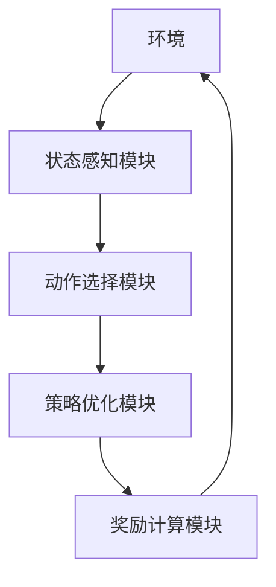
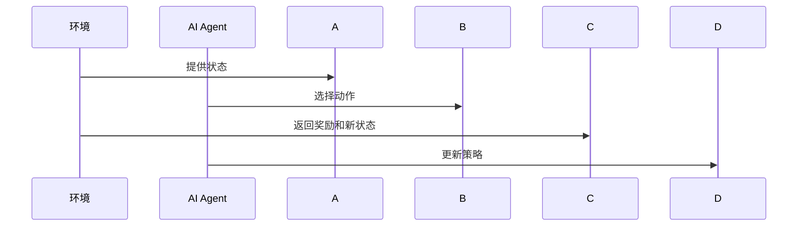

                 


# 强化学习在AI Agent开发中的应用

> **关键词**：强化学习、AI Agent、Q-learning、DQN、策略梯度  
> **摘要**：本文深入探讨了强化学习在AI Agent开发中的应用，从基础概念到核心算法，再到系统设计和实战案例，全面解析强化学习如何助力AI Agent的智能决策与优化。

---

# 强化学习与AI Agent开发基础

## 1. 强化学习与AI Agent概述

### 1.1 强化学习的基本概念
- **什么是强化学习**：强化学习是一种机器学习范式，通过智能体与环境的交互，学习如何做出最优决策。智能体通过执行动作并获得奖励或惩罚来优化其行为策略。
- **核心要素**：
  - 状态（State）：智能体所处的环境信息。
  - 动作（Action）：智能体采取的行为。
  - 奖励（Reward）：智能体行为的价值反馈。
  - 策略（Policy）：智能体选择动作的规则。
  - 价值函数（Value Function）：评估状态或动作的价值。
- **AI Agent的定义与特点**：AI Agent是一种能够感知环境并自主决策的智能实体，具备主动性、智能性和适应性。

### 1.2 强化学习与AI Agent的关系
- **强化学习在AI Agent中的作用**：强化学习是AI Agent实现自主决策的核心技术，通过与环境交互优化行为策略。
- **AI Agent的类型与应用场景**：
  - 单智能体：如游戏AI、机器人控制。
  - 多智能体：如自动驾驶、分布式系统。
  - 应用场景：游戏、机器人、自动驾驶、金融交易等。
- **强化学习与监督学习的区别**：强化学习通过奖励信号优化决策，而监督学习通过标签数据学习输入到输出的映射。

### 1.3 强化学习的核心算法简介
- **Q-learning算法**：基于值函数的强化学习算法，通过更新Q值表逼近最优策略。
- **Deep Q-Networks（DQN）**：将Q值表替换为深度神经网络，适用于高维状态空间。
- **策略梯度方法**：直接优化策略参数，通过梯度上升最大化期望奖励。

---

## 2. 强化学习的核心算法原理

### 2.1 Q-learning算法原理
- **基本原理**：通过迭代更新Q值表，找到每个状态-动作对的最大Q值，最终形成最优策略。
- **数学公式**：
  $$ Q(s,a) = Q(s,a) + \alpha (r + \gamma \max Q(s',a') - Q(s,a)) $$
  其中，$\alpha$是学习率，$\gamma$是折扣因子。
- **优缺点**：
  - 优点：简单易实现，适用于离散动作空间。
  - 缺点：状态空间大时，Q值表难以存储。

### 2.2 Deep Q-Networks（DQN）算法
- **改进思路**：使用深度神经网络近似Q值函数，避免Q值表的存储问题。
- **网络结构**：
  - 输入层：接收状态信息。
  - 隐藏层：提取特征。
  - 输出层：输出每个动作的Q值。
- **训练过程**：
  - 现在，我们使用Python代码示例来展示DQN的实现：
  ```python
  import numpy as np
  import gym
  import tensorflow as tf

  class DQN:
      def __init__(self, state_space, action_space, learning_rate=0.01):
          self.state_space = state_space
          self.action_space = action_space
          self.model = tf.keras.Sequential([
              tf.keras.layers.Dense(24, activation='relu', input_dim=state_space),
              tf.keras.layers.Dense(action_space)
          ])
          self.optimizer = tf.keras.optimizers.Adam(learning_rate=learning_rate)

      def remember(self, state, action, reward, next_state):
          # 简单的内存实现，实际可以使用更复杂的结构
          self.memory.append((state, action, reward, next_state))

      def act(self, state):
          # 选择动作：利用ε-greedy策略
          if np.random.random() < 0.9:
              return np.argmax(self.model.predict(state)[0])
          else:
              return np.random.randint(self.action_space)

      def replay(self, batch_size):
          # 训练神经网络
          if len(self.memory) < batch_size:
              return
          minibatch = np.random.choice(self.memory, batch_size)
          states = np.array([t[0] for t in minibatch])
          actions = np.array([t[1] for t in minibatch])
          rewards = np.array([t[2] for t in minibatch])
          next_states = np.array([t[3] for t in minibatch])

          # 预测Q值和目标Q值
          q_values = self.model.predict(states)
          next_q_values = self.model.predict(next_states)
          targets = q_values.copy()

          for i in range(batch_size):
              targets[i][actions[i]] = rewards[i] + gamma * np.max(next_q_values[i])

          self.model.fit(states, targets, epochs=1, verbose=0)

  # 使用DQN算法训练CartPole环境
  env = gym.make('CartPole-v1')
  state_space = env.observation_space.shape[0]
  action_space = env.action_space.n
  dqn = DQN(state_space, action_space)
  ```

### 2.3 策略梯度方法
- **基本原理**：直接优化策略参数，通过梯度上升最大化期望奖励。
- **数学公式**：
  $$ \nabla \theta J(\theta) = \mathbb{E}[ \nabla_{\theta} \log \pi(a|s) Q(s,a) ] $$
  其中，$\pi(a|s)$是策略分布，$Q(s,a)$是价值函数。
- **优缺点**：
  - 优点：适用于连续动作空间。
  - 缺点：计算复杂度较高。

---

## 3. AI Agent的开发流程与系统架构

### 3.1 AI Agent的开发流程
- **问题建模**：明确AI Agent的目标、状态和动作空间。
- **状态与动作空间设计**：根据具体任务设计状态和动作。
- **策略与奖励机制设计**：定义策略函数和奖励函数。

### 3.2 系统架构设计
- **功能模块划分**：
  - 状态感知模块：接收环境信息。
  - 动作选择模块：根据当前状态选择动作。
  - 奖励计算模块：计算并反馈奖励。
  - 策略优化模块：更新策略参数。
- **系统架构图（Mermaid）**：


### 3.3 接口设计与交互流程
- **系统接口定义**：定义AI Agent与环境之间的交互接口。
- **交互流程图（Mermaid）**：


---

## 4. 强化学习在AI Agent开发中的应用

### 4.1 项目实战：游戏AI Agent开发
- **环境配置**：使用OpenAI Gym库，选择CartPole环境。
- **代码实现**：基于Q-learning或DQN算法实现游戏AI Agent。
- **测试与优化**：通过不断训练优化策略，提升游戏表现。

### 4.2 案例分析
- **案例介绍**：开发一个简单的游戏AI Agent，实现CartPole平衡。
- **代码示例**：
  ```python
  import gym
  import numpy as np

  def q_learning(env, epsilon=0.1, alpha=0.1, gamma=0.9):
      n_states = env.observation_space.shape[0]
      n_actions = env.action_space.n
      Q = np.zeros((n_states, n_actions))

      for episode in range(1000):
          state = env.reset()
          total_reward = 0
          while True:
              if np.random.random() < epsilon:
                  action = np.random.randint(n_actions)
              else:
                  action = np.argmax(Q[state])

              next_state, reward, done, _ = env.step(action)
              Q[state][action] = Q[state][action] + alpha * (reward + gamma * np.max(Q[next_state]) - Q[state][action])

              total_reward += reward
              state = next_state
              if done:
                  break
      return Q

  # 测试Q-learning算法
  env = gym.make('CartPole-v1')
  Q = q_learning(env)
  env.close()
  ```

---

## 5. 总结与展望

### 5.1 强化学习的核心要点
- 强化学习通过与环境交互，优化AI Agent的决策策略。
- Q-learning、DQN和策略梯度是三种主要算法，各有优缺点。

### 5.2 当前研究热点
- 多智能体强化学习：解决多个AI Agent协作问题。
- 强化学习与神经网络结合：提升算法性能和泛化能力。

### 5.3 未来研究方向
- 强化学习的可解释性：提高算法的透明性和可解释性。
- 离线强化学习：利用历史数据进行训练，减少与环境的交互成本。

### 5.4 开发建议与注意事项
- 选择合适的算法：根据任务特点选择Q-learning、DQN或策略梯度。
- 调参技巧：合理设置学习率、折扣因子和探索率。
- 系统设计：注重模块化和可扩展性，方便后续优化和维护。

### 5.5 作者总结
强化学习为AI Agent开发提供了强大的工具，通过不断的研究与实践，我们可以开发出更智能、更高效的AI系统。

---

**作者：AI天才研究院/AI Genius Institute & 禅与计算机程序设计艺术 /Zen And The Art of Computer Programming**

