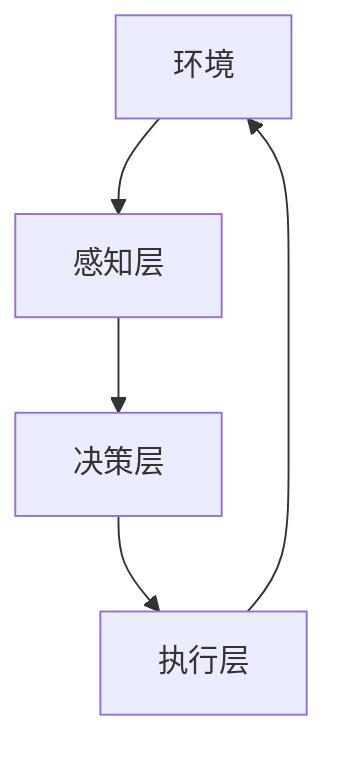
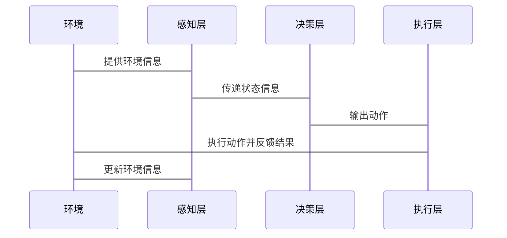

                 


# 强化学习在AI Agent自主探索中的应用

> 关键词：强化学习, AI Agent, 自主探索, 马尔可夫决策过程, 深度Q网络, 策略梯度

> 摘要：本文详细探讨了强化学习在AI Agent自主探索中的应用，从基础概念到高级算法，再到实际案例，系统地分析了强化学习的核心原理及其在AI Agent中的应用。通过理论与实践相结合的方式，本文为读者提供了全面的视角，帮助理解如何利用强化学习实现AI Agent的自主探索。

---

# 第1章: 强化学习概述

## 1.1 强化学习的基本概念

### 1.1.1 什么是强化学习
强化学习是一种机器学习范式，通过智能体与环境的交互，学习如何在复杂环境中做出最优决策。智能体通过试错的方式，根据环境的反馈（奖励或惩罚）来调整自己的行为，以最大化累积的奖励。

### 1.1.2 强化学习的核心要素
- **状态（State）**：智能体所处环境的当前情况。
- **动作（Action）**：智能体根据当前状态做出的决策。
- **奖励（Reward）**：环境对智能体动作的反馈，用于指导智能体的行为。
- **策略（Policy）**：智能体选择动作的规则，决定在特定状态下选择哪个动作。
- **值函数（Value Function）**：衡量某个状态或动作在未来能带来的预期奖励。

### 1.1.3 强化学习与监督学习的区别
| 对比维度 | 监督学习 | 强化学习 |
|----------|----------|----------|
| 数据来源 | 标签化数据 | 环境反馈（奖励） |
| 目标     | 最小化预测误差 | 最大化累积奖励 |
| 互动性   | 静态输入-输出 | 动态交互 |

---

## 1.2 AI Agent的定义与特点

### 1.2.1 AI Agent的基本概念
AI Agent是一种能够感知环境、自主决策并采取行动的智能体，其核心目标是通过与环境的交互实现特定任务的最优完成。

### 1.2.2 AI Agent的核心能力
- **感知能力**：通过传感器或其他输入方式获取环境信息。
- **决策能力**：基于当前状态和历史经验做出最优决策。
- **执行能力**：根据决策执行具体动作。

### 1.2.3 AI Agent的分类与应用场景
- **基于规则的AI Agent**：通过预定义的规则进行决策，适用于简单任务。
- **基于学习的AI Agent**：通过强化学习等方法学习决策策略，适用于复杂任务。
- **基于知识的AI Agent**：结合知识库进行推理和决策，适用于需要大量知识储备的任务。

---

## 1.3 强化学习在AI Agent中的作用

### 1.3.1 强化学习如何驱动AI Agent
强化学习通过试错机制，帮助AI Agent在复杂环境中找到最优策略。AI Agent通过不断尝试不同的动作，根据环境反馈调整行为，最终实现目标。

### 1.3.2 强化学习与自主探索的关系
自主探索是强化学习的核心，AI Agent通过探索未知环境，发现新的状态和动作，从而积累经验，提升决策能力。

### 1.3.3 强化学习在AI Agent中的挑战
- **环境的不确定性**：环境可能随机变化，导致决策的不确定性。
- **计算资源需求**：强化学习需要大量计算资源，尤其是深度强化学习。
- **训练稳定性**：部分强化学习算法训练过程不稳定，需要精心设计的策略。

---

## 1.4 本章小结
本章介绍了强化学习的基本概念和AI Agent的核心能力，分析了强化学习在AI Agent中的作用及其挑战。强化学习通过试错机制，帮助AI Agent实现自主探索，是实现智能决策的重要方法。

---

# 第2章: 强化学习的核心概念与数学模型

## 2.1 马尔可夫决策过程（MDP）

### 2.1.1 状态空间的定义
状态空间是所有可能状态的集合。例如，在迷宫导航问题中，每个位置都是一个状态。

### 2.1.2 动作空间的定义
动作空间是智能体在每个状态下可能采取的所有动作的集合。例如，在迷宫导航中，智能体可能的动作是“左转”、“右转”和“直行”。

### 2.1.3 奖励函数的设计
奖励函数定义了智能体在每个状态下采取某个动作后所获得的奖励。例如，在迷宫导航中，到达目标位置的奖励为+1，其他情况为-0.1。

### 2.1.4 转移概率的计算
转移概率表示智能体在某个状态下采取某个动作后，转移到下一个状态的概率。

$$ P(s' | s, a) $$
其中，$s$ 是当前状态，$a$ 是动作，$s'$ 是下一个状态。

---

## 2.2 强化学习的核心公式

### 2.2.1 Q-learning算法的数学表达
Q-learning的目标是学习每个状态下每个动作的最优Q值。Q值表示从当前状态采取某个动作后，未来能获得的预期奖励总和。

$$ Q(s, a) = r + \gamma \max Q(s', a') $$
其中，$\gamma$ 是折扣因子，$r$ 是即时奖励。

### 2.2.2 深度Q网络（DQN）的数学模型
DQN通过神经网络近似Q函数。输入是状态$s$，输出是所有动作的Q值。

$$ Q(s, a) = \theta \cdot \phi(s) $$
其中，$\theta$ 是网络参数，$\phi(s)$ 是状态的特征向量。

### 2.2.3 政策梯度（Policy Gradient）的数学推导
政策梯度方法直接优化策略$\pi(a|s)$，目标是最化累积奖励的期望。

$$ \nabla J(\theta) = \mathbb{E}_{s,a} [\nabla \log \pi(a|s) Q_\theta(s,a)] $$

---

## 2.3 强化学习中的探索与利用

### 2.3.1 探索与利用的平衡
探索是指尝试未访问过的动作，以发现更好的策略；利用是指在已知好的策略下进行操作，以最大化奖励。

### 2.3.2 贪婪算法与ε-greedy策略
ε-greedy策略是一种常见的探索-利用策略。以概率ε选择随机动作，以概率1-ε选择当前最优动作。

### 2.3.3 多臂老虎机问题的数学分析
多臂老虎机问题是强化学习中的一个经典问题，涉及多个选项（动作），智能体需要通过试错找到最佳选项。

---

## 2.4 本章小结
本章详细讲解了强化学习的核心概念，包括马尔可夫决策过程、Q值函数、深度Q网络和政策梯度方法。同时，分析了探索与利用的平衡，为后续算法实现奠定了理论基础。

---

# 第3章: 强化学习算法的实现原理

## 3.1 Q-learning算法的实现

### 3.1.1 Q-learning的基本流程
1. 初始化Q表为零。
2. 在每个时间步，选择动作（利用ε-greedy策略）。
3. 执行动作，观察新状态和奖励。
4. 更新Q表：
   $$ Q(s, a) = Q(s, a) + \alpha (r + \gamma \max Q(s', a') - Q(s, a)) $$
   其中，$\alpha$ 是学习率。

### 3.1.2 Q表的更新规则
Q表的更新基于即时奖励和未来奖励的折扣值。

### 3.1.3 探索与利用策略的实现
通过调整ε值，平衡探索与利用。

---

## 3.2 深度Q网络（DQN）的实现

### 3.2.1 DQN的基本架构
DQN由两个神经网络组成：主网络和目标网络。主网络用于评估当前策略，目标网络用于稳定训练。

### 3.2.2 经验回放机制的实现
经验回放通过存储过去的状态、动作和奖励，随机采样来训练网络，避免梯度消失问题。

### 3.2.3 目标网络的更新策略
目标网络定期同步主网络的权重，以保持稳定。

---

## 3.3 政策梯度方法的实现

### 3.3.1 政策梯度的基本原理
政策梯度方法直接优化策略，通过梯度上升最大化累积奖励。

### 3.3.2 REINFORCE算法的实现
REINFORCE算法是一种基于梯度的政策优化方法，适用于离散动作空间。

### 3.3.3 策略网络的优化方法
使用随机梯度下降（SGD）或Adam优化器更新策略网络参数。

---

## 3.4 本章小结
本章详细讲解了Q-learning、DQN和政策梯度方法的实现原理，为后续AI Agent的自主探索提供了算法基础。

---

# 第4章: 强化学习在AI Agent中的应用案例

## 4.1 游戏AI的应用

### 4.1.1 游戏AI的基本实现
以经典游戏《Pong》为例，通过强化学习训练AI Agent完成游戏任务。

### 4.1.2 DQN在游戏AI中的应用
使用DQN算法训练AI Agent在《Pong》中击败对手。

### 4.1.3 多智能体协作的实现
在多智能体游戏中，通过强化学习实现多个AI Agent的协作。

---

## 4.2 机器人控制的应用

### 4.2.1 机器人控制的基本实现
以机器人导航为例，通过强化学习训练AI Agent完成迷宫导航任务。

### 4.2.2 深度强化学习的应用
使用深度强化学习算法（如DQN或PPO）实现更复杂的机器人控制任务。

### 4.2.3 多目标协作的实现
在多机器人协作中，通过强化学习实现任务分配和协作决策。

---

## 4.3 实际案例分析

### 4.3.1 迷宫导航案例
训练AI Agent在迷宫中找到目标位置，使用Q-learning算法实现。

### 4.3.2 多智能体协作案例
训练多个AI Agent在复杂环境中协作完成任务，如无人机编队。

---

## 4.4 本章小结
本章通过具体案例分析，展示了强化学习在游戏AI和机器人控制中的应用，进一步验证了强化学习在AI Agent自主探索中的有效性。

---

# 第5章: 强化学习的系统分析与架构设计

## 5.1 系统分析

### 5.1.1 问题场景介绍
以训练一个AI Agent完成复杂任务为例，分析系统的输入、输出和目标。

### 5.1.2 系统功能设计
- **感知层**：获取环境信息。
- **决策层**：基于强化学习算法做出决策。
- **执行层**：执行决策并反馈结果。

---

## 5.2 系统架构设计

### 5.2.1 系统架构图


### 5.2.2 系统接口设计
- **输入接口**：接收环境信息。
- **输出接口**：输出决策动作。
- **反馈接口**：接收环境反馈。

### 5.2.3 系统交互流程


---

## 5.3 本章小结
本章通过系统分析与架构设计，详细描述了强化学习在AI Agent中的实现流程，为实际应用提供了参考。

---

# 第6章: 强化学习的项目实战

## 6.1 环境安装

### 6.1.1 安装Python
安装Python 3.8及以上版本。

### 6.1.2 安装深度学习框架
安装TensorFlow或PyTorch。

### 6.1.3 安装其他依赖
安装必要的库，如Gym库（`pip install gym`）。

---

## 6.2 核心实现

### 6.2.1 Q-learning算法实现
```python
import numpy as np

class QLearning:
    def __init__(self, state_space, action_space, gamma=0.99, alpha=0.1, epsilon=0.1):
        self.q_table = np.zeros((state_space, action_space))
        self.gamma = gamma
        self.alpha = alpha
        self.epsilon = epsilon
    
    def choose_action(self, state):
        if np.random.random() < self.epsilon:
            return np.random.randint(0, action_space)
        else:
            return np.argmax(self.q_table[state])
    
    def learn(self, state, action, reward, next_state):
        target = reward + self.gamma * np.max(self.q_table[next_state])
        self.q_table[state, action] = self.q_table[state, action] + self.alpha * (target - self.q_table[state, action])
```

### 6.2.2 DQN算法实现
```python
import tensorflow as tf

class DQN:
    def __init__(self, state_dim, action_dim, gamma=0.99, epsilon=0.1):
        self.state_dim = state_dim
        self.action_dim = action_dim
        self.gamma = gamma
        self.epsilon = epsilon
        self.main_network = self.build_network()
        self.target_network = self.build_network()
    
    def build_network(self):
        model = tf.keras.Sequential([
            tf.keras.layers.Dense(64, activation='relu', input_shape=(self.state_dim,)),
            tf.keras.layers.Dense(self.action_dim)
        ])
        return model
    
    def choose_action(self, state):
        if np.random.random() < self.epsilon:
            return np.random.randint(0, self.action_dim)
        else:
            predicted = self.main_network.predict(state)
            return np.argmax(predicted[0])
    
    def learn(self, experiences):
        states = np.array([exp[0] for exp in experiences])
        actions = np.array([exp[1] for exp in experiences])
        rewards = np.array([exp[2] for exp in experiences])
        next_states = np.array([exp[3] for exp in experiences])
        
        targets = self.target_network.predict(next_states)
        targets[range(len(actions)), actions] += rewards
        
        self.main_network.fit(states, targets, epochs=1, verbose=0)
        self.update_target_network()
    
    def update_target_network(self):
        self.target_network.set_weights(self.main_network.get_weights())
```

---

## 6.3 项目实战案例

### 6.3.1 迷宫导航案例
使用Q-learning算法训练AI Agent完成迷宫导航任务。

### 6.3.2 多智能体协作案例
使用DQN算法训练多个AI Agent在复杂环境中协作完成任务。

---

## 6.4 本章小结
本章通过具体项目实战，展示了强化学习算法的实现过程，帮助读者更好地理解理论知识。

---

# 第7章: 强化学习的总结与展望

## 7.1 总结
强化学习是一种强大的机器学习方法，通过试错机制帮助AI Agent实现自主探索。本文详细讲解了强化学习的核心概念、算法实现及其在AI Agent中的应用。

## 7.2 展望
未来，强化学习将在更多领域得到应用，如自动驾驶、机器人控制、游戏AI等。同时，如何解决强化学习中的计算资源需求和训练稳定性问题，是研究者们需要进一步探索的方向。

---

# 作者：AI天才研究院/AI Genius Institute & 禅与计算机程序设计艺术 /Zen And The Art of Computer Programming

---

通过本文的系统分析和详细讲解，读者可以全面理解强化学习在AI Agent自主探索中的应用，并能够将其应用于实际项目中。

