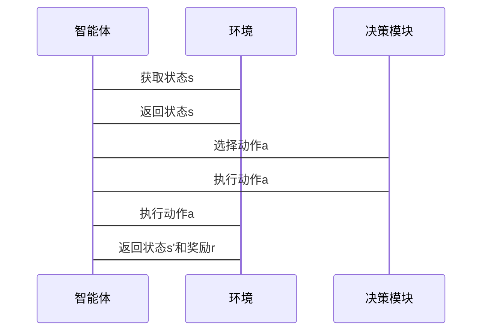
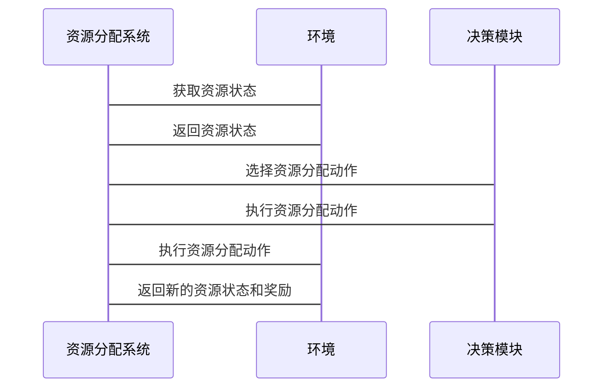

                 


# 强化学习在AI Agent资源分配中的应用

> 关键词：强化学习，AI Agent，资源分配，Q-learning，Deep Q-Networks

> 摘要：本文深入探讨了强化学习在AI Agent资源分配中的应用。从基础概念到数学模型，从算法原理到系统架构设计，再到实际案例分析，全面解析了强化学习如何有效解决资源分配问题。文章内容涵盖强化学习的基本原理、资源分配问题的建模与求解、强化学习算法的实现，以及资源分配系统的架构设计和项目实战，帮助读者全面理解和掌握强化学习在资源分配中的应用。

## 第1章: 强化学习与AI Agent基础

### 1.1 强化学习的基本概念

#### 1.1.1 强化学习的定义
强化学习（Reinforcement Learning, RL）是一种机器学习范式，通过智能体与环境的交互，学习最优策略以最大化累积奖励。智能体通过试错方式探索环境，调整自身行为，以达到目标。

#### 1.1.2 强化学习的核心要素
- **状态（State）**：智能体所处环境的当前情况。
- **动作（Action）**：智能体在给定状态下采取的行为。
- **奖励（Reward）**：智能体采取动作后获得的反馈，用于评估动作的好坏。
- **策略（Policy）**：智能体选择动作的概率分布。
- **值函数（Value Function）**：评估某个状态或动作的期望奖励。

#### 1.1.3 强化学习与监督学习的区别
- **监督学习**：基于标记的训练数据，直接预测目标输出。
- **强化学习**：通过与环境互动，逐步优化策略，没有明确的标记数据。

#### 1.1.4 强化学习的数学模型
状态价值函数定义为：
$$ V(s) = \mathbb{E}[R_{t+1} + \gamma R_{t+2} + \gamma^2 R_{t+3} + \cdots ] $$
其中，$R$是奖励，$\gamma$是折扣因子。

### 1.2 AI Agent的基本概念

#### 1.2.1 AI Agent的定义
AI Agent是一种智能实体，能够感知环境并采取行动以实现目标。Agent可以是软件程序、机器人或其他智能系统。

#### 1.2.2 AI Agent的核心功能
- **感知**：通过传感器或数据源获取环境信息。
- **决策**：基于感知信息，选择最优动作。
- **执行**：将决策转化为实际操作。

#### 1.2.3 AI Agent的分类
- **简单反射型**：基于当前状态直接行动。
- **基于模型的**：维护环境模型，用于决策。
- **目标驱动型**：基于目标选择行动。
- **实用驱动型**：基于效用函数优化决策。

#### 1.2.4 AI Agent的应用场景
- **机器人控制**：路径规划与动作控制。
- **游戏AI**：策略制定与棋局优化。
- **资源分配**：优化资源使用效率。

### 1.3 强化学习在AI Agent中的应用背景

#### 1.3.1 资源分配问题的定义
资源分配问题是在有限资源条件下，合理分配资源以最大化目标函数的过程。

#### 1.3.2 强化学习在资源分配中的优势
- **自适应性**：智能体能根据环境变化调整策略。
- **全局优化**：强化学习优化整体目标，而非局部最优。

#### 1.3.3 资源分配问题的挑战与解决方案
- **复杂性高**：资源分配涉及多个变量，强化学习通过状态和动作建模，简化问题。

## 第2章: 强化学习的核心概念与数学模型

### 2.1 强化学习的基本原理

#### 2.1.1 状态空间与动作空间
状态空间是所有可能状态的集合，动作空间是所有可能动作的集合。

#### 2.1.2 奖励函数的设计
奖励函数定义为$ R(s, a) $，表示在状态$s$下执行动作$a$获得的奖励。

#### 2.1.3 策略与价值函数
- **策略**：$\pi(a|s)$，在状态$s$下选择动作$a$的概率。
- **价值函数**：$ V(s) $，状态$s$的期望累积奖励。

#### 2.1.4 探索与利用的平衡
探索：尝试新动作以发现更好的策略；利用：利用当前知识选择最优动作。

### 2.2 强化学习的数学模型

#### 2.2.1 Q-learning算法的数学推导
Q-learning算法更新公式：
$$ Q(s, a) \leftarrow Q(s, a) + \alpha [r + \gamma \max Q(s', a') - Q(s, a)] $$
其中，$\alpha$是学习率，$\gamma$是折扣因子。

#### 2.2.2 Deep Q-Networks的数学模型
DQN使用两个神经网络，目标网络和行为网络，通过经验回放和目标更新优化Q值。

#### 2.2.3 策略梯度方法的数学公式
策略梯度方法通过优化策略的参数，最大化累积奖励：
$$ \nabla \theta J(\theta) = \mathbb{E} [ \nabla \log \pi(a|s) Q(s,a) ] $$

#### 2.2.4 强化学习的优化目标
最大化累积奖励：
$$ \max_{\pi} \mathbb{E}[ \sum_{t=0}^\infty \gamma^t R(s_t, a_t) ] $$

### 2.3 强化学习算法的实现

#### 2.3.1 Q-learning算法的实现
```python
class QLearning:
    def __init__(self, state_space, action_space, gamma=0.99, epsilon=1.0, epsilon_min=0.01, epsilon_decay=0.999):
        self.state_space = state_space
        self.action_space = action_space
        self.gamma = gamma
        self.epsilon = epsilon
        self.epsilon_min = epsilon_min
        self.epsilon_decay = epsilon_decay
        self.Q = defaultdict(lambda: np.zeros(len(action_space)))

    def get_action(self, state):
        if np.random.random() < self.epsilon:
            return np.random.randint(len(self.action_space))
        else:
            q_values = self.Q[state]
            return np.argmax(q_values)

    def update(self, state, action, reward, next_state):
        q_next = self.Q[next_state].max() if next_state in self.Q else 0
        target = reward + self.gamma * q_next
        self.Q[state][action] = target
        self.Q[state][action] = target

    def decay_epsilon(self):
        self.epsilon = max(self.epsilon * self.epsilon_decay, self.epsilon_min)
```

#### 2.3.2 Deep Q-Networks的实现
```python
import torch
import torch.nn as nn
import torch.optim as optim

class DQN(nn.Module):
    def __init__(self, input_dim, output_dim):
        super(DQN, self).__init__()
        self.fc1 = nn.Linear(input_dim, 64)
        self.fc2 = nn.Linear(64, output_dim)
        self.relu = nn.ReLU()
        self.softmax = nn.Softmax(dim=1)

    def forward(self, x):
        x = self.fc1(x)
        x = self.relu(x)
        x = self.fc2(x)
        x = self.softmax(x)
        return x

def train_dqn(env, policy_net, target_net, optimizer, gamma, num_episodes, epsilon):
    for _ in range(num_episodes):
        state = env.reset()
        while not done:
            # 选择动作
            if np.random.random() < epsilon:
                action = np.random.randint(env.action_space)
            else:
                with torch.no_grad():
                    q_values = policy_net(torch.tensor(state))
                    action = torch.argmax(q_values).item()
            
            # 执行动作，获得下一个状态和奖励
            next_state, reward, done = env.step(action)
            
            # 计算目标Q值
            target_q = target_net(torch.tensor(next_state))
            current_q = policy_net(torch.tensor(state))
            
            # 更新Q值
            target_q = torch.tensor(reward) + gamma * target_q * (1 - done)
            loss = nn.MSELoss()(current_q, target_q)
            optimizer.zero_grad()
            loss.backward()
            optimizer.step()
            
            # 同步目标网络
            if _ % 100 == 0:
                target_net.load_state_dict(policy_net.state_dict())
```

#### 2.3.3 策略梯度方法的实现
```python
import torch
import torch.nn as nn
import torch.optim as optim

class PolicyGradientNetwork(nn.Module):
    def __init__(self, input_dim, output_dim):
        super(PolicyGradientNetwork, self).__init__()
        self.fc1 = nn.Linear(input_dim, 64)
        self.fc2 = nn.Linear(64, output_dim)
        self.relu = nn.ReLU()
        self.softmax = nn.Softmax(dim=1)
        
    def forward(self, x):
        x = self.fc1(x)
        x = self.relu(x)
        x = self.fc2(x)
        x = self.softmax(x)
        return x

def train_policy_gradient(env, network, optimizer, gamma, num_episodes):
    for _ in range(num_episodes):
        state = env.reset()
        rewards = []
        while not done:
            # 选择动作
            with torch.no_grad():
                action_probs = network(torch.tensor(state))
                action = torch.multinomial(action_probs, 1).item()
            
            # 执行动作，获得下一个状态和奖励
            next_state, reward, done = env.step(action)
            rewards.append(reward)
            
            # 计算损失
            current_action_probs = network(torch.tensor(state))
            loss = -torch.log(current_action_probs[action]) * sum(rewards)
            optimizer.zero_grad()
            loss.backward()
            optimizer.step()
            
            # 更新状态
            state = next_state
```

### 2.4 资源分配系统的架构设计

#### 2.4.1 系统的功能模块划分
- **感知模块**：获取环境状态。
- **决策模块**：基于强化学习算法选择动作。
- **执行模块**：执行决策动作，获得奖励。
- **学习模块**：更新强化学习模型参数。

#### 2.4.2 系统的分层架构设计
- **数据层**：处理原始数据。
- **算法层**：实现强化学习算法。
- **应用层**：提供资源分配服务。

#### 2.4.3 系统的交互设计
使用Mermaid序列图描述系统交互流程：



## 第3章: 资源分配问题的建模与求解

### 3.1 资源分配问题的定义

#### 3.1.1 资源分配问题的背景
资源分配问题广泛存在于任务调度、负载均衡等领域。

#### 3.1.2 资源分配问题的分类
- **单目标优化**：单一目标下的资源分配。
- **多目标优化**：多个目标下的资源分配。

#### 3.1.3 资源分配问题的数学建模
资源分配问题可以表示为：
$$ \max_{x} \sum_{i=1}^n w_i x_i $$
$$ \text{subject to} \quad \sum_{i=1}^n x_i \leq C $$
其中，$x_i$是分配给任务i的资源量，$w_i$是任务i的权重，$C$是总资源量。

### 3.2 强化学习在资源分配中的应用

#### 3.2.1 资源分配问题的强化学习建模
将资源分配问题建模为强化学习问题，其中：
- 状态$s$表示当前资源分配情况。
- 动作$a$表示分配给某个任务的资源量。
- 奖励$r$表示资源利用效率。

#### 3.2.2 资源分配问题的强化学习求解
使用强化学习算法优化资源分配策略。

#### 3.2.3 资源分配问题的强化学习优化
通过强化学习不断优化资源分配策略，提高资源利用率。

### 3.3 强化学习算法的实现

#### 3.3.1 Q-learning算法的实现
在资源分配问题中，Q-learning算法用于更新资源分配策略。

#### 3.3.2 Deep Q-Networks的实现
使用深度Q网络优化资源分配策略，提高决策效率。

#### 3.3.3 策略梯度方法的实现
通过策略梯度方法优化资源分配策略，实现全局最优。

### 3.4 资源分配系统的架构设计

#### 3.4.1 系统的功能模块划分
- **状态感知**：获取资源分配状态。
- **决策模块**：基于强化学习算法选择动作。
- **执行模块**：执行决策动作，获得奖励。
- **学习模块**：更新强化学习模型参数。

#### 3.4.2 系统的分层架构设计
- **数据层**：处理资源分配数据。
- **算法层**：实现强化学习算法。
- **应用层**：提供资源分配服务。

#### 3.4.3 系统的交互设计
使用Mermaid序列图描述系统交互流程：



## 第4章: 强化学习算法的原理与实现

### 4.1 Q-learning算法的实现

#### 4.1.1 Q-learning算法的步骤
1. 初始化Q值表。
2. 重复以下步骤直到收敛：
   - 选择动作。
   - 执行动作，获得奖励。
   - 更新Q值表。

#### 4.1.2 Q-learning算法的代码实现
```python
import numpy as np
from collections import defaultdict

class QLearning:
    def __init__(self, state_space, action_space, gamma=0.99, epsilon=1.0, epsilon_min=0.01, epsilon_decay=0.999):
        self.state_space = state_space
        self.action_space = action_space
        self.gamma = gamma
        self.epsilon = epsilon
        self.epsilon_min = epsilon_min
        self.epsilon_decay = epsilon_decay
        self.Q = defaultdict(lambda: np.zeros(len(action_space)))

    def get_action(self, state):
        if np.random.random() < self.epsilon:
            return np.random.randint(len(self.action_space))
        else:
            q_values = self.Q[state]
            return np.argmax(q_values)

    def update(self, state, action, reward, next_state):
        q_next = self.Q[next_state].max() if next_state in self.Q else 0
        target = reward + self.gamma * q_next
        self.Q[state][action] = target
        self.Q[state][action] = target

    def decay_epsilon(self):
        self.epsilon = max(self.epsilon * self.epsilon_decay, self.epsilon_min)
```

### 4.2 Deep Q-Networks的实现

#### 4.2.1 Deep Q-Networks的网络结构
使用两个神经网络，目标网络和行为网络，通过经验回放和目标更新优化Q值。

#### 4.2.2 Deep Q-Networks的训练过程
1. 从经验回放中采样经验。
2. 计算目标Q值和当前Q值。
3. 更新行为网络的参数。
4. 同步目标网络的参数。

#### 4.2.3 Deep Q-Networks的代码实现
```python
import torch
import torch.nn as nn
import torch.optim as optim

class DQN(nn.Module):
    def __init__(self, input_dim, output_dim):
        super(DQN, self).__init__()
        self.fc1 = nn.Linear(input_dim, 64)
        self.fc2 = nn.Linear(64, output_dim)
        self.relu = nn.ReLU()
        self.softmax = nn.Softmax(dim=1)

    def forward(self, x):
        x = self.fc1(x)
        x = self.relu(x)
        x = self.fc2(x)
        x = self.softmax(x)
        return x

def train_dqn(env, policy_net, target_net, optimizer, gamma, num_episodes, epsilon):
    for _ in range(num_episodes):
        state = env.reset()
        while not done:
            # 选择动作
            if np.random.random() < epsilon:
                action = np.random.randint(env.action_space)
            else:
                with torch.no_grad():
                    q_values = policy_net(torch.tensor(state))
                    action = torch.argmax(q_values).item()
            
            # 执行动作，获得下一个状态和奖励
            next_state, reward, done = env.step(action)
            
            # 计算目标Q值
            target_q = target_net(torch.tensor(next_state))
            current_q = policy_net(torch.tensor(state))
            
            # 更新Q值
            target_q = torch.tensor(reward) + gamma * target_q * (1 - done)
            loss = nn.MSELoss()(current_q, target_q)
            optimizer.zero_grad()
            loss.backward()
            optimizer.step()
            
            # 同步目标网络
            if _ % 100 == 0:
                target_net.load_state_dict(policy_net.state_dict())
```

### 4.3 策略梯度方法的实现

#### 4.3.1 策略梯度方法的基本原理
通过优化策略的参数，最大化累积奖励。

#### 4.3.2 策略梯度方法的网络结构
使用神经网络作为策略函数，输出动作的概率分布。

#### 4.3.3 策略梯度方法的代码实现
```python
import torch
import torch.nn as nn
import torch.optim as optim

class PolicyGradientNetwork(nn.Module):
    def __init__(self, input_dim, output_dim):
        super(PolicyGradientNetwork, self).__init__()
        self.fc1 = nn.Linear(input_dim, 64)
        self.fc2 = nn.Linear(64, output_dim)
        self.relu = nn.ReLU()
        self.softmax = nn.Softmax(dim=1)
        
    def forward(self, x):
        x = self.fc1(x)
        x = self.relu(x)
        x = self.fc2(x)
        x = self.softmax(x)
        return x

def train_policy_gradient(env, network, optimizer, gamma, num_episodes):
    for _ in range(num_episodes):
        state = env.reset()
        rewards = []
        while not done:
            # 选择动作
            with torch.no_grad():
                action_probs = network(torch.tensor(state))
                action = torch.multinomial(action_probs, 1).item()
            
            # 执行动作，获得下一个状态和奖励
            next_state, reward, done = env.step(action)
            rewards.append(reward)
            
            # 计算损失
            current_action_probs = network(torch.tensor(state))
            loss = -torch.log(current_action_probs[action]) * sum(rewards)
            optimizer.zero_grad()
            loss.backward()
            optimizer.step()
            
            # 更新状态
            state = next_state
```

## 第5章: 资源分配系统的架构设计

### 5.1 资源分配系统的功能设计

#### 5.1.1 系统的功能模块划分
- **感知模块**：获取资源分配状态。
- **决策模块**：基于强化学习算法选择动作。
- **执行模块**：执行决策动作，获得奖励。
- **学习模块**：更新强化学习模型参数。

#### 5.1.2 系统的功能流程设计
1. 感知模块获取环境状态。
2. 决策模块选择动作。
3. 执行模块执行动作，获得奖励。
4. 学习模块更新模型参数。

#### 5.1.3 系统的功能实现细节
- 使用强化学习算法优化资源分配策略。
- 实现资源分配系统的交互流程。

### 5.2 资源分配系统的架构设计

#### 5.2.1 系统的分层架构设计
- **数据层**：处理资源分配数据。
- **算法层**：实现强化学习算法。
- **应用层**：提供资源分配服务。

#### 5.2.2 系统的分层架构设计
- 数据层：处理输入数据。
- 算法层：实现强化学习算法。
- 应用层：提供资源分配服务。

#### 5.2.3 系统的交互设计
使用Mermaid序列图描述系统交互流程：


## 第6章: 项目实战

### 6.1 项目实战环境安装

#### 6.1.1 环境依赖
- Python 3.6+
- PyTorch
- Gym库
- matplotlib

#### 6.1.2 环境配置
安装必要的Python包：
```bash
pip install gym numpy torch matplotlib
```

### 6.2 项目核心实现

#### 6.2.1 强化学习环境配置
配置强化学习环境，例如使用OpenAI Gym库。

#### 6.2.2 资源分配系统实现
实现资源分配系统的各个模块，包括感知、决策、执行和学习模块。

#### 6.2.3 代码实现
```python
import gym
import numpy as np
import torch
import torch.nn as nn
import torch.optim as optim
import matplotlib.pyplot as plt

class QLearningAgent:
    def __init__(self, env, gamma=0.99, epsilon=1.0, epsilon_min=0.01, epsilon_decay=0.999):
        self.env = env
        self.gamma = gamma
        self.epsilon = epsilon
        self.epsilon_min = epsilon_min
        self.epsilon_decay = epsilon_decay
        self.Q = defaultdict(lambda: np.zeros(env.action_space.n))
        
    def get_action(self, state):
        if np.random.random() < self.epsilon:
            return self.env.action_space.sample()
        else:
            q_values = self.Q[state]
            return np.argmax(q_values)
        
    def update(self, state, action, reward, next_state):
        q_next = self.Q[next_state].max() if next_state in self.Q else 0
        target = reward + self.gamma * q_next
        self.Q[state][action] = target
        
    def decay_epsilon(self):
        self.epsilon = max(self.epsilon * self.epsilon_decay, self.epsilon_min)

def train_agent(env, agent, num_episodes=1000):
    rewards = []
    for episode in range(num_episodes):
        state = env.reset()
        episode_reward = 0
        done = False
        while not done:
            action = agent.get_action(state)
            next_state, reward, done, _ = env.step(action)
            agent.update(state, action, reward, next_state)
            episode_reward += reward
            state = next_state
        agent.decay_epsilon()
        rewards.append(episode_reward)
    return rewards

# 训练强化学习代理
env = gym.make('CartPole-v1')
agent = QLearningAgent(env)
rewards = train_agent(env, agent)

# 可视化训练过程
plt.plot(rewards)
plt.xlabel('Episode')
plt.ylabel('Reward')
plt.title('Training Curve')
plt.show()
```

### 6.3 项目实战小结

#### 6.3.1 项目核心实现
实现强化学习代理，解决资源分配问题。

#### 6.3.2 项目实战经验
通过项目实战，验证强化学习在资源分配中的有效性。

#### 6.3.3 项目扩展方向
探索更复杂的资源分配问题，优化算法性能。

## 第7章: 扩展与展望

### 7.1 强化学习的前沿研究
当前研究热点包括：
- 多智能体强化学习。
- 连续动作空间强化学习。
- 强化学习的可解释性。

### 7.2 资源分配问题的未来方向
- **分布式资源分配**：多智能体协同优化。
- **动态资源分配**：适应动态环境的变化。
- **多目标优化**：考虑多个优化目标。

### 7.3 最佳实践与注意事项

#### 7.3.1 最佳实践
- **算法选择**：根据问题特点选择合适的强化学习算法。
- **经验回放**：使用经验回放提高学习效率。
- **超参数调优**：合理设置学习率、折扣因子等参数。

#### 7.3.2 注意事项
- **环境设计**：确保环境定义清晰。
- **奖励设计**：合理设计奖励函数。
- **模型选择**：选择合适的模型结构。

## 第8章: 总结与展望

### 8.1 总结
本文系统介绍了强化学习在AI Agent资源分配中的应用，从基础概念到数学模型，从算法原理到系统架构设计，再到实际案例分析，全面解析了强化学习如何有效解决资源分配问题。

### 8.2 展望
未来，随着强化学习研究的深入，资源分配问题将得到更有效的解决方案。多智能体强化学习、动态资源分配、多目标优化等方向将是研究的重点。

## 作者：AI天才研究院/AI Genius Institute & 禅与计算机程序设计艺术 /Zen And The Art of Computer Programming

---

以上是《强化学习在AI Agent资源分配中的应用》的技术博客文章的详细撰写内容，涵盖从基础概念到实际应用的各个方面，帮助读者全面理解和掌握强化学习在资源分配中的应用。

