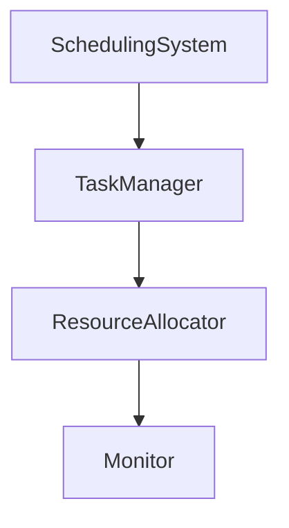

                 


# 强化学习在AI Agent资源调度中的应用

> **关键词**：强化学习，AI Agent，资源调度，算法原理，系统架构

> **摘要**：本文探讨了强化学习在AI Agent资源调度中的应用，详细分析了强化学习的基本概念、算法原理、系统架构设计以及实际案例。通过结合数学模型和系统设计，展示了如何利用强化学习优化资源调度问题。

---

# 第1章: 强化学习与AI Agent概述

## 1.1 强化学习的基本概念

### 1.1.1 强化学习的定义与特点

强化学习（Reinforcement Learning，RL）是一种机器学习范式，通过智能体在环境中交互，学习如何采取一系列行动以最大化累积奖励。其特点包括：

- **试错学习**：智能体通过不断尝试和错误来优化策略。
- **延迟奖励**：奖励可能在多个动作之后才给出。
- **动态环境**：环境状态可能随时间变化。
- **高维状态空间**：复杂问题涉及大量状态。

### 1.1.2 AI Agent的定义与类型

AI Agent是能够感知环境并采取行动以实现目标的智能体。类型包括：

- **反应式Agent**：基于当前感知做出反应。
- **认知式Agent**：具备推理和规划能力。
- **协作式Agent**：与多个智能体协作完成任务。

### 1.1.3 强化学习在AI Agent中的作用

强化学习为AI Agent提供了决策策略，使其能够在复杂环境中做出最优选择，尤其适用于资源调度等优化问题。

## 1.2 资源调度问题的背景与挑战

### 1.2.1 资源调度的基本概念

资源调度涉及分配和管理计算资源，以满足任务需求并优化性能指标。关键问题包括资源分配、任务调度和负载均衡。

### 1.2.2 资源调度的典型场景

- **云计算资源调度**：动态分配虚拟机以满足负载需求。
- **网络资源调度**：优化带宽分配以提高网络性能。
- **分布式系统调度**：在多节点环境中分配任务。

### 1.2.3 强化学习在资源调度中的优势

强化学习能够处理动态变化的环境，通过试错优化策略，适合资源调度的复杂性和不确定性。

## 1.3 强化学习在AI Agent资源调度中的应用案例

### 1.3.1 云计算资源调度

使用强化学习优化虚拟机分配，降低资源浪费并提高性能。

### 1.3.2 网络资源调度

通过强化学习优化带宽分配，提升网络效率。

### 1.3.3 多智能体协作场景

在多智能体系统中，强化学习促进协作，提高资源利用效率。

---

# 第2章: 强化学习的核心概念与原理

## 2.1 强化学习的基本原理

### 2.1.1 状态、动作与奖励

- **状态（State）**：环境当前的状况。
- **动作（Action）**：智能体采取的行为。
- **奖励（Reward）**：对动作的反馈，指导学习方向。

### 2.1.2 Q-learning算法

Q-learning通过更新Q值表，学习状态-动作对的最优价值。公式为：

$$ Q(s, a) = Q(s, a) + \alpha (r + \gamma \max Q(s', a') - Q(s, a)) $$

### 2.1.3 策略与价值函数

- **策略（Policy）**：决定采取哪个动作的函数。
- **价值函数（Value Function）**：评估状态或状态-动作对的价值。

## 2.2 AI Agent的决策过程

### 2.2.1 马尔可夫决策过程（MDP）

MDP定义为五元组 $(S, A, P, R, \gamma)$，其中：

- $S$：状态空间
- $A$：动作空间
- $P$：状态转移概率
- $R$：奖励函数
- $\gamma$：折扣因子

### 2.2.2 策略网络与价值网络

策略网络直接输出动作概率，价值网络评估状态的价值。常用算法包括：

- **策略梯度法（Policy Gradient）**
- **值函数法（Value Function）**

### 2.2.3 动态规划与近似方法

动态规划用于规划最优路径，近似方法（如神经网络）用于处理高维状态空间。

## 2.3 强化学习在资源调度中的应用特点

### 2.3.1 多步决策

资源调度需要多步优化，强化学习适合处理序列决策。

### 2.3.2 状态空间与动作空间

资源调度涉及大量状态和动作，强化学习能够处理高维问题。

### 2.3.3 奖励函数设计

奖励函数设计直接影响学习效果，需结合具体场景定义。

## 2.4 核心概念对比表格

| 概念       | 描述                                                                 |
|------------|----------------------------------------------------------------------|
| 状态 (State) | 当前环境的状况                                                     |
| 动作 (Action) | 智能体采取的行为                                                   |
| 奖励 (Reward) | 对动作的反馈，用于指导学习                                         |

## 2.5 ER实体关系图

```mermaid
er
actor(用户) --> ResourceScheduler(资源调度系统)
ResourceScheduler --> Task(任务)
ResourceScheduler --> Resource(资源)
```

---

# 第3章: 强化学习算法的数学模型与公式

## 3.1 Q-learning算法的数学模型

### 3.1.1 Q-learning公式推导

Q-learning更新公式：

$$ Q(s, a) = Q(s, a) + \alpha (r + \gamma \max Q(s', a') - Q(s, a)) $$

其中：

- $\alpha$：学习率
- $\gamma$：折扣因子

### 3.1.2 Q-learning的收敛性分析

在无限 episodes 下，Q-learning收敛于最优策略，假设环境是马尔可夫的，并且存在探索策略。

### 3.1.3 Q-learning的实现步骤

1. 初始化Q表为零。
2. 在环境中采取动作，观察状态和奖励。
3. 更新Q表：$ Q(s, a) = Q(s, a) + \alpha (r + \gamma \max Q(s', a') - Q(s, a)) $。
4. 重复步骤2-3直到收敛。

## 3.2 Deep Q-Networks（DQN）算法

### 3.2.1 DQN的网络结构

DQN使用两个神经网络：

- 主网络：评估当前策略。
- 目标网络：固定目标，用于稳定训练。

### 3.2.2 DQN算法流程

1. 从经验回放中抽取样本。
2. 更新目标网络，使其逼近主网络。
3. 使用主网络选择动作，并与环境交互。
4. 存储经验（状态，动作，奖励，新状态）。

### 3.2.3 DQN的数学模型

目标网络更新公式：

$$ \theta_{\text{target}} = \theta_{\text{main}} $$

主网络更新公式：

$$ \theta_{\text{main}} \leftarrow \theta_{\text{main}} - \alpha \nabla_{\theta_{\text{main}}} \mathcal{L} $$

其中，$\mathcal{L}$是损失函数：

$$ \mathcal{L} = \mathbb{E}[(y - Q(s, a))^2] $$

### 3.2.4 DQN的优缺点

- **优点**：适用于高维状态空间，稳定性高。
- **缺点**：需要经验回放和目标网络，实现复杂。

## 3.3 其他强化学习算法

### 3.3.1 策略梯度法

策略梯度法直接优化策略，公式为：

$$ \nabla \theta \leftarrow \nabla J(\theta) $$

其中，$J(\theta)$是目标函数，通常为期望奖励。

### 3.3.2 值函数法

值函数法通过优化价值函数，间接优化策略。公式为：

$$ V(s) = r + \gamma \max_a Q(s, a) $$

### 3.3.3 Actor-Critic算法

Actor-Critic结合策略和价值函数，同时优化两者。公式：

$$ \nabla \theta \leftarrow \nabla J(\theta) = \frac{\partial V}{\partial \pi} \cdot \frac{\partial \pi}{\partial \theta} $$

---

# 第4章: 强化学习在资源调度中的系统架构设计

## 4.1 系统设计背景

资源调度系统需要高效分配资源，优化性能指标。常见场景包括云计算、网络和分布式系统。

## 4.2 系统功能设计

### 4.2.1 领域模型

领域模型包括任务、资源、调度策略等实体。

### 4.2.2 系统架构图



### 4.2.3 系统接口设计

- **任务提交接口**：接收新任务请求。
- **资源分配接口**：分配资源并返回结果。
- **监控接口**：收集资源使用情况，动态调整调度策略。

## 4.3 系统架构设计

### 4.3.1 分层架构

分层架构包括感知层、决策层和执行层。

### 4.3.2 微服务架构

微服务架构适合分布式系统，各服务独立运行，通过API通信。

## 4.4 系统交互流程

### 4.4.1 交互流程图

```mermaid
sequence
    用户 --> TaskManager: 提交任务
    TaskManager --> ResourceAllocator: 请求资源
    ResourceAllocator --> Monitor: 获取资源使用情况
    Monitor --> ResourceAllocator: 返回资源状态
    ResourceAllocator --> TaskManager: 分配资源
    TaskManager --> 用户: 通知资源分配结果
```

---

# 第5章: 强化学习在资源调度中的项目实战

## 5.1 环境搭建

### 5.1.1 安装依赖

安装Python、TensorFlow、Keras等库。

### 5.1.2 环境配置

配置云计算或仿真环境，模拟资源调度场景。

## 5.2 核心代码实现

### 5.2.1 DQN算法实现

```python
class DQN:
    def __init__(self, state_space, action_space):
        self.state_space = state_space
        self.action_space = action_space
        self.main_network = self.build_network()
        self.target_network = self.build_network()
        # 其他初始化代码

    def build_network(self):
        model = keras.Sequential()
        model.add(Dense(64, activation='relu', input_dim=state_space))
        model.add(Dense(action_space))
        model.compile(optimizer='adam', loss='mean_squared_error')
        return model

    def update_target_network(self):
        self.target_network.set_weights(self.main_network.get_weights())
```

### 5.2.2 资源调度策略实现

```python
class ResourceScheduler:
    def __init__(self, env):
        self.env = env
        self.dqn = DQN(env.state_space, env.action_space)

    def train(self, episodes):
        for episode in range(episodes):
            state = self.env.reset()
            while not done:
                action = self.dqn.act(state)
                next_state, reward, done = self.env.step(action)
                self.dqn.remember(state, action, reward, next_state)
                self.dqn.replay()
                state = next_state
```

## 5.3 案例分析与实现解读

### 5.3.1 案例分析

使用DQN算法优化云计算资源调度，降低资源浪费和提高系统性能。

### 5.3.2 实现解读

通过训练智能体，使其在不同负载下选择最优资源分配策略。

## 5.4 项目小结

本项目展示了如何使用强化学习优化资源调度，验证了其有效性和优越性。

---

# 第6章: 高级主题与挑战

## 6.1 多智能体强化学习

### 6.1.1 多智能体场景

多个智能体协作完成复杂任务，如分布式计算中的任务分配。

### 6.1.2 多智能体算法

- **联邦学习**：多个智能体协作，保护数据隐私。
- **MADE算法**：多智能体决策增强。

## 6.2 分布式资源调度

### 6.2.1 分布式系统特点

节点独立运行，任务分布处理。

### 6.2.2 分布式强化学习

利用分布式计算资源，加速训练过程。

## 6.3 自适应调度策略

### 6.3.1 动态调整策略

根据负载变化自适应调整资源分配。

### 6.3.2 混合调度策略

结合多种调度算法，提高系统性能。

---

# 第7章: 强化学习在资源调度中的优化与挑战

## 7.1 算法优化

### 7.1.1 激励机制优化

改进奖励函数设计，引导智能体做出更优决策。

### 7.1.2 网络结构优化

使用更深的网络结构，提高近似能力。

## 7.2 资源调度中的挑战

### 7.2.1 状态空间维度

高维状态空间增加计算复杂度。

### 7.2.2 动作空间复杂性

多个动作组合导致决策空间爆炸。

## 7.3 未来研究方向

### 7.3.1 新型算法研究

探索更适合资源调度的强化学习算法。

### 7.3.2 高效训练方法

研究更高效的训练策略，如离线强化学习。

---

# 第8章: 总结与展望

## 8.1 全文总结

强化学习在AI Agent资源调度中展现出巨大潜力，优化了资源分配，提升了系统性能。

## 8.2 展望

未来，随着算法进步和计算能力提升，强化学习将在更复杂的资源调度场景中发挥重要作用。

---

# 作者

**作者：AI天才研究院/AI Genius Institute & 禅与计算机程序设计艺术 /Zen And The Art of Computer Programming**

