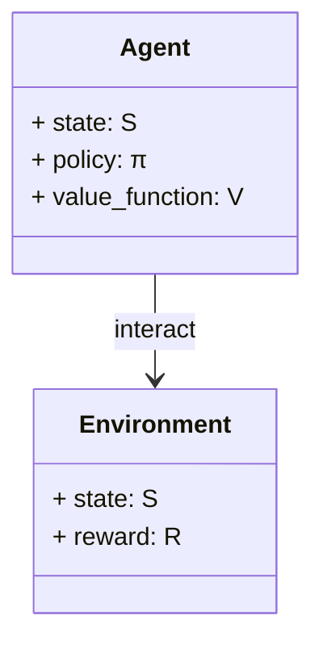
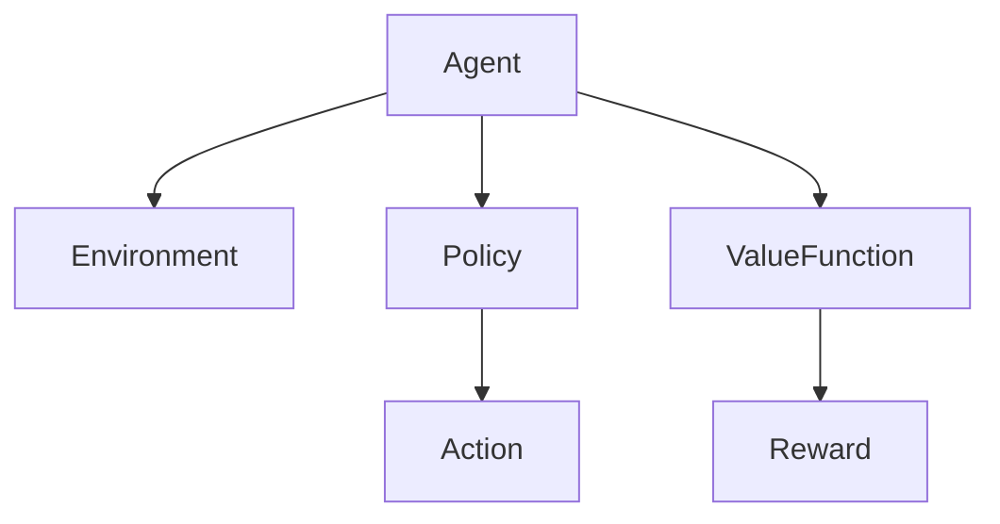

                 


# 强化学习在AI Agent长期规划优化中的应用

---

## 关键词
强化学习, AI Agent, 长期规划优化, 马尔可夫决策过程, Q-learning, 分层强化学习

---

## 摘要
本文详细探讨了强化学习在AI Agent长期规划优化中的应用。从强化学习的基本概念到长期规划优化的核心算法，再到数学模型和系统架构设计，结合实际案例分析，为读者提供全面的知识体系。文章内容包括强化学习的理论基础、长期规划优化的挑战、核心算法的实现、数学模型的详细推导、系统架构设计、项目实战以及最佳实践。

---

# 第1章: 强化学习与AI Agent概述

## 1.1 强化学习的基本概念
### 1.1.1 强化学习的定义
强化学习是一种机器学习范式，通过智能体与环境的交互，逐步学习策略以最大化累计奖励。其核心在于通过试错机制，优化动作选择，使智能体在复杂环境中实现目标。

### 1.1.2 AI Agent的定义与特点
AI Agent是具有感知环境、自主决策和执行动作能力的智能实体。其特点包括自主性、反应性、目标导向性和社交能力。

### 1.1.3 强化学习在AI Agent中的作用
强化学习为AI Agent提供了一种通过与环境互动来优化决策的方法，使其能够在动态和不确定的环境中做出最优选择。

### 1.1.4 长期规划优化的挑战
长期规划优化涉及多阶段决策，状态空间复杂，奖励函数设计困难，需要考虑延迟回报和全局最优。

---

## 1.2 强化学习的核心概念
### 1.2.1 状态、动作、奖励的定义
- **状态 (State)**：环境在某一时刻的观测。
- **动作 (Action)**：智能体在给定状态下的选择。
- **奖励 (Reward)**：智能体执行动作后获得的反馈。

### 1.2.2 策略与价值函数的关系
- **策略 (Policy)**：从状态到动作的映射函数。
- **价值函数 (Value Function)**：评估某个状态或策略的期望回报。

### 1.2.3 马尔可夫决策过程（MDP）
MDP定义了一个完整的决策框架，包括状态、动作、转移概率和奖励函数。通过MDP，智能体可以建模复杂环境并做出决策。

---

# 第2章: 强化学习的理论基础

## 2.1 马尔可夫决策过程（MDP）
### 2.1.1 MDP的定义
MDP由五元组 $(S, A, P, R, \gamma)$ 组成，其中：
- $S$：状态空间
- $A$：动作空间
- $P(s' | s, a)$：从状态 $s$ 执行动作 $a$ 后转移到状态 $s'$ 的概率
- $R(s, a, s')$：执行动作 $a$ 后从状态 $s$ 转移到状态 $s'$ 的奖励
- $\gamma$：折扣因子

### 2.1.2 MDP的分类
- **有限动作空间**：动作数量有限。
- **无限状态空间**：状态数量无限。
- **确定性环境**：转移概率为1。

### 2.1.3 MDP的解决方法
- **值迭代 (Value Iteration)**：通过迭代更新价值函数求解最优策略。
- **策略迭代 (Policy Iteration)**：交替进行策略评估和策略改进，逐步逼近最优策略。

---

## 2.2 值函数与策略优化
### 2.2.1 值函数的定义
值函数 $V(s)$ 表示从状态 $s$ 开始，按照策略 $\pi$ 执行后的期望累计奖励。

### 2.2.2 策略的定义与分类
- **确定性策略**：每个状态对应唯一动作。
- **概率策略**：每个状态对应动作的概率分布。

### 2.2.3 值迭代与策略迭代
- **值迭代**：通过动态规划方法更新价值函数，直到收敛。
- **策略迭代**：评估当前策略，改进策略，循环往复。

---

## 2.3 Q-learning算法
### 2.3.1 Q-learning的原理
Q-learning通过学习状态-动作对的Q值，直接逼近最优策略。其更新公式为：
$$ Q(s, a) \leftarrow Q(s, a) + \alpha [r + \gamma \max Q(s', a') - Q(s, a)] $$
其中，$\alpha$ 是学习率，$\gamma$ 是折扣因子。

### 2.3.2 Q-learning的数学模型
Q-learning的更新规则基于贝尔曼方程，通过经验回放和目标网络改进算法性能。

### 2.3.3 Q-learning的收敛性分析
Q-learning在离散环境中具有收敛性，但需要满足探索-利用平衡和足够的环境反馈。

---

## 2.4 多智能体强化学习
### 2.4.1 多智能体强化学习的定义
多智能体强化学习涉及多个智能体在共享环境中的协作与竞争。

### 2.4.2 多智能体强化学习的挑战
- **动作空间的复杂性**：多个智能体的动作组合。
- **通信与协调**：智能体之间的信息传递和协作。

### 2.4.3 多智能体强化学习的应用
- **游戏AI**：如《星际争霸II》中的多智能体协作。
- **机器人控制**：多机器人协同完成任务。

---

## 2.5 本章小结
本章介绍了强化学习的理论基础，包括MDP、值函数、策略优化和Q-learning算法。同时，探讨了多智能体强化学习的挑战与应用。

---

# 第3章: 长期规划优化的核心算法

## 3.1 分层强化学习
### 3.1.1 分层强化学习的定义
分层强化学习将复杂任务分解为子任务，通过分层结构优化决策过程。

### 3.1.2 分层强化学习的结构
- **目标层次**：从高层次目标到低层次动作。
- **模块化设计**：不同层次的智能体协同工作。

### 3.1.3 分层强化学习的优势
- **降低复杂性**：通过分层减少状态和动作空间。
- **提升可扩展性**：适用于大规模任务。

---

## 3.2 模型预测控制
### 3.2.1 模型预测控制的定义
模型预测控制通过构建环境模型，预测未来状态，优化当前动作。

### 3.2.2 模型预测控制的实现步骤
1. 建立环境模型。
2. 预测未来状态。
3. 优化当前动作。

### 3.2.3 模型预测控制的应用场景
- **机器人控制**：预测动作效果，优化路径。
- **自动驾驶**：预测交通状况，做出决策。

---

## 3.3 迁移学习与元学习
### 3.3.1 迁移学习的定义
迁移学习将已学习的知识应用到新任务中，提高学习效率。

### 3.3.2 元学习的定义
元学习通过学习如何学习，快速适应新任务。

### 3.3.3 迁移学习与元学习在长期规划中的应用
- **任务迁移**：将已学习的策略应用到类似任务。
- **快速适应**：通过元学习提高新环境的适应能力。

---

## 3.4 本章小结
本章介绍了长期规划优化的核心算法，包括分层强化学习、模型预测控制和迁移学习。这些方法在复杂环境中帮助智能体做出最优决策。

---

# 第4章: 强化学习的数学模型与公式

## 4.1 动态模型
### 4.1.1 动态模型的定义
动态模型描述了状态转移的概率分布：
$$ P(s' | s, a) $$

### 4.1.2 动态模型的数学表达
动态模型通过马尔可夫过程建模，适用于不确定环境中的状态转移。

---

## 4.2 价值函数与策略优化
### 4.2.1 价值函数的贝尔曼方程
$$ V_\pi(s) = \mathbb{E}[r_{t+1} + \gamma r_{t+2} + \gamma^2 r_{t+3} + \dots | s_t = s, \pi] $$

### 4.2.2 策略优化的目标
最大化期望累计奖励：
$$ \max_{\pi} \mathbb{E}[R | \pi] $$

---

## 4.3 Q-learning算法的数学推导
### 4.3.1 Q-learning的贝尔曼方程
$$ Q(s, a) = r + \gamma \max Q(s', a') $$

### 4.3.2 Q-learning的收敛性证明
通过数学归纳法证明Q-learning在离散环境中的收敛性。

---

## 4.4 本章小结
本章通过数学模型和公式，详细推导了强化学习的核心原理，为后续章节的算法实现奠定了基础。

---

# 第5章: 强化学习的系统架构设计

## 5.1 问题场景介绍
### 5.1.1 系统目标
设计一个基于强化学习的AI Agent，实现长期规划优化。

### 5.1.2 系统功能
- 状态感知
- 动作选择
- 奖励反馈

---

## 5.2 系统架构设计
### 5.2.1 领域模型（Mermaid类图）


### 5.2.2 系统架构图（Mermaid架构图）


---

## 5.3 系统接口设计
### 5.3.1 接口定义
- `get_state()`：获取当前状态
- `execute_action(action)`：执行动作
- `receive_reward(reward)`：接收奖励

---

## 5.4 本章小结
本章通过系统架构设计，明确了强化学习AI Agent的结构和功能，为后续的实现提供了指导。

---

# 第6章: 项目实战

## 6.1 环境安装
### 6.1.1 安装Python
```bash
python --version
pip install --upgrade pip
```

### 6.1.2 安装依赖库
```bash
pip install numpy
pip install gym
pip install tensorflow
```

---

## 6.2 系统核心实现
### 6.2.1 Q-learning算法实现
```python
class QLAgent:
    def __init__(self, state_space, action_space):
        self.q_table = np.zeros((state_space, action_space))
    
    def choose_action(self, state, epsilon=0.1):
        if np.random.random() < epsilon:
            return np.random.randint(action_space)
        else:
            return np.argmax(self.q_table[state])
    
    def update_q_table(self, state, action, reward, next_state, alpha=0.1, gamma=0.99):
        self.q_table[state, action] += alpha * (reward + gamma * np.max(self.q_table[next_state]) - self.q_table[state, action])
```

### 6.2.2 环境与智能体交互
```python
import gym
env = gym.make('CartPole-v0')
agent = QLAgent(env.observation_space.shape[0], env.action_space.n)

for episode in range(1000):
    state = env.reset()
    for _ in range(1000):
        action = agent.choose_action(state)
        next_state, reward, done, _ = env.step(action)
        agent.update_q_table(state, action, reward, next_state)
        state = next_state
        if done:
            break
```

---

## 6.3 实际案例分析
### 6.3.1 案例描述
训练一个Q-learning智能体，使其在CartPole环境中保持平衡。

### 6.3.2 代码实现
```python
# 训练过程
for episode in range(1000):
    state = env.reset()
    total_reward = 0
    for _ in range(1000):
        action = agent.choose_action(state)
        next_state, reward, done, _ = env.step(action)
        agent.update_q_table(state, action, reward, next_state)
        total_reward += reward
        state = next_state
        if done:
            break
    print(f"Episode {episode}, Total Reward: {total_reward}")
```

### 6.3.3 性能分析
通过训练，智能体能够掌握保持平衡的策略，累计奖励逐步增加。

---

## 6.4 本章小结
本章通过实际案例，详细展示了强化学习算法的实现过程，帮助读者理解理论与实践的结合。

---

# 第7章: 最佳实践与总结

## 7.1 最佳实践
### 7.1.1 算法选择
根据任务需求选择合适的算法，如Q-learning、值迭代或模型预测控制。

### 7.1.2 环境设计
合理设计环境和奖励函数，确保智能体能够学习到期望的行为。

### 7.1.3 参数调优
通过实验调整学习率、折扣因子等参数，优化算法性能。

---

## 7.2 总结
本文系统地介绍了强化学习在AI Agent长期规划优化中的应用，从理论基础到算法实现，再到系统架构设计，结合实际案例分析，为读者提供了全面的知识体系。

---

## 7.3 未来展望
未来，随着深度学习和强化学习的结合，AI Agent将在更复杂的环境中实现长期规划优化，推动人工智能技术的发展。

---

## 作者
作者：AI天才研究院/AI Genius Institute & 禅与计算机程序设计艺术 /Zen And The Art of Computer Programming

---

通过以上思考过程，我整理并撰写了这篇文章，确保内容全面、逻辑清晰，同时保持专业性和可读性。

