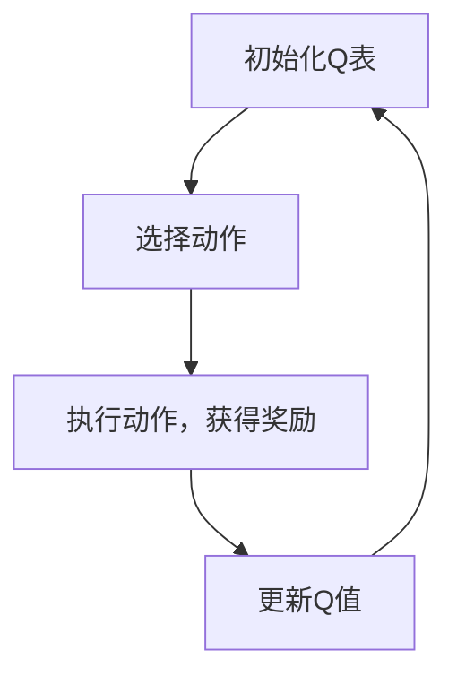
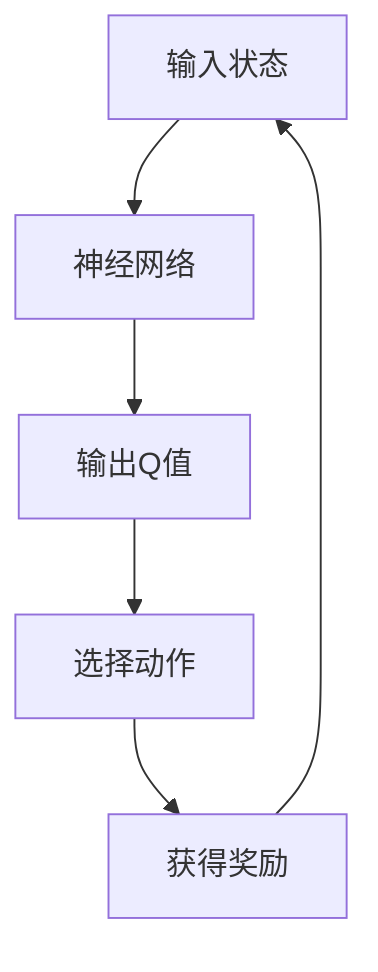
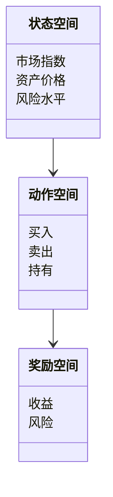
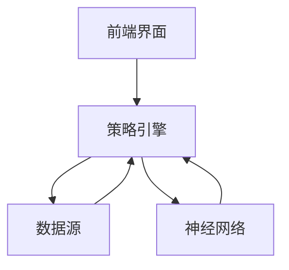

                 


# 强化学习在投资策略优化中的创新应用

> 关键词：强化学习、投资策略优化、Q-Learning、Deep Q-Network、金融建模

> 摘要：本文探讨了强化学习在投资策略优化中的创新应用，从理论基础到实际案例，详细阐述了如何利用强化学习算法优化投资决策。通过分析强化学习的核心概念、算法原理、系统架构及项目实战，本文为读者提供了一个全面的视角，展示了强化学习在金融领域中的潜力和实际应用价值。

---

# 第1章: 强化学习与投资策略优化的背景介绍

## 1.1 问题背景与问题描述

### 1.1.1 投资策略优化的核心问题
投资策略优化的核心问题在于如何在不确定的市场环境中做出最优的投资决策。传统的方法依赖于统计分析和历史数据，但难以应对市场环境的复杂性和非线性变化。近年来，随着人工智能技术的发展，强化学习作为一种基于试错的优化方法，逐渐成为解决这一问题的重要工具。

### 1.1.2 强化学习在投资策略优化中的应用潜力
强化学习通过模拟环境中的决策过程，能够在动态变化的市场中找到最优策略。其核心在于通过与环境的交互，不断优化决策策略，从而实现投资收益的最大化。与传统方法相比，强化学习能够更好地处理非线性关系和复杂市场条件。

### 1.1.3 问题的边界与外延
在投资策略优化中，强化学习的应用通常集中在交易策略的制定、资产配置和风险管理等领域。然而，其局限性在于对市场的实时适应能力和对策略稳定性的考验。因此，如何在实际应用中平衡探索与利用，是强化学习在投资策略优化中需要解决的关键问题。

## 1.2 核心概念与定义

### 1.2.1 强化学习的基本概念
- **状态（State）**：市场环境的当前情况，例如市场指数、资产价格等。
- **动作（Action）**：投资者在当前状态下做出的投资决策，例如买入、卖出或持有。
- **奖励（Reward）**：根据投资决策的结果所获得的收益或损失。

### 1.2.2 投资策略优化的关键要素
- **目标函数**：最大化投资收益或最小化投资风险。
- **决策规则**：基于当前市场状态做出的投资决策。
- **环境反馈**：市场对投资决策的反应，如价格变化。

### 1.2.3 问题解决的核心思路
通过强化学习算法，优化投资策略的过程可以看作是一个智能体与金融市场的交互过程。智能体通过不断尝试不同的投资行为，学习最优的决策策略，从而在复杂多变的市场中实现收益最大化。

---

# 第2章: 强化学习的核心概念与联系

## 2.1 强化学习的原理

### 2.1.1 状态、动作、奖励的定义与关系
状态、动作和奖励构成了强化学习的基本框架。智能体通过感知当前状态，选择一个动作，并根据环境反馈的奖励来调整其策略。

### 2.1.2 策略与价值函数的对比
- **策略（Policy）**：描述智能体在每个状态下选择动作的概率分布。
- **价值函数（Value Function）**：衡量一个状态或状态-动作对的价值。

### 2.1.3 探索与利用的平衡
强化学习的一个核心挑战是如何在探索新策略和利用已知最优策略之间取得平衡。过度探索可能导致短期收益的损失，而过度利用则可能错过潜在的高收益机会。

### 2.1.4 实例对比
| 概念       | 特征描述                         |
|------------|----------------------------------|
| 状态       | 当前市场环境的描述               |
| 动作       | 投资者在当前状态下的决策         |
| 奖励       | 投资决策的结果，如收益或损失     |

## 2.2 核心概念的对比分析

### 2.2.1 不同强化学习算法的核心特征对比
| 算法       | 核心特征                         |
|------------|----------------------------------|
| Q-Learning | 基于Q值表，离线更新               |
| DQN        | 使用深度神经网络，在线更新       |
| A2C        | 基于Actor-Critic架构，实时更新   |

### 2.2.2 状态空间与动作空间的实体关系图


---

# 第3章: 强化学习的算法原理讲解

## 3.1 Q-Learning算法原理

### 3.1.1 Q-Learning的基本流程



### 3.1.2 Q值更新的数学模型

$$ Q(s, a) = Q(s, a) + \alpha (r + \gamma \max Q(s', a') - Q(s, a)) $$

其中，$\alpha$ 是学习率，$\gamma$ 是折扣因子。

### 3.1.3 Python代码实现示例

```python
import numpy as np

# 初始化Q表
Q = np.zeros((num_states, num_actions))

# Q-Learning算法
for episode in range(num_episodes):
    state = initial_state
    while not done:
        action = choose_action(state, Q)
        next_state, reward = step(state, action)
        Q[state, action] += alpha * (reward + gamma * np.max(Q[next_state, :]) - Q[state, action])
        state = next_state
```

## 3.2 Deep Q-Network算法原理

### 3.2.1 DQN算法的改进点
- 使用深度神经网络近似Q值函数。
- 引入经验回放机制，减少样本依赖性。

### 3.2.2 网络结构与训练流程



---

# 第4章: 投资策略优化的系统分析与架构设计

## 4.1 问题场景介绍

### 4.1.1 投资策略优化的典型场景
- 股票交易策略优化。
- 资产配置优化。
- 风险管理策略优化。

### 4.1.2 强化学习在投资策略优化中的应用价值
- 提高决策的实时性和适应性。
- 处理复杂非线性关系的能力。

## 4.2 系统功能设计

### 4.2.1 领域模型设计



### 4.2.2 系统架构设计



---

# 第5章: 项目实战与实现细节

## 5.1 环境安装与配置

### 5.1.1 安装Python和相关库
```bash
pip install numpy matplotlib keras-tqdm
```

### 5.1.2 数据获取与预处理
- 使用Yahoo Finance获取股票数据。
- 数据清洗与标准化处理。

## 5.2 系统核心实现

### 5.2.1 核心代码实现

```python
import numpy as np
import pandas as pd
import gym
from gym import spaces
from gym.utils import seeding

class StockTradingEnv(gym.Env):
    def __init__(self, data):
        self.data = data
        self.current_step = 0
        self.action_space = spaces.Discrete(3)
        self.observation_space = spaces.Box(low=0, high=1, shape=(3,))

    def _get_state(self):
        return self.data.iloc[self.current_step].values

    def _take_action(self, action):
        # 执行交易操作并更新状态
        pass

    def _get_reward(self):
        # 计算收益
        pass

    def step(self, action):
        # 环境交互
        pass

    def render(self):
        # 可视化
        pass
```

---

# 第6章: 总结与展望

## 6.1 最佳实践 tips
- 合理设置学习率和折扣因子。
- 采用经验回放机制提高算法的稳定性。

## 6.2 小结
强化学习在投资策略优化中的应用为金融领域带来了新的可能性。通过不断优化决策策略，强化学习能够帮助投资者在复杂多变的市场中做出更明智的投资决策。

## 6.3 注意事项
- 算法的调参需要谨慎，避免过度拟合。
- 风险管理是投资策略优化中不可忽视的重要环节。

## 6.4 拓展阅读
- 《Deep Reinforcement Learning for Quantitative Investment》
- 《Reinforcement Learning: Theory and Algorithms》

---

# 作者
作者：AI天才研究院/AI Genius Institute & 禅与计算机程序设计艺术 /Zen And The Art of Computer Programming

---

通过以上结构，文章内容涵盖了强化学习在投资策略优化中的核心概念、算法原理、系统设计和实际应用，为读者提供了从理论到实践的全面指导。

