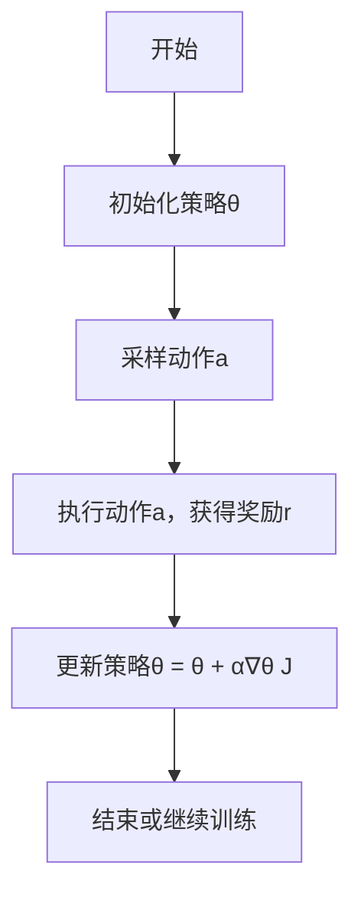
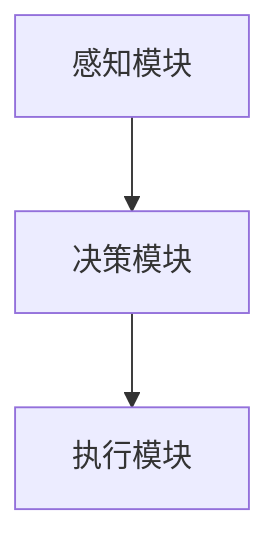
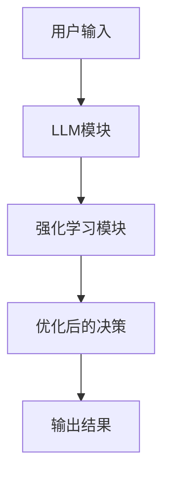
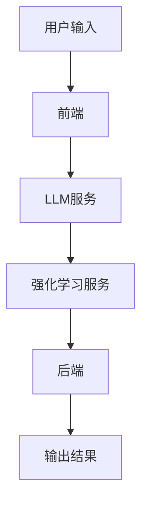

                 


# 强化学习驱动的AI Agent：优化LLM的决策策略

> **关键词**：强化学习, AI Agent, 大语言模型, 决策策略, 强化学习算法, 系统架构设计

> **摘要**：本文详细探讨了如何通过强化学习驱动的AI Agent来优化大语言模型（LLM）的决策策略。文章从强化学习的基本原理和AI Agent的设计与实现入手，深入分析了强化学习在LLM决策优化中的应用。通过具体案例分析，结合数学模型和算法实现，展示了如何设计和实现一个基于强化学习的AI Agent，以提升LLM的决策性能。本文还讨论了系统的架构设计、项目实战以及最佳实践，为读者提供了一个全面的技术指导。

---

## 第1章: 强化学习与AI Agent概述

### 1.1 强化学习的基本概念

#### 1.1.1 强化学习的定义
强化学习（Reinforcement Learning, RL）是一种机器学习范式，其中智能体通过与环境交互来学习如何做出最优决策。智能体通过执行动作来获得奖励或惩罚，从而逐步优化其策略以最大化累积奖励。

#### 1.1.2 强化学习的核心要素
- **状态（State）**：环境在某一时刻的观察。
- **动作（Action）**：智能体在给定状态下选择的行为。
- **奖励（Reward）**：智能体执行动作后获得的反馈，用于指导优化决策。
- **策略（Policy）**：智能体选择动作的概率分布函数。
- **值函数（Value Function）**：衡量状态或动作-状态对的价值。

#### 1.1.3 AI Agent的概念与特点
AI Agent是一种能够感知环境、自主决策并执行动作的智能实体。AI Agent的特点包括自主性、反应性、目标导向和社交能力。

### 1.2 强化学习与AI Agent的关系
- **强化学习在AI Agent中的作用**：强化学习为AI Agent提供了一种从经验中学习和优化决策策略的方法。
- **AI Agent的决策过程**：AI Agent通过强化学习算法，逐步学习最优的决策策略。
- **强化学习驱动的决策策略**：通过强化学习，AI Agent能够根据环境反馈不断调整其决策策略，以实现目标。

### 1.3 强化学习驱动的AI Agent的应用场景
- **自动驾驶中的应用**：AI Agent通过强化学习优化自动驾驶决策策略。
- **游戏AI中的应用**：强化学习驱动的游戏AI能够实现更智能的行为。
- **机器人控制中的应用**：强化学习帮助机器人在复杂环境中做出最优决策。

### 1.4 本章小结
本章介绍了强化学习和AI Agent的基本概念，探讨了强化学习在AI Agent中的作用，并总结了强化学习驱动的AI Agent的应用场景。

---

## 第2章: 强化学习的核心原理

### 2.1 强化学习的基本框架

#### 2.1.1 状态、动作、奖励的定义
- **状态**：智能体对环境的感知，例如在迷宫中的位置。
- **动作**：智能体在给定状态下选择的行为，例如“左转”或“右转”。
- **奖励**：智能体执行动作后获得的反馈，例如“+1”或“-1”。

#### 2.1.2 策略与价值函数
- **策略（Policy）**：描述智能体在状态s下选择动作a的概率分布。
- **值函数（Value Function）**：衡量状态s或动作a在状态s下的价值。

#### 2.1.3 探索与利用的平衡
- **探索**：尝试新的动作以发现更好的策略。
- **利用**：根据当前知识选择最优动作以最大化奖励。

### 2.2 基于值函数的方法

#### 2.2.1 Q-learning算法
Q-learning是一种经典的强化学习算法，通过更新Q值表来学习最优策略。

**算法流程图（Mermaid）**：
```mermaid
graph TD
    A[开始] --> B[初始化Q表]
    B --> C[选择动作a]
    C --> D[执行动作a，获得奖励r]
    D --> E[更新Q(s,a) = Q(s,a) + α(r + γ max Q(s',a))]
    E --> F[结束或继续训练]
```

**数学公式**：
$$ Q(s,a) \leftarrow Q(s,a) + \alpha \left( r + \gamma \max Q(s',a') - Q(s,a) \right) $$

#### 2.2.2 动态规划与策略评估
动态规划方法用于在已知策略下评估状态价值。

**数学公式**：
$$ V_{\pi}(s) = \mathbb{E}[R_t | s_t = s, \pi] $$

#### 2.2.3 值迭代算法
值迭代算法通过迭代更新值函数来逼近最优策略。

**数学公式**：
$$ V_{i+1}(s) = \max_a \left( r + \gamma \sum_{s'} P(s'|s,a) V_i(s') \right) $$

### 2.3 基于策略梯度的方法

#### 2.3.1 策略梯度的基本原理
策略梯度方法直接优化策略参数，通过梯度上升最大化奖励期望。

**数学公式**：
$$ \nabla J = \mathbb{E}[\nabla \log \pi(a|s) Q(s,a)] $$

#### 2.3.2 REINFORCE算法
REINFORCE是一种基于策略梯度的强化学习算法，通过采样策略动作来更新策略参数。

**算法流程图（Mermaid）**：


#### 2.3.3 Actor-Critic架构
Actor-Critic架构结合了策略梯度和值函数的优势，通过同时优化策略和值函数来加速收敛。

### 2.4 强化学习的数学基础

#### 2.4.1 贝尔曼方程
贝尔曼方程描述了状态价值的递归关系。

**数学公式**：
$$ V(s) = \max_a \left( r + \gamma \sum_{s'} P(s'|s,a) V(s') \right) $$

#### 2.4.2 策略梯度的数学推导
策略梯度方法通过优化策略参数来最大化奖励期望。

**数学公式**：
$$ J(\theta) = \mathbb{E}_{\tau \sim \pi_\theta} [R(\tau)] $$

#### 2.4.3 值函数的优化方法
值函数优化方法通过最小化优势函数的差分来更新策略。

**数学公式**：
$$ \text{优势} = Q(s,a) - V(s) $$

### 2.5 本章小结
本章详细介绍了强化学习的核心原理，包括基于值函数和基于策略梯度的算法，并探讨了其数学基础。

---

## 第3章: AI Agent的设计与实现

### 3.1 AI Agent的设计原则

#### 3.1.1 状态空间的设计
状态空间的设计直接影响AI Agent的感知能力。

**示例**：在自动驾驶中，状态可以包括车辆位置、速度、周围车辆和行人的位置等。

#### 3.1.2 动作空间的设计
动作空间的设计需要考虑环境的约束和任务的目标。

**示例**：在机器人控制中，动作可以包括左转、右转、前进等。

#### 3.1.3 奖励机制的设计
奖励机制的设计需要平衡局部奖励和全局目标。

**示例**：在游戏AI中，奖励可以包括得分、存活时间等。

### 3.2 AI Agent的架构设计

#### 3.2.1 模块划分
AI Agent的架构通常包括感知模块、决策模块和执行模块。

**示意图（Mermaid）**：


#### 3.2.2 协作机制
在多智能体系统中，协作机制需要协调各智能体的动作。

**示例**：在机器人协作任务中，智能体之间通过通信模块共享状态和动作。

### 3.3 多智能体协作的AI Agent

#### 3.3.1 多智能体系统的基本概念
多智能体系统由多个智能体组成，通过协作完成复杂任务。

#### 3.3.2 多智能体协作的挑战
- **通信开销**：智能体之间需要频繁通信。
- **协调问题**：需要解决智能体之间的冲突和协作。

#### 3.3.3 基于强化学习的多智能体协作方法
- **分布式强化学习**：每个智能体独立学习策略。
- **集中式强化学习**：由中央控制器统一决策。

### 3.4 本章小结
本章探讨了AI Agent的设计原则和架构，并重点分析了多智能体协作的挑战与解决方案。

---

## 第4章: LLM的决策策略优化

### 4.1 LLM的基本原理

#### 4.1.1 大语言模型的定义
大语言模型是一种基于深度学习的自然语言处理模型，能够生成和理解人类语言。

#### 4.1.2 LLM的训练目标
LLM的训练目标包括生成有意义的文本、回答问题等。

#### 4.1.3 LLM的决策机制
LLM通过内部的参数调整来生成最优的输出。

### 4.2 强化学习驱动的LLM优化

#### 4.2.1 基于强化学习的策略优化
通过强化学习优化LLM的决策策略。

#### 4.2.2 奖励函数的设计
设计合适的奖励函数是强化学习优化的关键。

**示例**：在对话生成任务中，奖励可以包括语义相关性和生成的流畅性。

#### 4.2.3 策略优化方法
- **策略梯度方法**：直接优化策略参数。
- **Q-learning方法**：通过值函数优化策略。

### 4.3 基于强化学习的LLM优化案例

#### 4.3.1 对话生成任务
通过强化学习优化对话生成策略。

#### 4.3.2 机器翻译任务
通过强化学习优化翻译质量。

### 4.4 本章小结
本章介绍了如何通过强化学习优化LLM的决策策略，并通过具体案例展示了其应用。

---

## 第5章: 系统架构设计

### 5.1 系统功能设计

#### 5.1.1 领域模型设计
领域模型描述了系统的功能模块和交互流程。

**示意图（Mermaid）**：


#### 5.1.2 系统架构设计
系统架构设计包括模块划分和交互流程。

**示意图（Mermaid）**：


### 5.2 系统接口设计

#### 5.2.1 接口定义
系统接口定义了各模块之间的交互方式。

#### 5.2.2 接口实现
通过API实现各模块之间的通信。

### 5.3 系统交互流程

#### 5.3.1 交互流程图（Mermaid）


### 5.4 本章小结
本章详细介绍了系统的架构设计和交互流程。

---

## 第6章: 项目实战

### 6.1 环境搭建

#### 6.1.1 环境安装
安装必要的开发环境和依赖库。

#### 6.1.2 工具准备
准备开发工具和测试环境。

### 6.2 系统核心实现

#### 6.2.1 LLM模块实现
实现大语言模型的接口和功能。

#### 6.2.2 强化学习模块实现
实现强化学习算法的核心功能。

### 6.3 代码实现与解读

#### 6.3.1 核心代码示例
```python
class AI-Agent:
    def __init__(self, states, actions):
        self.states = states
        self.actions = actions
        # 初始化Q表
        self.Q = {s: {a: 0 for a in actions} for s in states}
    
    def choose_action(self, state):
        # ε-greedy策略选择动作
        if random.random() < self.epsilon:
            return random.choice(self.actions)
        else:
            return max(self.Q[state], key=lambda k: self.Q[state][k])
    
    def update_Q(self, state, action, reward, next_state):
        # 更新Q表
        self.Q[state][action] += self.alpha * (reward + self.gamma * max(self.Q[next_state].values()) - self.Q[state][action])
```

#### 6.3.2 代码功能解读
解释代码的功能和实现逻辑。

### 6.4 案例分析与实现

#### 6.4.1 案例分析
分析具体的案例，例如自动驾驶中的路径规划。

#### 6.4.2 实现步骤
详细说明实现步骤和注意事项。

### 6.5 本章小结
本章通过项目实战展示了如何实现强化学习驱动的AI Agent，并优化LLM的决策策略。

---

## 第7章: 总结与展望

### 7.1 本章总结
总结全文的主要内容和核心思想。

### 7.2 最佳实践 Tips
- **数学公式的重要性**：强化学习的核心在于数学模型的优化。
- **算法实现的关键点**：实现强化学习算法时需要注意细节。
- **系统设计的注意事项**：系统架构设计需要考虑可扩展性和可维护性。

### 7.3 未来展望
展望强化学习驱动的AI Agent在优化LLM决策策略中的未来发展。

### 7.4 本章小结
本章总结了全文内容，并提出了未来的研究方向。

---

## 作者

**作者：AI天才研究院/AI Genius Institute & 禅与计算机程序设计艺术/Zen And The Art of Computer Programming**

---

这篇技术博客详细探讨了强化学习驱动的AI Agent在优化LLM决策策略中的应用，从理论到实践，层层深入，为读者提供了全面的技术指导。

