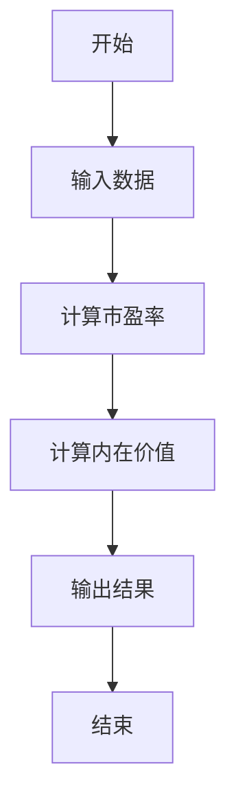
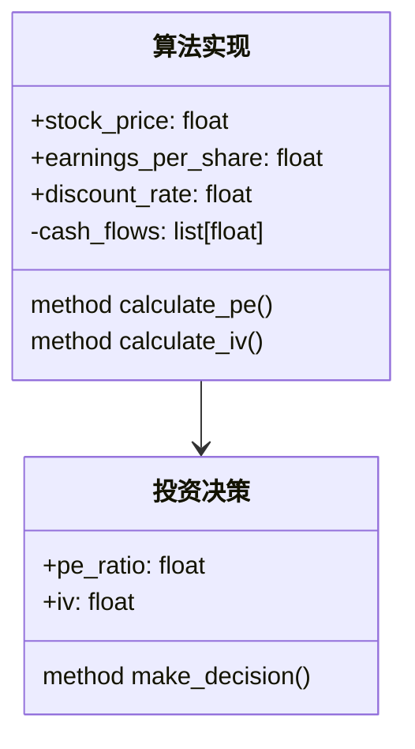
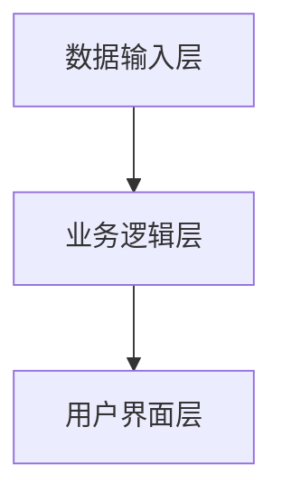
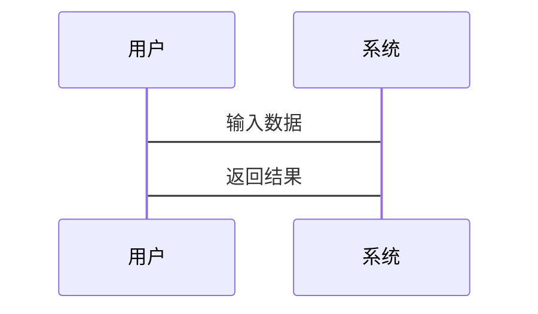

                 


# 彼得·林奇的实地调研方法论

> **关键词**：彼得·林奇、实地调研、投资方法论、基本面分析、财务分析、竞争优势  
> **摘要**：本文深入探讨了彼得·林奇的实地调研方法论，分析了其核心概念、数学模型、系统架构及实战案例，结合技术语言与投资分析，为投资者和程序员提供深刻见解。

---

## 第一章: 彼得·林奇与他的投资方法论

### 1.1 彼得·林奇的生平与投资理念

#### 1.1.1 彼得·林奇的生平简介
彼得·林奇是美国著名投资经理人，以其在富达投资管理公司的卓越表现闻名。他通过实地调研方法，帮助投资者识别优质股票，实现长期收益。

#### 1.1.2 林奇的投资哲学与核心理念
林奇强调长期投资、价值投资，认为市场波动是投资机会，通过深入分析公司基本面，识别具有竞争优势的企业。

#### 1.1.3 林奇实地调研方法的背景与意义
实地调研帮助投资者直接了解公司运营，评估管理层能力，发现财务问题，是林奇方法的核心。

### 1.2 实地调研的核心概念与背景

#### 1.2.1 什么是实地调研
实地调研是通过现场考察、访谈和数据收集，评估公司基本面、管理层和行业环境的过程。

#### 1.2.2 实地调研的必要性与重要性
直接获取信息，验证数据，识别潜在风险，是投资决策的关键步骤。

#### 1.2.3 林奇实地调研方法的边界与外延
适用于上市公司，强调长期投资，需结合市场趋势和行业分析。

---

## 第二章: 公司基本面分析

### 2.1 公司基本面分析的核心要素

#### 2.1.1 收入与利润分析
评估公司盈利能力，关注收入增长和利润质量，通过利润表和趋势分析识别潜在问题。

#### 2.1.2 现金流分析
现金流是企业健康指标，通过现金流量表分析经营活动、投资活动和筹资活动的现金流情况。

#### 2.1.3 资产负债表分析
分析资产、负债和所有者权益，评估公司财务状况和偿债能力，识别潜在财务风险。

### 2.2 行业分析与竞争地位

#### 2.2.1 行业分析的基本方法
研究行业趋势、市场规模、竞争结构，了解公司所处行业环境。

#### 2.2.2 竞争地位的评估标准
分析公司在行业中的地位、市场份额和竞争优势，判断其长期发展潜力。

#### 2.2.3 行业趋势对投资的影响
行业趋势影响公司前景，需结合宏观经济和政策变化，评估行业周期和未来发展方向。

### 2.3 管理层评估

#### 2.3.1 管理层的素质与能力
考察管理层的背景、经验和决策能力，评估其领导力和战略规划能力。

#### 2.3.2 管理层的战略规划
分析管理层的战略目标和实施计划，判断其是否合理且可行。

#### 2.3.3 管理层的诚信与责任感
评估管理层的诚信和责任感，关注其过往行为和对公司文化的塑造。

---

## 第三章: 财务报表分析与估值方法

### 3.1 财务报表分析的核心指标

#### 3.1.1 收入与利润指标
分析收入增长率、净利润率和毛利率，评估公司盈利能力。

#### 3.1.2 资产与负债指标
关注资产周转率、资产负债率和流动比率，评估公司财务健康状况。

#### 3.1.3 现金流指标
分析经营活动现金流、投资活动现金流和筹资活动现金流，判断公司资金流动性。

### 3.2 估值方法与模型

#### 3.2.1 市盈率与市净率
市盈率=股价/每股收益，市净率=股价/每股净资产，用于相对估值。

#### 3.2.2 内在价值评估
通过DCF模型计算公司内在价值，公式：
$$
\text{内在价值} = \sum \frac{\text{现金流}}{(1 + r)^t}
$$

#### 3.2.3 现金流量折现法
通过未来现金流折现，计算公司价值，适用于高增长公司。

### 3.3 林奇的估值方法与实战案例

#### 3.3.1 林奇估值方法的实战应用
通过基本面分析和财务指标，评估公司价值，识别低估股票。

#### 3.3.2 案例分析：如何估值一家公司
以某公司为例，分析收入、利润、现金流和竞争优势，计算其内在价值。

---

## 第四章: 竞争优势与护城河分析

### 4.1 竞争优势的定义与分类

#### 4.1.1 什么是竞争优势
竞争优势是公司在市场中的独特优势，包括技术、成本、品牌等。

#### 4.1.2 竞争优势的分类
技术壁垒、成本优势、品牌优势、网络效应和政策优势。

#### 4.1.3 竞争优势的评估标准
评估竞争优势的可持续性和可扩展性，判断其对公司的长期影响。

### 4.2 护城河的构建与维护

#### 4.2.1 技术壁垒
通过技术创新和专利保护，建立技术壁垒。

#### 4.2.2 市场壁垒
通过品牌建设、客户关系和渠道优势，巩固市场地位。

#### 4.2.3 经济壁垒
通过规模效应和成本优势，降低竞争对手的进入门槛。

### 4.3 林奇的竞争优势分析方法

#### 4.3.1 如何识别竞争优势
通过实地调研和数据分析，识别公司的竞争优势。

#### 4.3.2 竞争优势的可持续性分析
评估竞争优势的持久性和可扩展性，判断其对投资的影响。

#### 4.3.3 竞争优势与投资决策的关系
竞争优势是投资决策的关键因素，需结合财务指标和行业趋势综合判断。

---

## 第五章: 数学模型与算法实现

### 5.1 核心数学模型与公式

#### 5.1.1 市盈率公式
$$
\text{市盈率} = \frac{\text{股价}}{\text{每股收益}}
$$

#### 5.1.2 市净率公式
$$
\text{市净率} = \frac{\text{股价}}{\text{每股净资产}}
$$

#### 5.1.3 内在价值计算公式
$$
\text{内在价值} = \sum_{t=1}^{n} \frac{\text{现金流}_t}{(1 + r)^t}
$$

### 5.2 算法实现与代码示例

#### 5.2.1 计算市盈率的Python代码
```python
import pandas as pd

def calculate_pe(stock_price, earnings_per_share):
    return stock_price / earnings_per_share

# 示例数据
stock_price = 100
earnings_per_share = 10

pe_ratio = calculate_pe(stock_price, earnings_per_share)
print(f"市盈率: {pe_ratio}")
```

#### 5.2.2 计算内在价值的Python代码
```python
def calculate_intrinsic_value(cash_flows, discount_rate):
    return sum(cash_flow / (1 + discount_rate) ** t for t, cash_flow in enumerate(cash_flows))

# 示例数据
cash_flows = [100, 150, 200]
discount_rate = 0.1

iv = calculate_intrinsic_value(cash_flows, discount_rate)
print(f"内在价值: {iv}")
```

### 5.3 算法流程图与系统架构

#### 5.3.1 算法流程图


#### 5.3.2 系统架构图


---

## 第六章: 系统分析与架构设计

### 6.1 系统分析

#### 6.1.1 问题场景介绍
设计一个投资分析系统，支持财务指标计算和投资决策。

#### 6.1.2 系统功能设计
功能模块包括数据输入、指标计算、结果展示和决策支持。

#### 6.1.3 系统架构设计
采用分层架构，包括数据层、业务逻辑层和用户界面层。

### 6.2 系统架构设计

#### 6.2.1 系统架构图


#### 6.2.2 系统接口设计
定义API接口，用于数据输入和结果输出。

#### 6.2.3 系统交互图


---

## 第七章: 项目实战与案例分析

### 7.1 项目实战

#### 7.1.1 环境安装
安装Python和相关库，如Pandas和Matplotlib。

#### 7.1.2 核心实现
编写代码，实现市盈率和内在价值计算。

#### 7.1.3 代码解读与分析
详细解读代码功能，分析其在投资决策中的应用。

### 7.2 案例分析

#### 7.2.1 案例介绍
选择一家公司，分析其基本面和财务指标。

#### 7.2.2 数据分析与结果展示
展示分析结果，包括市盈率和内在价值。

#### 7.2.3 结果分析与投资决策
根据分析结果，制定投资策略。

---

## 第八章: 最佳实践、小结与注意事项

### 8.1 最佳实践 tips

- 结合定量分析和定性分析。
- 定期更新数据和模型。
- 保持对市场的敏感性。

### 8.2 小结

本文系统介绍了彼得·林奇的实地调研方法，结合技术语言和投资分析，为投资者和程序员提供了深刻见解。

### 8.3 注意事项

- 风险提示：投资有风险，需谨慎决策。
- 数据准确性：确保数据来源可靠。
- 持续学习：市场变化快，需不断学习。

---

## 第九章: 拓展阅读与深入学习

### 9.1 拓展阅读

- 推荐书籍：《彼得·林奇的投资哲学》。
- 推荐文章：《技术分析与基本面分析的结合》。

### 9.2 深入学习

- 学习更多投资策略。
- 研究更多数学模型。
- 参与投资实践，提升实战能力。

---

## 作者：AI天才研究院/AI Genius Institute & 禅与计算机程序设计艺术 /Zen And The Art of Computer Programming

---

**总结**：本文通过系统分析和实战案例，深入探讨了彼得·林奇的实地调研方法论，结合技术语言和投资分析，为读者提供了全面的指导。

