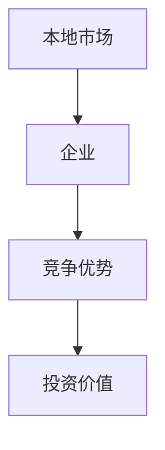
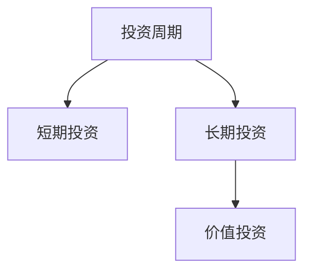

                 

# 彼得·林奇的本地投资优势：投资你所了解的

**关键词**：彼得·林奇，本地投资优势，投资策略，竞争优势，风险管理，投资组合

**摘要**：本文深入探讨了彼得·林奇的投资理念，特别是他强调的“本地投资优势”。通过分析本地市场信息优势、竞争优势以及投资策略，本文为投资者提供了如何利用本地信息进行投资决策的系统性方法。文章结合技术分析与投资策略，详细阐述了本地投资的优势与挑战，并通过实际案例和数学模型，帮助读者理解如何在本地市场中找到投资机会。

---

## 第一部分：彼得·林奇投资理念概述

### 第1章：彼得·林奇的投资哲学

#### 1.1 彼得·林奇的投资者背景

**1.1.1 彼得·林奇的生平简介**

彼得·林奇（Peter Lynch）是全球最著名的职业投资者之一，曾担任富达投资集团（Fidelity Investments）的基金经理，管理麦哲伦基金（Magellan Fund）长达13年。他以卓越的投资业绩和独特的投资风格闻名，尤其擅长通过深入研究和分析企业基本面来进行投资决策。林奇的投资哲学强调“投资你所了解的”，即通过深入研究本地市场和行业，发现具有竞争优势的企业进行投资。

**1.1.2 林奇的投资风格与核心理念**

林奇的投资风格以价值投资和成长投资相结合为特点。他认为，投资者应该选择那些具有强大竞争优势、良好管理团队和持续增长潜力的企业进行投资。他的核心理念是“本地投资优势”，即通过深入研究本地市场中的企业，利用信息优势和熟悉度来提高投资决策的准确性。

**1.1.3 林奇投资哲学的核心思想**

林奇的投资哲学可以总结为以下几点：
1. **投资你所了解的**：选择自己熟悉的企业和行业进行投资。
2. **竞争优势是关键**：寻找具有持续竞争优势的企业。
3. **长期投资**：通过长期持有优质股票实现资本增值。
4. **风险管理**：分散投资以降低风险。

#### 1.2 本地投资优势的定义与内涵

**1.2.1 本地投资优势的概念**

本地投资优势是指投资者通过对本地市场的深入了解，利用本地信息优势、竞争优势和市场熟悉度，选择具有投资价值的企业进行投资。本地投资的优势在于投资者能够更深入地了解企业的经营状况、行业动态和市场环境，从而做出更明智的投资决策。

**1.2.2 本地投资优势的核心要素**

本地投资优势的核心要素包括：
1. **信息优势**：通过本地市场调研、行业分析和企业基本面研究，获取超越公开信息的独家见解。
2. **竞争优势**：选择具有独特竞争优势的企业，例如成本优势、品牌优势、技术优势等。
3. **市场熟悉度**：对本地市场的深入了解，包括行业趋势、政策变化和市场结构等。

**1.2.3 本地投资与全球化投资的对比**

本地投资与全球化投资的对比：

| 对比维度       | 本地投资                 | 全球化投资                 |
|----------------|--------------------------|-----------------------------|
| 投资范围       | 本地市场                 | 全球市场                   |
| 信息获取       | 高（本地信息优势）       | 中（全球化信息分散）       |
| 竞争优势       | 明显（本地竞争优势）     | 较弱（全球化竞争激烈）     |
| 风险控制       | 高（本地市场可控）       | 低（全球化市场波动大）     |
| 投资复杂度     | 中（本地市场熟悉）       | 高（全球化市场复杂）       |

---

### 第2章：本地投资的优势与挑战

#### 2.1 本地投资的优势

**2.1.1 信息优势：你所了解的行业与企业**

本地投资的核心优势在于信息优势。通过深入研究本地市场，投资者可以获取更多非公开信息，例如企业的内部运营状况、行业动态和政策变化等。这些信息可以帮助投资者更准确地评估企业的投资价值。

**2.1.2 熟悉性：本地市场的深度理解**

本地市场的深度理解是本地投资的另一大优势。通过长期关注本地市场，投资者可以更好地理解市场的运作规律、行业趋势和企业的竞争优势。这种熟悉度有助于投资者做出更明智的投资决策。

**2.1.3 风险控制：本地市场的可控性**

本地市场的可控性是本地投资的第三个优势。由于投资者对本地市场的深入了解，可以更好地控制投资风险，例如通过分散投资、风险管理和风险对冲等方法降低投资风险。

#### 2.2 本地投资的挑战

**2.2.1 信息过载与筛选困难**

本地投资的挑战之一是信息过载与筛选困难。由于本地市场信息繁杂，投资者需要花费大量时间和精力筛选有用的信息，这增加了投资决策的复杂性。

**2.2.2 本地市场的局限性**

本地市场的局限性是本地投资的另一个挑战。由于本地市场可能缺乏足够的投资机会或市场规模有限，投资者可能难以找到具有持续增长潜力的企业。

**2.2.3 个人偏见与认知偏差**

个人偏见与认知偏差是本地投资的第三个挑战。由于投资者对本地市场的熟悉，可能会产生过度自信或认知偏差，导致投资决策失误。

---

### 第3章：本地投资的核心概念与联系

#### 3.1 核心概念原理

**3.1.1 本地信息优势的数学模型**

本地信息优势的数学模型可以通过以下公式表示：

$$
\text{投资价值} = \text{企业价值} \times \text{信息优势}
$$

其中，信息优势是指投资者通过本地市场调研和分析所获得的超越公开信息的独特见解。

**3.1.2 竞争优势的定义与分类**

竞争优势是指企业在市场上相对于竞争对手的独特优势。竞争优势可以分为以下几类：
1. **成本优势**：企业通过规模经济或技术创新降低成本。
2. **品牌优势**：企业通过强大的品牌影响力吸引消费者。
3. **技术优势**：企业通过技术创新或专利技术获得竞争优势。
4. **资源优势**：企业通过拥有独特资源或原材料获得竞争优势。

**3.1.3 本地市场与企业成长的关系**

本地市场与企业成长的关系可以通过以下图示表示：

---

### 第4章：本地投资的策略与方法

#### 4.1 本地投资的策略分析

**4.1.1 选择本地企业的标准**

选择本地企业的标准包括：
1. **竞争优势**：企业是否具有持续的竞争优势。
2. **财务状况**：企业的财务状况是否健康。
3. **管理团队**：企业的管理团队是否优秀。
4. **增长潜力**：企业是否具有增长潜力。

**4.1.2 竞争优势的评估方法**

竞争优势的评估方法可以通过以下步骤进行：
1. **行业分析**：分析企业的行业地位和竞争优势。
2. **财务分析**：分析企业的财务状况和盈利能力。
3. **管理团队分析**：评估企业的管理团队能力。

**4.1.3 本地市场的投资周期**

本地市场的投资周期可以通过以下图示表示：

#### 4.2 本地投资的数学模型与算法

本地投资的数学模型与算法可以通过以下步骤进行：

1. **数据收集**：收集本地市场的企业数据，包括财务数据、行业数据和市场数据。
2. **数据分析**：通过数据分析工具对数据进行分析，识别具有竞争优势的企业。
3. **投资决策**：根据分析结果制定投资策略。

---

## 第五部分：总结与展望

### 第5章：总结与展望

#### 5.1 总结

本文深入探讨了彼得·林奇的本地投资优势，通过分析本地市场信息优势、竞争优势和投资策略，为投资者提供了如何利用本地信息进行投资决策的系统性方法。文章结合技术分析与投资策略，详细阐述了本地投资的优势与挑战，并通过实际案例和数学模型，帮助读者理解如何在本地市场中找到投资机会。

#### 5.2 展望

未来，随着技术的进步和市场的变化，本地投资的优势将更加突出。投资者可以通过大数据分析、人工智能和区块链等技术手段，进一步提高本地投资的效率和准确性。同时，本地投资也将更加注重可持续发展和ESG（环境、社会和治理）因素，为投资者提供更全面的投资决策支持。

---

**作者：AI天才研究院/AI Genius Institute & 禅与计算机程序设计艺术 /Zen And The Art of Computer Programming**

---

以上是关于《彼得·林奇的本地投资优势：投资你所了解的》的技术博客文章的详细目录大纲和内容概要。希望这篇文章能为您提供深入的见解和实用的投资策略，帮助您在本地市场中实现投资成功。

