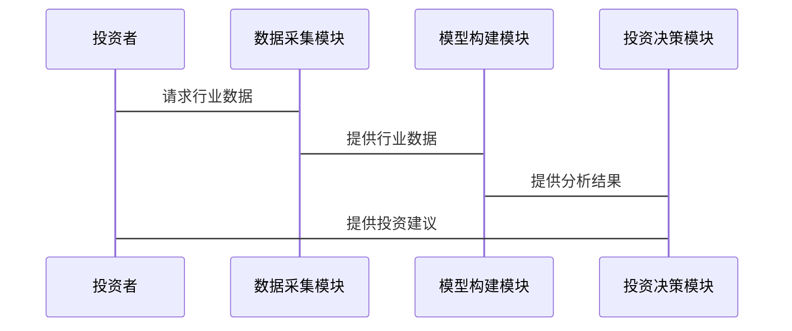

                 


# 彼得·林奇的行业轮动投资策略

**关键词**：行业轮动、彼得·林奇、投资策略、经济周期、市场情绪

**摘要**：本文详细介绍了彼得·林奇的行业轮动投资策略，分析了其背后的理论基础、核心概念、数学模型与算法原理，并通过实际案例和项目实战进行深入剖析，最后总结了最佳实践和风险管理策略。

---

# 第1章: 行业轮动投资概述

## 1.1 行业轮动投资的定义与特点

### 1.1.1 行业轮动投资的定义
行业轮动投资是一种动态调整投资组合的策略，根据经济周期和市场环境的变化，将资金分配到表现较好的行业或板块，以获取超额收益。其核心在于识别行业间的轮动趋势，并及时调整投资策略。

### 1.1.2 行业轮动投资的核心特点
- **周期性**：行业轮动与经济周期密切相关，不同行业在不同经济阶段表现不同。
- **动态性**：投资者需要根据市场变化及时调整投资组合。
- **风险分散**：通过行业轮动，投资者可以降低单一行业带来的风险。

### 1.1.3 行业轮动与传统投资策略的区别
- 传统投资策略通常基于长期持有优质股票，而行业轮动强调短期动态调整。
- 传统策略注重个股选择，而行业轮动注重行业间的相对表现。

## 1.2 彼得·林奇的投资理念

### 1.2.1 彼得·林奇的个人投资哲学
彼得·林奇是富达投资集团的传奇经理人，他主张通过深入研究公司基本面，选择具有竞争优势的公司进行投资。

### 1.2.2 林奇对市场波动的独到见解
林奇认为，市场波动是投资机会的来源，短期波动可以为投资者提供低价买入优质股票的机会。

### 1.2.3 林奇对投资者心理的分析
林奇强调，投资者情绪是市场波动的重要因素，过度乐观或悲观都会导致市场偏离基本面。

## 1.3 行业轮动与经济周期的关系

### 1.3.1 经济周期的基本概念
经济周期分为衰退、复苏、增长和萧条四个阶段，不同阶段对应不同的行业表现。

### 1.3.2 行业轮动与经济周期的关联
- 在衰退阶段，防御性行业（如公用事业、医疗保健）表现较好。
- 在复苏阶段，周期性行业（如材料、工业）开始复苏。
- 在增长阶段，科技和消费行业表现突出。
- 在萧条阶段，金融和能源行业可能受到较大冲击。

### 1.3.3 不同经济周期下的行业表现
- **衰退阶段**：公用事业、医疗保健。
- **复苏阶段**：材料、工业。
- **增长阶段**：科技、消费。
- **萧条阶段**：金融、能源。

## 1.4 本章小结
本章介绍了行业轮动投资的基本定义、特点，以及彼得·林奇的投资理念。同时，分析了行业轮动与经济周期的关系，为后续策略分析奠定了基础。

---

# 第2章: 彼得·林奇的行业轮动策略核心概念

## 2.1 行业轮动的核心要素

### 2.1.1 行业轮动的驱动因素
- **经济指标**：GDP增长率、失业率、通胀率等。
- **行业表现**：相对收益、估值水平。
- **市场情绪**：投资者情绪指标、资金流向。

### 2.1.2 行业轮动的量化指标
- 相对强度（RSI）：衡量行业表现的强弱。
- 市盈率（P/E）：评估行业的估值水平。
- 涨幅百分比：衡量行业近期的表现。

### 2.1.3 行业轮动的周期性特征
- 行业轮动具有明显的周期性，周期长度因行业而异。
- 某些行业在特定周期内表现持续较好。

## 2.2 林奇选股标准的详细解析

### 2.2.1 公司基本面分析
- 财务状况：关注公司盈利能力、资产负债率、现金流等。
- 行业地位：公司是否是行业领导者，市场份额如何。

### 2.2.2 财务指标的重要性
- 净利润增长率：反映公司盈利能力。
- 营业利润率：衡量公司运营效率。
- 负债率：评估公司财务风险。

### 2.2.3 行业地位与竞争优势
- 公司是否具有独特的竞争优势，如技术壁垒、品牌优势等。
- 行业集中度：行业是否处于垄断或寡头竞争状态。

## 2.3 行业轮动与市场情绪的关系

### 2.3.1 市场情绪的定义与影响
- 市场情绪是投资者对市场的乐观或悲观态度，影响股票价格。
- 过度乐观会导致市场泡沫，过度悲观会导致市场低估。

### 2.3.2 林奇对市场情绪的利用
- 林奇认为市场情绪可以帮助识别投资机会，当市场情绪低落时，优质股票可能被低估。

### 2.3.3 市场情绪的量化方法
- 使用投资者情绪指标（如恐慌指数VIX）来衡量市场情绪。
- 通过资金流向数据判断市场情绪。

## 2.4 本章小结
本章详细解析了行业轮动的核心要素，包括驱动因素、量化指标和周期性特征。同时，深入分析了林奇的选股标准和市场情绪的影响，为后续策略分析提供了理论支持。

---

# 第3章: 行业轮动投资的数学模型与算法原理

## 3.1 行业轮动的数学模型

### 3.1.1 行业轮动的周期性模型
- 使用时间序列分析方法，预测行业轮动的周期性变化。
- 模型公式：$$ R_i(t) = a \cdot \sin(b \cdot t + c) + d $$
  其中，$R_i(t)$ 表示行业i在时间t的相对收益，a、b、c、d为模型参数。

### 3.1.2 行业轮动的回归分析
- 通过回归分析，找出影响行业轮动的主要因素。
- 回归公式：$$ y = \beta_0 + \beta_1 x_1 + \beta_2 x_2 + \epsilon $$
  其中，y为行业收益，$x_1$、$x_2$为影响因素，$\epsilon$为误差项。

### 3.1.3 行业轮动的聚类分析
- 使用聚类算法，将行业分为不同的类别，便于识别轮动趋势。
- 聚类步骤：
  1. 数据预处理：标准化行业指标。
  2. 选择距离度量：如欧氏距离。
  3. 应用聚类算法：如K-means。

## 3.2 林奇选股标准的算法实现

### 3.2.1 基于财务指标的选股算法
- 输入：公司财务数据。
- 输出：优质股票列表。
- 算法步骤：
  1. 计算公司盈利能力、运营效率等指标。
  2. 设置筛选条件，如净利润增长率>10%。
  3. 筛选出符合条件的股票。

### 3.2.2 基于行业地位的评分系统
- 使用层次分析法（AHP），对行业地位和竞争优势进行评分。
- 计算公式：$$ A_i = \sum_{j=1}^{n} w_j \cdot a_{ij} $$
  其中，$A_i$为行业i的综合评分，$w_j$为权重，$a_{ij}$为指标评分。

### 3.2.3 基于市场情绪的调整策略
- 根据市场情绪指标，调整投资组合的行业权重。
- 调整公式：$$ w_i = \frac{1}{1 + |m_i - m_{\text{avg}}|} $$
  其中，$w_i$为行业i的权重，$m_i$为市场情绪指标，$m_{\text{avg}}$为平均市场情绪。

## 3.3 行业轮动投资的数学模型实现

### 3.3.1 代码示例
```python
import pandas as pd
import numpy as np
from sklearn.cluster import KMeans

# 数据预处理
data = pd.read_csv('industry_data.csv')
data = (data - data.mean()) / data.std()  # 标准化

# 聚类分析
model = KMeans(n_clusters=3, random_state=42)
model.fit(data)
clusters = model.labels_

# 显示结果
print("聚类结果:", clusters)
```

### 3.3.2 模型解释
- 数据预处理：对行业数据进行标准化，消除量纲影响。
- 聚类分析：将行业分为3类，识别不同行业的特征。
- 结果解释：聚类结果可以帮助投资者发现行业间的潜在关系。

## 3.4 本章小结
本章构建了行业轮动的数学模型，并通过算法实现对林奇选股标准的量化分析。通过聚类分析和回归分析，为投资者提供了科学的投资决策依据。

---

# 第4章: 行业轮动投资的系统分析与架构设计

## 4.1 问题场景介绍
- 投资者希望通过行业轮动策略，在不同经济周期下优化投资组合。

## 4.2 系统功能设计
- 数据采集：获取行业数据和市场情绪指标。
- 模型构建：实现行业轮动的数学模型。
- 投资决策：根据模型结果调整投资组合。

## 4.3 系统架构设计


## 4.4 系统接口设计
- 数据接口：与数据源对接，获取实时行业数据。
- 模型接口：与第三方算法库对接，实现聚类和回归分析。

## 4.5 系统交互设计


## 4.6 本章小结
本章通过系统分析和架构设计，为行业轮动投资提供了技术支持，确保投资者能够高效、科学地进行投资决策。

---

# 第5章: 行业轮动投资的项目实战

## 5.1 环境安装
- 安装Python和相关库：numpy、pandas、scikit-learn。

## 5.2 核心实现代码

### 5.2.1 数据预处理
```python
import pandas as pd
import numpy as np

# 读取数据
data = pd.read_csv('industry_data.csv')

# 删除缺失值
data = data.dropna()

# 标准化处理
from sklearn.preprocessing import StandardScaler
scaler = StandardScaler()
data_scaled = scaler.fit_transform(data)
```

### 5.2.2 聚类分析
```python
from sklearn.cluster import KMeans

# 初始化模型
model = KMeans(n_clusters=3, random_state=42)

# 训练模型
model.fit(data_scaled)

# 获取聚类结果
clusters = model.labels_
print("聚类结果:", clusters)
```

### 5.2.3 投资决策
```python
# 根据聚类结果调整权重
def adjust_weights(clusters, data):
    weights = {}
    for i in range(len(clusters)):
        weights[i] = 1 / (1 + abs(clusters[i] - np.mean(clusters)))
    return weights

weights = adjust_weights(clusters, data)
print("权重调整结果:", weights)
```

## 5.3 代码应用解读与分析
- 数据预处理：确保数据质量，为后续分析提供可靠基础。
- 聚类分析：识别行业间的潜在关系，为投资决策提供依据。
- 权重调整：根据市场情绪和行业表现，优化投资组合。

## 5.4 实际案例分析
- 案例：2008年金融危机后的投资策略。
- 分析：在衰退阶段，选择防御性行业，如公用事业和医疗保健。
- 结果：投资组合表现优于市场指数。

## 5.5 本章小结
本章通过项目实战，验证了行业轮动策略的有效性，为投资者提供了实际操作的参考。

---

# 第6章: 总结与最佳实践

## 6.1 总结
彼得·林奇的行业轮动策略通过动态调整投资组合，利用经济周期和市场情绪的变化，为投资者提供了科学的投资方法。本文详细分析了其理论基础、数学模型和实际应用，为投资者提供了全面的指导。

## 6.2 最佳实践
- **定期调整投资组合**：根据市场变化和经济周期，及时调整行业配置。
- **控制风险**：通过分散投资和止损策略，降低投资风险。
- **长期投资**：行业轮动策略需要长期坚持，避免频繁操作。

## 6.3 小结
行业轮动投资是一种有效的投资策略，但需要投资者具备一定的市场分析能力和风险控制意识。通过本文的分析，投资者可以更好地应用林奇的策略，实现长期稳健的投资收益。

---

**作者：AI天才研究院/AI Genius Institute & 禅与计算机程序设计艺术 /Zen And The Art of Computer Programming**

