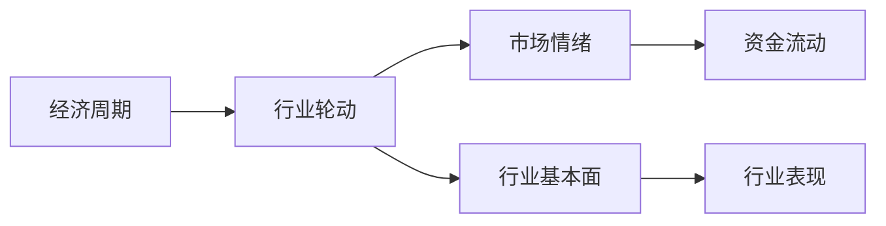
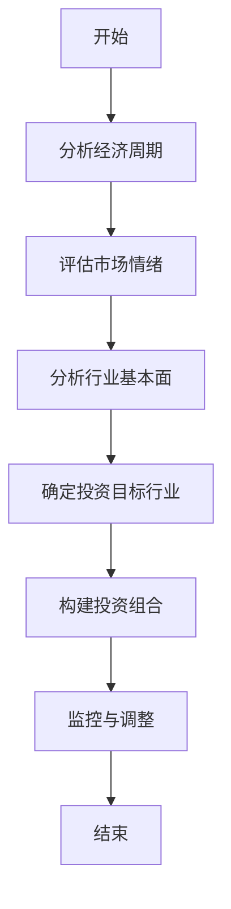

                 


# 彼得·林奇的行业轮动策略

> 关键词：彼得·林奇，行业轮动，投资策略，算法原理，数学模型，系统设计，项目实战

> 摘要：本文将深入探讨彼得·林奇的行业轮动策略，从背景、核心概念、算法原理、数学模型、系统设计到项目实战，系统化地解析这一投资策略的全貌。通过详细的分析和实际案例，结合技术手段（如Mermaid图表和Python代码示例），帮助读者全面理解并掌握这一策略的应用方法。

---

## 第一部分: 行业轮动策略的背景与意义

### 第1章: 行业轮动策略的背景与意义

#### 1.1 行业轮动的基本概念
##### 1.1.1 行业轮动的定义
行业轮动是指投资者根据市场环境的变化，选择在不同时期表现优于市场平均水平的行业进行投资的策略。其核心在于通过分析经济周期、行业基本面和市场情绪等因素，动态调整投资组合中的行业配置。

##### 1.1.2 行业轮动在投资中的意义
行业轮动策略能够帮助投资者在不同经济周期中捕捉到表现最佳的行业，从而在市场波动中实现超额收益。与单纯的投资个股相比，行业轮动策略通过分散投资于多个行业，降低了单一行业带来的风险。

##### 1.1.3 彼得·林奇的行业轮动策略特点
彼得·林奇以其独特的“非主流”投资理念闻名，他注重挖掘那些被市场忽视但具有成长潜力的行业和公司。他的行业轮动策略强调对行业基本面的深入研究和对市场情绪的精准把握。

#### 1.2 影响行业轮动的主要因素
##### 1.2.1 经济周期与行业轮动的关系
经济周期的变化直接影响行业的表现。例如，在经济衰退期，防御性行业（如公用事业、医疗保健）可能表现较好，而在经济复苏期，周期性行业（如材料、工业）可能更具投资价值。

##### 1.2.2 行业基本面分析
行业轮动的核心在于对行业基本面的分析，包括行业的增长率、盈利能力、市场结构等。基本面良好的行业更有可能在未来实现超额收益。

##### 1.2.3 市场情绪与资金流动
市场情绪和资金流动是行业轮动的重要影响因素。投资者情绪的波动会导致资金在不同行业之间的流动，从而影响行业的相对表现。

#### 1.3 彼得·林奇的行业轮动策略背景
##### 1.3.1 彼得·林奇的投资理念
彼得·林奇强调长期投资和价值投资，他认为市场的短期波动不应该影响投资者的决策，而应该关注企业的基本面和成长潜力。

##### 1.3.2 林奇的投资风格与行业轮动策略
林奇的投资风格以分散投资和深度研究著称。他通过分散投资于多个行业和公司，降低投资风险，同时通过深入研究行业基本面，抓住行业轮动的机会。

##### 1.3.3 行业轮动策略的历史表现
行业轮动策略在不同经济周期下的历史表现各异，但总体来看，通过合理配置行业，投资者可以在不同市场环境下实现稳健收益。

---

## 第二部分: 行业轮动策略的核心概念与联系

### 第2章: 行业轮动策略的核心概念与联系

#### 2.1 行业轮动的核心概念
##### 2.1.1 行业轮动的逻辑框架
行业轮动的逻辑框架包括经济周期分析、行业基本面分析、市场情绪分析和投资组合构建等步骤。通过这些步骤的有机结合，投资者可以制定出科学的行业轮动策略。

##### 2.1.2 行业轮动的驱动因素
行业轮动的驱动因素包括宏观经济因素、行业自身因素和市场情绪因素。这些因素共同作用，决定了行业的相对表现。

##### 2.1.3 行业轮动的周期性特征
行业轮动具有明显的周期性特征，不同经济周期下表现最佳的行业往往不同。例如，在经济复苏期，周期性行业可能表现较好，而在经济衰退期，防御性行业可能更受青睐。

#### 2.2 行业轮动的实体关系图


#### 2.3 行业轮动的流程图


---

## 第三部分: 行业轮动策略的算法原理

### 第3章: 行业轮动策略的算法原理

#### 3.1 行业轮动策略的筛选标准
##### 3.1.1 行业筛选标准
- 行业增长率：选择增长率较高的行业。
- 行业盈利能力：选择盈利能力较强的行业。
- 行业估值水平：选择估值合理的行业。
- 行业竞争结构：选择竞争结构合理的行业。

##### 3.1.2 个股筛选标准
- 公司基本面：包括盈利能力、成长性、财务状况等。
- 行业地位：选择行业内的龙头公司。
- 市场情绪：考虑市场的认可度。

##### 3.1.3 组合构建标准
- 分散投资：避免过度集中于单一行业。
- 风险控制：通过行业间的相关性进行风险分散。
- 定期调整：根据市场变化进行动态调整。

#### 3.2 行业轮动策略的数学模型
##### 3.2.1 行业轮动模型
$$ P_{i} = \alpha + \beta \cdot M_{t} + \epsilon $$

其中，\( P_{i} \) 表示行业 \( i \) 的表现，\( M_{t} \) 表示市场情绪，\( \alpha \) 和 \( \beta \) 是模型参数，\( \epsilon \) 是误差项。

##### 3.2.2 投资组合优化模型
$$ max \quad \mu \cdot w - 0.5 \cdot w^{T} \cdot Q \cdot w $$
$$ s.t. \quad w^{T} \cdot 1 = 1 $$

其中，\( w \) 是权重向量，\( \mu \) 是预期收益向量，\( Q \) 是风险矩阵。

##### 3.2.3 风险调整收益模型
$$ Sharpe \ Ratio = \frac{E[r - r_f]}{\sqrt{Var(r - r_f)}} $$

其中，\( E[r - r_f] \) 是预期超额收益，\( Var(r - r_f) \) 是超额收益的方差。

#### 3.3 行业轮动策略的算法实现
##### 3.3.1 数据获取与预处理
- 数据来源：选择可靠的金融数据源，如Yahoo Finance或 Bloomberg。
- 数据清洗：处理缺失值和异常值。

##### 3.3.2 行业筛选与排序
- 行业筛选：根据基本面指标筛选出符合条件的行业。
- 行业排序：根据预期收益和风险对行业进行排序。

##### 3.3.3 投资组合构建与优化
- 组合构建：根据行业排序结果，构建投资组合。
- 组合优化：通过优化模型调整行业权重，降低整体风险。

##### 3.3.4 风险管理与调整
- 风险管理：设置止损和止盈点，控制投资风险。
- 动态调整：根据市场变化定期调整投资组合。

---

## 第四部分: 行业轮动策略的系统设计

### 第4章: 行业轮动策略的系统设计

#### 4.1 系统功能设计
##### 4.1.1 功能模块划分
- 数据采集模块：负责数据的获取和预处理。
- 行业分析模块：负责行业筛选和排序。
- 投资组合构建模块：负责组合优化和风险管理。
- 监控与调整模块：负责市场监控和动态调整。

##### 4.1.2 系统架构设计


#### 4.2 系统接口设计
- 数据接口：与金融数据源对接，获取实时数据。
- 用户接口：提供用户输入和输出功能。
- 组合管理接口：与投资组合管理系统对接。

#### 4.3 系统交互设计


---

## 第五部分: 行业轮动策略的项目实战

### 第5章: 行业轮动策略的项目实战

#### 5.1 环境安装
- 安装Python和必要的库（如Pandas、NumPy、Scikit-learn）。
- 安装金融数据接口（如Yahoo Finance API）。

#### 5.2 核心实现代码
```python
import pandas as pd
import numpy as np
from sklearn.linear_model import LinearRegression

# 示例数据：行业表现与市场情绪
data = pd.DataFrame({
    'market_sentiment': [0.8, 0.7, 0.9, 0.6, 0.7],
    'industry_growth': [0.1, 0.15, 0.05, 0.12, 0.1],
    'industry_profit': [0.2, 0.15, 0.25, 0.18, 0.2]
})

# 行业筛选模型
model = LinearRegression()
X = data[['market_sentiment', 'industry_growth', 'industry_profit']]
y = data['industry_profit']
model.fit(X, y)

# 行业排序
data['predicted_profit'] = model.predict(X)
data = data.sort_values('predicted_profit', ascending=False)

print(data)
```

#### 5.3 实际案例分析
- 数据分析：分析历史数据，找出不同经济周期下表现最佳的行业。
- 投资组合构建：根据分析结果，构建投资组合。
- 案例总结：总结经验教训，优化策略。

#### 5.4 项目总结
- 项目成果：成功构建并验证了行业轮动策略。
- 成功经验：科学的行业筛选和动态调整是策略成功的关键。
- 项目启示：技术与投资策略的结合能够显著提升投资效率。

---

## 第六部分: 行业轮动策略的最佳实践

### 第6章: 行业轮动策略的最佳实践

#### 6.1 最佳实践 tips
- 定期回顾和调整投资组合。
- 保持对市场的敏感性，及时捕捉行业轮动机会。
- 结合技术分析和基本面分析，提高决策的准确性。

#### 6.2 小结
彼得·林奇的行业轮动策略通过科学的行业筛选和动态调整，能够在不同经济周期下实现超额收益。投资者在实际操作中，应结合市场环境和自身风险承受能力，灵活应用这一策略。

#### 6.3 注意事项
- 风险控制：避免过度集中于单一行业。
- 市场风险：行业轮动策略在市场剧烈波动时可能面临较大风险。
- 信息滞后：数据获取和分析可能存在滞后性，影响策略的有效性。

#### 6.4 拓展阅读
- 推荐书籍：《彼得·林奇的投资策略》。
- 推荐文章：行业轮动策略的最新研究和发展。

---

## 作者：AI天才研究院/AI Genius Institute & 禅与计算机程序设计艺术 /Zen And The Art of Computer Programming

